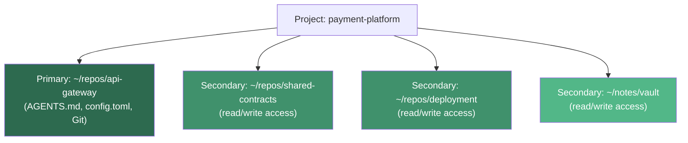
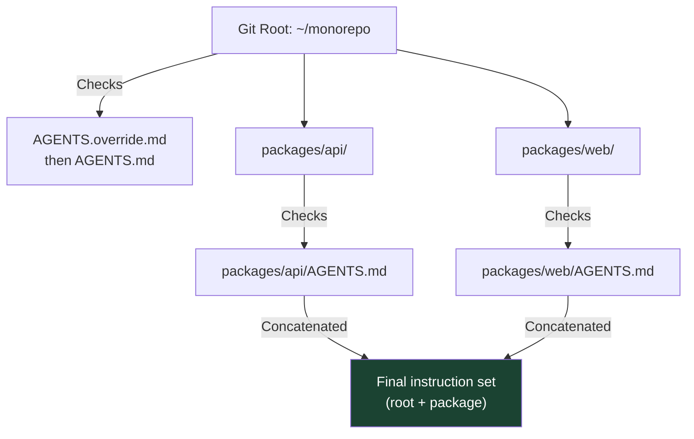

# Multi-Folder Projects in Codex: How Primary Folders, Writable Roots, and Cross-Repo Workspaces Actually Work


---

## The Problem: Real Projects Span Multiple Directories

Most senior developers do not work inside a single directory. A typical day involves a frontend repository, a backend repository, a shared library, an infrastructure-as-code directory, perhaps an Obsidian vault for notes, and a configuration directory that ties everything together. Until this month, Codex forced you to choose one.

The CLI has long offered escape hatches — `--add-dir` and `writable_roots` — but the desktop app restricted projects to a single folder [^1]. That changed on 23 July 2026 with Codex app build 26.715, which shipped multi-folder projects with a designated **primary folder** that drives new chats, Git operations, and automatic discovery of `AGENTS.md`, skills, and `config.toml` [^2]. This article maps the full multi-folder configuration surface across CLI, desktop, and the community `codex-multi-workspace` crate, then compares the approach with Claude Code's equivalent mechanisms.

## The CLI Surface: `--add-dir` and `writable_roots`

The CLI has supported multiple writable directories since v0.124.0 via two mechanisms [^3]:

### The `--add-dir` Flag

```bash
codex --sandbox workspace-write \
  --add-dir ~/projects/shared-lib \
  --add-dir ~/projects/infrastructure \
  "Refactor the auth module to use the shared JWT library"
```

Each `--add-dir` grants write access to an additional path alongside the primary workspace. The agent's `cwd` remains in the primary workspace; additional directories become writable roots within the sandbox [^3]. The flag can be repeated as many times as needed.

### Persistent Configuration with `writable_roots`

For workflows that always span the same directories, bake them into `config.toml`:

```toml
# ~/.codex/config.toml  (global)
# or .codex/config.toml  (project-level)

sandbox_mode = "workspace-write"

[sandbox_workspace_write]
writable_roots = [
  "/home/dev/projects/shared-lib",
  "/home/dev/projects/infrastructure",
  "/home/dev/notes"
]
network_access = false
```

These paths merge with the current working directory at startup [^3]. The sandbox enforces the boundary at the kernel level: macOS uses Seatbelt SBPL profiles, Linux uses Bubblewrap bind-mounts, and Windows uses DACL grants [^4]. An agent cannot circumvent the restriction through `mv`, `ln -s`, or any other shell trick — the operating system itself blocks the write.

### Named Permission Profiles (v0.124+)

Named profiles replace flat sandbox modes with granular control [^3]:

```toml
[profiles.cross-repo]
sandbox_mode = "workspace-write"

[profiles.cross-repo.sandbox_workspace_write]
writable_roots = [
  ":project_roots",
  "/home/dev/projects/shared-lib"
]
```

The `:project_roots` placeholder dynamically resolves to detected workspace roots, removing the need to hardcode paths.

## The Desktop Surface: Primary Folders (v26.715)

The desktop app's multi-folder support, shipped on 23 July 2026, introduces a **primary folder** concept [^2]:

- **Adding folders**: Select "Edit project" from a project's menu to add folders and designate one as primary.
- **Primary folder role**: New chats, Git operations, and automatic discovery of `AGENTS.md`, skills, and `config.toml` all use the primary folder.
- **Secondary folders**: Remain fully accessible for file reads and writes but do not drive configuration discovery.



This addresses the long-standing request in GitHub Issue #27943, which accumulated 37 thumbs-up reactions before the feature shipped [^1]. The issue's original use case — an `ai-workspace/` directory for deliverables alongside an `obsidian-vault/` for persistent knowledge — is now a first-class configuration.

### What the Desktop App Does Not Yet Support

The desktop implementation remains simpler than the CLI's:

- **No per-folder permission profiles**: All folders get the same access level. The CLI's ability to mark individual roots as read-only or deny-access is not yet exposed in the app UI [^1].
- **No `:project_roots` dynamic resolution**: Folder paths must be added manually.
- **Single primary folder**: You cannot designate multiple primaries or cascade `AGENTS.md` discovery across roots — only the primary folder's configuration files are loaded automatically.

## AGENTS.md Discovery Across Multiple Directories

When working across repositories, each can maintain its own `AGENTS.md`. Codex discovers and loads instructions independently from each directory's project root downward [^3][^5]. However, the combined instruction payload caps at 32 KiB by default [^3].

For monorepo layouts, the discovery walk is more nuanced:



Codex walks from the Git root down to the current working directory, concatenating `AGENTS.md` files at each level. Files closer to the working directory override earlier guidance [^5]. With multi-folder projects, only the primary folder's walk is performed automatically — secondary folders' `AGENTS.md` files are accessible but not auto-loaded into the system prompt.

## The Community Approach: `codex-multi-workspace`

The `codex-multi-workspace` Rust crate, published on crates.io, takes a different approach entirely: it runs Codex CLI inside Docker containers with declarative workspace definitions [^6].

```bash
# Define a multi-folder workspace
codex-ws create payment-platform \
  --folder ~/repos/api-gateway \
  --folder ~/repos/shared-contracts \
  --folder ~/repos/deployment

# Launch — all folders mounted under /workspace/
codex-ws run payment-platform
```

Multi-folder workspaces start Codex in `/workspace`, with each project available as `/workspace/<folder-name>` [^6]. The runtime image is based on Ubuntu 22.04 and includes Codex CLI, Node.js 22, Git, Bubblewrap, and declarative toolchain management via `mise` [^6]. Workspaces can request specific language runtimes (Python, Go, Rust, Java, etc.) without relying on system packages.

Each workspace's Codex sessions are stored under `~/.codex-ws`, providing session isolation between projects — something neither the CLI's `--add-dir` nor the desktop app's multi-folder feature handles explicitly.

## Comparison with Claude Code

Claude Code offers a parallel set of mechanisms for multi-directory work [^7]:

| Capability | Codex CLI | Codex Desktop | Claude Code |
|---|---|---|---|
| Additional directories at launch | `--add-dir` | Edit project UI | `--add-dir` |
| In-session directory expansion | Not supported | Not supported | `/add-dir` |
| Persistent configuration | `writable_roots` in TOML | Project settings | `permissions.additionalDirectories` |
| Per-directory permissions | Named profiles with access levels | Same access for all | Not granular |
| Instruction file discovery | `AGENTS.md` walk per root | Primary folder only | `CLAUDE.md` two-tier structure |
| Sandbox enforcement | Kernel-level (Seatbelt/Bubblewrap/DACL) | Inherited from CLI sandbox | Process-level |
| Parallel agents across directories | Via `/agent` command | Via desktop threads | Native parallel agents |

Claude Code's `/add-dir` in-session command is a notable gap in Codex's feature set — Codex requires directory configuration before the session starts [^7]. Conversely, Codex's kernel-level sandbox enforcement across writable roots is materially stronger than Claude Code's process-level approach [^4].

For monorepo workflows, both tools recommend a two-tier instruction file structure (root-level shared conventions, package-level specifics) and advise starting sessions from the package directory rather than the monorepo root [^7].

## Practical Constraints

Before reaching for multi-folder projects, understand the trade-offs:

1. **Context window pressure**: Reading from multiple codebases consumes tokens rapidly. A three-repository workspace can exhaust GPT-5.6 Sol's 272,000-token context window before meaningful work begins [^3].
2. **Diff visibility**: The diff panel shows changes relative to the primary `cwd` only. Use `git diff` per repository for full visibility across roots [^3].
3. **Git isolation**: `.git/` directories remain read-only. Agents cannot create cross-repo commits — each repository must be committed independently [^3].
4. **App compatibility**: Some web applications (Google Docs, Gmail) provide limited structured text when accessed via Appshots from secondary folders ⚠️.
5. **Instruction file cap**: Combined `AGENTS.md` content from multiple roots caps at 32 KiB, requiring disciplined instruction authoring [^3].

## When to Use Each Approach

**Single `--add-dir` for one-off access**: You need to read a shared library's types while refactoring your main project. Lightweight, no configuration changes.

**`writable_roots` for stable multi-repo workflows**: Your team consistently works across the same three repositories. Bake the paths into project-level `config.toml` and commit it.

**Desktop multi-folder projects for non-terminal workflows**: You prefer the Codex app UI and need access to a notes vault alongside your code. Designate the code repository as primary.

**`codex-multi-workspace` for containerised reproducibility**: You want identical environments across team members, with declarative toolchains and session isolation. Accept the Docker overhead.

## What Comes Next

The feature request in Issue #27943 remains open despite the initial multi-folder support shipping [^1]. Outstanding requests include per-folder permission profiles in the desktop UI, multi-repository Git operations (cross-repo commits), and VS Code multi-folder workspace detection (Issue #30453) [^8]. The CLI's `--add-dir` also has a documented bug where `apply_patch` ignores the whitelist and writes outside permitted directories (Issue #24214) [^9] — worth monitoring if you rely on strict sandbox boundaries.

Multi-folder support closes a genuine gap in how developers use coding agents. The primary-folder model is a pragmatic first step: it preserves the simplicity of single-root configuration discovery while opening access to the directories real projects actually span.

## Citations

[^1]: GitHub Issue #27943 — "Support multiple workspace folders in the Codex app." [https://github.com/openai/codex/issues/27943](https://github.com/openai/codex/issues/27943)

[^2]: Codex Releases on X — "Codex app update: ChatGPT Voice and multi-folder projects 26.715." [https://x.com/CodexReleases/status/2080374810895331450](https://x.com/CodexReleases/status/2080374810895331450)

[^3]: Daniel Vaughan, "Codex CLI Multi-Directory Workflows: Coordinating Cross-Repo Changes with --add-dir, Writable Roots, and Permission Profiles." Codex Knowledge Base, 10 May 2026. [https://codex.danielvaughan.com/2026/05/10/codex-cli-multi-directory-workflows-add-dir-writable-roots-cross-repo-coordination/](https://codex.danielvaughan.com/2026/05/10/codex-cli-multi-directory-workflows-add-dir-writable-roots-cross-repo-coordination/)

[^4]: OpenAI, "Sandbox — Codex Documentation." ChatGPT Learn. [https://developers.openai.com/codex/concepts/sandboxing](https://developers.openai.com/codex/concepts/sandboxing)

[^5]: OpenAI, "Custom instructions with AGENTS.md." ChatGPT Learn. [https://developers.openai.com/codex/guides/agents-md](https://developers.openai.com/codex/guides/agents-md)

[^6]: codex-multi-workspace crate — Lib.rs. [https://lib.rs/crates/codex-multi-workspace](https://lib.rs/crates/codex-multi-workspace)

[^7]: LOW/CODE, "Claude Code for Monorepo Development 2026." [https://www.lowcode.agency/blog/claude-code-monorepo](https://www.lowcode.agency/blog/claude-code-monorepo)

[^8]: GitHub Issue #30453 — "Support VS Code and Cursor workspaces when selecting Codex projects." [https://github.com/openai/codex/issues/30453](https://github.com/openai/codex/issues/30453)

[^9]: GitHub Issue #24214 — "codex exec --sandbox workspace-write --add-dir X: apply_patch tool ignores --add-dir whitelist and writes anywhere under --cd." [https://github.com/openai/codex/issues/24214](https://github.com/openai/codex/issues/24214)
