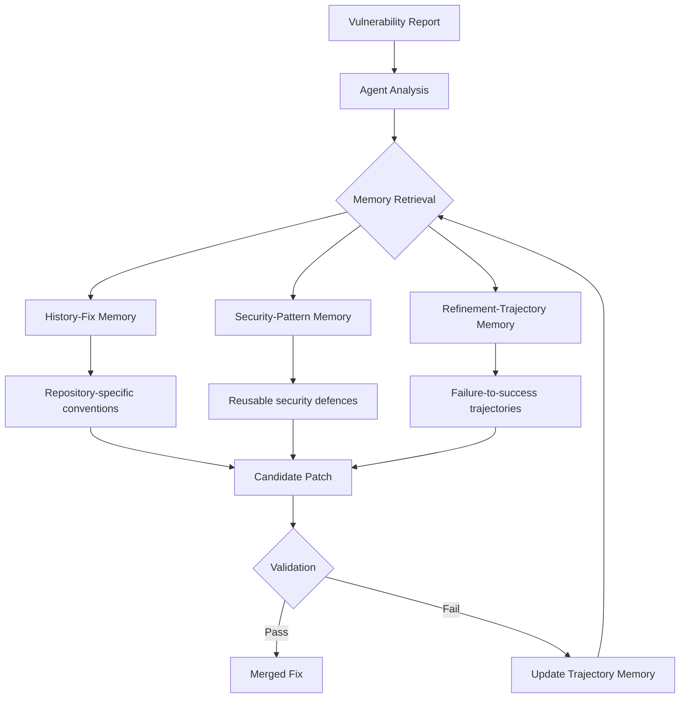
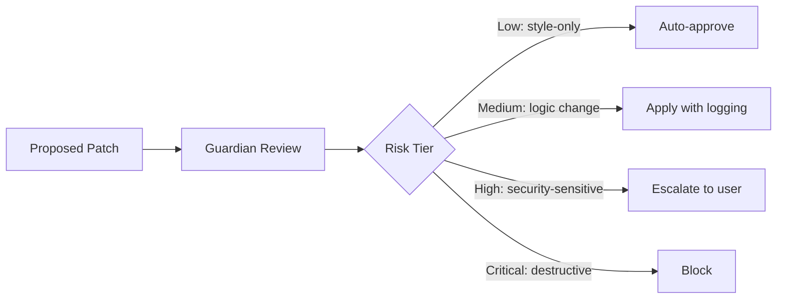

# MemRepair and the Memory-Driven Vulnerability Fix: What Hierarchical Repair Memory Means for Codex CLI Security Workflows


---

Most automated vulnerability repair tools treat each finding as if it were the first the agent has ever seen. They fetch the CVE description, locate the affected function, generate a candidate patch, and move on — with no recall of what worked last time, what pattern the same repository uses for bounds checks, or which earlier attempt failed validation. The result is predictable: low resolution rates, redundant analysis, and patches that pass the proof-of-concept test but break the functional test suite.

MemRepair, published in May 2026 by Liu et al.[^1], attacks this problem head-on with a three-layer hierarchical memory architecture that lets a vulnerability repair agent accumulate and reuse experience across fixes. Its benchmark numbers — 58.0% on SEC-Bench (C/C++), 58.2% on PatchEval (Python/Go/JavaScript), and 30.58% on Multi-SWE-bench (C++) — outperform both general-purpose coding agents like OpenHands and SWE-agent and the specialised InfCode-C++ tool[^1].

This article unpacks what makes MemRepair's memory hierarchy effective, maps its architecture to Codex CLI's existing security tooling, and provides configuration recipes for building a memory-driven vulnerability repair workflow on the CLI today.

## The Three Memory Layers

MemRepair's core contribution is decomposing repair knowledge into three complementary memory stores, each serving a distinct retrieval purpose[^1]:



### History-Fix Memory

This layer stores repository-specific repair conventions: how a given project handles NULL-pointer checks, which error-handling macro it uses, where defensive assertions live in the codebase. When the agent encounters a new vulnerability in the same repository, it retrieves historical fixes to match the project's style rather than generating a generic patch[^1].

### Security-Pattern Memory

Reusable security defence patterns — buffer-length validation, integer-overflow guards, use-after-free mitigations — abstracted away from any single repository. This layer captures cross-project knowledge about which defence strategies work for which CWE categories[^1].

### Refinement-Trajectory Memory

The most novel layer. It records the full sequence from a failed patch attempt through validation failure to eventual success, including the runtime evidence (sanitiser output, test failures) that guided the revision. Future repairs can retrieve these "failure-to-success" trajectories to avoid repeating the same dead ends[^1].

## Why Memory Matters: The Benchmark Evidence

The vulnerability repair landscape has matured rapidly in 2026, with three benchmarks now covering the major language families:

| Benchmark | Languages | Scope | MemRepair Resolution Rate |
|-----------|-----------|-------|--------------------------|
| SEC-Bench[^2] | C/C++ | 200 vulnerabilities, 29 projects, 16 CWEs | 58.0% |
| PatchEval[^3] | Python, Go, JavaScript | 1,000 CVEs (230 with sandbox), 65 CWEs | 58.2% |
| Multi-SWE-bench[^4] | C++ subset | Repository-level issue resolution | 30.58% |

SEC-Bench, presented at NeurIPS 2025 and actively maintained through 2026, provides Docker-containerised reproducible vulnerability instances with both proof-of-concept exploit tests and functional regression tests[^2]. PatchEval, developed by ByteDance, extends coverage to Go and JavaScript with 230 CVEs equipped with runtime sandbox environments[^3].

MemRepair's gains come primarily from reducing redundant analysis — the History-Fix layer eliminates repeated codebase exploration, whilst the Refinement-Trajectory layer prevents the agent from generating patches it has already seen fail[^1].

## Mapping MemRepair to Codex CLI

Codex CLI does not ship a MemRepair-equivalent out of the box. But its security plugin, memory system, hook pipeline, and Guardian auto-review provide the building blocks for a similar workflow.

### The Security Plugin as Analysis Front-End

The Codex Security plugin, available since June 2026, exposes four skills: repository scanning, deep scanning, diff-scoped review, and single-finding remediation[^5]. The remediation skill already performs the analysis-patch-validate cycle that MemRepair automates — but without persistent memory across findings.

```bash
# Install the security plugin
codex plugin add @openai/codex-security

# Run a targeted scan on a specific file
codex "Scan src/parser.c for memory safety vulnerabilities and propose fixes"
```

### Building the Memory Layers with Codex Memories

Codex CLI's built-in memory system, shipped in v0.128.0 and refined through v0.145.0, provides the persistence mechanism[^6]. The two-phase pipeline — per-rollout extraction with secret redaction, followed by global consolidation — can store security-specific context across sessions.

The key insight is structuring your AGENTS.md to direct the agent to create and consult security-specific memories:

```markdown
# AGENTS.md — Security Memory Directives

## Vulnerability Repair Conventions

When fixing security vulnerabilities in this repository:
1. Before generating a patch, check memories for prior fixes to the same CWE category
2. Follow the project's established error-handling patterns (see memories for examples)
3. After a successful fix, create a memory summarising the defence pattern used
4. After a failed validation, create a memory recording the failure reason and sanitiser output
```

### PostToolUse Hooks for Validation Feedback

MemRepair's refinement loop depends on runtime validation feedback. In Codex CLI, PostToolUse hooks can capture sanitiser output and feed it back into the repair cycle[^7]:

```toml
# .codex/hooks/security-validate.toml
[hook]
event = "PostToolUse"
tool = "shell"

[hook.match]
command_pattern = "gcc|clang|make|cargo"

[hook.action]
type = "shell"
command = """
# Run AddressSanitizer on the built artefact
if [ -f ./test_binary ]; then
    ASAN_OPTIONS=detect_leaks=1 ./test_binary 2>&1 | tee /tmp/asan_output.txt
    if grep -q 'ERROR: AddressSanitizer' /tmp/asan_output.txt; then
        echo "ASAN_FAILURE: $(cat /tmp/asan_output.txt)"
        exit 1
    fi
fi
"""
```

### Guardian Auto-Review as Safety Gate

The Guardian subagent, restored to its stable prompting policy in v0.144.2[^8], provides a final safety gate before any vulnerability fix is applied. In `full-auto` mode with Guardian enabled, the fix goes through a four-tier risk classification before approval:



## Configuration Recipe: Memory-Driven Vulnerability Repair Profile

Combining these components into a named profile for security work:

```toml
# ~/.codex/config.toml

[profiles.security-repair]
model = "gpt-5.6-sol"
reasoning_effort = "high"
approval_policy = "full-auto-with-guardian"

# Extend context for multi-file vulnerability analysis
model_auto_compact_token_limit = 200000

# Security-specific tool configuration
[profiles.security-repair.tools]
enabled_tools = [
    "shell",
    "file_read",
    "file_write",
    "codex-security:scan",
    "codex-security:deep-scan",
    "codex-security:diff-review",
    "codex-security:remediate"
]

# Rollout budget for iterative repair cycles
[profiles.security-repair.features.rollout_budget]
enabled = true
limit_tokens = 500000
reminder_interval_tokens = 50000
```

Activate the profile when working on vulnerability fixes:

```bash
codex -p security-repair "Fix CVE-2026-4521 in src/image_parser.c — \
  check memories for prior ImageMagick bounds-check patterns"
```

## The Refinement Loop Gap

The most significant gap between MemRepair's architecture and what Codex CLI supports natively is the **structured refinement loop**. MemRepair automatically captures failed patch attempts, extracts the validation failure reason, updates its Refinement-Trajectory memory, and retries with that context. Codex CLI's memory system records session outcomes but does not yet implement a structured failure-to-success trajectory store.

Two approaches bridge this gap today:

1. **AGENTS.md behavioural directives** that instruct the agent to explicitly record failure context in memories before retrying (shown above).

2. **Goal mode** (`/goal`), shipped in v0.128.0[^9], which provides the long-horizon persistence needed for iterative repair. A goal like "Fix all AddressSanitizer findings in the parser module" persists across interruptions and allows the agent to accumulate repair context through its built-in state management.

## Complementary Research: KeaRepair and ContraFix

MemRepair is not the only memory-augmented vulnerability repair framework published in 2026:

**KeaRepair** (Cao et al., July 2026) takes a knowledge-retrieval approach, constructing dual-view multi-dimensional knowledge bases from historical vulnerability-patch pairs and using ReAct-style reasoning for vulnerability diagnosis[^10].

**ContraFix** (also May 2026) combines skill-enhanced contrastive runtime analysis with differential execution traces, reusing learned repair "skills" across similar vulnerability classes[^11].

The convergence on memory and experience reuse across independent research groups suggests this is the direction automated vulnerability repair is heading. Codex CLI's extensible architecture — memories, hooks, Guardian, and the security plugin — provides the integration points to absorb these advances as they mature.

## Practical Recommendations

For teams integrating vulnerability repair into their Codex CLI workflows today:

- **Start with the security plugin's remediation skill** for individual findings. It handles the single-fix cycle well without memory infrastructure.

- **Add AGENTS.md security directives** to build up project-specific repair conventions over time. The built-in memory system will accumulate these across sessions.

- **Use PostToolUse hooks for sanitiser validation** to catch regression failures before they reach code review.

- **Reserve goal mode for multi-vulnerability campaigns** where iterative refinement across related findings matters most.

- **Watch the memory consolidation logs** (`RUST_LOG=codex_memory=debug`) to verify that security-relevant context is being captured and not over-compacted.

## Citations

[^1]: Liu, S., Zhang, L., Liu, F., Lian, X., Liu, Y., & Zhu, Y. (2026). MemRepair: Hierarchical Memory for Agentic Repository-Level Vulnerability Repair. *arXiv:2605.17444*. [https://arxiv.org/abs/2605.17444](https://arxiv.org/abs/2605.17444)

[^2]: SEC-Bench: Automated Benchmarking of LLM Agents on Real-World Software Security Tasks. NeurIPS 2025. [https://github.com/SEC-bench/SEC-bench](https://github.com/SEC-bench/SEC-bench)

[^3]: PatchEval: A New Benchmark for Evaluating LLMs on Patching Real-World Vulnerabilities. ByteDance. [https://github.com/bytedance/PatchEval](https://github.com/bytedance/PatchEval)

[^4]: Multi-SWE-bench. [https://llm-stats.com/benchmarks/swe-bench-verified-(agentic-coding)](https://llm-stats.com/benchmarks/swe-bench-verified-(agentic-coding))

[^5]: Codex Security Plugin: Local Vulnerability Scanning, Diff Review, and Automated Remediation from the CLI. Codex Knowledge Base, June 2026. [https://codex.danielvaughan.com/2026/06/03/codex-security-plugin-local-vulnerability-scanning-diff-review-remediation-cli/](https://codex.danielvaughan.com/2026/06/03/codex-security-plugin-local-vulnerability-scanning-diff-review-remediation-cli/)

[^6]: Codex Built-In Memory Deep Dive: How the Two-Phase Pipeline Turns Sessions into Institutional Knowledge. Codex Knowledge Base, April 2026. [https://codex.danielvaughan.com/2026/04/18/codex-built-in-memory-system-deep-dive/](https://codex.danielvaughan.com/2026/04/18/codex-built-in-memory-system-deep-dive/)

[^7]: Codex CLI Hook Architecture. OpenAI Developer Documentation. [https://developers.openai.com/codex/agent-approvals-security](https://developers.openai.com/codex/agent-approvals-security)

[^8]: Codex CLI v0.144.2 Release Notes. OpenAI, July 2026. [https://releasebot.io/updates/openai/codex](https://releasebot.io/updates/openai/codex)

[^9]: Codex CLI Goal Mode. OpenAI Developer Documentation. [https://developers.openai.com/codex/cli/reference](https://developers.openai.com/codex/cli/reference)

[^10]: Cao, S., Ma, H., Yu, L., et al. (2026). Knowledge-Enhanced Agentic Vulnerability Repair. *arXiv:2607.00820*. [https://arxiv.org/abs/2607.00820](https://arxiv.org/abs/2607.00820)

[^11]: ContraFix: Agentic Vulnerability Repair via Differential Runtime Evidence and Skill Reuse. *arXiv:2605.17450*. [https://arxiv.org/abs/2605.17450](https://arxiv.org/abs/2605.17450)
