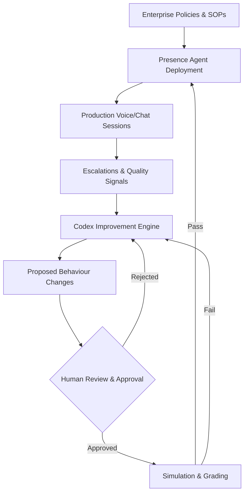
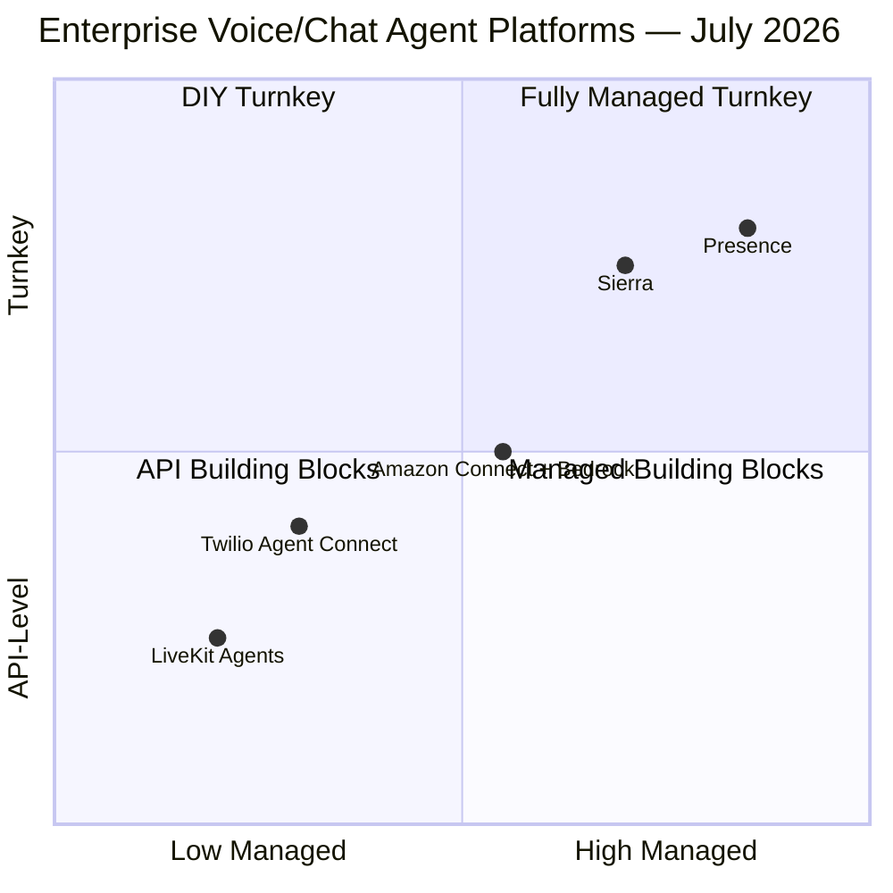

# OpenAI Presence: How Codex Became the Improvement Engine for Enterprise Voice and Chat Agents


---

On 22 July 2026, OpenAI announced **Presence** — a managed platform for deploying production-grade voice and chat agents inside enterprises [^1]. The headline feature is not a new model. It is not a new API. It is the revelation that **Codex, the coding agent most of us associate with writing software, now drives the continuous improvement loop for customer-facing AI agents** that answer phone calls, process claims, and handle banking queries.

For Codex CLI developers, this matters. Presence is the clearest signal yet that OpenAI views Codex not as a coding tool but as an autonomous improvement engine — one whose agent-loop architecture, guardrail patterns, and testing primitives are being repurposed well beyond the terminal.

## What Presence Actually Is

Presence is a **deployment platform, not a model** [^2]. It bundles six components into a managed offering:

1. **Policies and standard operating procedures** — company-specific rules the agent must follow
2. **Guardrails** — runtime interventions when interactions exceed approved boundaries
3. **Approved actions** — a controlled set of tools the agent may invoke (database lookups, account modifications, escalation triggers)
4. **Simulations** — pre-deployment scenario testing against routine requests, edge cases, and high-risk workflows
5. **Evaluation graders** — automated checks for correct outcomes, policy compliance, appropriate tool usage, and escalation decisions
6. **A Codex-powered improvement process** — the production feedback loop [^2]



The entire stack runs on **GPT-5.6**, the model family that reached general availability on 9 July 2026 [^3]. Presence agents use the Sol, Terra, or Luna tiers depending on task complexity, with context windows corrected to 272,000 tokens as of v0.144.6 [^4].

## The Codex Improvement Loop

The most architecturally significant component is the Codex-powered improvement process. Here is how it works:

1. **Signal collection**: Presence captures production sessions, escalations, and quality metrics that reveal performance gaps [^2]
2. **Codex analysis**: OpenAI's coding agent reviews this production data and identifies where the voice/chat agent underperformed — missed policy rules, incorrect tool calls, premature escalations
3. **Change proposal**: Codex generates specific behaviour modifications — updated prompts, new guardrail rules, refined escalation thresholds
4. **Human gate**: Staff review, test, and approve proposed changes before they reach production [^5]
5. **Simulation validation**: Approved changes run through the simulation and grading framework before deployment [^6]

This is not fine-tuning. It is not RLHF. It is **an agentic coding loop applied to agent configuration** — Codex reads production telemetry, reasons about failures, and writes improvements that humans validate. The same agent-loop architecture that powers `codex --exec "fix the failing test"` now powers "fix the agent that misrouted 12% of insurance claims yesterday."

## What Presence Tells CLI Developers About Codex's Direction

### 1. The Agent Loop Is the Product

Presence confirms that OpenAI's core competitive asset is not GPT-5.6 itself but the **agent loop around it** — the cycle of observe, reason, propose, validate, deploy. This is the same loop Codex CLI developers use daily: run a task, review the diff, approve or reject, iterate.

The difference is scope. In the CLI, the loop improves code. In Presence, the loop improves other agents. Codex has become a **meta-agent** — an agent that improves agents.

### 2. Guardrails Are Becoming First-Class Primitives

Presence's guardrail architecture mirrors patterns that Codex CLI already exposes:

| Presence Concept | Codex CLI Equivalent |
|---|---|
| Policies & SOPs | `AGENTS.md` layered discovery [^7] |
| Guardrails (runtime intervention) | `PreToolUse` / `PostToolUse` hooks [^8] |
| Approved actions | Sandbox allowlists, `writes` approval mode [^9] |
| Simulations & graders | Eval framework, `codex eval` [^10] |
| Human review gate | Approval prompts, Guardian auto-review [^11] |

The parallel is not accidental. Presence and Codex CLI share architectural DNA. Enterprise teams already comfortable with `requirements.toml` fleet governance and permission profiles are building the same muscles Presence demands [^12].

### 3. Forward Deployed Engineers Are the Deployment Model

Presence is explicitly **not self-serve** [^1]. Deployments require OpenAI's Forward Deployed Engineers (FDEs) or certified systems integrators from the OpenAI Deployment Company (DeployCo), the $4 billion+ venture backed by TPG, BBVA, Goldman Sachs, SoftBank, and others [^13].

This is the same FDE-led model that has driven Codex enterprise adoption since early 2026 [^14]. The implication for CLI developers: if your organisation is already working with OpenAI FDEs on Codex, Presence deployments will likely use the same team and the same configuration patterns.

## Early Enterprise Deployments

Three design partners are publicly confirmed [^1]:

- **BBVA** (Spain/Mexico) — voice support for Mexican banking customers, part of BBVA's broader 120,000-employee ChatGPT Enterprise rollout [^15]
- **SoftBank** (Japan) — natural language conversational agents
- **IAG** (Australia) — weather-related insurance claim processing

OpenAI also runs Presence on its own **English-language phone support line** at 1-888-GPT-0090. The internal deployment reportedly met or exceeded human-support quality benchmarks within weeks and now resolves **75% of inbound issues without human escalation** [^2].

## The Competitive Landscape

Presence enters a market with established players:



- **Sierra** (founded by Bret Taylor, OpenAI Board Chair) offers outcome-based pricing and deep backend integration [^16]
- **Twilio Agent Connect** provides infrastructure for connecting any AI agent to voice/messaging channels [^17]
- **LiveKit** powers real-time voice infrastructure — including, notably, ChatGPT's own Advanced Voice feature [^18]
- **Amazon Connect + Bedrock** offers AWS-native agent deployment

Presence's differentiator is the **Codex improvement loop** — no competitor offers an integrated coding agent that autonomously analyses production failures and proposes fixes. Sierra has outcome-based pricing; Twilio has channel infrastructure; Presence has an agent that makes your agents better.

## Implications for Codex CLI Workflows

### The Config-as-Code Pattern Extends

If Presence agents are configured through policies, guardrails, and approved-action lists, and Codex proposes modifications to those configurations, then **Codex is doing config-as-code for voice/chat agents** the same way it does config-as-code for software projects.

CLI developers who have invested in structured `AGENTS.md` files, `config.toml` profiles, and `requirements.toml` fleet policies are already practising the workflow Presence productises. The skills transfer directly.

### Testing Primitives Converge

Presence's simulation-and-grading framework maps to Codex CLI's eval pipeline:

```toml
# Codex CLI eval config — same pattern as Presence simulations
[eval]
model = "gpt-5.6-terra"
grader = "llm-as-judge"

[[eval.cases]]
prompt = "Handle a weather-related insurance claim for a customer in Sydney"
expected_tools = ["lookup_policy", "create_claim", "send_confirmation"]
expected_outcome = "Claim created with correct coverage type"
```

The grading dimensions are identical: correct outcome, policy compliance, appropriate tool usage, proper escalation. Teams writing Codex CLI evals are building the same evaluation muscle Presence requires.

### Codex as Meta-Agent Is the Endgame

The most consequential takeaway is directional. Codex is no longer just a tool that writes code for developers. It is becoming **an autonomous improvement engine** that can be pointed at any structured system — codebases, agent configurations, enterprise workflows — and told to make it better.

For CLI developers, this means the investment in understanding Codex's agent loop, hook system, and evaluation primitives has compounding returns. The same patterns that make you effective at `codex --exec` today will make you effective at orchestrating Presence-style improvement loops tomorrow.

## What to Watch

1. **Self-serve access**: Presence is currently FDE-gated. When (not if) it opens to API access, expect Codex CLI integration patterns to emerge rapidly
2. **Codex Agents SDK integration**: The existing `openai-agents` Python SDK already supports Codex cloud tasks [^19]. Presence workflows will likely surface through the same SDK
3. **Eval convergence**: Watch for Presence's simulation/grading framework to share tooling with Codex CLI's eval pipeline
4. **Requirements.toml for Presence**: Enterprise fleet governance for voice/chat agents using the same `requirements.toml` pattern that governs Codex CLI deployments

## Conclusion

Presence is not a pivot away from coding. It is the proof that Codex's agent-loop architecture — observe, reason, propose, validate, deploy — works beyond code. OpenAI has taken the improvement engine that developers use to fix failing tests and pointed it at failing customer interactions.

For Codex CLI developers, the message is clear: you are not just learning a coding tool. You are learning the operational patterns of an autonomous improvement engine that OpenAI is deploying across every enterprise surface it can reach.

---

## Citations

[^1]: OpenAI, "Introducing OpenAI Presence," openai.com, 22 July 2026. [https://openai.com/index/introducing-openai-presence/](https://openai.com/index/introducing-openai-presence/)

[^2]: Help Net Security, "OpenAI Presence connects AI agents to enterprise data with built-in guardrails," 22 July 2026. [https://www.helpnetsecurity.com/2026/07/22/openai-presence-ai-agent-platform/](https://www.helpnetsecurity.com/2026/07/22/openai-presence-ai-agent-platform/)

[^3]: OpenAI, "Previewing GPT-5.6 Sol: a next-generation model," openai.com, July 2026. [https://openai.com/index/previewing-gpt-5-6-sol/](https://openai.com/index/previewing-gpt-5-6-sol/)

[^4]: Codex CLI v0.144.6 release notes, 18 July 2026. Context windows corrected to 272,000 tokens for GPT-5.6 Sol, Terra, and Luna.

[^5]: Techgenyz, "OpenAI Presence, an Enterprise Platform for Trusted AI Voice and Chat Agents," July 2026. [https://techgenyz.com/openai-presence-enterprise-ai-agents-platform-launch/](https://techgenyz.com/openai-presence-enterprise-ai-agents-platform-launch/)

[^6]: QATechTools, "OpenAI Presence Brings Agent Testing to Production," 23 July 2026. [https://qatechtools.com/2026/07/23/openai-presence-agent-testing-qa/](https://qatechtools.com/2026/07/23/openai-presence-agent-testing-qa/)

[^7]: OpenAI, "AGENTS.md," Codex CLI documentation. Layered discovery loads project, folder, and global instruction files.

[^8]: OpenAI, "Hooks," Codex CLI documentation. PreToolUse and PostToolUse hooks provide runtime intervention points.

[^9]: Codex CLI v0.144.0 release notes, 9 July 2026. Writes app-approval mode introduced.

[^10]: OpenAI, "Codex eval framework," Codex CLI documentation. LLM-as-judge grading for agent behaviour evaluation.

[^11]: Codex CLI v0.144.2 release notes, 13 July 2026. Guardian auto-review policy restored after prompting regression.

[^12]: OpenAI, "Managed configuration," Codex CLI enterprise documentation. [https://developers.openai.com/codex/enterprise/managed-configuration](https://developers.openai.com/codex/enterprise/managed-configuration)

[^13]: OpenAI, "OpenAI launches the OpenAI Deployment Company," May 2026. [https://openai.com/index/openai-launches-the-deployment-company/](https://openai.com/index/openai-launches-the-deployment-company/)

[^14]: Let's Data Science, "OpenAI Launches $4B Deployment Company With TPG, Buys Tomoro," 11 May 2026. [https://letsdatascience.com/blog/openai-deployment-company-4b-tpg-tomoro-may-11-2026](https://letsdatascience.com/blog/openai-deployment-company-4b-tpg-tomoro-may-11-2026)

[^15]: BBVA, "BBVA joins DeployCo, OpenAI's new company to accelerate AI enterprise transformation," 2026. [https://www.bbva.com/en/innovation/bbva-joins-deployco-openais-new-company-to-accelerate-ai-enterprise-transformation/](https://www.bbva.com/en/innovation/bbva-joins-deployco-openais-new-company-to-accelerate-ai-enterprise-transformation/)

[^16]: Ground News, "OpenAI Tries the Consulting Path with 'Presence'," July 2026. [https://ground.news/article/openai-launches-presence-for-enterprise-voice-agents](https://ground.news/article/openai-launches-presence-for-enterprise-voice-agents)

[^17]: Twilio, "8 top AI-powered contact center platforms in 2026," twilio.com. [https://www.twilio.com/en-us/blog/insights/ai-contact-center-platforms](https://www.twilio.com/en-us/blog/insights/ai-contact-center-platforms)

[^18]: LiveKit infrastructure powers ChatGPT's Advanced Voice feature. Referenced in Forasoft, "Twilio Alternatives for Voice AI and Telephony in 2026." [https://www.forasoft.com/blog/article/twilio-alternatives-voice-ai](https://www.forasoft.com/blog/article/twilio-alternatives-voice-ai)

[^19]: OpenAI, "Use Codex with the Agents SDK," Codex documentation. [https://developers.openai.com/codex/guides/agents-sdk](https://developers.openai.com/codex/guides/agents-sdk)
