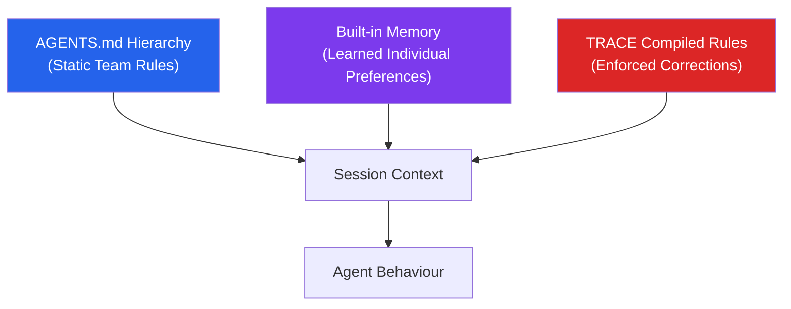
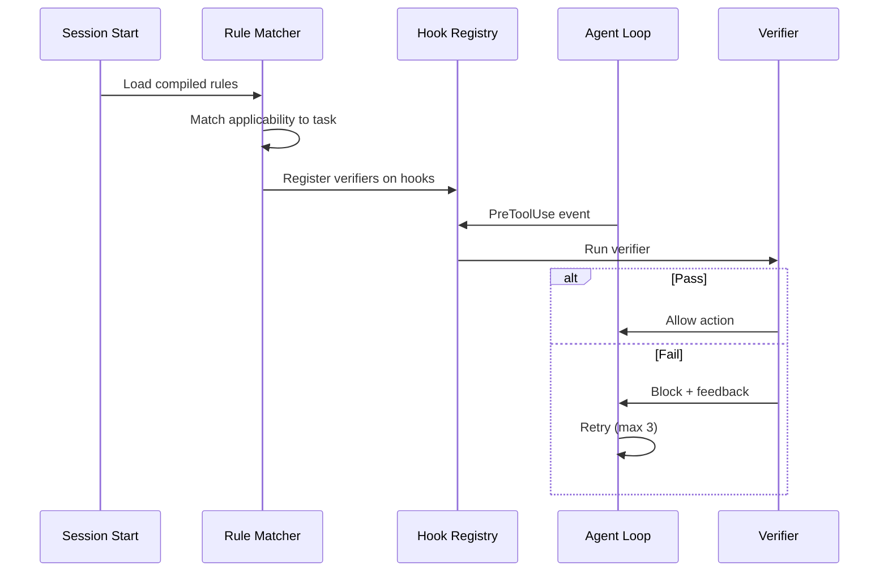

# The Preference Engineering Playbook: From Captured Corrections to Compiled Enforcement in Codex CLI


---

Telling a coding agent your preferences once and having it remember them is table stakes. Making it *comply* with them — reliably, deterministically, across sessions and teammates — is a different problem entirely. Prompt-based preference enforcement achieves roughly 48% compliance even with frontier models [^1]. That is a coin flip dressed up as personalisation.

This playbook synthesises three converging developments — TRACE compiled enforcement, Codex CLI's built-in memory system, and the AGENTS.md instruction hierarchy — into a single preference lifecycle framework: **capture → compile → enforce → audit → prune**. If you are running Codex CLI in a team setting and wondering why your agent keeps ignoring the conventions you taught it last week, this is the architecture that fixes it.

## The Preference Stack: Three Layers, One Agent

Codex CLI's preference architecture comprises three independent layers, each serving a distinct purpose:



**AGENTS.md** handles static, team-level conventions — coding standards, framework choices, naming patterns. The three-tier hierarchy (global at `~/.codex/AGENTS.md`, project root, subdirectory) merges at session start [^2].

**Built-in memory** captures individual developer preferences learned from completed sessions — your preferred test runner, your habitual commit message format, your toolchain quirks. It operates through a two-phase pipeline: rollout extraction followed by global consolidation [^3].

**TRACE compiled rules** transform one-off corrections into runtime-enforceable constraints with verifiers that gate task completion [^4]. This is the layer that closes the compliance gap.

The critical insight: these layers are *complementary*, not competing. AGENTS.md tells the agent what the team expects. Memory tells it what you personally prefer. TRACE ensures it actually *does* both.

## Phase 1: Capture

Preference capture happens through two channels, and conflating them is a common mistake.

### Implicit Capture via Memory

Codex CLI's memory system extracts preferences from completed sessions automatically. Each rollout generates a `raw_memory`, a `rollout_summary`, and an optional `rollout_slug` [^3]. The consolidation phase — which only triggers after six hours of session idleness — ranks memories by usage frequency and recency, promoting high-frequency patterns and demoting stale ones [^5].

Configuration is straightforward:

```toml
[features]
memories = true

[memories]
generate_memories = true
use_memories = true
extract_model = "gpt-5.2-codex"
consolidation_model = "gpt-5.3-codex"
```

The `/m_update` slash command lets you deliberately save a convention or preference rather than waiting for the system to extract it organically [^5].

### Explicit Capture via TRACE

TRACE's detection pipeline uses a lightweight LLM (Gemma 4 31B in the reference implementation) to evaluate incoming user messages for correction signals — durable preferences, repeated errors, or workflow friction [^4]. When detected, it constructs a correction record linking your feedback to the specific agent behaviour and workspace state that triggered it.

A correction about leftover debug files becomes a targeted cleanup rule. A correction about import ordering becomes a formatting constraint. The key distinction from memory: TRACE does not merely *remember* the correction. It compiles it into an executable artefact with an applicability check, a behaviour instruction, and a runtime verifier [^4].

## Phase 2: Compile

Compilation is what separates preference *recall* from preference *enforcement*. The TRACE evaluation data makes this gap brutally clear [^4]:

| Method | Compliance Rate |
|--------|----------------|
| No rules (baseline) | 31.6% |
| Mem0 memory backend | 42.5% |
| All rules via context injection | 55.0% |
| **Compiled rules** | **70.1%** |

Memory backends like Mem0 improve recall but not compliance — "remembering a correction makes it available for retrieval, but does not guarantee compliance" [^4].

### Rule Formation

TRACE extracts atomic rules paired with applicability conditions. Each compiled rule has three components:

1. **Applicability check** — determines whether the rule is relevant to the current task
2. **Behaviour instruction** — injected into the agent's context when applicable
3. **Verifier** — defines the runtime validation logic (regex, script, or model-based)

The rule library is maintained through a five-action resolver [^4]:

- **Noop**: appends evidence to existing rules
- **Update**: refines active rules with compatible corrections
- **Supersede**: deactivates contradicted rules, archives originals
- **Split**: separates multi-part corrections into atomic rules
- **New**: creates rules with no existing coverage

### Mapping to Codex Hooks

Codex CLI's hook system provides the enforcement surface. Hooks fire on five lifecycle events: `SessionStart`, `PreToolUse`, `PostToolUse`, `UserPromptSubmit`, and `Stop` [^6]. TRACE verifiers register against these events:



A `hooks.json` entry for a compiled rule might look like this:

```json
{
  "hooks": [
    {
      "event": "PostToolUse",
      "command": ".codex/verifiers/no-console-log.sh",
      "timeout_ms": 5000
    }
  ]
}
```

Project hooks follow the untrusted-project trust model — the script's hash is recorded, and any modification revokes trust until you re-review [^6].

## Phase 3: Enforce

Enforcement operates at three tiers, each with different compliance characteristics [^4]:

**Deterministic rules** verify through tool-call structures, command arguments, filenames, or workspace states using regex patterns and script-based checks. These are the cheapest and most reliable.

**Semantic rules** evaluate generated text or edited files through model-based checks. More flexible but slower and costlier.

**Intent-level rules** fire as runtime reminders matching task applicability conditions. The weakest tier — essentially context injection with better targeting.

All deployed entries carry verify-retry markers. Retries are bounded at three per task in automated workflows, or two user turns in interactive sessions [^4].

### The PCAS Evolution

For teams requiring stronger guarantees, PCAS (Policy Compiler for Agentic Systems) represents the next evolution: Datalog-based declarative policies compiled into deterministic reference monitors [^1]. Where Codex hooks match surface patterns, PCAS tracks information flow transitively through a causal dependency graph:

```
Depends(dst, src) :- Edge(src, dst).
Depends(dst, src) :- Depends(dst, mid), Edge(src, mid).
```

This catches scenarios that pattern-matching hooks miss — such as credentials entering variables under different names and flowing to subagents through intermediate processing [^1]. Microsoft's Agent Governance Toolkit (April 2026) achieves 0.00% violation rates using similar compiled-policy approaches, compared to 26.67% for prompt-based guardrails [^1].

## Phase 4: Audit

Preference drift is the silent killer of personalisation systems. Without auditing, your preference stack accumulates contradictions, stale conventions, and over-fitted rules.

### Memory Audit

Inspect `~/.codex/memories/MEMORY.md` periodically. This is the primary injection point — its contents are included in the system prompt of every future session when `use_memories` is enabled [^3]. Check for:

- **Stale conventions** from projects you no longer work on
- **Contradictory preferences** from different project contexts
- **Over-personalisation** — preferences so specific they degrade performance on new tasks

The `/m_drop <query>` slash command removes individual memories matching a query [^5]. Use it surgically rather than clearing the entire store.

### Rule Library Audit

TRACE's deployed rule library in the reference implementation comprises 37 atomic rules (79%), 7 refinement entries (15%), and 3 composite parents (6%) [^4]. Your own library should follow a similar distribution — if composite rules dominate, your corrections are too broad and need splitting.

### AGENTS.md Audit

The three-tier hierarchy means subdirectory AGENTS.md files override project-root files, which override the global file [^2]. Contradictions between tiers are not flagged — they silently resolve by precedence. Periodically diff your tiers to catch unintended overrides.

## Phase 5: Prune

Accumulation without pruning is how you end up with an agent that spends half its context window on preferences from three projects ago.

### Automatic Pruning

Codex CLI's memory system prunes automatically on two axes [^5]:

- **Rollout ageing**: rollouts unused for thirty days are aged out
- **Memory pruning**: individual memories unrecalled for thirty days are pruned
- **Database hygiene**: `stage1_outputs` older than `max_unused_days` are batch-deleted

The consolidation pass considers a bounded set of recent rollouts (256 by default), implementing a natural recency window [^5].

### Manual Pruning

Run `codex debug clear-memories` when switching domains entirely — onboarding to an unrelated project with stale memories active is worse than starting fresh [^5].

For TRACE rule libraries, the **Supersede** action in the five-action resolver handles rule retirement: contradicted rules are deactivated but archived for audit trail purposes [^4]. This preserves the correction history whilst keeping the active library lean.

### Hygiene Protocol

A monthly preference hygiene check should cover:

1. Review `MEMORY.md` for stale entries — drop anything project-specific from completed work
2. Check active TRACE rules against current project requirements — supersede rules from previous contexts
3. Diff AGENTS.md tiers for unintended overrides
4. Verify hook trust hashes — untrusted hooks are silently skipped [^6]
5. Review consolidation logs for repeated extraction failures

## Putting It Together

The preference engineering lifecycle is not a one-time setup. It is a continuous loop where each phase feeds the next:


**AGENTS.md** is your team's shared constitution — static, version-controlled, reviewable in PRs. **Memory** is your personal preference layer — dynamic, automatically maintained, regularly audited. **TRACE compiled rules** are the enforcement mechanism that turns both into runtime constraints with teeth.

The 48% compliance baseline is not a fundamental limitation of AI agents. It is a limitation of treating preferences as suggestions. Compiled enforcement — whether through TRACE's hook-based verifiers today or PCAS-style causal policy monitors tomorrow — is how you close the gap.

Stop telling your agent twice. Start compiling once.

## Citations

[^1]: "Compiled Policy Enforcement: Why Prompt-Based Safety Fails at 48% and What PCAS Means for Codex Hooks," Codex Knowledge Base, April 2026. [https://codex.danielvaughan.com/2026/04/19/compiled-policy-enforcement-pcas-codex-hooks/](https://codex.danielvaughan.com/2026/04/19/compiled-policy-enforcement-pcas-codex-hooks/)

[^2]: "Codex CLI Configuration Complete Guide: Hierarchy, Profiles, and Trust," Codex Knowledge Base, April 2026. [https://codex.danielvaughan.com/2026/04/16/codex-cli-configuration-complete-guide-hierarchy-profiles-trust/](https://codex.danielvaughan.com/2026/04/16/codex-cli-configuration-complete-guide-hierarchy-profiles-trust/)

[^3]: "Codex Built-In Memory Deep Dive: How the Two-Phase Pipeline Turns Sessions into Institutional Knowledge," Codex Knowledge Base, April 2026. [https://codex.danielvaughan.com/2026/04/18/codex-built-in-memory-system-deep-dive/](https://codex.danielvaughan.com/2026/04/18/codex-built-in-memory-system-deep-dive/)

[^4]: Chen et al., "Getting Better at Working With You: Compiling User Corrections into Runtime Enforcement for Coding Agents" (TRACE), arXiv:2606.13174, June 2026. [https://arxiv.org/html/2606.13174](https://arxiv.org/html/2606.13174)

[^5]: "Memory Lifecycle Management: Create, Consolidate, Clean, Delete in Codex CLI," Codex Knowledge Base, April 2026. [https://codex.danielvaughan.com/2026/04/15/memory-lifecycle-management-codex-cli/](https://codex.danielvaughan.com/2026/04/15/memory-lifecycle-management-codex-cli/)

[^6]: "OpenAI Codex Hooks: Control Your AI Agent's Every Move," ByteIota, 2026. [https://byteiota.com/openai-codex-hooks-control-coding-agent/](https://byteiota.com/openai-codex-hooks-control-coding-agent/)
