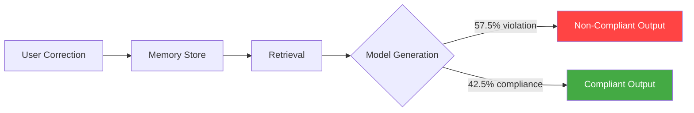
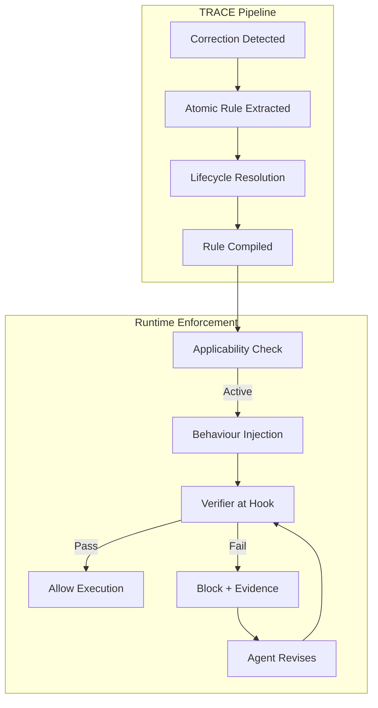
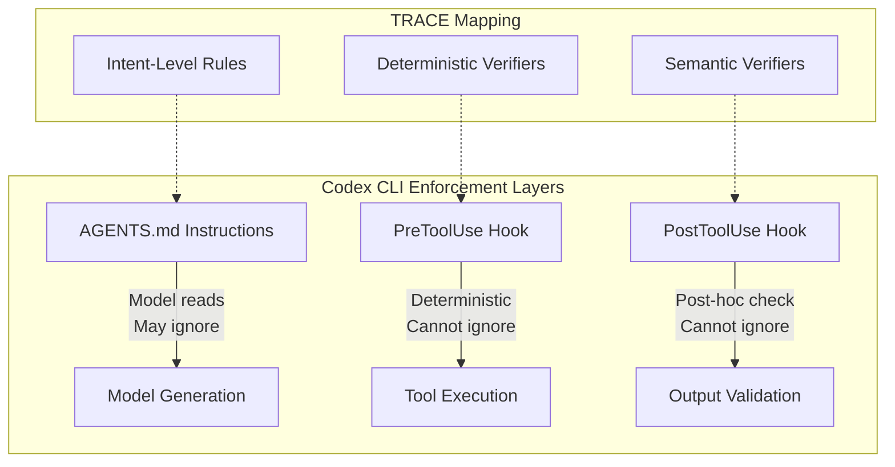

# Tell Me Once: How TRACE Compiles User Corrections into Runtime Enforcement — and What It Means for Codex CLI's Hook Stack


---

Every senior developer who has spent serious time with a coding agent knows the frustration: you correct the agent once — "use British English in docstrings", "never run `rm -rf` on the monorepo root", "always import from the internal SDK, not the public package" — and the correction sticks for exactly one session. Next session, same mistake. The agent has access to your preference. It simply does not comply.

A June 2026 paper from Zhou et al. quantifies this gap precisely: even with Mem0 memory, 57.5% of applicable preference checks are still violated [^1]. The paper introduces **TRACE** (Test-time Rule Acquisition and Compiled Enforcement), a drop-in skill-layer pipeline that mines corrections from chat, compiles them into verifiable runtime rules, and enforces them through hooks — reducing violations to 2.0% on out-of-distribution tasks [^1]. The companion **tellonce** skill already runs on Claude Code, Codex CLI, and GitHub Copilot CLI [^2].

This article unpacks how TRACE works, what the numbers actually show, and how its architecture maps onto Codex CLI's existing hook and memory stack.

## The Preference Compliance Gap

The core insight is deceptively simple: **remembering a preference and enforcing a preference are different problems**. Memory systems store corrections. They retrieve them when the embedding similarity is high enough. But retrieval does not guarantee compliance — the model may attend to the retrieved preference and still generate a non-compliant output [^1].

Zhou et al. tested this across four coding agents, including Claude Code and Codex CLI, using six models [^1]. The diagnostic finding: Mem0 retrieves relevant preferences in most cases, but the model's generation step ignores them more than half the time. The failure is not in storage or retrieval — it is in the gap between context presence and behavioural adherence.



## How TRACE Works

TRACE operates as a three-stage pipeline that transforms ephemeral corrections into durable, enforceable rules [^1].

### Stage 1: Detection and Extraction

Every user message is evaluated by a lightweight model (Gemma 4 31B in the paper's implementation) for correction signals — durable preferences, repeated-error notifications, or workflow friction [^1]. When a signal is detected, an atomic rule is extracted: a concise directive paired with an applicability condition that defines precisely when the rule should and should not trigger.

### Stage 2: Lifecycle Resolution

New rules are compared against the existing rule set using five resolution actions [^1]:

| Action | Effect |
|---|---|
| **Noop** | Rule already exists, no change |
| **Update** | Existing rule refined with new detail |
| **Supersede** | New rule replaces an outdated one |
| **Split** | One rule decomposed into multiple specific rules |
| **New** | Novel rule added to the set |

This lifecycle management prevents rule bloat and handles the natural evolution of preferences — a problem that the Cai et al. study of 7,310 IDE rules showed is dominated by constructive expansions (29.17%) and enrichments (26.59%) [^3].

### Stage 3: Compilation to Runtime Checks

Each rule is decomposed into three enforceable components [^1]:

1. **Applicability check** — determines whether the rule activates for a given task
2. **Behaviour instruction** — specifies required agent actions, injected into context
3. **Verifier** — defines runtime validation logic and failure conditions

The verifiers execute at hook intercept points: prompt injection, tool-use, file-write, termination, and completion gates [^1]. If a verifier fails, the hook blocks the event and reports the violation with evidence, compelling the agent to revise until compliant. Execution terminates only when all active verifiers pass.



### Three Enforcement Tiers

TRACE distinguishes three verification tiers based on what can be checked deterministically [^1]:

- **Deterministic** — verified via tool structures, arguments, file names, workspace state. Example: a rule requiring all test files to use `.test.ts` extension can be checked by inspecting the file path in the tool call.
- **Semantic** — evaluated through model-based checks on generated text or files. Example: a rule requiring British English spelling needs an LLM to evaluate compliance.
- **Intent-level** — injected as runtime reminders when no programmatic check is feasible. Example: "prefer composition over inheritance" cannot be verified mechanically, but can be surfaced as context.

## The Numbers

Zhou et al. evaluated TRACE on ClawArena, a benchmark of 62 scenario templates representing multi-round coding tasks with objective checkers and preference overlays [^1].

| Condition | In-Distribution Violation | Out-of-Distribution Violation |
|---|---|---|
| No Memory | 100.0% | 100.0% |
| Mem0 | 57.5% | ~50%+ |
| **TRACE** | **37.6%** | **2.0%** |

The out-of-distribution result is the headline: 2.0% violation rate on tasks from five entirely unseen families [^1]. This suggests compiled rules generalise far better than retrieved memories.

On MemoryArena-derived tasks, TRACE reduced in-distribution violations from 100.0% to 60.5% while achieving the highest task-pass rate at 17.3% [^1]. The efficiency metrics are equally notable: TRACE required 1.02 user turns per OOD round versus 2.00 for the no-memory baseline, with 42.5 seconds wall-clock time per round [^1].

## Mapping TRACE to Codex CLI's Existing Stack

Codex CLI already ships the architectural primitives that TRACE's enforcement layer requires. The question is how they align.

### PreToolUse Hooks as Verifier Intercepts

TRACE verifiers fire "at prompt, tool-use, file-write, or termination events" [^1]. Codex CLI's `PreToolUse` hook fires before every tool call, receiving a JSON payload on stdin with the tool name and arguments [^4]. A TRACE deterministic verifier — say, blocking `rm -rf` on protected paths — maps directly to a PreToolUse hook that inspects `tool_input.command` and emits `{"verdict": "deny", "reason": "..."}` [^4].

```toml
# .codex/hooks.toml — example TRACE-style deterministic verifier
[[hooks]]
event = "PreToolUse"
command = "trace-verify --tier deterministic"
timeout_ms = 5000
```

### PostToolUse Hooks for Post-Hoc Verification

TRACE's semantic verifiers need to inspect outputs. Codex CLI's `PostToolUse` hook fires after tool completion, allowing follow-up checks — lint output, file content validation, or model-based compliance evaluation [^4]. This is where spelling rules, code-style preferences, and output-format constraints would be enforced.

### AGENTS.md as the Rule Store

TRACE stores compiled rules with applicability conditions and verifier definitions [^1]. In Codex CLI, the natural home for these rules is the layered AGENTS.md discovery system — project-root `AGENTS.md` for team-wide rules, subdirectory `AGENTS.md` for module-specific preferences, and `AGENTS.override.md` for temporal rules that evolve across sessions [^5]. The key difference: AGENTS.md rules are instruction-layer (the model reads them), whilst TRACE verifiers are enforcement-layer (hooks enforce them regardless of whether the model attends to them).



### The tellonce Skill

The deployable artefact of TRACE is **tellonce**, an open-source skill available at `github.com/YujunZhou/tellonce` [^2]. It runs on Claude Code, Codex CLI, and GitHub Copilot CLI with a shared memory across all three agents [^2]. The skill operates in three modes [^2]:

- **Observe** — scans turns for correction signals, records rules, reports but does not enforce
- **Enforce** — activates verifiers for recorded rules, blocks non-compliant outputs
- **Full** — observe + enforce, the default production mode

For Codex CLI, tellonce integrates via the runtime hooks system. Installation follows the standard skill pattern, and the skill includes `install`, `doctor`, and `uninstall` commands with chaos-tested reliability [^2].

## Architectural Implications for Codex CLI Users

### 1. Hooks Are Not Optional Infrastructure

The TRACE results make an empirical case that hooks are the most effective enforcement mechanism available. AGENTS.md instructions alone leave 57.5% of preferences violated (the Mem0 baseline is functionally equivalent to instruction-layer enforcement) [^1]. Deterministic hooks reduce this to single digits [^1]. If you are writing preferences in AGENTS.md but not backing critical ones with hooks, you are relying on the weaker enforcement path.

### 2. Rule Compilation Is a Missing Layer

Codex CLI provides the hooks. It provides the AGENTS.md rule store. What it does not yet provide natively is the compilation step — the automatic transformation of a chat correction into a hook-backed verifier. TRACE fills this gap as a skill, but the pattern suggests a future where coding agents ship rule compilers as first-party features [^1].

### 3. The Memory-Enforcement Spectrum

TRACE reveals a spectrum of enforcement strength:

| Layer | Mechanism | Compliance Rate |
|---|---|---|
| No memory | Prompt only | 0% |
| Memory retrieval | Mem0 / AGENTS.md | ~42% |
| Instruction injection | Context-stuffed rules | ~60% |
| **Compiled enforcement** | **Hook-backed verifiers** | **~98% OOD** |

For Codex CLI users, the practical recommendation is: use AGENTS.md for intent-level guidance, use hooks for anything that must not be violated, and consider TRACE or tellonce to bridge the gap automatically.

### 4. Cross-Agent Portability

tellonce's shared memory across Claude Code, Codex CLI, and Copilot CLI [^2] points to a future where user preferences are portable across agents. The Codex CLI `requirements.toml` fleet governance file [^6] could serve as a distribution channel for compiled rules in enterprise environments — ensuring that TRACE-derived verifiers propagate across developer machines without manual configuration.

## Limitations and Open Questions

TRACE's in-distribution violation rate of 37.6% is not zero [^1]. Semantic verifiers depend on a secondary model call, adding latency and cost. The ClawArena benchmark, whilst rigorous, uses synthetic preference overlays rather than real-world developer corrections collected in production. And the lifecycle resolution system (Noop/Update/Supersede/Split/New) has not been tested at scale with hundreds of accumulated rules over months of use.

For Codex CLI specifically, the `PreToolUse` hook protocol currently supports `deny` verdicts but does not support `allow` or `updatedInput` responses [^4], limiting the sophistication of verifier feedback. A richer hook response protocol would unlock more of TRACE's enforcement capabilities.

## Conclusion

The preference compliance gap is real, quantified, and architecturally solvable. TRACE demonstrates that compiling corrections into hook-backed verifiers reduces violations from 100% to 2% on unseen tasks — a result that should change how we think about coding-agent memory. The insight is not "agents need better memory" but "agents need enforcement, and enforcement means hooks."

Codex CLI's existing PreToolUse/PostToolUse hook system, AGENTS.md layered discovery, and skill architecture provide the foundation. TRACE and tellonce provide the compilation layer. The combination turns "tell me once" from aspiration into architecture.

---

## Citations

[^1]: Zhou, Y., Guo, K., Zhuang, H., Wang, X., Huang, Y., Liang, Z., Chen, P.-Y., Gao, T., Moniz, N., Chawla, N. V., & Zhang, X. (2026). "Getting Better at Working With You: Compiling User Corrections into Runtime Enforcement for Coding Agents." arXiv:2606.13174. [https://arxiv.org/abs/2606.13174](https://arxiv.org/abs/2606.13174)

[^2]: Zhou, Y. (2026). tellonce — In-session compliance enforcement skill for Claude Code. GitHub. [https://github.com/YujunZhou/tellonce](https://github.com/YujunZhou/tellonce)

[^3]: Cai, Y. et al. (2026). "Rule Taxonomy in AI IDEs." arXiv:2606.12231. [https://arxiv.org/abs/2606.12231](https://arxiv.org/abs/2606.12231)

[^4]: OpenAI. (2026). Codex CLI Hooks Reference — hooks.json, PreToolUse & PostToolUse. [https://developers.openai.com/codex/agent-approvals-security](https://developers.openai.com/codex/agent-approvals-security)

[^5]: OpenAI. (2026). Codex CLI Guide 2026: Setup, Sandbox, AGENTS.md & MCP. [https://developers.openai.com/codex/config-advanced](https://developers.openai.com/codex/config-advanced)

[^6]: OpenAI. (2026). Codex CLI Advanced Configuration — requirements.toml fleet governance. [https://developers.openai.com/codex/config-advanced](https://developers.openai.com/codex/config-advanced)
