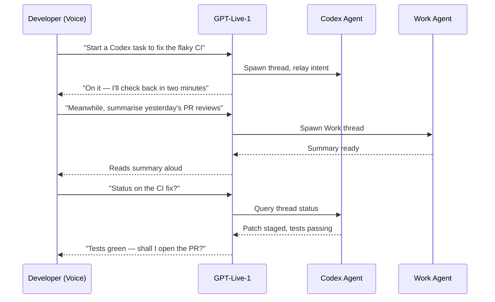

# ChatGPT Voice Meets Codex: Full-Duplex Agent Orchestration from the Desktop


On 23 July 2026, OpenAI shipped ChatGPT Voice into the desktop application on macOS and Windows, powered by the GPT-Live-1 model family launched two weeks earlier.[^1] The headline capability: developers can now speak to start, steer, interrupt, and coordinate Codex and Work agent threads without typing a single character. This article examines the architecture, the practical developer workflows it enables, the mapping back to Codex CLI's existing voice infrastructure, and the limitations worth knowing before you adopt it.

## GPT-Live-1: The Full-Duplex Foundation

GPT-Live-1 is not a wrapper around GPT-5.6. It is a dedicated voice model designed for **full-duplex** interaction — simultaneous listening and speaking — with the ability to dynamically decide whether to keep listening, pause, respond, or invoke deeper reasoning.[^2] A free-tier variant, GPT-Live-1 mini, ships for ChatGPT Free users, but the Work and Codex integration requires Plus, Pro, Business, Edu, or Enterprise plans.[^1]

The full-duplex architecture eliminates the push-to-talk, wait-for-response cadence of earlier voice modes. You can interrupt mid-sentence, and the model adjusts. When a question requires web search, multi-step reasoning, or agentic execution, GPT-Live-1 delegates to GPT-5.5 and brings results back into the conversational stream without breaking flow.[^3]



## Architecture: Voice as an Orchestration Layer

The critical design decision is that voice does not replace the existing Codex or Work harnesses. It sits above them as an **orchestration input channel**.[^4] When you say "fix the flaky CI in the payments repo," GPT-Live-1 translates that into a Codex task creation call. The Codex agent runs exactly as it would if you had typed the instruction — same sandbox, same approval policies, same hooks.

This means:

- **Permissions are inherited.** Voice uses the tools and permissions already available within whichever Work or Codex context is selected.[^5] No new permission surface is introduced.
- **Quotas are shared.** Voice-triggered agent tasks consume standard Codex and Work plan quotas. There is no separate voice-agent allocation.[^4]
- **Threads are independent.** Each voice-initiated task runs in its own thread. You can have multiple Codex threads and Work threads active simultaneously, steering them by voice.

## Appshots: Screen Context Without Screenshots

On macOS, the desktop app integrates **Appshots** — a feature that captures the frontmost window and shares it with the voice session when Screen context is enabled.[^1] This allows interactions such as:

- "Take a look at this" while a failing test output is visible in the terminal
- "Explain this error" with a stack trace on screen
- "What's wrong with this diff?" while reviewing code in your editor

Appshots are not full desktop screenshots. They capture only the **frontmost window**, limiting the information surface and reducing accidental exposure of sensitive content from other applications.[^5] Windows receives voice and agent control but currently lacks Appshots parity.[^4]

To enable Screen context on macOS, the application requires **Screen & Audio Recording** and **Accessibility** permissions at the OS level.[^5]

## Mapping to Codex CLI's Voice Infrastructure

Codex CLI has had its own voice layer since v0.105.0 (February 2026), when native voice transcription was added behind a feature flag.[^6] The March 2026 `[realtime]` configuration consolidation (PRs #14556 and #14606) unified this into a proper WebSocket-based realtime session architecture with two modes: conversational and transcription.[^7]

The desktop Voice integration and the CLI's `[realtime]` configuration serve different interaction models:

| Dimension | Codex CLI `[realtime]` | ChatGPT Desktop Voice |
|-----------|----------------------|----------------------|
| **Model** | Realtime API (audio WebSocket) | GPT-Live-1 (full-duplex) |
| **Activation** | Press-and-hold spacebar in TUI | Always-on conversation |
| **Scope** | Single CLI session | Multi-thread orchestration |
| **Output** | Text in terminal | Spoken + streamed text |
| **Screen context** | None (terminal-only) | Appshots (macOS) |
| **Config** | `config.toml` `[realtime]` table | Desktop app settings |

The CLI's voice is optimised for in-session dictation and pair-programming within a single agentic loop. Desktop Voice is optimised for **supervisory orchestration** across multiple concurrent threads.[^4]

## Multi-Folder Projects: The Companion Feature

Shipped alongside Voice on 23 July, multi-folder project support allows a single desktop project to span multiple related repositories.[^1] You designate a primary folder — used for new chats, Git operations, and automatic discovery of `AGENTS.md`, skills, and `config.toml` — while secondary folders are available for file search and editing.[^8]

This pairs naturally with voice orchestration. A spoken instruction like "check the API service for breaking changes against the frontend types" can operate across folders without manually switching context.

## Practical Workflow Patterns

### The Voice-Driven Code Review

1. Open a PR diff in your editor
2. Enable Screen context
3. Say: "Walk me through this diff — flag anything that looks risky"
4. GPT-Live-1 reads the Appshot, analyses the code, and speaks through its findings
5. Interrupt with: "What about the error handling in that second function?"

### The Multi-Agent Sprint

1. "Start a Codex task to add pagination to the users endpoint"
2. "In parallel, research the cursor-based pagination pattern we discussed yesterday" (spawns a Work thread)
3. "Narrate progress every two minutes, stay quiet otherwise"
4. Continue working manually while agents execute in the background
5. "Status on both tasks" — receive a spoken summary

### The Ambient Monitor

Voice supports a low-interruption mode where the agent provides periodic status updates on long-running tasks. The suggested prompt pattern: "narrate progress every ~2 minutes, stay quiet otherwise."[^4] This turns Codex into background pair-programmer that speaks up only when something requires your attention.

## Limitations and Caveats

**Voice is better for steering than specification.** Dense architectural requirements, precise type signatures, and detailed config blocks are still better typed. As one early assessment puts it: "Voice is great for steer, weaker for spec density."[^4]

**Single voice conversation at a time.** Only one voice session can be active simultaneously, even though multiple agent threads can run in the background.[^5]

**No Android support yet.** Voice works on macOS and Windows desktop apps, and through Remote on paired iOS devices. Android remote access is forthcoming but not yet available.[^9]

**Quota consumption is real.** Every voice-triggered agent task draws from the same weekly Codex and Work quotas as typed tasks. Heavy voice orchestration can exhaust allocations faster than expected because the conversational overhead (GPT-Live-1 processing) sits on top of the agent compute.[^4]

**Appshots are macOS-only.** Windows users get voice orchestration but cannot share screen context. This gap matters for workflows that rely on visual code review.[^4]

## Configuration Checklist

For developers adopting desktop Voice with Codex:

```toml
# config.toml — these settings apply to CLI sessions
# Desktop Voice inherits project-level AGENTS.md and config.toml
# from the primary folder

[model]
# Desktop Voice delegates to the model configured here for Codex tasks
model = "o4-mini"

[sandbox]
# Voice-initiated tasks run in the same sandbox as typed tasks
sandbox = "workspace-write"

[approval_policy]
# Voice does not bypass approval — same policy applies
approval_policy = "unless-allow-listed"
```

The key point: there is no separate voice configuration in `config.toml` for desktop Voice. The desktop app reads `AGENTS.md`, `config.toml`, and `requirements.toml` from the project's primary folder, and voice-initiated tasks inherit those settings identically to typed tasks.[^8]

## What This Means for Codex CLI Users

Desktop Voice does not replace the CLI. It adds a supervisory layer for developers who work across multiple repositories and want to coordinate agents without context-switching to a terminal. The CLI remains the tool for deep, single-session agentic work with fine-grained `[realtime]` voice control and sandbox configuration.

The more interesting trajectory is convergence. Codex CLI v0.145.0, released two days before Voice shipped, added audio input support and streaming Realtime V3 conversations.[^10] As the CLI's voice capabilities evolve toward the same full-duplex model that powers desktop Voice, the gap between the two surfaces will narrow — potentially unifying supervisory orchestration and in-session pair-programming into a single voice-driven development workflow.

## Citations

[^1]: OpenAI, "What's new — ChatGPT Voice in Work and Codex," ChatGPT Learn, 23 July 2026. [https://learn.chatgpt.com/docs/whats-new](https://learn.chatgpt.com/docs/whats-new)

[^2]: ExplainX, "GPT-Live: OpenAI Full-Duplex ChatGPT Voice," July 2026. [https://www.explainx.ai/blog/gpt-live-openai-chatgpt-voice-july-2026](https://www.explainx.ai/blog/gpt-live-openai-chatgpt-voice-july-2026)

[^3]: VentureBeat, "Agentic coding goes hands-free as OpenAI brings GPT-Live's full duplex voice control to Codex and ChatGPT on the desktop," 23 July 2026. [https://venturebeat.com/orchestration/agentic-coding-goes-hands-free-as-openai-brings-gpt-lives-full-duplex-voice-control-to-codex-and-chatgpt-on-the-desktop](https://venturebeat.com/orchestration/agentic-coding-goes-hands-free-as-openai-brings-gpt-lives-full-duplex-voice-control-to-codex-and-chatgpt-on-the-desktop)

[^4]: ExplainX, "ChatGPT Voice Desktop: GPT-Live for Codex Work," July 2026. [https://explainx.ai/blog/chatgpt-voice-desktop-gpt-live-codex-work-july-2026](https://explainx.ai/blog/chatgpt-voice-desktop-gpt-live-codex-work-july-2026)

[^5]: XenoSpectrum, "ChatGPT Voice Now Works with Work and Codex, Letting You Direct Multiple Agents by Voice," July 2026. [https://xenospectrum.com/en/chatgpt-voice-work-codex-desktop/](https://xenospectrum.com/en/chatgpt-voice-work-codex-desktop/)

[^6]: Codex CLI changelog, v0.105.0, 26 February 2026. [https://www.gradually.ai/en/changelogs/codex-cli/](https://www.gradually.ai/en/changelogs/codex-cli/)

[^7]: Codex Resources, "Codex CLI Realtime Sessions: Voice Pair Programming, Transcription Mode, and the [realtime] Config," 31 March 2026. [https://codex.danielvaughan.com/2026/03/31/codex-cli-realtime-sessions-voice-transcription/](https://codex.danielvaughan.com/2026/03/31/codex-cli-realtime-sessions-voice-transcription/)

[^8]: OpenAI, "Codex changelog — Multi-folder projects," ChatGPT Learn, 23 July 2026. [https://learn.chatgpt.com/docs/changelog](https://learn.chatgpt.com/docs/changelog)

[^9]: TestingCatalog (@testingcatalog), X post on ChatGPT Voice desktop rollout, 23 July 2026. [https://x.com/testingcatalog/status/2080401533728940372](https://x.com/testingcatalog/status/2080401533728940372)

[^10]: OpenAI, "Codex CLI v0.145.0 changelog," 21 July 2026. [https://learn.chatgpt.com/docs/changelog](https://learn.chatgpt.com/docs/changelog)
