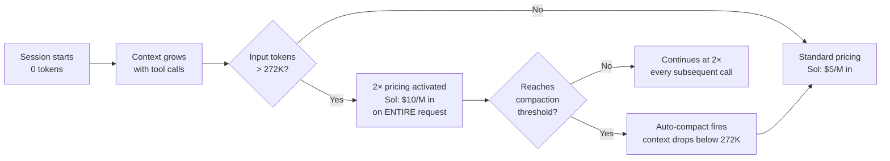

# The 272K Tripwire: How GPT-5.6's Context Window Cap Silently Doubles Your Codex CLI Bill


---

OpenAI's GPT-5.6 family launched on 9 July 2026 with a headline 1.05-million-token context window and 128K maximum output [^1]. The marketing suggested room to spare. The reality is a pricing tripwire at 272,000 input tokens that, once crossed, applies a **2× input and 1.5× output multiplier to the entire request** — not just the overage [^2]. Codex CLI's default configuration until v0.144.6 made it trivially easy to cross that line without knowing it.

This article explains the mechanics of the threshold, shows exactly how Codex CLI sessions drift past it, and provides the configuration changes needed to stay on the right side.

## The Pricing Bands

GPT-5.6 ships in three tiers. Standard pricing per million tokens [^2]:

| Model | Input | Cached Read | Output |
|-------|-------|-------------|--------|
| Sol | \$5.00 | \$0.50 | \$30.00 |
| Terra | \$2.50 | \$0.25 | \$15.00 |
| Luna | \$1.00 | \$0.10 | \$6.00 |

Cross 272K input tokens and the **long-context** multiplier activates [^2]:

| Model | Input (2×) | Cached Read (2×) | Output (1.5×) |
|-------|-----------|-------------------|---------------|
| Sol | \$10.00 | \$1.00 | \$45.00 |
| Terra | \$5.00 | \$0.50 | \$22.50 |
| Luna | \$2.00 | \$0.20 | \$9.00 |

The critical detail: the multiplier applies to the **full request**, not the tokens above 272K [^2]. A 280K-token prompt costs the same per-token rate as a 500K-token prompt — both hit the 2× band. There is no gradual ramp.

## How Codex CLI Crossed the Line by Default

When GPT-5.6 models first appeared in Codex CLI's model catalogue, the metadata reported a raw context window of 372,000 tokens with a 95% effective-context multiplier, yielding approximately 353,400 usable tokens [^3]. That put the auto-compaction trigger — which fires at roughly `context_window - 13,000` tokens — well above the 272K pricing boundary [^4].

The result: a session could accumulate 340K+ tokens of context before compaction kicked in, silently entering the higher-usage pricing band for every API call along the way.



In v0.144.5, OpenAI corrected the catalogue entry to `context_window: 272000` with a 95% effective-context multiplier, giving an effective window of 258,400 tokens [^5]. This kept default sessions below the pricing boundary but represented a 26.9% reduction in usable context compared to the previous configuration [^6].

## The Sub-Agent Amplifier

Multi-Agent V2 makes the problem worse. When Sol spawns sub-agents to audit its own work or parallelise tasks, each child agent carries its own context accumulation [^7]. A parent orchestrator with three active sub-agents can generate four concurrent streams of context growth, any of which might independently cross 272K.

The `hide_spawn_agent_metadata` default (set to `true`) compounds this by stripping model and reasoning-effort parameters from the spawn schema, preventing the orchestrator from routing sub-agents to cheaper tiers like Terra or Luna [^8].

## Defence Configuration

### 1. Set an Explicit Compaction Threshold

The most direct defence is forcing auto-compaction well below 272K. In `~/.config/codex/config.toml`:

```toml
# Compact before reaching the 272K pricing boundary
# 250K gives ~22K of headroom for the final exchange
model_auto_compact_token_limit = 250000
```

This overrides the model-catalogue-derived threshold and ensures compaction fires before any request enters the higher-usage band [^3].

### 2. Use Named Profiles for Tier Routing

Not every task needs Sol. Create profiles that default to cheaper tiers for routine work:

```toml
[profile.review]
model = "gpt-5.6-terra"
model_auto_compact_token_limit = 250000

[profile.scaffold]
model = "gpt-5.6-luna"
model_auto_compact_token_limit = 250000

[profile.deep]
model = "gpt-5.6-sol"
model_auto_compact_token_limit = 250000
```

Launch with `codex --profile review` to stay on Terra's \$2.50/M input rate for code reviews, reserving Sol for genuinely complex reasoning tasks [^9].

### 3. Pin Sub-Agent Models

If you run Multi-Agent V2, expose the spawn schema and pin sub-agent models:

```toml
[multi_agent]
hide_spawn_agent_metadata = false

[agents]
default_subagent_model = "gpt-5.6-terra"
```

This ensures child agents use Terra by default rather than inheriting Sol's pricing [^8].

### 4. Monitor with /usage and /status

The `/status` command shows the active model and current token count. The `/statusline` command enables a persistent footer with live token tracking [^10]. Use these to spot sessions approaching the boundary:

```bash
# Inside a Codex session:
/status          # Check current token usage
/statusline      # Enable persistent token counter
/compact         # Manually trigger compaction
```

### 5. Set rollout_token_budget for Cost Caps

For sessions using Ultra or Max reasoning, constrain the reasoning token budget to prevent runaway context growth:

```toml
[reasoning]
rollout_token_budget = 200000
```

This caps reasoning tokens independently of context, preventing the combined total from crossing 272K [^11].

## The Maths: What Crossing 272K Actually Costs

Consider a typical Sol session that drifts to 300K input tokens before compaction, generating 50K output tokens:

**Standard band (under 272K):**
- Input: 300K × \$5.00/M = \$1.50
- Output: 50K × \$30.00/M = \$1.50
- **Total: \$3.00**

**Higher-usage band (over 272K):**
- Input: 300K × \$10.00/M = \$3.00
- Output: 50K × \$45.00/M = \$2.25
- **Total: \$5.25**

That is a **75% cost increase** for the same work, triggered by just 28K tokens of overshoot. Over a full day of heavy Sol usage, the difference compounds rapidly. Community reports describe teams seeing 40-60% bill increases after upgrading to GPT-5.6 with unchanged workflows [^6].

## The Competitive Context

The 272K cap is particularly notable given competitors' offerings in the same period:

- **Google Gemini 2.5 Pro**: 1M+ token context window without tiered pricing [^12]
- **Anthropic Claude Sonnet 4**: 1M context option available without pricing multipliers [^6]
- **xAI Grok 4.3**: 1M tokens without long-context surcharges [^6]

None of these competitors apply a full-request multiplier at a mid-range threshold. OpenAI's approach is uniquely punitive: the multiplier hits the entire request rather than just the tokens above the boundary, creating a cliff rather than a gradient.

## The v0.144.6 Fix and What Remains Broken

The v0.144.6 release on 18 July 2026 corrected the model catalogue to report `context_window: 272000`, aligning the default auto-compaction behaviour with the pricing boundary [^5]. For new installations, the problem is largely resolved — sessions compact before reaching 272K.

However, several issues remain:

1. **No in-session warning**: Codex CLI does not display a warning when approaching the pricing threshold [^3]. Users must manually monitor via `/status` or `/statusline`.
2. **Sub-agent context is opaque**: There is no aggregate view of total token consumption across parent and child agents [^7].
3. **Cached tokens count**: The 272K threshold applies to total input tokens including cached reads, though cached tokens receive their own (lower) per-token rate [^2].
4. **Custom endpoints**: Users connecting via Amazon Bedrock or custom API endpoints may have different catalogue metadata, potentially reverting to the wider window [^13].

## Recommended Defensive Configuration

For teams wanting a single copy-paste block:

```toml
# ~/.config/codex/config.toml — 272K pricing defence

# Compact before the pricing cliff
model_auto_compact_token_limit = 250000

# Pin sub-agents to Terra unless overridden
[agents]
default_subagent_model = "gpt-5.6-terra"

# Expose sub-agent model selection
[multi_agent]
hide_spawn_agent_metadata = false

# Cap reasoning tokens
[reasoning]
rollout_token_budget = 200000
```

Add the `/statusline` command to your workflow habits. Treat the 272K boundary the same way you treat a rate limit: something to be monitored, not discovered on your invoice.

## Citations

[^1]: OpenAI, "GPT-5.6 Model Card," OpenAI Platform Documentation, July 2026. [https://platform.openai.com/docs/models/gpt-5.6](https://platform.openai.com/docs/models/gpt-5.6)

[^2]: OpenAI, "API Pricing — GPT-5.6 Family," OpenAI Platform, July 2026. Confirmed via [https://devtk.ai/en/blog/openai-api-pricing-guide-2026/](https://devtk.ai/en/blog/openai-api-pricing-guide-2026/)

[^3]: GitHub Issue #32486, "Default GPT-5.6 context can cross the 272K higher-usage threshold," openai/codex, July 2026. [https://github.com/openai/codex/issues/32486](https://github.com/openai/codex/issues/32486)

[^4]: Unblocked, "Codex Context Window: How It Works (2026)," July 2026. [https://getunblocked.com/blog/codex-context-window/](https://getunblocked.com/blog/codex-context-window/)

[^5]: OpenAI Codex CLI v0.144.6 Release Notes, "Refreshed bundled instructions for GPT-5.6 Sol, Terra, and Luna, and corrected their context windows to 272,000 tokens," 18 July 2026. [https://github.com/openai/codex/releases/tag/rust-v0.144.6](https://github.com/openai/codex/releases/tag/rust-v0.144.6)

[^6]: GitHub Issue #32806, "GPT-5.6 Sol context cut again: 353K → 258K despite advertised 1.05M," openai/codex, July 2026. [https://github.com/openai/codex/issues/32806](https://github.com/openai/codex/issues/32806)

[^7]: OpenAI, "Multi-Agent V2 Documentation," Codex CLI, July 2026. Referenced in GitHub Issue #31814.

[^8]: GitHub Issue #32031, "Critical UX regression: hidden schema in Multi-Agent V2," openai/codex, July 2026. [https://github.com/openai/codex/issues/32031](https://github.com/openai/codex/issues/32031)

[^9]: OpenAI, "Named Profiles," Codex CLI Documentation, 2026. [https://developers.openai.com/codex/configuration](https://developers.openai.com/codex/configuration)

[^10]: OpenAI, "Codex CLI Commands Reference," 2026. [https://toolsbase.dev/en/reference/codex-commands](https://toolsbase.dev/en/reference/codex-commands)

[^11]: GitHub PRs #28746 and #28494, "rollout_token_budget configuration," openai/codex, June-July 2026.

[^12]: Google, "Gemini 2.5 Pro Model Card," Google AI, 2026. ⚠️ Exact pricing model for long-context requests may vary by access tier.

[^13]: OpenAI, "Amazon Bedrock Integration," Codex CLI v0.145.0 Release Notes, July 2026. [https://github.com/openai/codex/releases/tag/rust-v0.145.0](https://github.com/openai/codex/releases/tag/rust-v0.145.0)
