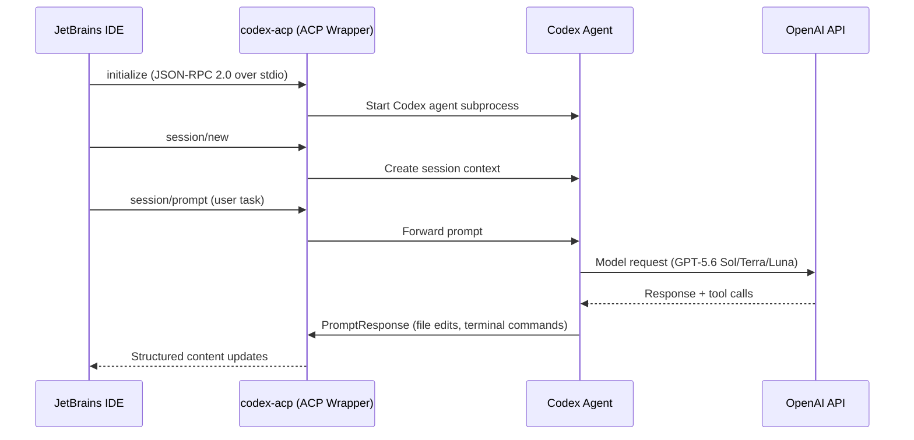
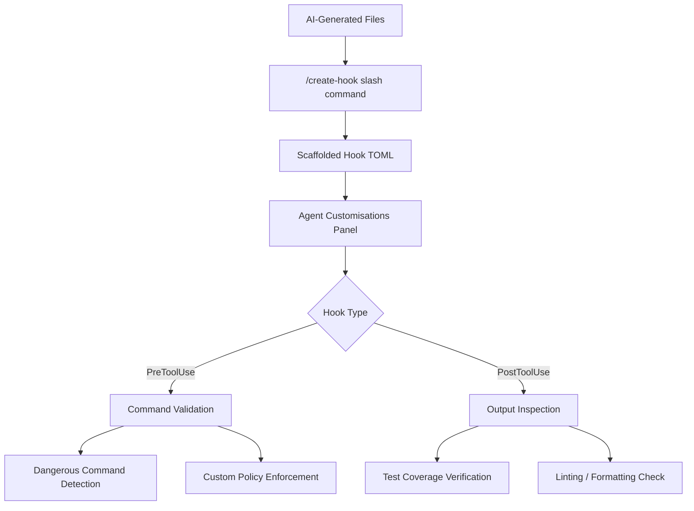

# Codex as JetBrains Agent Provider: How ACP, Hooks, and MCP Server Management Turn Your IDE into a Multi-Agent Control Plane


---

On 7 July 2026, GitHub published a changelog entry that quietly reshaped the IDE agent landscape: Codex is now available as a first-class agent provider in JetBrains IDEs, sitting alongside Junie, Claude Agent, and GitHub Copilot CLI in the agent picker [^1]. This is not merely a chat integration — it is a full ACP-wrapped subprocess that brings Codex CLI's sandbox, hooks, and MCP stack into IntelliJ IDEA, PyCharm, WebStorm, and every other JetBrains IDE from version 2025.3 onwards [^2].

This article dissects how the integration works at the protocol level, what configuration surfaces are now available inside the IDE, and how to avoid the pitfalls that trip up teams migrating from Junie or Copilot CLI.

## The ACP Substrate

The integration rests on the Agent Client Protocol (ACP), the open JSON-RPC 2.0 standard co-developed by Zed Industries and JetBrains that standardises how coding agents communicate with editors [^3]. ACP operates over stdin/stdout: the IDE spawns the agent as a subprocess and pipes JSON-RPC messages bidirectionally [^3].



The crucial architectural detail: JetBrains ships two executables [^4]. The first is the Codex agent itself, downloaded from `github.com/openai/codex/releases/`. The second is `codex-acp`, a JetBrains-authored binary that the IDE communicates with directly. The wrapper translates between ACP's `session/new`, `session/prompt`, and `PromptResponse` methods and Codex's internal interfaces [^3][^4]. Both executables are downloaded into `<IDE system dir>/aia/codex/bin` — no separate CLI installation is strictly required, though pointing the IDE at a locally installed CLI gives you version control [^4].

During the `initialize` handshake, the agent declares its capabilities, and the IDE adapts its UI accordingly [^3]. This is why Codex surfaces approval dialogs, model selectors, and reasoning-effort controls in the chat panel — all negotiated at startup.

## Configuration: Three Layers, One Truth

All runtime behaviour — sandbox modes, approval policies, models — flows from the same `config.toml` and `auth.json` that govern the CLI [^4]. The IDE does not maintain a separate configuration store. This means:

```toml
# ~/.codex/config.toml — applies identically in CLI and IDE
[model]
default = "gpt-5.6-terra"
reasoning_effort = "high"

[sandbox]
mode = "workspace-write"

[approval_policy]
default = "on-request"

[apps._default]
default_tools_approval_mode = "writes"
```

Project-level `AGENTS.md` files are discovered using the same layered resolution: repository root, then subdirectories [^4]. This is the single most important point for teams already using Codex CLI — switching to the IDE surface requires zero configuration changes.

Enterprise teams add a third layer via `requirements.toml`, which enforces fleet-wide constraints that individual developers cannot override [^5]:

```toml
# .codex/requirements.toml — admin-enforced
[model]
allowed = ["gpt-5.6-sol", "gpt-5.6-terra"]

[sandbox]
mode = "workspace-write"        # cannot be weakened
network_enabled = false          # hard constraint

[mcp]
allowed_servers = ["jetbrains-ide", "github"]
```

## Authentication Pathways

The July integration supports three authentication methods [^2]:

1. **JetBrains AI subscription** — uses the JetBrains platform token, simplest for teams already paying for JetBrains AI Pro.
2. **ChatGPT account** — sign in with an existing ChatGPT Plus/Pro/Enterprise account. The same five-hour rolling usage allowance applies.
3. **Bring Your Own Key (BYOK)** — provide an OpenAI API key directly. Required for Amazon Bedrock routing via the `bedrock-mantle` endpoint introduced in v0.145.0 [^6].

## Hooks in the IDE: Agent Customisations Editor

The July 7 changelog introduced hooks management directly in the IDE's Agent Customisations panel [^1]. Previously, hooks required manual editing of `.codex/hooks/` TOML files. Now the IDE provides a GUI for creating and managing `PreToolUse` and `PostToolUse` hooks in both local and Copilot CLI sessions.



The AI-generated customisation files deserve attention. The Overview page now offers a "New" button with slash commands — `/create-instruction`, `/create-prompt`, `/create-skill`, `/create-agent`, and `/create-hook` — that scaffold configuration files via chat [^1]. For hooks specifically, `/create-hook` generates a TOML stub wired into the correct lifecycle event.

This matters because v0.144.5 (16 July 2026) expanded dangerous-command detection to cover more forced `rm` variants, flag reordering, and aliased forms, with clearer rejection reasons [^7]. Teams that were relying solely on the built-in detection can now layer custom `PreToolUse` hooks on top — and manage them without leaving the IDE.

## MCP Server Management

The second major enhancement is richer MCP server management inside Agent Customisations [^1]. The IDE now supports:

- **Browse Marketplace** — discover and install MCP servers from a curated registry.
- **Add manually** — configure servers of type `command` (subprocess) or `http` (Streamable HTTP).
- **Status monitoring** — each configured server shows live status with start, stop, restart, and uninstall actions.
- **Workspace-level definition** — `.github/mcp.json` defines per-project MCP servers, shared across the team.

Since IntelliJ IDEA 2025.2, JetBrains has shipped a built-in MCP server exposing over twenty IDE-native tools — inspections, run configurations, semantic renames, code reformatting — to any external MCP client [^8]. When Codex runs as agent provider, it automatically discovers this server, giving it capabilities no terminal-only agent has: IDE-grade refactoring, integrated test execution, and inspection-driven diagnostics.

```toml
# .github/mcp.json — workspace MCP servers
{
  "servers": {
    "jetbrains-ide": {
      "type": "builtin",
      "enabled": true
    },
    "github": {
      "type": "command",
      "command": "npx",
      "args": ["-y", "@modelcontextprotocol/server-github"],
      "env": {
        "GITHUB_TOKEN": "${env:GITHUB_TOKEN}"
      }
    }
  }
}
```

## Approval Policies: Three Tiers

The July update introduced three approval tiers for Codex sessions in JetBrains [^1]:

| Tier | Behaviour | Use Case |
|------|-----------|----------|
| **Default Approvals** | Follows `config.toml` policies; prompts for confirmation | Production work, shared codebases |
| **Bypass Approvals** | Auto-approves all tool calls without dialogs | Trusted sandbox environments, spike work |
| **Autopilot (Preview)** | Auto-approves tool calls *and* auto-responds to clarifying questions | Batch processing, overnight runs |

Autopilot mode is the most aggressive — it removes both the approval gate and the human-in-the-loop for ambiguity resolution. Use it only in disposable environments or behind `requirements.toml` constraints that prevent network access and limit writable paths.

## Why Not Just Use Junie?

JetBrains evaluated multiple agents before designating Codex as the recommended default in June 2026 [^9]. Their benchmark across 353 tasks (225 Java, 38 C#, 90 Python) showed:

| Metric | Codex (GPT-5.4 mini, medium reasoning) |
|--------|----------------------------------------|
| Java solve rate | 43.9% |
| C# solve rate | 62.6% |
| Python solve rate | 20.2% |
| Weighted average | 39.9% |
| Median latency | 170.40s |
| Median cost per task | \$0.1387 |

These numbers predate GPT-5.6 — Sol and Terra should improve them substantially. The key differentiator is not raw solve rate but the configuration surface: Codex brings sandbox isolation, hooks, MCP federation, and `AGENTS.md` governance that Junie lacks [^9][^10]. For enterprise teams that need auditable, policy-constrained agent execution, Codex is the only option in the JetBrains ecosystem that provides OS-level sandboxing via Seatbelt (macOS), Bubblewrap (Linux), or restricted tokens (Windows) [^11].

Junie remains competitive on cost flexibility (\$100/user/year for JetBrains AI Pro) and benefits from deeper IDE-native refactoring [^10]. The pragmatic approach: use both. ACP's agent picker makes switching per-task trivial.

## Model Selection Post-GPT-5.6

Since v0.145.0, bundled GPT-5.4 model selections have been migrated to GPT-5.6 Terra and Luna variants [^6]. In the JetBrains chat panel, you can switch between supported OpenAI models and adjust reasoning budget directly [^2]:

```toml
# Per-profile model routing
[profiles.jetbrains-heavy]
model = "gpt-5.6-sol"
reasoning_effort = "high"

[profiles.jetbrains-light]
model = "gpt-5.6-luna"
reasoning_effort = "medium"
```

v0.144.6 (18 July 2026) corrected GPT-5.6 context windows to 272,000 tokens across Sol, Terra, and Luna [^12]. If your `config.toml` still references GPT-5.4 or GPT-5.5 models, the IDE will silently use the migrated variants — check `codex --version` and model resolution logs if behaviour changes unexpectedly.

## Practical Setup Checklist

For teams adopting Codex as their JetBrains agent:

1. **Verify IDE version** — 2025.3 or later required. Update the AI Assistant plugin.
2. **Choose authentication** — BYOK for API-key billing, ChatGPT account for subscription billing, JetBrains AI for unified JetBrains billing.
3. **Set the CLI path** — `Settings > Tools > GitHub Copilot > Chat`, enable Codex, point to your installed CLI binary for version pinning [^1].
4. **Configure `config.toml`** — same file as CLI. Set model, sandbox, and approval policy.
5. **Add project `AGENTS.md`** — repository root minimum; subdirectory overrides for monorepos.
6. **Define workspace MCP servers** — `.github/mcp.json` for shared team tooling.
7. **Create hooks** — use `/create-hook` in chat or edit `.codex/hooks/` directly.
8. **Enterprise: deploy `requirements.toml`** — enforce model allowlists, sandbox constraints, MCP server restrictions.

⚠️ Copilot Business or Enterprise subscribers require an administrator to enable the "editor preview features" policy before Codex appears in the agent picker [^1].

## What This Means for the Four-Surface Architecture

Codex now operates identically across four surfaces: CLI terminal, desktop app, VS Code extension, and JetBrains IDEs [^13]. The shared configuration layer — `config.toml`, `AGENTS.md`, `requirements.toml`, MCP servers, hooks — means a team can standardise governance once and enforce it everywhere. The ACP wrapper is the mechanism that makes this possible without forking the agent for each IDE.

The practical consequence: your CI pipeline running `codex exec`, your terminal sessions, your VS Code sidebar, and your IntelliJ chat panel all read the same rules, hit the same sandbox constraints, and fire the same hooks. That is the architectural win — not any single feature, but the elimination of surface-specific configuration drift.

---

## Citations

[^1]: GitHub Blog, "Codex as agent provider and agentic enhancements in JetBrains IDEs," GitHub Changelog, 7 July 2026. [https://github.blog/changelog/2026-07-07-codex-as-agent-provider-and-agentic-enhancements-in-jetbrains-ides/](https://github.blog/changelog/2026-07-07-codex-as-agent-provider-and-agentic-enhancements-in-jetbrains-ides/)

[^2]: JetBrains Blog, "Codex Is Now Integrated Into JetBrains IDEs," January 2026. [https://blog.jetbrains.com/ai/2026/01/codex-in-jetbrains-ides/](https://blog.jetbrains.com/ai/2026/01/codex-in-jetbrains-ides/)

[^3]: Danilchenko, A., "Agent Client Protocol (ACP): Connect Any AI Agent to Any Editor," 2026. [https://www.danilchenko.dev/posts/agent-client-protocol/](https://www.danilchenko.dev/posts/agent-client-protocol/)

[^4]: JetBrains YouTrack, "How does Codex CLI integration (Codex Agent) work in JetBrains IDEs?" Knowledge Base article SUPPORT-A-3134. [https://youtrack.jetbrains.com/articles/SUPPORT-A-3134/How-does-Codex-CLI-integration-Codex-Agent-work-in-JetBrains-IDEs](https://youtrack.jetbrains.com/articles/SUPPORT-A-3134/How-does-Codex-CLI-integration-Codex-Agent-work-in-JetBrains-IDEs)

[^5]: OpenAI, "Codex CLI Configuration — requirements.toml," Codex documentation, 2026. [https://developers.openai.com/codex/configuration](https://developers.openai.com/codex/configuration)

[^6]: OpenAI, "Codex CLI v0.145.0 Release Notes," GitHub Releases, 21 July 2026. [https://github.com/openai/codex/releases/tag/rust-v0.145.0](https://github.com/openai/codex/releases/tag/rust-v0.145.0)

[^7]: OpenAI, "Codex CLI v0.144.5 Release Notes," GitHub Releases, 16 July 2026. [https://github.com/openai/codex/releases/tag/rust-v0.144.5](https://github.com/openai/codex/releases/tag/rust-v0.144.5)

[^8]: Daniel Vaughan, "Codex CLI + JetBrains MCP Server: Giving Your Terminal Agent IDE-Grade Intelligence," Codex Knowledge Base, 8 May 2026. [https://codex.danielvaughan.com/2026/05/08/codex-cli-jetbrains-mcp-server-ide-intelligence-terminal-agent/](https://codex.danielvaughan.com/2026/05/08/codex-cli-jetbrains-mcp-server-ide-intelligence-terminal-agent/)

[^9]: JetBrains Blog, "Introducing a Recommended Agent in AI Chat, With Codex as the Current Default," June 2026. [https://blog.jetbrains.com/ai/2026/06/codex-is-now-the-recommended-agent-in-jetbrains-ai/](https://blog.jetbrains.com/ai/2026/06/codex-is-now-the-recommended-agent-in-jetbrains-ai/)

[^10]: Vibecoding, "Junie vs OpenAI Codex CLI (2026): Pick Your Poison." [https://vibecoding.app/compare/junie-vs-openai-codex-cli](https://vibecoding.app/compare/junie-vs-openai-codex-cli)

[^11]: Wikipedia, "Codex (AI agent)." [https://en.wikipedia.org/wiki/Codex_(AI_agent)](https://en.wikipedia.org/wiki/Codex_(AI_agent))

[^12]: OpenAI, "Codex CLI v0.144.6 Release Notes," GitHub Releases, 18 July 2026. [https://github.com/openai/codex/releases/tag/rust-v0.144.6](https://github.com/openai/codex/releases/tag/rust-v0.144.6)

[^13]: Daniel Vaughan, "The Four-Surface Architecture: CLI, Desktop, IDE Extension and Cloud as One System," Codex Knowledge Base, 8 April 2026. [https://codex.danielvaughan.com/2026/04/08/four-surface-architecture/](https://codex.danielvaughan.com/2026/04/08/four-surface-architecture/)
