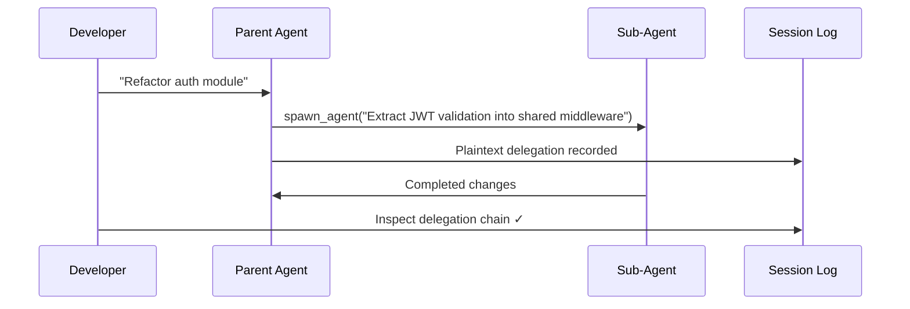
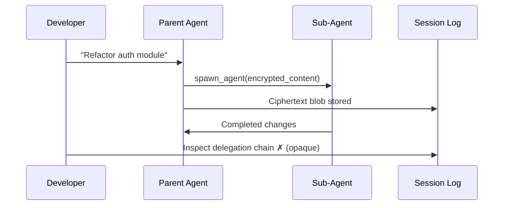

# The Multi-Agent Auditability Gap: Why Codex CLI's Encrypted Sub-Agent Delegation Is a Compliance Liability


---

Since 14 July 2026, developers running Codex CLI on GPT-5.6 Sol and GPT-5.6 Terra can no longer read what their parent agents told their sub-agents to do [^1]. What was once an inspectable task description in a session log is now ciphertext — evidence that a delegation happened, but no record of what was delegated. For teams operating under the EU AI Act, whose Annex III obligations take effect on 2 August 2026 [^2], this is not an inconvenience. It is a structural compliance gap.

This article traces the technical change, maps it against regulatory requirements, examines the community's proposed fix, and outlines what you should do before that August deadline arrives.

## How Multi-Agent Delegation Works in Codex CLI

Codex CLI's MultiAgentV2 protocol lets a parent agent decompose complex tasks and delegate sub-tasks to child agents, each running in an isolated context window [^3]. Three tools handle the delegation:

- **`spawn_agent`** — creates a new child agent with a task description
- **`send_message`** — passes follow-up instructions to an existing child
- **`followup_task`** — queues additional work for a child agent

Prior to version 0.138.0, these delegation messages were stored as plaintext in local session history, rollout records, and telemetry traces [^4]. A developer could inspect the full chain: what the parent decided to delegate, what instructions the child received, and what the child produced. Debugging a failed multi-agent run meant reading the transcript.



## What Changed: PR #26210 and the Encryption Regression

Pull request #26210, titled "Encrypt multi-agent v2 message payloads," was merged on 5 June 2026 [^5]. The change encrypts the `message` parameter of all three delegation tools before they reach local storage. The encrypted payload is stored in `InterAgentCommunication.encrypted_content`; the `InterAgentCommunication.content` field is left empty [^4].

The encryption shipped in Codex CLI 0.138.0 on 8 June 2026 and became unavoidable in version 0.144.4, released on 14 July 2026, when MultiAgentV2 became the default protocol for Sol and Terra models [^1].



The critical point: only OpenAI's servers hold the decryption key [^1]. There is no local decryption path. The developer sees that a delegation occurred, but the content of the delegation is inaccessible.

## Why This Matters: Four Broken Workflows

### 1. Root-Cause Analysis

When a multi-agent run produces incorrect output, the first debugging question is: "What did the parent tell the child to do?" With encrypted delegation, you cannot distinguish between a bad delegation (parent gave wrong instructions) and a bad execution (child misunderstood correct instructions) [^6]. The root cause is locked inside ciphertext.

### 2. Prompt Optimisation

Teams iterating on their `AGENTS.md` files and system prompts need to observe how the parent decomposes tasks. Encrypted delegation removes the feedback loop — you can tune the parent's behaviour but cannot see how it manifests in delegation decisions [^6].

### 3. Security Review

If a parent agent delegates a task that includes sensitive data (API keys, database credentials, internal URLs), the security team cannot audit what was passed to the child agent [^7]. In a `full-auto` configuration with network access enabled, this is a material risk.

### 4. Compliance Demonstration

Regulated industries need to demonstrate that AI systems operate within defined boundaries. When an auditor asks "What did this agent tell its sub-agent to do?", the answer cannot be "We don't know — it's encrypted" [^8].

## The EU AI Act Collision

The timing is not coincidental in its awkwardness. The EU AI Act's Annex III obligations, including Article 12's logging requirements, were originally scheduled for 2 August 2026. However, the EU AI Omnibus amendment — politically agreed on 7 May 2026 — postponed these high-risk obligations to **2 December 2027** [^2]. The delay buys time, but it does not remove the compliance requirement. Teams building audit infrastructure now will be better positioned when the deadline arrives.

Article 12 requires that high-risk AI systems "shall technically allow for the automatic recording of events (logs) over the lifetime of the system" [^9]. The logs must capture inputs, outputs, and decision points sufficient for "full traceability" [^9].

Whether a coding agent qualifies as "high-risk" under Annex III depends on deployment context. But for teams building safety-critical software, medical device firmware, or financial systems, the argument that their AI coding tool is high-risk is straightforward [^10].

The penalty for non-compliance, once the postponed deadline arrives: up to €15 million or 3% of worldwide annual turnover, whichever is higher [^2].

### What Article 12 Requires vs What Codex Provides

| Requirement | Article 12 Mandate | Codex CLI 0.144.4+ |
|---|---|---|
| Event recording | Automatic logging of events | ✓ Events logged |
| Input traceability | Inputs recorded | ✗ Delegation inputs encrypted |
| Decision provenance | Full chain from input to output | ✗ Parent→child chain opaque |
| Human oversight data | Timestamps, authorisation records | ✓ Timestamps present |
| Retention | Minimum 6 months | ✓ Local storage persists |

The gap is narrow but non-negotiable: event metadata is logged, but the substance of inter-agent delegation is not locally readable.

## The Community Fix: Remizov's Dual-Path Proposal

Ignat Remizov, CTO at payment service Zolvat, filed GitHub Issue #28058 on 13 June 2026 [^4]. His proposal does not ask OpenAI to abandon encryption. Instead, it requests a separation of concerns:

1. **Keep encrypted delivery** for model-to-model communication (the child agent receives ciphertext)
2. **Add a parallel plaintext audit copy** written to local history, rollout records, and telemetry metadata

The fork implementation demonstrates six commits covering [^4]:

- **Configurable delivery policy**: `encrypted` | `encrypted_with_audit` | `plaintext`
- **8 KiB payload size limits** to prevent unbounded audit storage
- **Parent TUI updates** showing readable task text in the terminal
- **Child history projection** with sender attribution
- **Durable inter-agent transcript delivery** through resume and pagination

The configuration would sit in `config.toml`:

```toml
[multi_agent]
# Options: "encrypted", "encrypted_with_audit", "plaintext"
delegation_audit = "encrypted_with_audit"
```

This is architecturally sound. The security boundary (encrypted delivery between models) is preserved. The observability boundary (plaintext audit copy for the operator) is restored. The two concerns are orthogonal.

### Why OpenAI Hasn't Shipped It

As of 25 July 2026, Issue #28058 remains open with no linked resolution [^4]. An OpenAI contributor stated that "the protocol remains under development" and declined the requested changes [^6]. No further public response has been issued.

The likely explanation is architectural: MultiAgentV2 is still being stabilised. Version 0.145.0, released on 21 July 2026, included "multi-agent V2 stabilisation" among 356 changes [^11]. OpenAI may be waiting for the protocol to settle before committing to an audit interface.

The problem is that the EU AI Act is not waiting.

## What You Should Do Now

### For Teams in Regulated Environments

**Option 1: Pin to suggest mode.** If your `approval_policy` is set to `suggest` (the default), the parent agent must request approval before spawning sub-agents. You see the delegation in the approval prompt before it executes. This is not a complete audit trail, but it provides real-time visibility.

```toml
[policy]
approval_policy = "suggest"
```

**Option 2: Disable MultiAgentV2.** You can force single-agent execution:

```toml
[features]
multi_agent_v2 = false
```

This sacrifices parallel task decomposition but restores full auditability of the single-threaded execution path. ⚠️ Note: some users report that GPT-5.5 forces MultiAgentV2 despite this flag (see Issue #31097 [^12]); verify this works with your model and Codex version.

**Option 3: Use Remizov's fork.** The fork at Remizov's GitHub provides the `encrypted_with_audit` policy. This is an unofficial build and carries the usual risks of running a fork — no upstream security patches, potential divergence — but it demonstrates the viable architecture.

### For Teams Not Yet Under Regulatory Pressure

**Monitor Issue #28058.** If OpenAI ships a native audit copy mechanism, it will likely appear there first.

**Log approval prompts externally.** If you are in `suggest` mode, pipe your session output to a structured log. The approval prompts contain the delegation text before encryption.

**Test your audit trail now.** Run a multi-agent task, then attempt to reconstruct the full delegation chain from your local session history. If you cannot, you have the same gap — and knowing it now is better than discovering it during an audit.

## The Broader Pattern: Observability as a First-Class Concern

This is not solely a Codex CLI problem. Any multi-agent system that encrypts, summarises, or discards inter-agent communications creates an observability gap. Claude Code's sub-agent architecture, Cursor's background agents, and GitHub Copilot's multi-file orchestration all face variants of the same question: can the operator reconstruct what happened?

The difference is that Codex CLI's gap is documented, public, and has a proposed fix. That makes it the best place to establish the principle: **in multi-agent coding systems, encrypted delivery and operator auditability are not mutually exclusive, and both are required**.

The EU AI Act will formalise this principle into law when the postponed Annex III obligations take effect on 2 December 2027. The delay provides a window, but the question remains whether the tooling will catch up.

---

## Citations

[^1]: [Codex CLI 0.144.4 Encrypts Multi-Agent Instructions, Blinding Local Auditors — Windows News](https://windowsnews.ai/article/codex-cli-01444-encrypts-multi-agent-instructions-blinding-local-auditors.439178)
[^2]: [EU AI Act Compliance 2026: What High-risk AI Systems Must Do Now — Salt Security](https://salt.security/eu-ai-act-compliance)
[^3]: [Multi-Agent Orchestration With Codex — Firecrawl](https://www.firecrawl.dev/blog/codex-multi-agent-orchestration)
[^4]: [Regression: encrypted MultiAgentV2 messages remove readable task audit trail — GitHub Issue #28058](https://github.com/openai/codex/issues/28058)
[^5]: [OpenAI Encrypts Multi-Agent V2 Instructions, Prompting GitHub Calls for Audit Visibility — NewsBang](https://www.newsbang.com/news/article/story_id-p008-163512)
[^6]: [Codex Multi-Agent V2 update raises developer concerns over agent transparency — InfoWorld](https://www.infoworld.com/article/4197328/codex-multi-agent-v2-update-raises-developer-concerns-over-agent-transparency.html)
[^7]: [OpenAI Codex Encrypts Agent Instructions, Stripping Developers of Audit Access — TechTimes](https://www.techtimes.com/articles/320784/20260716/openai-codex-encrypts-agent-instructions-stripping-developers-audit-access.htm)
[^8]: [OpenAI Encrypts Codex Agent Instructions: Audit Stakes — Digital Applied](https://www.digitalapplied.com/blog/openai-codex-encrypted-agent-instructions-auditability)
[^9]: [EU AI Act Article 12 Explained: Automatic AI Logging Requirements — Synapt AI](https://www.synapt.ai/layered-by-synapt/eu-ai-act-article-12-decoded/)
[^10]: [7 AI Coding Tools for EU AI Act Compliance (2026) — Augment Code](https://www.augmentcode.com/tools/ai-coding-tools-eu-ai-act-compliance)
[^11]: [Codex CLI Changelog (July 2026) — Gradually](https://www.gradually.ai/en/changelogs/codex-cli/)
[^12]: [GPT-5.5 forces MultiAgentV2 despite disable — GitHub Issue #31097](https://github.com/openai/codex/issues/31097)
