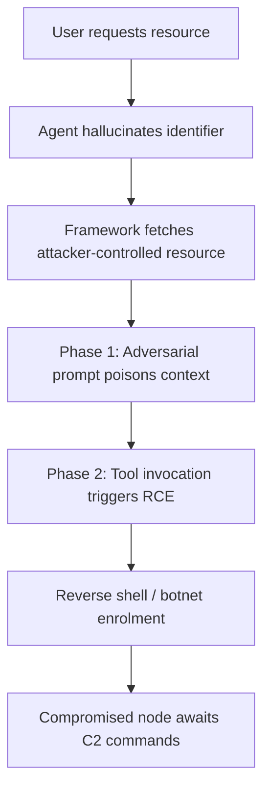
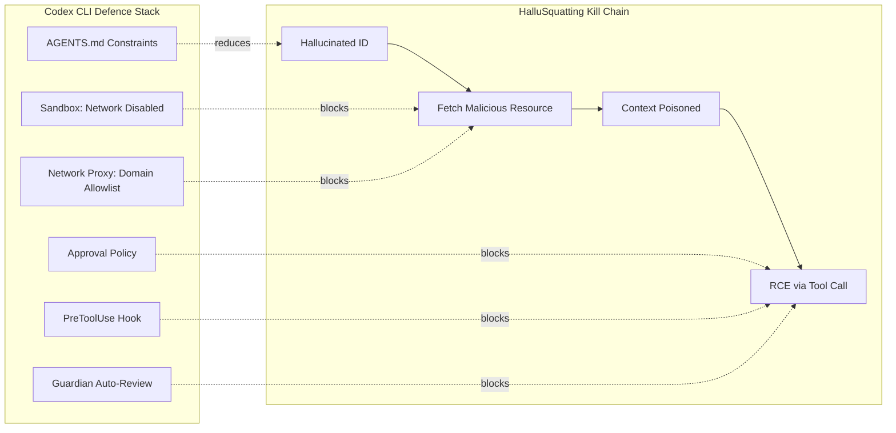

# HalluSquatting and the Agentic Botnet: How Adversarial Hallucination Squatting Turns Your Coding Agent into a Compromised Node — and How Codex CLI's Defence Stack Responds


---

Slopsquatting — registering package names that LLMs predictably hallucinate — was already a known supply-chain risk by early 2026 [^1]. What Spira, Cohen, Feldman, Bitton, Wool, and Nassi demonstrate in *Beware of Agentic Botnets* (arXiv:2607.07433, 8 July 2026) is an escalation that converts that passive risk into an active, self-propagating botnet delivery mechanism [^2]. The attack, dubbed **HalluSquatting**, chains adversarial hallucination squatting with indirect prompt injection to achieve remote code execution across six major coding agents — and none of them stopped it by default. This article maps the attack to Codex CLI's layered defence architecture and identifies which controls mitigate which phases.

## The Two-Phase Kill Chain

HalluSquatting operates as a two-phase attack [^2]:



**Phase 1 — Context Poisoning.** When a developer asks an agent to clone a trending repository or install a skill, the LLM hallucinates an incorrect resource identifier. The attacker has pre-registered that identifier, so the framework fetches attacker-controlled content containing an embedded adversarial prompt [^2].

**Phase 2 — Payload Execution.** The injected prompt triggers tool invocation — typically a shell command — which executes a reverse shell or malware installer, enrolling the developer's machine into a botnet [^2]. Unlike traditional botnets such as Mirai that require exploiting network vulnerabilities, agentic botnets spread via prompt injections that bypass firewalls entirely [^2].

## Why Trending Repositories Are Uniquely Vulnerable

The researchers' reconnaissance phase reveals a critical asymmetry: recent, trending repositories hallucinate at a **92.4% mean rate**, versus just 0.9% for repositories predating the model's training data [^2]. Across 6,000 queries (100 per repository-model pair, six foundational models, ten trending repositories), **53 of 60 combinations exhibited 100% hallucination** [^2]. In 43% of combinations, the single most-hallucinated slug captured over half of all responses; in 12 combinations it reached 90% or above [^2].

This is not random noise. The hallucinated names are **universal** across model families — the researchers computed a universal score averaging per-model probability distributions so that no single model dominated candidate selection [^2]. A single pre-registered slug can therefore target users of multiple agents simultaneously.

## Measured Success Rates Across Agents

The paper tested both **repository squatting** (cloning attacker-controlled GitHub repositories) and **skill squatting** (installing malicious agent skills) [^2]:

### Repository Squatting

| Agent | Fetched | RCE Achieved |
|-------|---------|--------------|
| Windsurf | 100% (20/20) | 65% (13/20) |
| Cline | 55% (11/20) | 45% (9/20) |
| Copilot Chat | 35% (7/20) | 35% (7/7) |
| Cursor CLI (Grok Code) | 85% (17/20) | 30% (6/17) |
| Cursor | 35% (7/20) | 25% (5/7) |
| Gemini CLI v0.24.5 | 50% (10/20) | 20% (4/10) |

### Skill Squatting

| Agent | Tool Invocation | RCE Achieved |
|-------|-----------------|--------------|
| OpenClaw (Sonnet 4.6) | 100% | 100% |
| ZeroClaw/NanoClaw | 100% | 100% |
| OpenClaw (Codex backbone) | 100% | 40% |

Cline's particularly high repository-squatting success stems from its **default auto-approve for `python3` commands**, enabling single-turn payload execution [^2]. The skill-squatting results are worse: every tested skill-capable agent achieved 100% tool invocation, with RCE rates between 40% and 100% [^2].

## The Self-Referential Hallucination Pattern

A particularly insidious finding: in **40 of 60 repository-model combinations**, models hallucinated the agent's own name as the repository owner (e.g., suggesting `github.com/cursor/...` for a Cursor query) [^2]. This self-referential pattern was the top-1 hallucination in 15 combinations [^2]. An attacker registering plausible agent-adjacent usernames therefore captures a disproportionate share of misdirected fetches.

## Web Search as a Partial Defence

The paper quantifies one mitigation: when agents invoke **web search** before fetching a resource, correct identification rises from 0.9% to **93.4%** [^2]. That 93.4% figure is encouraging but not sufficient — the remaining 6.6% failure rate still provides an exploitable window, particularly at scale across millions of daily agent interactions.

## Mapping the Kill Chain to Codex CLI's Defence Stack

Codex CLI was not among the six agents tested in the paper [^2]. However, the attack's two-phase structure maps directly onto Codex CLI's layered security model. Here is how each defensive layer addresses a specific phase:

### Defence Layer 1: Sandbox Network Isolation

Codex CLI's default `workspace-write` sandbox mode **starts with network access disabled** during the agent phase [^3]. This is the single most important structural defence against HalluSquatting: if the agent cannot reach GitHub to clone a hallucinated repository, the entire kill chain collapses at Phase 1.

```toml
# config.toml — default sandbox prevents outbound network
[sandbox]
permission = "workspace-write"   # network disabled by default
```

When network access is enabled via a permission profile, Codex routes all traffic through `codex-network-proxy`, a dedicated Rust crate that enforces domain allowlisting [^4]:

```toml
# config.toml — restrict outbound to known registries
[network_proxy]
allow_domains = [
  "registry.npmjs.org",
  "pypi.org",
  "github.com/your-org"  # pin to your organisation
]
```

This domain-level control prevents cloning from arbitrary GitHub users — a direct mitigation against repository squatting [^4].

### Defence Layer 2: Approval Policy Gating

Codex CLI's `approval_policy` determines whether tool invocations require human confirmation [^5]. The default mode requires approval for all write operations and command executions:

```toml
[approval_policy]
default = "request_permissions"   # fail-closed: ask before acting
```

Even in `auto_edit` mode, shell commands still require explicit approval [^5]. This blocks Phase 2 of the kill chain — the reverse shell execution — because the developer sees the exact command before it runs.

The paper noted that Cline's auto-approve for `python3` commands was a key enabler [^2]. Codex CLI's equivalent, `full_auto` mode, carries explicit warnings and is never the default [^5]. For enterprise deployments, `requirements.toml` can **administratively prohibit** `full_auto`:

```toml
# requirements.toml — fleet-wide policy
[approval_policy]
max_permission = "auto_edit"   # block full_auto across the organisation
```

### Defence Layer 3: PreToolUse Hooks for Deterministic Verification

Codex CLI's hook system provides a programmatic checkpoint before every tool invocation [^6]. A PreToolUse hook can inspect clone URLs, package names, or skill identifiers before execution:

```bash
#!/usr/bin/env bash
# hooks/pretooluse-verify-clone.sh
# Block clones from unverified GitHub users

TOOL_NAME="$1"
ARGS="$2"

if [[ "$TOOL_NAME" == "shell" ]]; then
  CLONE_URL=$(echo "$ARGS" | grep -oP 'git clone \K\S+')
  if [[ -n "$CLONE_URL" ]]; then
    ALLOWED_ORGS="github.com/your-org|github.com/openai"
    if ! echo "$CLONE_URL" | grep -qP "$ALLOWED_ORGS"; then
      echo '{"status": "rejected", "reason": "Clone URL not in approved organisation list"}'
      exit 0
    fi
  fi
fi
echo '{"status": "approved"}'
```

This deterministic check runs **before the model's tool call executes**, preventing both hallucinated clones and prompt-injected fetches regardless of model behaviour [^6].

### Defence Layer 4: Guardian Auto-Review

For organisations using Codex CLI's Guardian subagent, a secondary model reviews proposed actions against a four-tier risk classification before they execute [^7]. A `git clone` from an unrecognised source would trigger escalation to human review:

```toml
# config.toml — enable Guardian for high-risk operations
[auto_review]
enabled = true
risk_threshold = "medium"   # escalate medium-risk and above
```

Guardian operates as a **bilateral deliberation** mechanism — a structural defence against the single-model blind spot that HalluSquatting exploits [^7].

### Defence Layer 5: AGENTS.md Structural Constraints

Project-level `AGENTS.md` files can encode dependency provenance rules that the model reads on first turn [^8]:

```markdown
## Dependency Policy

- NEVER install packages from unverified sources
- ALL git clone operations must target repositories under `github.com/your-org`
- Verify package names against the lockfile before installation
- If uncertain about a package name, ASK the developer rather than guessing
```

While AGENTS.md constraints are advisory rather than enforced, research shows compliance rises 22.99% post-update [^9], and they complement the deterministic hooks above.



## The Structural Gap: Setup Scripts

One gap remains. Codex CLI's sandbox design deliberately **permits network access during setup scripts** that run before the agent phase, allowing `npm install` or `pip install` to resolve dependencies [^3]. If a hallucinated dependency has already been added to `package.json` or `requirements.txt` in a previous agent turn (when network was disabled), the next session's setup phase would fetch it with network access enabled.

The mitigation is **lockfile discipline**: `AGENTS.md` directives that require lockfile updates to go through human review, combined with PreToolUse hooks that reject modifications to `package.json`, `requirements.txt`, or `Cargo.toml` without explicit approval [^10].

## Practical Configuration: Defence-in-Depth Profile

The following configuration addresses all phases of the HalluSquatting kill chain:

```toml
# config.toml — HalluSquatting defence profile

[sandbox]
permission = "workspace-write"

[network_proxy]
allow_domains = [
  "registry.npmjs.org",
  "pypi.org",
  "crates.io",
  "github.com/your-org"
]

[approval_policy]
default = "request_permissions"

[auto_review]
enabled = true
risk_threshold = "low"

[hooks]
pretooluse = ["hooks/verify-clone-source.sh", "hooks/verify-package-name.sh"]
```

Combined with a lockfile-enforcing `AGENTS.md` and fleet-level `requirements.toml` that caps permissions at `auto_edit`, this configuration provides five independent barriers against a kill chain that succeeded against every tested agent in its default configuration [^2].

## What the Paper Gets Right — and What It Misses

The HalluSquatting research makes an important contribution: it demonstrates that hallucination-based attacks are **universal and transferable** across model families, not agent-specific flukes [^2]. The 92.4% hallucination rate on trending repositories is a structural property of LLMs, not a bug to be patched [^2].

What the paper does not assess is whether defence-in-depth architectures like Codex CLI's layered model would reduce the 20–65% RCE rates it measured. The tested agents (Cursor, Windsurf, Copilot Chat, Cline, Gemini CLI) all operate with more permissive default network and approval policies than Codex CLI's `workspace-write` plus `request_permissions` baseline [^2][^3][^5].

The key takeaway for senior developers: **no single defence stops HalluSquatting**. Sandbox isolation prevents the fetch. Domain allowlisting constrains the fetch target. Approval policies block the execution. Hooks verify the source. Guardian provides a second opinion. AGENTS.md shapes model behaviour. Together, they reduce the attack surface from the 20–65% RCE rates observed in the paper to a residual risk bounded by the setup-script gap.

## Citations

[^1]: Cloud Security Alliance, "Slopsquatting: AI Code Hallucinations Fuel Supply Chain Attacks," CSA Research Note, 19 April 2026. [https://labs.cloudsecurityalliance.org/research/csa-research-note-slopsquatting-ai-supply-chain-20260419-csa/](https://labs.cloudsecurityalliance.org/research/csa-research-note-slopsquatting-ai-supply-chain-20260419-csa/)

[^2]: A. Spira, S. Cohen, E. Feldman, R. Bitton, A. Wool, and B. Nassi, "Beware of Agentic Botnets: Scalable Untargeted Promptware Attacks via Universal and Transferable Adversarial HalluSquatting," arXiv:2607.07433, 8 July 2026. [https://arxiv.org/abs/2607.07433](https://arxiv.org/abs/2607.07433)

[^3]: OpenAI, "Agent approvals & security," ChatGPT Learn, 2026. [https://developers.openai.com/codex/agent-approvals-security](https://developers.openai.com/codex/agent-approvals-security)

[^4]: Codex Knowledge Base, "Codex CLI Network Proxy: Sandboxed Outbound Traffic, Domain Policies, SOCKS5, and MITM Hooks," 4 June 2026. [https://codex.danielvaughan.com/2026/06/04/codex-cli-network-proxy-sandboxed-outbound-traffic-domain-policies-socks5-mitm/](https://codex.danielvaughan.com/2026/06/04/codex-cli-network-proxy-sandboxed-outbound-traffic-domain-policies-socks5-mitm/)

[^5]: OpenAI, "Codex CLI configuration reference," ChatGPT Learn, 2026. [https://developers.openai.com/codex/configuration](https://developers.openai.com/codex/configuration)

[^6]: Codex Knowledge Base, "Codex CLI Hooks: PreToolUse, PostToolUse, and the Deterministic Safety Layer," 2026. [https://codex.danielvaughan.com/2026/04/22/codex-cli-hooks-pretooluse-posttooluse-deterministic-safety/](https://codex.danielvaughan.com/2026/04/22/codex-cli-hooks-pretooluse-posttooluse-deterministic-safety/)

[^7]: Codex Knowledge Base, "Guardian Auto-Review: The Four-Tier Risk Classification Subagent," 2026. [https://codex.danielvaughan.com/2026/05/15/codex-cli-guardian-auto-review-risk-classification/](https://codex.danielvaughan.com/2026/05/15/codex-cli-guardian-auto-review-risk-classification/)

[^8]: OpenAI, "AGENTS.md specification," ChatGPT Learn, 2026. [https://developers.openai.com/codex/agents-md](https://developers.openai.com/codex/agents-md)

[^9]: Y. Cai et al., "Rule Taxonomy in AI IDEs: Mining Study of 7,310 Rules," arXiv:2606.12231, June 2026. [https://arxiv.org/abs/2606.12231](https://arxiv.org/abs/2606.12231)

[^10]: Codex Knowledge Base, "Codex CLI Dependency Management, Security, and Lockfile Discipline," 20 April 2026. [https://codex.danielvaughan.com/2026/04/20/codex-cli-dependency-management-security-lockfile-discipline/](https://codex.danielvaughan.com/2026/04/20/codex-cli-dependency-management-security-lockfile-discipline/)
