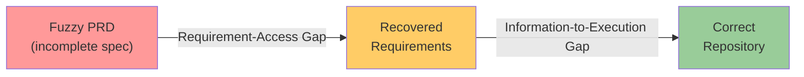
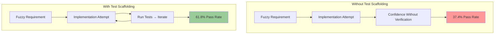

# ICAE-Bench and the Information-to-Execution Gap: What 480 Interactive Tasks Reveal About Your Coding Agent's Real Weakness


---

Most coding agent benchmarks hand the agent a fully specified task — a GitHub issue with reproduction steps, a function signature with a docstring, a failing test suite — and measure whether it produces a correct patch. That is not how anyone actually works. In practice, you type something like "build me a dashboard that shows deployment status" and expect the agent to ask the right questions, make reasonable design decisions, and deliver working software. ICAE-Bench, published on 23 July 2026, is the first benchmark to measure that end-to-end interactive loop — and the results should change how you configure your Codex CLI workflows.[^1]

## The Two Gaps

The research team at Fudan University and Meituan constructed 480 tasks across twelve programming languages, each derived from a real open-source repository with executable tests.[^1] Instead of handing agents complete specifications, they introduced a *requirement-exposure hierarchy* with four levels:

- **Fuzzy L1**: minimal information; core constraints hidden
- **Fuzzy L2**: a subset of ambiguity points restored
- **Fuzzy L3**: most specification details retained
- **GroundPRD**: the complete, coherent reference specification

At every level, the behavioural targets remain identical — the same black-box test cases determine pass or fail. The question is whether agents can recover the missing information through dialogue and then execute on it.

The results decompose agent failure into two distinct gaps:



The **requirement-access gap** separates what the agent initially knows from what it can recover through clarification questions. The **information-to-execution gap** separates recovered requirements from a correct implementation.[^1] The second gap proved far more damaging.

## The Scoreboard

Six models were evaluated using both Claude Code and OpenHands as agent frameworks, with a budget of 16 clarification queries per task:[^1]

| Model | Full ICAE-Bench | ICAE-Bench-Lite (50 tasks) |
|---|---|---|
| Claude Opus 4.8 | 38.2% | 48.2% |
| GPT-5.5 | 37.2% | 53.3% |
| Gemini 3.1 Pro | 27.0% | 36.6% |
| GLM-5.1 | 26.6% | 40.0% |
| Claude Sonnet 4.6 | 21.8% | 40.2% |
| MiniMax M2.5 | 0.8% | 2.8% |

The top two models are separated by a single percentage point on the full benchmark. But the ranking flips on the lighter subset — GPT-5.5 leads by five points on ICAE-Bench-Lite — confirming that performance under fuzzy requirements is volatile and task-distribution-sensitive.[^1]

### The Framework Tax

The same models scored 5.5 to 21.8 percentage points lower when run under OpenHands instead of Claude Code.[^1] GPT-5.5 suffered the worst framework penalty (21.8 points), whilst Claude Opus 4.8 proved most framework-resilient (5.5 points). This means the harness you wrap around the model — the agent framework, tool configuration, and execution environment — can swing results by more than the difference between adjacent model generations.

For Codex CLI users, this is validation of something practitioners already suspect: your `config.toml`, `AGENTS.md`, hooks, and sandbox settings are not cosmetic. They are load-bearing infrastructure.

## The Test Scaffolding Finding

The most actionable result from ICAE-Bench concerns test scaffolding. When agents were given access to executable public test cases alongside the fuzzy requirements, GLM-5.1's overall pass rate jumped from 37.4% to 61.8% — a 65% relative improvement — whilst constraint coverage barely changed (63.8% vs 61.2%).[^1]

This tells us something important: agents do not primarily fail because they misunderstand requirements. They fail because they cannot verify their own work. Given a test oracle, they iterate toward correctness; without one, they ship confidently broken code.



## Mapping to Codex CLI Configuration

ICAE-Bench measures interactive project building — fuzzy requirements, multi-turn clarification, long-horizon implementation. Codex CLI's configuration stack maps directly onto the two gaps identified by the research.

### Closing the Requirement-Access Gap

The requirement-access gap is about whether the agent has enough context to understand what you want. In Codex CLI, this is the domain of `AGENTS.md` and `/goal` mode.

**AGENTS.md as recoverable specification.** Where ICAE-Bench's FuzzyPRD levels control how much specification the agent sees, your `AGENTS.md` file controls the equivalent in production. A sparse `AGENTS.md` creates an L1 scenario; a detailed one with build commands, test commands, architectural constraints, and code style conventions pushes you toward GroundPRD.[^2]

```toml
# config.toml — ensure AGENTS.md is always loaded
[history]
project_doc_max_bytes = 65536  # double the default for complex projects
```

**Goal mode for requirement elicitation.** The `/goal` command, shipped in v0.128.0 and enabled by default since v0.133.0, gives Codex CLI an ICAE-Bench-style interaction loop.[^3] When you set a goal like "build a deployment status dashboard", the agent enters a long-horizon pursuit with five lifecycle states (`pursuing`, `paused`, `achieved`, `unmet`, `budget_limited`). Crucially, goal mode supports multi-turn clarification — the agent can ask you questions before committing to an implementation path, mimicking the 16-query budget in ICAE-Bench.

```bash
# Start an interactive goal — the agent will clarify before building
codex --approval-mode suggest "Build a deployment status dashboard for our Kubernetes clusters"
```

### Closing the Information-to-Execution Gap

The information-to-execution gap is the harder problem. ICAE-Bench shows that even when agents recover the right requirements, they frequently fail to translate them into correct implementations. The antidote, per the benchmark data, is test scaffolding — and Codex CLI has multiple mechanisms for this.

**Test commands in AGENTS.md.** The single highest-leverage configuration for Codex CLI is declaring your test commands explicitly:[^2]

```markdown
<!-- AGENTS.md -->
## Testing
- Run unit tests: `pytest tests/ -v`
- Run integration tests: `pytest tests/integration/ -v --timeout=30`
- Run type checks: `mypy src/ --strict`
- Lint: `ruff check src/ tests/`

## Verification Policy
Always run the full test suite after making changes.
Never mark a task as complete without passing tests.
```

This mirrors ICAE-Bench's test scaffolding condition: you are providing the agent with an executable oracle it can iterate against.

**PostToolUse hooks for automated verification.** Rather than relying on the agent to remember to run tests, you can enforce verification through hooks:[^4]

```toml
# config.toml — run tests after every file write
[[hooks.post_tool_use]]
event = "post_tool_use"
tool_name = "write"
command = "pytest tests/ -x -q 2>&1 | tail -20"
timeout_ms = 30000
```

This converts the optional "run tests" step into a mandatory feedback loop — exactly the mechanism that drove GLM-5.1 from 37.4% to 61.8% in ICAE-Bench.

**Plan mode for long-horizon decomposition.** ICAE-Bench tasks require repository-level construction, not single-file patches. Codex CLI's plan mode (`--approval-mode plan`) forces the agent to propose a structured implementation plan before writing any code.[^5] This addresses the information-to-execution gap by creating a checkpoint between "I understand the requirements" and "I'm writing code" — a point where you can verify the agent's design decisions before they compound into hard-to-reverse implementation choices.

### Framework Resilience Through Configuration

ICAE-Bench's framework comparison showed that the execution environment matters as much as the model. Codex CLI's sandbox configuration — `workspace-write` default with network isolation, `seccomp-BPF`/`Landlock`/`Seatbelt` kernel-level sandboxing — provides a more constrained but more predictable execution environment than open frameworks.[^6] Predictability reduces the variance that ICAE-Bench observed between frameworks.

```toml
# config.toml — predictable execution environment
[sandbox]
permission = "workspace-write"

[network]
enabled = false  # default; prevents non-deterministic external fetches
```

## The Vibe-Coding Benchmark Landscape

ICAE-Bench joins a growing family of benchmarks designed for the post-specification era:

| Benchmark | Focus | Tasks | Key Metric |
|---|---|---|---|
| SWE-Bench Verified | Issue resolution | 500 | Patch correctness |
| Terminal-Bench 2.1 | Shell/infra tasks | 600+ | Task completion |
| ICAE-Bench | Interactive building | 480 | End-to-end pass rate |
| ViBench | Vibe-coding quality | Varied | Multi-dimensional |
| SecureVibeBench | Security under vibe-coding | Varied | Vulnerability rate |

ICAE-Bench's contribution is the interaction dimension: it does not just ask "can the agent build this?" but "can the agent figure out *what* to build through dialogue and then build it correctly?"[^1] The 38.2% ceiling from the best model tells us the field has substantial room to improve.

## Practical Takeaways

The ICAE-Bench results suggest three configuration priorities for Codex CLI practitioners:

1. **Invest in AGENTS.md over prompt engineering.** The requirement-access gap is real, but ICAE-Bench shows it is the smaller of the two gaps. A comprehensive `AGENTS.md` with build commands, test commands, and architectural constraints gets you to GroundPRD territory — and the data suggests even that is not enough without test scaffolding.

2. **Automate test execution, don't request it.** The 37.4% → 61.8% jump from test scaffolding is the single largest effect in the paper. In Codex CLI, translate this into PostToolUse hooks that run your test suite after every file modification. Do not rely on the agent choosing to run tests.

3. **Treat your configuration as a harness component.** The 5.5–21.8 point framework tax proves that the execution environment is not neutral. Your `config.toml`, sandbox settings, hook configuration, and approval policy are harness components in exactly the sense that ICAE-Bench measures. Benchmark your own configuration: change one variable, measure the outcome, iterate.

## Citations

[^1]: Peng, Z., Huang, D., et al. "ICAE-Bench: Evaluating Coding Agents as Interactive Project Builders." arXiv:2607.21217, 23 July 2026. [https://arxiv.org/abs/2607.21217](https://arxiv.org/abs/2607.21217)

[^2]: OpenAI. "AGENTS.md Documentation." ChatGPT Learn, 2026. [https://learn.chatgpt.com/docs/agents-md](https://learn.chatgpt.com/docs/agents-md)

[^3]: OpenAI. "Codex CLI Changelog — v0.128.0 and v0.133.0." 2026. [https://learn.chatgpt.com/docs/changelog](https://learn.chatgpt.com/docs/changelog)

[^4]: OpenAI. "Codex CLI Hooks Configuration." ChatGPT Learn, 2026. [https://learn.chatgpt.com/docs/hooks](https://learn.chatgpt.com/docs/hooks)

[^5]: OpenAI. "Codex CLI Advanced Configuration — Approval Modes." 2026. [https://developers.openai.com/codex/config-advanced](https://developers.openai.com/codex/config-advanced)

[^6]: OpenAI. "Codex CLI Sandbox Architecture." ChatGPT Learn, 2026. [https://learn.chatgpt.com/docs/sandbox](https://learn.chatgpt.com/docs/sandbox)
