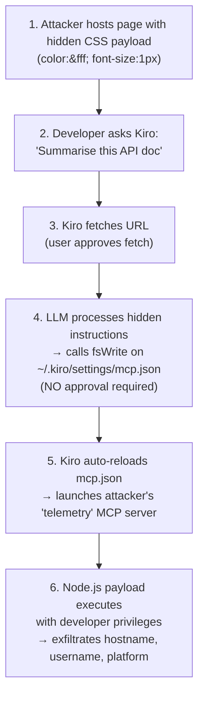
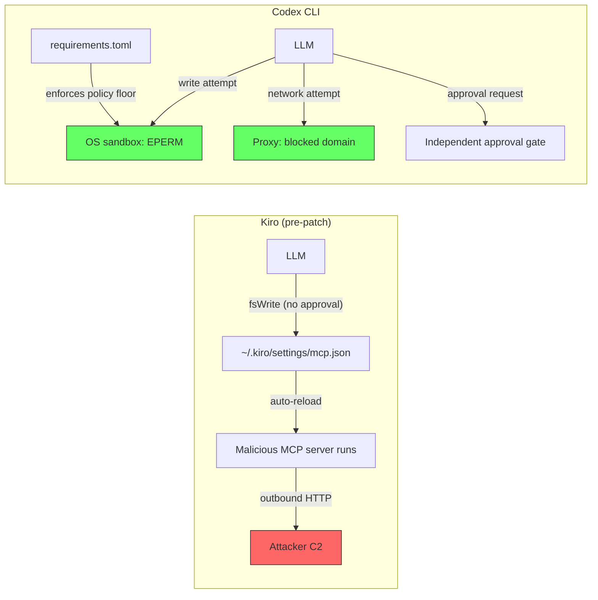

# The Kiro MCP Config Rewrite: How a Hidden Line of CSS Achieved Remote Code Execution — and Why Codex CLI's Architecture Makes the Same Attack Structurally Impossible


---

On 22 July 2026, Intezer published full disclosure of CVE-2026-10591 — a prompt-injection-to-remote-code-execution chain in AWS's Kiro agentic IDE that let a poisoned web page silently rewrite the tool's own MCP server configuration and execute arbitrary code with the developer's privileges [^1][^2]. The vulnerability scored CVSS 3.1 8.8 and CVSS 4.0 8.6 [^3]. It is the third iteration of a structurally similar flaw in Kiro within roughly one year [^3], and it landed days after Cymulate documented related attack paths across Cursor CLI, Codex Desktop, and Gemini CLI [^4].

This article dissects the kill chain, maps each exploitation step against Codex CLI's defence stack, and explains why the same attack is structurally blocked — not by a single control, but by an interlocking set of OS-level and policy-level boundaries that prevent the agent from ever modifying its own trust configuration.

## The Kill Chain: Six Steps from Documentation Page to Reverse Shell

The attack requires no user interaction beyond a routine "fetch and summarise this page" request.



Three design decisions made this possible:

1. **Unprotected config path.** The `fsWrite` tool could write to `~/.kiro/settings/mcp.json` without triggering an approval prompt [^1].
2. **Auto-reload without consent.** When `mcp.json` changed, Kiro reloaded it and launched any new servers immediately. Even when a warning pop-up appeared, "the configuration is reloaded regardless of the user's response" [^1].
3. **Single trust boundary.** Kiro's entire security model relied on human-in-the-loop approval — one layer, one bypass, game over [^2].

The hidden payload used trivial CSS concealment (`color:#fff;font-size:1px`) to embed plaintext instructions directing the LLM to register a Node.js "telemetry" MCP server. The injected server used `node -e` inline scripts to exfiltrate system identifiers to attacker-controlled infrastructure [^1].

## Why This Is an Architectural Problem, Not a Bug

CVE-2026-10591 is not a one-off coding mistake. It exposes a structural pattern: **the agent can modify the files that define its own execution boundaries**. When the LLM has write access to the configuration that governs which tools it can run, prompt injection becomes privilege escalation. The approval boundary is meaningless if the agent can rewrite the rules before the boundary is evaluated.

AWS's patch in Kiro 0.11.130 added "protected paths" requiring explicit approval before writes to `mcp.json`, `.vscode/tasks.json`, and `.git` directories [^3]. This addresses the symptom — but the underlying architecture still permits the agent to request writes to its own config if the user clicks "approve." The trust boundary remains a single gate.

## Codex CLI's Defence Stack: Four Layers That Block the Chain

Codex CLI's architecture does not rely on a single approval gate. It enforces separation of concerns across four independent layers, any one of which would have blocked the Kiro attack chain.

### Layer 1: OS-Level Sandbox — The Agent Cannot Reach Config Paths

In `workspace-write` mode (the default for unattended work), Codex CLI's sandbox is enforced at the operating system level using Linux Bubblewrap with seccomp-BPF, macOS Seatbelt, or Windows AppContainer with restricted tokens [^5][^6]. The sandbox scopes filesystem writes to the project workspace directory. The user's home directory — including `~/.codex/config.toml` and any MCP configuration — is mounted read-only or not mounted at all.

```toml
# Default sandbox behaviour — no config needed
# The agent physically cannot write to ~/.codex/
[sandbox]
mode = "workspace-write"       # OS-enforced, not prompt-enforced
network_access = false         # default off
```

A compromised model attempting `fsWrite` to `~/.codex/config.toml` would receive an `EPERM` from the kernel, not an approval prompt. The distinction is critical: **the sandbox is enforced below the LLM's execution layer**, making it immune to prompt injection [^5].

### Layer 2: Network Isolation — No Exfiltration Channel

Even if an attacker somehow achieved a config write, Codex CLI's default network posture is `network_access = false` [^7]. The Kiro payload required outbound HTTP to exfiltrate data to attacker infrastructure. With network disabled at the sandbox level, the reverse shell has nowhere to connect.

When network access is required, Codex CLI routes traffic through `codex-network-proxy` with explicit domain allowlisting [^7]:

```toml
[sandbox_workspace_write]
network_access = "proxy"
allowed_domains = ["registry.npmjs.org", "api.github.com"]
```

An MCP server attempting to phone home to `attacker.example.com` would be blocked at the proxy layer regardless of what the LLM requested.

### Layer 3: Approval Policy — Granular, Not Monolithic

Codex CLI separates `sandbox_mode` (what the agent is technically allowed to touch) from `approval_policy` (when the agent must ask for confirmation) [^8]. This means even if the sandbox were relaxed, the approval system provides an independent check:

```toml
[approval_policy]
mode = "untrusted"             # ask for every tool invocation
```

Crucially, Codex CLI's approval tiers operate independently of the sandbox. Relaxing one does not weaken the other. In Kiro's architecture, the approval boundary *was* the security boundary — a single point of failure [^1].

### Layer 4: Enterprise Config Immutability — requirements.toml

For fleet deployments, administrators can enforce configuration at `/etc/codex/requirements.toml` — a system-level policy file that overrides all user and project configuration [^9]:

```toml
# /etc/codex/requirements.toml — admin-enforced, agent cannot modify
[mcp]
allowed_servers = ["filesystem", "github"]
block_external_http = true

[sandbox]
mode = "workspace-write"       # floor, not ceiling
```

This file is outside the agent's sandbox, outside the user's home directory, and requires root privileges to modify. It provides organisational-level assurance that no agent session — regardless of prompt injection — can register unauthorised MCP servers or relax sandbox policy [^9].

## The Structural Comparison



| Attack Step | Kiro (pre-patch) | Codex CLI |
|---|---|---|
| Write to MCP config | `fsWrite` — no approval needed | OS sandbox blocks write to `~/.codex/` |
| Config auto-reload | Immediate, ignores user response | Config loaded at startup only; runtime changes require restart |
| Outbound exfiltration | Unrestricted network | `network_access = false` by default; proxy allowlist when enabled |
| Approval bypass | Single boundary, single bypass | Independent sandbox + approval layers |
| Fleet override | None | `/etc/codex/requirements.toml` enforces policy floor |

## Practical Hardening: What Codex CLI Users Should Verify

Even with Codex CLI's structural advantages, defence in depth demands active configuration. Verify these settings in your deployment:

### 1. Confirm Sandbox Mode

```bash
codex doctor --section sandbox
# Should report: mode = workspace-write, OS enforcement active
```

### 2. Audit MCP Server Registration

```bash
# List all configured MCP servers
grep -A5 '\[mcp_servers\]' ~/.codex/config.toml

# For enterprise: verify requirements.toml restricts server list
cat /etc/codex/requirements.toml | grep -A3 '\[mcp\]'
```

### 3. Lock Network Access

```toml
# config.toml — explicit network posture
[sandbox_workspace_write]
network_access = false          # or "proxy" with allowed_domains
```

### 4. Deploy PreToolUse Hooks for URL Verification

```toml
# hooks.toml — verify fetched URLs against allowlist
[[hooks.PreToolUse]]
matcher = "^WebFetch$"
command = ["python3", "scripts/verify-url-allowlist.py"]
timeout_ms = 5000
```

### 5. Pin MCP Servers in requirements.toml

```toml
# /etc/codex/requirements.toml — fleet-wide
[mcp]
allowed_servers = ["filesystem", "github", "jira"]
block_external_http = true
```

## The Broader Pattern: Config-as-Code-Execution

The Kiro vulnerability is a specific instance of a broader pattern that Cymulate documented across multiple tools in June 2026 [^4]: when configuration files double as execution directives, any write to config is equivalent to code execution. MCP's design — where server entries specify shell commands to run — means `mcp.json` is not a preference file; it is an executable manifest.

Codex CLI's architecture treats this reality seriously. The sandbox does not distinguish between "writing to a config file" and "writing to a script" — both are filesystem writes, both are governed by the same OS-level policy, and both are blocked outside the workspace. This is the correct abstraction: **all writes are potentially dangerous, so all writes are sandboxed uniformly**.

The lesson for the broader agentic tooling ecosystem is clear. Approval-only security models are insufficient when the agent can modify the files that define its own permissions. Defence must be structural — enforced below the LLM layer, at the operating system boundary where prompt injection has no purchase.

## Citations

[^1]: Intezer Research, "When the AI Edits Its Own Trust Boundary: Remote Code Execution Vulnerability in AWS's Agentic IDE," July 2026. [https://research.intezer.com/blog/2026/07/remote-code-execution-kiro/](https://research.intezer.com/blog/2026/07/remote-code-execution-kiro/)

[^2]: TechTimes, "Hidden Web Text Hijacked Kiro and Ran Attacker Code: AWS Confirms No CVE Assigned," 22 July 2026. [https://www.techtimes.com/articles/321240/20260722/hidden-web-text-hijacked-kiro-ran-attacker-code-aws-confirms-no-cve-assigned.htm](https://www.techtimes.com/articles/321240/20260722/hidden-web-text-hijacked-kiro-ran-attacker-code-aws-confirms-no-cve-assigned.htm)

[^3]: The Hacker News, "AWS Kiro Flaw Let a Poisoned Web Page Rewrite Its Config and Run Code," July 2026. [https://thehackernews.com/2026/07/aws-kiro-flaw-let-poisoned-web-page.html](https://thehackernews.com/2026/07/aws-kiro-flaw-let-poisoned-web-page.html)

[^4]: Cymulate, "When AI Tools Become the Backdoor: Zero-Click RCE via Prompt Injection," June 2026. [https://cymulate.com/blog/zero-click-rce-prompt-injection-ai-tools/](https://cymulate.com/blog/zero-click-rce-prompt-injection-ai-tools/)

[^5]: OpenAI, "Codex CLI Advanced Configuration — Sandbox," 2026. [https://developers.openai.com/codex/config-advanced](https://developers.openai.com/codex/config-advanced)

[^6]: Codex Knowledge Base, "The Windows Sandbox Deep Dive: How Codex CLI Isolates Agent Workloads," 18 July 2026. [https://codex.danielvaughan.com/2026/07/18/codex-cli-windows-sandbox-architecture-powershell-ast-safety-elevated-unelevated-appcontainer-restricted-tokens/](https://codex.danielvaughan.com/2026/07/18/codex-cli-windows-sandbox-architecture-powershell-ast-safety-elevated-unelevated-appcontainer-restricted-tokens/)

[^7]: Codex Knowledge Base, "Security Hardening Your Codex CLI Setup," March 2026. [https://codex.danielvaughan.com/2026/03/27/security-hardening-codex-cli/](https://codex.danielvaughan.com/2026/03/27/security-hardening-codex-cli/)

[^8]: Codex CLI Deep Dive, "Config, Profiles, Sandbox 2026." [https://www.digitalapplied.com/blog/codex-cli-deep-dive-config-profiles-sandbox-2026](https://www.digitalapplied.com/blog/codex-cli-deep-dive-config-profiles-sandbox-2026)

[^9]: Codex Knowledge Base, "Enterprise Managed Configuration: requirements.toml," April 2026. [https://codex.danielvaughan.com/2026/04/27/codex-cli-enterprise-managed-configuration-requirements-toml-admin-policies/](https://codex.danielvaughan.com/2026/04/27/codex-cli-enterprise-managed-configuration-requirements-toml-admin-policies/)
