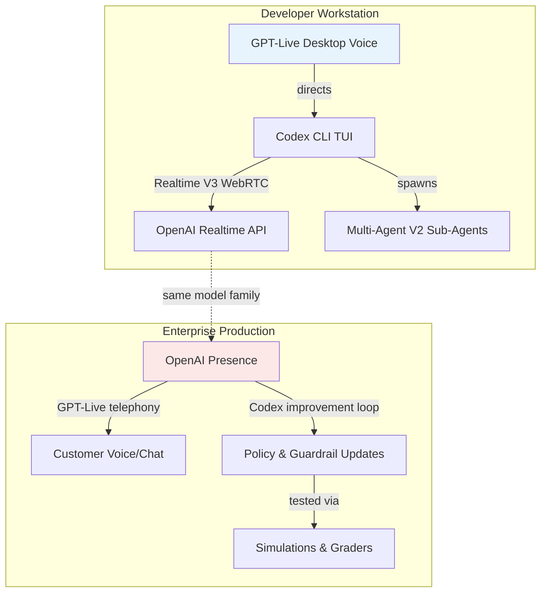
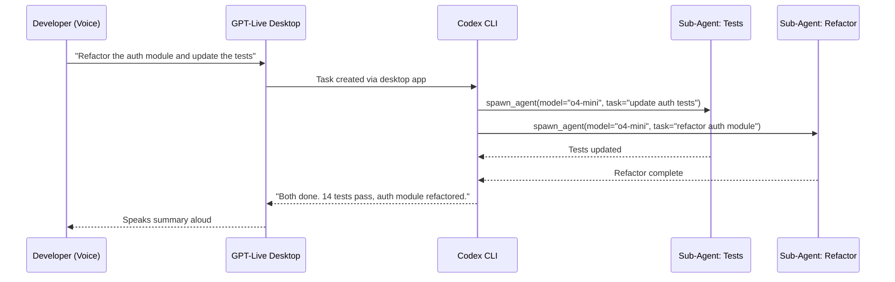

# The Voice-First Agent Orchestration Guide: Unifying GPT-Live, OpenAI Presence, and Realtime V3 in Codex CLI


---

Three voice capabilities shipped within a fortnight of each other in July 2026: GPT-Live full-duplex voice on the ChatGPT desktop app[^1], OpenAI Presence as an enterprise voice-and-chat agent platform[^2], and streaming Realtime V3 conversations in Codex CLI v0.145.0[^3]. Each targets a different layer of the stack, but together they form a single voice-first architecture for agent orchestration — from a developer's terminal to a production contact centre. This guide maps that architecture, shows how the pieces connect, and provides the configuration needed to wire them up.

## The Three Layers



### Layer 1 — GPT-Live: Full-Duplex Voice Control

GPT-Live-1, launched 8 July 2026, is a continuous audio model that listens and speaks simultaneously[^4]. Unlike the previous Advanced Voice Mode's turn-based architecture, GPT-Live processes audio continuously and decides many times per second whether to speak, listen, pause, or delegate to a background model[^5].

The hybrid architecture couples a lightweight, low-latency voice model (GPT-Live-1 and GPT-Live-1 mini) with GPT-5.5 running asynchronously for heavier reasoning[^4]. When a query requires web search or deeper analysis, GPT-Live delegates to GPT-5.5 in the background whilst keeping the conversation flowing. The user experiences no pause.

On 23 July 2026, ChatGPT Voice — powered by GPT-Live — shipped on the desktop app for macOS and Windows[^1]. For developers, this means voice-directed control over Codex tasks, Work threads, and Chat conversations from a single interface, with Appshots providing screen context on macOS[^6].

### Layer 2 — Realtime V3: CLI-Native Voice Sessions

Codex CLI has supported voice since v0.105.0 (spacebar push-to-talk transcription)[^7], but v0.145.0 shipped streaming Realtime V3 conversations with audio inputs and audio tool outputs[^3]. This is the bridge between GPT-Live on the desktop and the agentic loop in the terminal.

The realtime subsystem has evolved through three generations:

| Version | Transport | Capability | CLI Version |
|---------|-----------|-----------|-------------|
| V1 | WebSocket | Quicksilver intent, basic voice | v0.105.0+ |
| V2 | WebRTC | Two-way audio, voice selection, progress streaming | v0.119.0+ |
| V3 | WebRTC + Frameless Bidi | Streaming audio I/O, tool audio outputs, handoff streaming | v0.145.0+ |

V3 introduces frameless bidirectional support, meaning audio tool outputs (not just text) stream back during agent execution[^3]. An agent can now speak its progress aloud whilst editing files — genuine pair-programming rather than dictation.

### Layer 3 — OpenAI Presence: Enterprise Voice Agents

Presence, announced 22 July 2026, is OpenAI's managed platform for deploying production voice and chat agents[^2]. It brings together six components: policies and SOPs, guardrails, approved actions, simulations, graders, and a Codex-powered improvement loop[^8].

The improvement loop is the architectural link to the CLI world. Codex investigates signals from production sessions using a Presence plugin, identifies weaknesses, and proposes behavioural changes — but human staff must test and approve every change before rollout[^9]. OpenAI reports 75% of inbound calls on 1-888-GPT-0090 resolve without human escalation, and the Codex review loop cut handoffs by 15% over a 10-day period[^8].

## Configuration: Wiring Voice into Codex CLI

### Basic Realtime V3 Setup

The `[realtime]` TOML configuration table, introduced in PRs #14556 and #14606[^7], controls voice session behaviour:

```toml
[realtime]
version = "v3"
type    = "conversational"

[audio]
microphone = "MacBook Pro Microphone"
speaker    = "External Headphones"

[features]
voice_transcription  = true
prevent_idle_sleep   = true
```

Two modes are available[^7]:

- **`conversational`** — Interactive two-way voice with tool execution during audio turns. Sessions initialise with recent thread context.
- **`transcription`** — Speech-to-text piped into the agentic loop as standard user messages. Lower latency, lower token cost.

### Voice Selection and Device Configuration

The `/audio` slash command provides interactive device selection within the TUI[^10]. Audio device preferences persist automatically in `config.toml`.

### AGENTS.md Voice Directives

Voice sessions benefit from explicit behavioural guidance in your project's `AGENTS.md`[^7]:

```markdown
## Voice Session Conventions

- Confirm destructive actions aloud before executing
- Summarise each completed file edit in one sentence
- If interrupted mid-sentence, restart the previous thought on next user turn
- Prefer short confirmations over long explanations when the task is clear
- When running tests, announce pass/fail counts rather than reading full output
```

These directives shape the agent's audio responses during conversational mode, keeping voice interactions concise and actionable.

## Voice-Directed Multi-Agent Orchestration

The real power emerges when GPT-Live desktop voice directs Codex's Multi-Agent V2 system. A developer can speak a high-level objective, and the orchestrator spawns sub-agents to handle it:



With v0.145.0's stabilised Multi-Agent V2[^3], sub-agent model routing is configurable, preventing the cost explosion of uniform Sol spawning[^11]:

```toml
[agents]
default_subagent_model    = "o4-mini"
hide_spawn_agent_metadata = false

[agents.profiles.heavy]
model            = "gpt-5.6-sol"
reasoning_effort = "high"
```

### Voice + Goal Mode

Goal mode (`/goal`, shipped v0.128.0, default since v0.133.0)[^12] pairs naturally with voice. Speak a goal, walk away, and the Ralph loop pursues it autonomously — checking back via voice when budget thresholds are reached:

```toml
[goal]
token_budget        = 500000
continuation_prompt = "Continue pursuing the goal"
budget_limit_prompt = "Budget nearly exhausted. Summarise progress and stop."
```

## Extending Voice: MCP and Hooks

### Spokenly MCP for Mid-Workflow Voice Q&A

The Spokenly MCP server enables agents to request spoken answers during autonomous runs[^7]:

```bash
codex mcp add spokenly --url http://localhost:51089
```

Add a directive to `AGENTS.md`:

```markdown
ALWAYS ask clarification questions via the `ask_user_dictation` tool
from the spokenly MCP server, never as plain text.
```

This bridges voice input beyond initial prompts — the agent pauses, asks a question aloud, and waits for a spoken reply.

### Text-to-Speech Output Hooks

Wire task completion to speech synthesis for full audio-loop closure[^7]:

```toml
[hooks]
PostTaskComplete = "say -v Samantha \"$(cat | python3 -c \"import sys,json; print(json.load(sys.stdin).get('message',''))\")\""
```

On macOS this uses the built-in `say` command; on other platforms, substitute with `espeak`, `piper`, or a cloud TTS endpoint.

## Enterprise Voice: From CLI Patterns to Presence

The architectural parallels between Codex CLI's hook stack and Presence's production governance are deliberate:

| Codex CLI Concept | Presence Equivalent | Purpose |
|-------------------|---------------------|---------|
| `AGENTS.md` | Policies & SOPs | Behavioural directives |
| `PreToolUse` / `PostToolUse` hooks | Guardrails | Runtime intervention |
| `requirements.toml` | Approved Actions | Permission boundaries |
| `/goal` + Ralph loop | Codex Improvement Loop | Iterative refinement |
| Named profiles | Simulation scenarios | Testing configurations |
| eval framework | Graders | Outcome verification |

Teams prototyping voice agents with Codex CLI can expect their `AGENTS.md` conventions and hook patterns to translate structurally into Presence deployments, even though the runtime environments differ[^8].

## Platform Constraints and Known Limitations

Voice support in Codex CLI carries several constraints worth noting[^7][^10]:

- **Linux**: No native voice transcription. Use Spokenly MCP or WhisperTyping as workarounds.
- **Windows CLI**: Realtime voice requires the Desktop app; the CLI TUI alone is insufficient.
- **Session length**: Long voice sessions trigger context compaction. Ensure `compact_prompt` preserves audio transcripts.
- **Clip duration**: Spacebar dictation caps at 60 seconds per clip.
- **Echo loops**: If transcriptions feed back into prompts, rapid token consumption follows. The backpressure and silence detection fixes in v0.116.0–v0.117.0 mitigate this but do not eliminate it entirely.
- **Presence availability**: Limited general availability only, with deployments led by OpenAI Forward Deployed Engineers. No self-service tier exists yet[^2].

## What Comes Next

The convergence of GPT-Live, Realtime V3, and Presence points toward a future where voice is the primary orchestration interface for coding agents. The Codex Micro hardware control surface (\$230, six illuminated keys) already ships with a dedicated voice-activation key[^13]. As Realtime V3 matures and Presence opens beyond its current FDE-led deployment model, expect voice-directed agent orchestration to move from novelty to default workflow.

For now, the practical path is clear: configure `[realtime]` for V3 conversational mode, add voice directives to `AGENTS.md`, wire up Spokenly for mid-task Q&A, and start talking to your agents.

---

## Citations

[^1]: OpenAI, "ChatGPT Desktop 26.715 Changelog — ChatGPT Voice powered by GPT-Live," 23 July 2026. [https://learn.chatgpt.com/docs/changelog](https://learn.chatgpt.com/docs/changelog)

[^2]: OpenAI, "Introducing OpenAI Presence," 22 July 2026. [https://openai.com/index/introducing-openai-presence/](https://openai.com/index/introducing-openai-presence/)

[^3]: OpenAI, "Codex CLI 0.145.0 Release — Audio inputs, Realtime V3 streaming, Multi-Agent V2 stabilisation," 21 July 2026. [https://learn.chatgpt.com/docs/changelog](https://learn.chatgpt.com/docs/changelog)

[^4]: MLQ News, "OpenAI Launches GPT-Live-1, a Full-Duplex Voice Model That Listens and Speaks Simultaneously," July 2026. [https://mlq.ai/news/openai-launches-gpt-live-1-a-full-duplex-voice-model-that-listens-and-speaks-simultaneously/](https://mlq.ai/news/openai-launches-gpt-live-1-a-full-duplex-voice-model-that-listens-and-speaks-simultaneously/)

[^5]: BuildFastWithAI, "GPT-Live Review: OpenAI's Full-Duplex Voice Model Explained," July 2026. [https://www.buildfastwithai.com/blogs/gpt-live-review-openai-voice-model-july-2026](https://www.buildfastwithai.com/blogs/gpt-live-review-openai-voice-model-july-2026)

[^6]: VentureBeat, "Agentic coding goes hands-free as OpenAI brings GPT-Live's full duplex voice control to Codex and ChatGPT on the desktop," July 2026. [https://venturebeat.com/orchestration/agentic-coding-goes-hands-free-as-openai-brings-gpt-lives-full-duplex-voice-control-to-codex-and-chatgpt-on-the-desktop](https://venturebeat.com/orchestration/agentic-coding-goes-hands-free-as-openai-brings-gpt-lives-full-duplex-voice-control-to-codex-and-chatgpt-on-the-desktop)

[^7]: Daniel Vaughan, "Codex CLI Realtime Sessions: Voice Pair Programming, Transcription Mode, and the [realtime] Config," 31 March 2026. [https://codex.danielvaughan.com/2026/03/31/codex-cli-realtime-sessions-voice-transcription/](https://codex.danielvaughan.com/2026/03/31/codex-cli-realtime-sessions-voice-transcription/)

[^8]: Help Net Security, "OpenAI Presence connects AI agents to enterprise data with built-in guardrails," 22 July 2026. [https://www.helpnetsecurity.com/2026/07/22/openai-presence-ai-agent-platform/](https://www.helpnetsecurity.com/2026/07/22/openai-presence-ai-agent-platform/)

[^9]: OpenAI Developers, "Build an Agent Improvement Loop with Traces, Evals, and Codex." [https://developers.openai.com/cookbook/examples/agents_sdk/agent_improvement_loop](https://developers.openai.com/cookbook/examples/agents_sdk/agent_improvement_loop)

[^10]: Daniel Vaughan, "Voice-Driven Development in Codex CLI: From Push-to-Talk to Realtime V2 WebRTC," 17 April 2026. [https://codex.danielvaughan.com/2026/04/17/codex-cli-voice-realtime-webrtc-push-to-talk/](https://codex.danielvaughan.com/2026/04/17/codex-cli-voice-realtime-webrtc-push-to-talk/)

[^11]: Daniel Vaughan, "Sub-Agent Model Routing in Multi-Agent V2," 24 July 2026. [https://codex.danielvaughan.com/articles/2026-07-24-codex-cli-sub-agent-model-routing-multi-agent-v2-hidden-schema-cost-control-configuration/](https://codex.danielvaughan.com/articles/2026-07-24-codex-cli-sub-agent-model-routing-multi-agent-v2-hidden-schema-cost-control-configuration/)

[^12]: Daniel Vaughan, "Goal Mode: How Codex CLI Turns a Single Objective into Hours of Autonomous Work," 23 July 2026. [https://codex.danielvaughan.com/articles/2026-07-23-codex-cli-goal-mode-long-horizon-autonomous-workflows-ralph-loop-token-budgets/](https://codex.danielvaughan.com/articles/2026-07-23-codex-cli-goal-mode-long-horizon-autonomous-workflows-ralph-loop-token-budgets/)

[^13]: Rohit AI, "OpenAI Codex Micro Puts the Agent Control Loop on Your Desk." [https://rohitai.com/blog/openai-codex-micro-agent-control-surface](https://rohitai.com/blog/openai-codex-micro-agent-control-surface)
