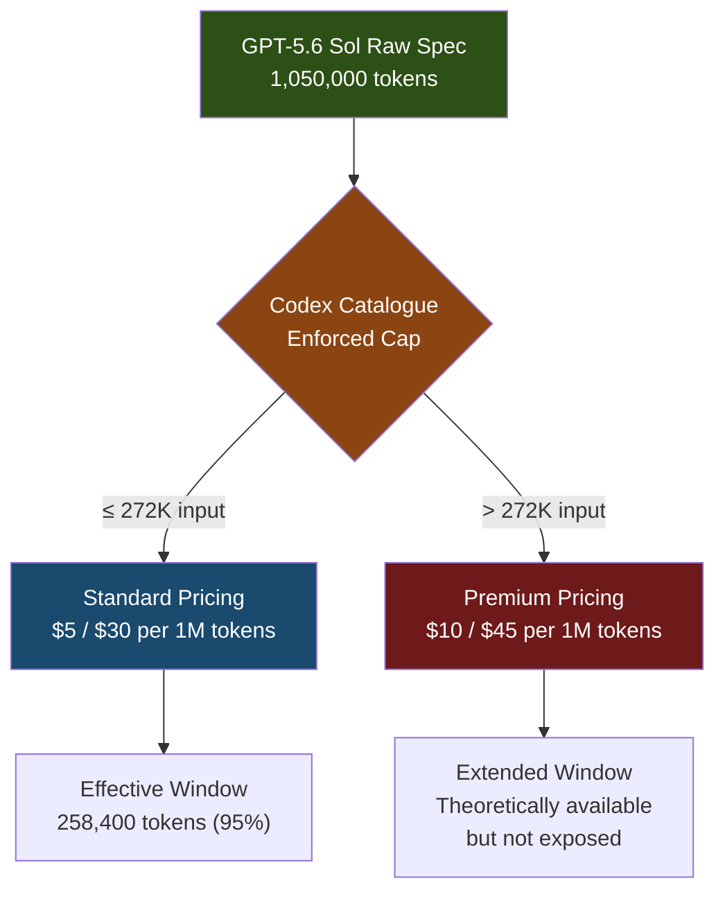
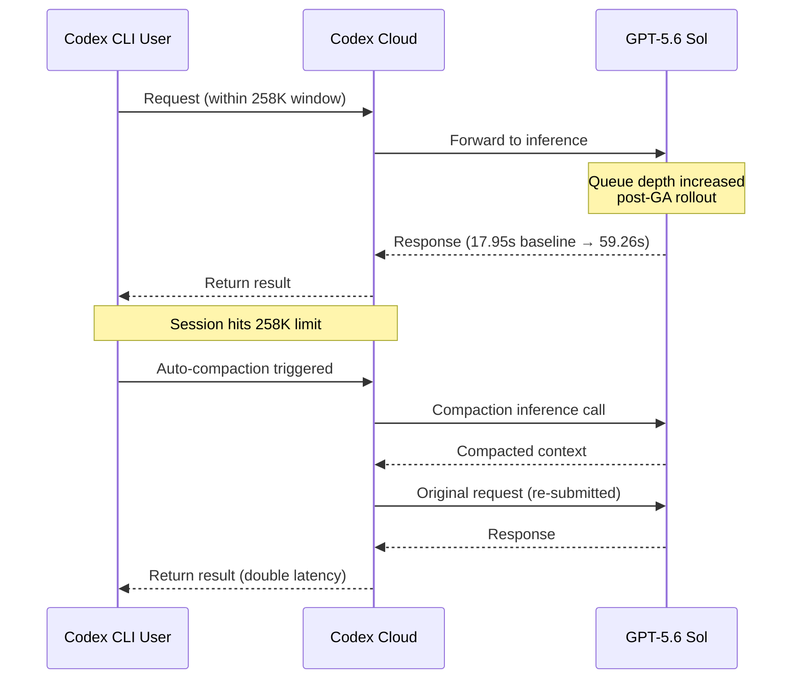

# The 272K Reality: How GPT-5.6 Sol's Context Window Cap and July Latency Regression Expose Codex CLI's Infrastructure Limits


---

## Two Problems, One Root Cause

Between 12 and 19 July 2026, Codex CLI users running GPT-5.6 Sol experienced a sustained latency regression: mean full-request latency climbed from 17.95 seconds to 59.26 seconds — a 3.3× slowdown — whilst P90 latency ballooned from 32.58 seconds to 154.13 seconds [^1]. Simultaneously, a separate cohort discovered that the model's effective context window had been silently cut from 353,400 tokens to 258,400 tokens [^2], despite GPT-5.6 Sol's published specification of 1.05 million tokens [^3].

These are not two independent bugs. They are symptoms of the same architectural reality: Codex Cloud's serving infrastructure imposes hard billing, capacity, and throughput constraints that diverge significantly from the raw model specification. Understanding this gap is essential for any team relying on Codex CLI for production workflows.

---

## The Context Window Is a Billing Boundary, Not a Technical Limit

GPT-5.6 Sol's model card specifies a 1,050,000-token context window with 128,000 maximum output tokens [^3]. The Codex CLI model catalogue, however, exposes `context_window: 272000` and `max_context_window: 272000` [^2]. At the standard 95% effective-context multiplier, this yields 258,400 usable tokens — roughly 25% of the advertised capacity.

The 272K figure is not arbitrary. It aligns with a pricing threshold documented in OpenAI's rate card: prompts exceeding 272,000 input tokens trigger 2× input pricing and 1.5× output pricing for the entire session [^4]. The context cap therefore functions as a billing guard rail, not a model limitation.



### The Shrinking Window Timeline

The cap has tightened progressively since GPT-5.6 Sol's preview launch on 26 June 2026 [^3]:

| Date | Raw Catalogue | Effective (95%) | Change |
|------|--------------|-----------------|--------|
| 26 June – 12 July | 372,000 | 353,400 | Initial cap |
| 13 July onwards | 272,000 | 258,400 | −95,000 tokens (−26.9%) |
| Advertised spec | 1,050,000 | ~997,500 | Never exposed in Codex |

Version 0.144.6 (18 July 2026) formalised the reduction by "correcting" the bundled metadata for Sol, Terra, and Luna to 272,000 tokens [^5]. Paweł Huryn noted the framing on X: "The release notes call it a bug fix: 'corrected their context windows to 272,000 tokens'" [^6].

---

## The Latency Regression: Anatomy of a 3.3× Slowdown

The performance degradation documented in GitHub Issue #34225 was not a brief blip. User @Accademia compiled daily aggregates showing sustained degradation across an eight-day window [^1]:

| Metric | 12 July (Baseline) | 19 July (Peak Regression) | Multiplier |
|--------|-------------------|--------------------------|------------|
| Mean latency | 17.95s | 59.26s | 3.30× |
| P90 latency | 32.58s | 154.13s | 4.73× |
| Performance index | 100% | 30.3% | — |

The P90 figure is particularly alarming. A 154-second tail latency means roughly one in ten requests takes over two and a half minutes — long enough to break interactive development workflows entirely.

### Probable Contributing Factors

Several infrastructure pressures converged around this period:

1. **Usage limit resets.** The reporter hypothesised that a wave of free-tier usage resets on 12 July increased server load [^1]. Codex's compute substrate is shared across all tiers.

2. **GPT-5.6 GA rollout.** Sol, Terra, and Luna reached general availability on 9 July 2026 [^3], expanding the user base whilst the serving fleet was still scaling.

3. **Context window compaction churn.** With the effective window reduced to 258K, sessions that previously ran without compaction now hit the auto-compact threshold more frequently, generating additional inference calls [^7].



---

## What You Can (and Cannot) Override

### Context Window Overrides: Proceed with Caution

Codex CLI exposes `model_context_window` in `config.toml`, but overriding the server-delivered catalogue value is fraught:

```toml
# ~/.codex/config.toml

# ⚠️ Setting this breaks auto-compaction in some versions
# model_context_window = 400000

# Safer: tune the compaction trigger instead
model_auto_compact_token_limit = 155000  # ~60% of 258K
```

GitHub Issue #16068 documents that setting `model_context_window` to any value — 300K, 350K, or 400K — causes auto-compaction to fail permanently after the first context overflow [^8]. The `fill_to_context_window` logic resets the token counter, creating an infinite loop where compaction never completes. The only reliable behaviour is using the server-delivered default (272K).

Even if the override worked, sessions exceeding 272K input tokens would trigger the premium pricing tier [^4], doubling your input costs without warning in the CLI's usage display.

### Compaction Tuning: The Practical Lever

The single most effective mitigation is triggering compaction early and often, before the context window fills:

```toml
# ~/.codex/config.toml

# Trigger compaction at 60% of effective window
# 258,400 × 0.60 ≈ 155,000
model_auto_compact_token_limit = 155000
```

This trades context depth for session stability. You lose the ability to hold 258K tokens of working context simultaneously, but you avoid the compaction-induced latency spikes that occur when the window fills completely.

The 90% hard cap is enforced silently: setting `model_auto_compact_token_limit` above 90% of the context window is ignored without warning [^7].

### Profile-Scoped Overrides: A Known Bug

As of v0.145.0, `model_context_window` and `model_auto_compact_token_limit` set within named profiles in `.codex/config.toml` (project scope) are silently ignored [^9]. Only user-scope settings in `~/.codex/config.toml` take effect. This is a known limitation tracked in Issue #14456.

```toml
# ❌ Does NOT work in project-scoped profiles
[profiles.deep-context]
model_context_window = 272000
model_auto_compact_token_limit = 155000

# ✅ Works at user scope
# Place in ~/.codex/config.toml (without profile wrapper)
model_auto_compact_token_limit = 155000
```

---

## Strategic Implications for Teams

### 1. Budget for the Window You Actually Get

Do not plan sessions around 1.05M tokens. Plan around 258K. For complex, multi-file refactoring tasks, this means:

- **Decompose aggressively.** Break large tasks into focused sub-tasks that fit within ~150K tokens of working context.
- **Use sub-agents.** Codex CLI's Multi-Agent V2 (stabilised in v0.145.0) can delegate sub-tasks to separate sessions, each with its own 258K window.
- **Pin critical context in AGENTS.md.** Instructions in AGENTS.md are loaded at session start and survive compaction. Use them to preserve architectural decisions and coding conventions that would otherwise be lost.

### 2. Monitor Latency, Not Just Correctness

The July regression was visible only to users who tracked latency systematically. Codex CLI does not surface latency metrics in the TUI. Consider:

```bash
# Wrapper script to log request timing
time codex --quiet -p "Refactor auth module" 2>&1 | tee session.log
```

Or use the `codex exec-server` WebSocket endpoint with external monitoring for automated workflows.

### 3. Have a Fallback Model Strategy

When Sol's infrastructure is degraded, routing to Terra preserves throughput at a quality tradeoff:

```toml
# ~/.codex/config.toml

# Default to Terra for routine work
model = "gpt-5.6-terra"

# Switch to Sol only for complex tasks via profile
[profiles.complex]
model = "gpt-5.6-sol"
```

Terra shares the same 272K context window but at \$2.50/\$15 per million tokens versus Sol's \$5/\$30 [^10], and during the July regression, Terra latencies were less severely affected — likely because the surge demand disproportionately targeted Sol.

---

## The Broader Pattern

The gap between a model's technical specification and its operational reality inside a hosted product is not unique to Codex CLI. Claude Code's context windows are similarly constrained by Anthropic's serving infrastructure. Cursor manages context aggressively behind its own abstraction layer [^11].

What makes the Codex CLI case instructive is the transparency of the community response. The GitHub issues document exact token counts, daily latency aggregates, and version-specific reproduction steps. This level of empirical rigour — treating the infrastructure as a system to be characterised rather than a black box to be tolerated — is exactly the engineering discipline that cloud-hosted AI tooling demands.

The 272K cap will likely evolve. OpenAI has every incentive to expand it as serving costs decline and competition from Claude Code and Cursor intensifies. But the lesson holds: **the model card tells you what the model can do; the infrastructure tells you what you can actually do with it.**

---

## Citations

[^1]: Accademia, "Starting from 2026-July-12, Codex performance dropped 3X", GitHub Issue #34225, openai/codex, 19 July 2026. [https://github.com/openai/codex/issues/34225](https://github.com/openai/codex/issues/34225)

[^2]: Lady-Lin, "[SEVERE REGRESSION] GPT-5.6 Sol context cut again: 353K → 258K despite advertised 1.05M", GitHub Issue #32806, openai/codex, 13 July 2026. [https://github.com/openai/codex/issues/32806](https://github.com/openai/codex/issues/32806)

[^3]: OpenAI, "Previewing GPT-5.6 Sol: a next-generation model", openai.com, 26 June 2026. [https://openai.com/index/previewing-gpt-5-6-sol/](https://openai.com/index/previewing-gpt-5-6-sol/)

[^4]: "Default GPT-5.6 context can cross the 272K higher-usage threshold", GitHub Issue #32486, openai/codex, July 2026. [https://github.com/openai/codex/issues/32486](https://github.com/openai/codex/issues/32486)

[^5]: OpenAI, Codex CLI v0.144.6 release notes, 18 July 2026. [https://releasebot.io/updates/openai/codex](https://releasebot.io/updates/openai/codex)

[^6]: Paweł Huryn (@PawelHuryn), post on X, July 2026. [https://x.com/PawelHuryn/status/2079052153180569803](https://x.com/PawelHuryn/status/2079052153180569803)

[^7]: Daniel Vaughan, "Codex CLI Context Compaction: Architecture, Configuration, and Managing Long Sessions", Codex Knowledge Base, 2026. [https://codex.danielvaughan.com/2026/03/31/codex-cli-context-compaction-architecture/](https://codex.danielvaughan.com/2026/03/31/codex-cli-context-compaction-architecture/)

[^8]: "Setting model_context_window in config.toml breaks auto-compaction", GitHub Issue #16068, openai/codex. [https://github.com/openai/codex/issues/16068](https://github.com/openai/codex/issues/16068)

[^9]: "Support model_context_window/model_auto_compact_token_limit in profiles", GitHub Issue #14456, openai/codex. [https://github.com/openai/codex/issues/14456](https://github.com/openai/codex/issues/14456)

[^10]: "GPT-5.6 Pricing 2026: Sol, Terra & Luna API Costs", aipricing.guru, July 2026. [https://www.aipricing.guru/openai-pricing/](https://www.aipricing.guru/openai-pricing/)

[^11]: "Codex GPT-5.6 Sol context window reduced to 258K tokens, users report performance degradation", Agentic Ready, July 2026. [https://www.getreadyforagents.com/news/codex-context-window-reduction/](https://www.getreadyforagents.com/news/codex-context-window-reduction/)
