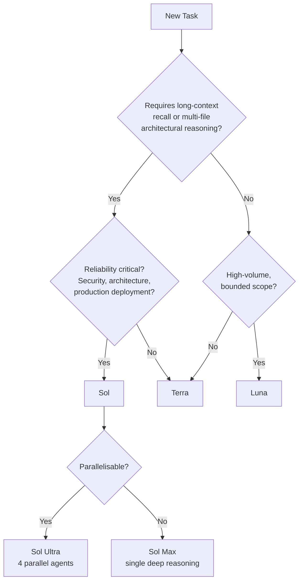
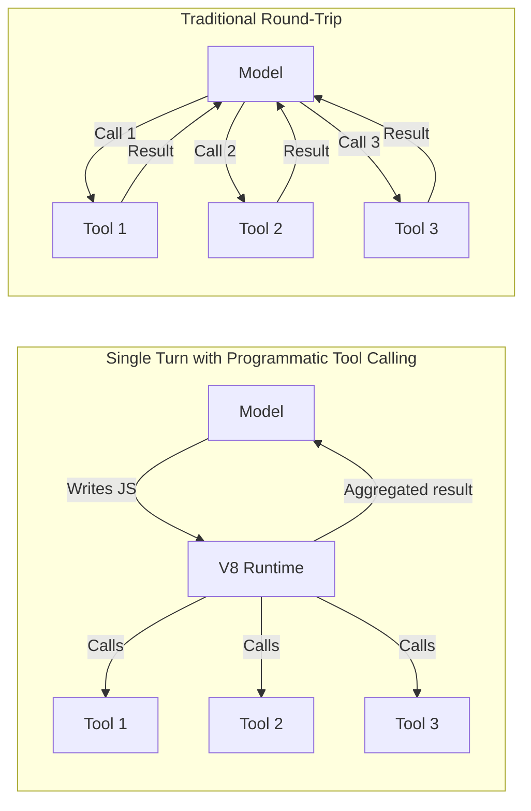

# Model Routing Patterns for Codex CLI: A Sol, Terra, Luna Decision Framework


---

GPT-5.6's three-tier model family — Sol at \$5/\$30, Terra at \$2.50/\$15, and Luna at \$1/\$6 per million tokens [^1] — turns model selection from a one-time decision into a routing problem. The right tier depends on the task, not the project. This article builds a practical decision framework for Codex CLI developers who want to stop paying Sol prices for Luna-grade work.

## The Three Tiers in Practice

OpenAI positions Sol as the flagship for "hardest agent tasks, frontier benchmarks, long-horizon coding," Terra as the everyday workhorse matching GPT-5.5 at half the price, and Luna as the high-volume option for latency-sensitive or budget-constrained loops [^1]. The pricing spread is dramatic: a task that costs \$1 on Luna costs \$5 on Sol — a 5× multiplier on output tokens.

But raw pricing tells only half the story. The benchmark gaps between tiers are narrower than the cost gaps:

| Benchmark | Sol | Terra | Luna |
|-----------|-----|-------|------|
| Coding Agent Index | 80.0 | 77.4 | — |
| DeepSWE | 72.7% | 69.6% | — |
| Terminal-Bench 2.1 | 88.8% | — | — |
| Long-context recall (MRCR) | 91.5% | — | 41.3% |

Terra trails Sol by just 2–4 points on most coding benchmarks [^2]. Luna's critical weakness is long-context recall — 41.3% versus Sol's 91.5% — which rules it out for large codebase reasoning or multi-document synthesis [^2].

## The Decision Framework

The routing logic reduces to three questions:



### Route to Sol When

- **Long-horizon agentic workflows** requiring dozens of steps across multiple files. Sol leads on Terminal-Bench 2.1 (88.8%) and BrowseComp (90.4%) [^1].
- **Security audits and architectural decisions** where a missed edge case costs more than the inference bill.
- **Complex terminal operations** and computer-use tasks where Sol's lead over Terra is most pronounced.

### Default to Terra

Terra is the correct default for most development work. The 2–4 point benchmark gap against Sol translates to roughly one in every 30–50 tasks where Sol would have succeeded and Terra fails [^2]. At half the cost, this is an excellent trade-off for:

- First-pass implementation and scoped refactors
- Code review triage and test generation
- Bug investigation with bounded scope
- Documentation and explanation tasks

### Use Luna for Volume

Luna delivers approximately 24 benchmark points per estimated API dollar [^2] — the best cost-performance ratio in the family. It excels at:

- PR summary generation and commit message drafting
- Classification and labelling tasks
- Docstring generation and linting passes
- Boilerplate scaffolding with bounded templates

**Critical constraint:** never route Luna to tasks requiring reasoning over large contexts. Its 41.3% long-context recall score means it will silently miss information rather than fail loudly [^2].

## Implementing Routing with Named Profiles

Codex CLI's named profile system maps directly onto this framework. Each profile lives in its own file at `~/.codex/<profile-name>.config.toml` and activates with `--profile <name>` or `CODEX_PROFILE=<name>` [^3].

### Profile Configuration

```toml
# ~/.codex/sol-review.config.toml
model = "gpt-5.6-sol"
model_reasoning_effort = "xhigh"
approval_policy = "on-request"
```

```toml
# ~/.codex/terra-dev.config.toml
model = "gpt-5.6-terra"
model_reasoning_effort = "high"
sandbox_mode = "workspace-write"
```

```toml
# ~/.codex/luna-bulk.config.toml
model = "gpt-5.6-luna"
model_reasoning_effort = "medium"
model_verbosity = "low"
```

### Usage Patterns

```bash
# Security audit — Sol with maximum reasoning
codex --profile sol-review "audit authentication handling for OWASP Top 10"

# Daily development — Terra as default
codex --profile terra-dev "add error handling to the payment service"

# Bulk operations — Luna for throughput
codex --profile luna-bulk "generate docstrings for all exported functions"
```

The configuration precedence chain runs CLI flags → profile values → project config → user config → system config → defaults [^3]. This means a project-level `.codex/config.toml` can set a floor (e.g., minimum sandbox mode) whilst profiles control the model tier.

## The Subagent Routing Problem

One significant limitation constrains automated model routing: GPT-5.6 Sol's MultiAgent V2 defaults `hide_spawn_agent_metadata` to `true`, stripping the `model`, `agent_type`, `reasoning_effort`, and `service_tier` fields from the `spawn_agent` schema [^4]. The result is that Sol cannot delegate to cheaper Terra or Luna subagents — every child inherits the parent's (expensive) configuration.

Users have documented token waste exceeding 700 million tokens across recursive Sol instances that should have used cheaper tiers [^4]. The issue was closed as a duplicate of #31893, with workarounds including forcing MultiAgent V1 via the features table:

```toml
[features]
multi_agent = true
multi_agent_v2 = false
```

⚠️ This workaround trades V2's encrypted delegation (important for security) for V1's transparent but less secure routing. The trade-off may not suit all environments.

## Programmatic Tool Calling and Tier Selection

GPT-5.6 introduced Programmatic Tool Calling, where the model writes JavaScript executed in an isolated V8 runtime to coordinate multiple tool invocations in a single turn [^5]. This reduces round-trips and, consequently, total token consumption.

The interaction with tier selection matters: Programmatic Tool Calling is available across all three tiers [^1], but its effectiveness varies. Sol's deeper reasoning produces more sophisticated orchestration programmes, whilst Luna tends to fall back to sequential single-tool patterns. Terra hits the sweet spot — capable enough to generate useful multi-tool programmes at half Sol's cost.



The token savings compound: fewer round-trips mean fewer input tokens re-sent as context. On a 10-tool workflow, Programmatic Tool Calling can reduce total token consumption by 40–60% compared to sequential dispatch [^5].

## Reasoning Modes: Max vs Ultra

Each tier supports two reasoning modes that further influence routing decisions:

- **Max**: single-agent deep reasoning, adding 2–4 benchmark points. Use for non-parallelisable tasks requiring careful sequential thought [^1].
- **Ultra**: spawns up to four parallel agents, adding 1.8–3.1 points at approximately 3× the cost. Only justified when the task naturally decomposes into independent subtasks [^2].

The practical calculus on Terminal-Bench 2.1: single-agent Sol scores 88.8% at roughly \$1.70, whilst Sol Ultra reaches 91.9% at approximately \$5.00 [^2]. That is a 3× cost increase for a 3.1-point gain — worth it for production-critical work, wasteful for iteration.

## A Practical SDLC Routing Table

Mapping the framework onto a typical software development lifecycle:

| Phase | Recommended Tier | Reasoning Mode | Rationale |
|-------|-----------------|----------------|-----------|
| Architecture & planning | Sol | Max | Long-horizon reasoning, reliability critical |
| Implementation | Terra | Default | Best cost-performance for scoped tasks |
| Test generation | Terra | Default | Bounded scope, moderate complexity |
| Security review | Sol | Max | Cannot afford missed vulnerabilities |
| Code review comments | Terra | Default | Adequate quality at half the cost |
| Docstring generation | Luna | Default | High-volume, bounded, templated |
| PR summaries | Luna | Default | Classification and summarisation |
| CI/CD debugging | Terra | Default | Moderate context, scoped investigation |
| Incident response | Sol | Ultra | Parallelisable investigation, reliability critical |

## Cost Modelling

For a team running 1,000 Codex CLI tasks per week with an even distribution across the SDLC phases above, naive Sol-for-everything versus routed tiers produces roughly the following cost profile (assuming 50K average output tokens per task):

- **All-Sol**: 1,000 × 50K × \$30/1M = **\$1,500/week**
- **Routed** (20% Sol, 60% Terra, 20% Luna): (200 × \$30 + 600 × \$15 + 200 × \$6) × 50K/1M = **\$600/week**

That is a 60% cost reduction with minimal quality trade-off on the tasks that matter [^2].

## Recommendations

1. **Set Terra as your default model** in `~/.codex/config.toml`. Escalate to Sol deliberately, not by default.
2. **Create three named profiles** — one per tier — and build the habit of selecting the right one per task.
3. **Avoid Luna for anything requiring long-context recall.** Its 41.3% MRCR score makes it unreliable for large codebases [^2].
4. **Watch the subagent routing gap.** Until MultiAgent V2 exposes model routing fields by default, Sol's multi-agent workflows will over-spend [^4].
5. **Use Programmatic Tool Calling on Terra** to capture the token savings of fewer round-trips without paying Sol's premium [^5].
6. **Reserve Ultra mode for genuinely parallelisable tasks.** The 3× cost multiplier is rarely justified for sequential work [^2].

## Citations

[^1]: OpenAI, "GPT-5.6: Frontier intelligence that scales with your ambition," openai.com, July 2026. [https://openai.com/index/gpt-5-6/](https://openai.com/index/gpt-5-6/)

[^2]: The Agent Report, "GPT-5.6 Sol, Terra, Luna: Full Benchmark Analysis and Which Tier to Actually Use," July 2026. [https://the-agent-report.com/2026/07/gpt-5-6-sol-terra-luna-benchmarks-pricing-analysis/](https://the-agent-report.com/2026/07/gpt-5-6-sol-terra-luna-benchmarks-pricing-analysis/)

[^3]: OpenAI, "Advanced Configuration — Codex CLI," learn.chatgpt.com, 2026. [https://learn.chatgpt.com/docs/config-file/config-advanced](https://learn.chatgpt.com/docs/config-file/config-advanced)

[^4]: GitHub Issue #31814, "GPT-5.6 Sol cannot specify subagent models, forcing all subagents to also be Sol instances," openai/codex, July 2026. [https://github.com/openai/codex/issues/31814](https://github.com/openai/codex/issues/31814)

[^5]: Mervin Praison, "GPT-5.6 Explained: Sol, Terra, Luna Tiers, Ultra Multi-Agent, and API Pricing," mer.vin, July 2026. [https://mer.vin/2026/07/gpt-5-6-explained-sol-terra-luna-tiers-ultra-multi-agent-and-api-pricing/](https://mer.vin/2026/07/gpt-5-6-explained-sol-terra-luna-tiers-ultra-multi-agent-and-api-pricing/)
