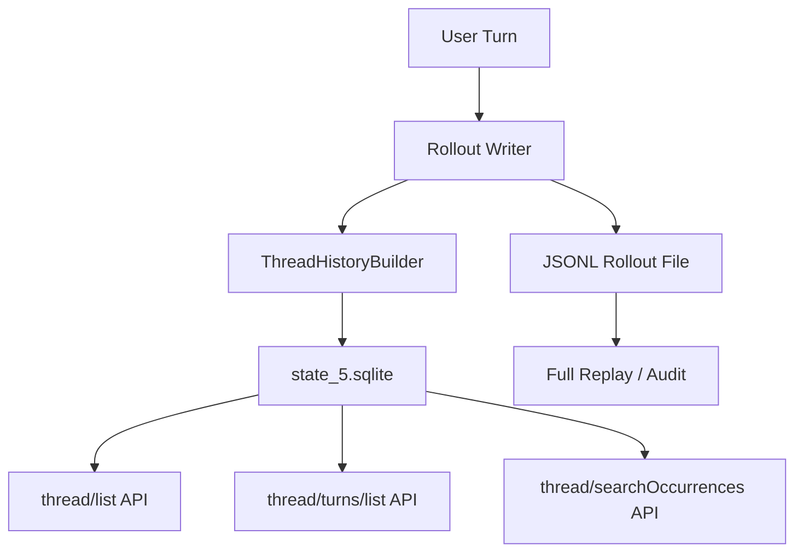
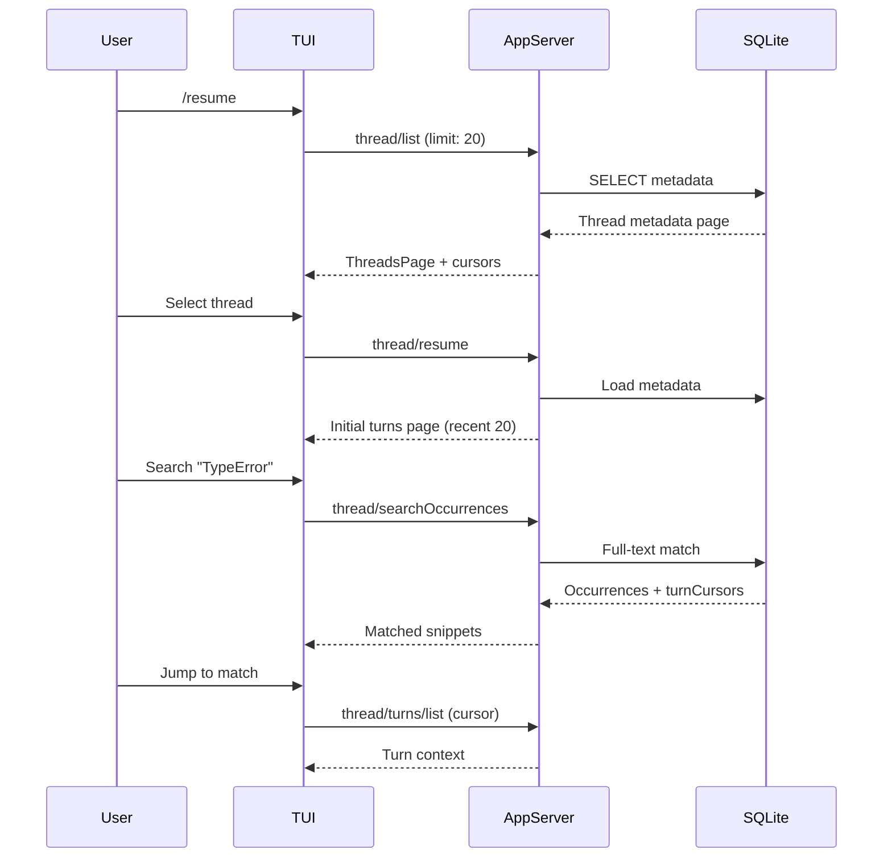

# Paginated Thread History: How Codex CLI v0.145's SQLite-Backed Session Architecture Transforms Resume, Search, and Memory


---

Codex CLI v0.145.0, released on 21 July 2026, shipped the most significant overhaul to session persistence since the original JSONL rollout format[^1]. The headline feature — experimental paginated thread history — replaces the previous model of loading entire conversation transcripts into memory with a cursor-based pagination architecture backed by SQLite. For developers running long-lived agent sessions, multi-day investigations, or fleet-scale automations, this changes the economics of session resume, search, and cross-session memory extraction.

## The Problem: Full-Thread Loading Doesn't Scale

Before v0.145, resuming a session meant deserialising the entire rollout JSONL file into memory. A single intensive debugging session could easily produce a 15–30 MB rollout file containing hundreds of turns. Resuming that session required parsing every event, reconstructing the turn tree, and hydrating the full transcript before the agent could accept new input.

This created three practical problems:

1. **Resume latency** — loading a 500-turn session on a constrained remote host could take several seconds, blocking the TUI.
2. **Memory pressure** — multiple resumed threads in a multi-agent workflow each carried their full history in memory.
3. **Search was linear** — finding a specific code snippet or error message across sessions required scanning raw JSONL files.

## Architecture: The Two-Layer Persistence Model

The paginated thread history introduces a clean separation between the durable event log (JSONL rollout files) and the queryable index (SQLite).



### The JSONL Layer

Rollout files remain the append-only source of truth, stored under `~/.codex/sessions/` in a date-partitioned hierarchy[^2]. Every prompt, model response, tool call, and approval decision is timestamped and persisted. This layer serves audit, replay, and recovery use cases.

### The SQLite Layer

The `state_5.sqlite` database, stored at `CODEX_HOME/state_5.sqlite`, maintains a `threads` table with thread metadata — identifier, title, current working directory, rollout path, archived status, pinned state, and `updated_at` timestamp[^3]. PR #27750 introduced `ThreadHistoryBuilder` APIs that let the app-server efficiently collect incremental thread item and turn changes from rollout events without rebuilding the entire index[^4].

The critical design decision: the SQLite index is a projection of the rollout data, not a replacement. If the database becomes corrupted — a scenario documented in Issues #21750 and #27363 — Codex can rebuild it from the rollout files[^3].

## The Pagination API Surface

The paginated history exposes four app-server JSON-RPC methods, all gated behind `"experimentalApi": true` during connection initialisation[^5].

### `thread/list` — Cursor-Based Thread Browsing

Returns paginated thread metadata with filters for `modelProviders`, `sourceKinds`, `archived`, `isPinned`, `cwd`, and `searchTerm`. Experimental clients can filter by `parentThreadId` (direct children) or `ancestorThreadId` (any-depth descendants), which are mutually exclusive[^2]. Review and Guardian threads are excluded from results.

### `thread/turns/list` — Paging Through Conversation History

The core pagination method. Supports bidirectional cursor navigation with three detail levels:

| View Mode | Contents | Use Case |
|-----------|----------|----------|
| `notLoaded` | Metadata only | Thread listings, dashboards |
| `summary` | Condensed summaries | Activity feeds, quick scanning |
| `full` | Complete payloads with deltas | Detailed replay, audit trails |

```json
{
  "method": "thread/turns/list",
  "params": {
    "threadId": "thread_abc123",
    "limit": 20,
    "itemsView": "summary"
  }
}
```

The response includes `nextCursor` and `backwardsCursor` for bidirectional traversal[^5]. This means the TUI can load only the most recent 20 turns on resume, fetching earlier history on demand as the user scrolls.

### `thread/items/list` — Item-Level Pagination

Provides granular access to individual items within turns. Pass `turnId` to restrict results to a single turn, or omit it to page items across the entire thread[^2]. This is essential for inspecting specific tool call chains without loading surrounding context.

### `thread/searchOccurrences` — In-Thread Text Search

Performs literal, case-insensitive matching across visible user messages (including steering messages) and summary-selected final assistant messages within a single paginated thread — without replaying the rollout[^2]. Results include `snippetMatchRange` with UTF-16 offsets and a `turnCursor` that can be passed directly to `thread/turns/list` to jump to the containing turn.



## Persisted Thread Names

Thread names are now persisted in the SQLite index via `thread/name/set` and are not required to be unique[^2]. Name lookups resolve to the most recently updated thread, which means you can name threads by feature branch or ticket number without worrying about collisions from restarted sessions.

The `/resume` picker now displays these persisted names alongside the working directory and last-updated timestamp, making it practical to maintain dozens of named threads across multiple projects.

## Sub-Agent Thread Support

The `parentThreadId` and `ancestorThreadId` filters enable navigating the thread tree spawned by multi-agent V2 workflows[^2]. When a Sol-tier orchestrator spawns Terra-tier sub-agents, each sub-agent creates its own thread linked to the parent. PR #26662 added server-side filtering by parent, so the TUI can display a hierarchical view of an orchestration run without loading every sub-agent's full history[^6].

This interacts with the multi-agent V2 stabilisation also shipped in v0.145.0, where sub-agent models, reasoning levels, and concurrency became configurable at spawn time[^1].

## Memory Integration

The paginated history feeds directly into the memory extraction pipeline. Codex's memory system extracts observations from completed sessions and injects them as developer instructions at startup[^7]. The key configuration parameters:

```toml
[memories]
generate_memories = true
use_memories = true
disable_on_external_context = true
min_rollout_idle_hours = 2
max_rollout_age_days = 30
max_rollouts_per_startup = 10
max_unused_days = 90
```

With paginated history, the memory consolidation pipeline no longer needs to deserialise entire rollout files to determine whether a session qualifies for extraction. The SQLite metadata — including idle duration, age, and thread status — provides the qualifying filters, and only threads that pass the threshold criteria trigger full rollout parsing for memory generation.

## Corruption Recovery and Migration

The SQLite state database has a documented history of corruption issues across platforms. Issue #21750 reported `state_5.sqlite` "file is not a database" errors wedging startup with no auto-recovery[^3]. Issue #22452 documented drift between `state_5.sqlite` and `session_index.jsonl` on Windows, hiding threads from the UI. Issue #23841 identified WSL environments corrupting migrations.

PR #28671 addressed this by restoring thread recency with a compatible migration history, ensuring that upgrades from earlier schema versions preserve thread ordering[^8]. The recovery strategy is defensive: on startup, Codex detects drift between the SQLite index and existing rollout files, preferring a recoverable visible state when discrepancies exist.

⚠️ The paginated history is gated behind `experimentalApi: true` and the `historyMode: "paginated"` thread creation parameter. Threads created in paginated mode do not support the deprecated `thread/rollback` operation.

## Practical Configuration

To enable paginated thread history in the TUI, ensure you are running v0.145.0 or later and that the experimental API flag is active. The feature is opt-in per thread — existing sessions continue to use the legacy full-load model unless explicitly migrated.

For headless and app-server clients building against the JSON-RPC API, the thread creation call accepts `historyMode: "paginated"` to enable projection-backed durable history:

```json
{
  "method": "thread/start",
  "params": {
    "historyMode": "paginated",
    "cwd": "/home/dev/my-project"
  }
}
```

Thread metadata updates — including `gitInfo` fields and `isPinned` state — are performed via `thread/metadata/update` without requiring the thread to be loaded[^2].

## What This Means for Your Workflow

The paginated thread history shifts Codex CLI's session management from a "load everything" model to a "load what you need" model. For developers maintaining long-running agent sessions across feature branches, the practical benefits are immediate:

- **Resume in milliseconds**, not seconds — the TUI loads recent turns on demand.
- **Search across sessions** without shelling out to `grep` against raw JSONL.
- **Named threads** map naturally to feature branches, tickets, or investigation topics.
- **Sub-agent visibility** provides a hierarchical view of multi-agent orchestration runs.
- **Memory extraction** scales without proportional I/O overhead.

The experimental flag is the obvious caveat. API surface may shift before the feature graduates to stable, and the `thread/rollback` deprecation means paginated threads are forward-only. For production headless services, the recommendation is to adopt the pagination API for new threads whilst keeping legacy threads on the full-load path until the API stabilises.

---

## Citations

[^1]: OpenAI, "Release 0.145.0 — openai/codex," GitHub, 21 July 2026. [https://github.com/openai/codex/releases/tag/rust-v0.145.0](https://github.com/openai/codex/releases/tag/rust-v0.145.0)

[^2]: OpenAI, "codex-rs/app-server/README.md," GitHub (main branch). [https://github.com/openai/codex/blob/main/codex-rs/app-server/README.md](https://github.com/openai/codex/blob/main/codex-rs/app-server/README.md)

[^3]: Various contributors, Issues #21750, #22452, #23979, #27363, openai/codex, GitHub, 2026. [https://github.com/openai/codex/issues/21750](https://github.com/openai/codex/issues/21750)

[^4]: wiltzius-openai, "Add incremental thread history changes," PR #27750, openai/codex, GitHub. [https://github.com/openai/codex/pull/27750](https://github.com/openai/codex/pull/27750)

[^5]: owenlin0, "feat(app-server, threadstore): Thread pagination APIs and ThreadStore contract," PR #21566, openai/codex, GitHub. [https://github.com/openai/codex/pull/21566](https://github.com/openai/codex/pull/21566)

[^6]: btraut-openai, "feat(app-server): filter threads by parent," PR #26662, openai/codex, GitHub. [https://github.com/openai/codex/pull/26662](https://github.com/openai/codex/pull/26662)

[^7]: Daniel Vaughan, "Memory Lifecycle Management: Create, Consolidate, Clean, Delete in Codex CLI," Codex Knowledge Base, 15 April 2026. [https://codex.danielvaughan.com/2026/04/15/memory-lifecycle-management-codex-cli/](https://codex.danielvaughan.com/2026/04/15/memory-lifecycle-management-codex-cli/)

[^8]: nornagon-openai, "Restore thread recency with compatible migration history," PR #28671, openai/codex, GitHub. [https://github.com/openai/codex/pull/28671](https://github.com/openai/codex/pull/28671)
