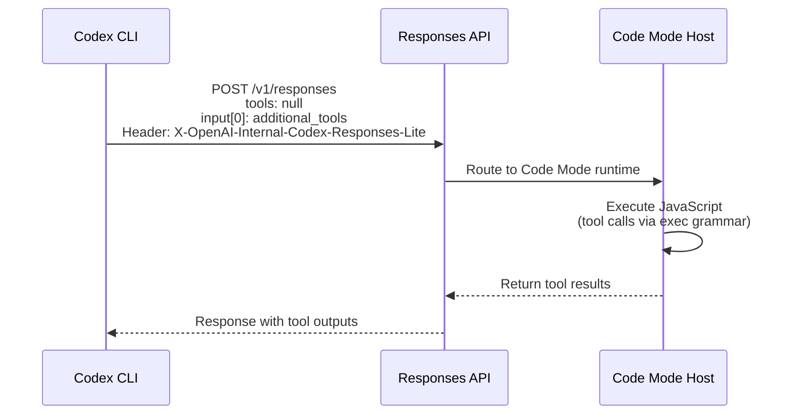
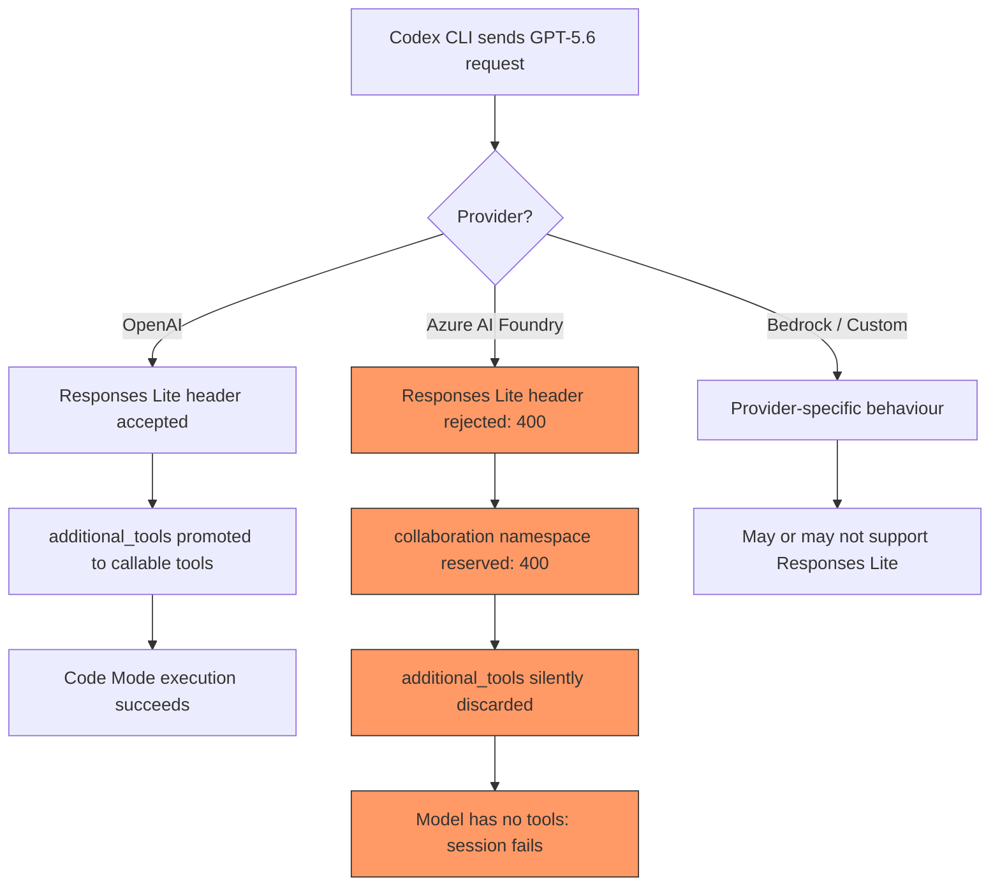

# Responses Lite Explained: How GPT-5.6's Wire Format Reshapes Tool Dispatch in Codex CLI — and Why Azure Users Hit a Wall


---

When OpenAI shipped GPT-5.6 (Sol, Terra, Luna) in late June 2026, the models arrived with a fundamentally different wire protocol for tool execution. Internally called **Responses Lite**, this transport replaces the top-level `tools` array with a compact `additional_tools` input item and routes all code execution through a hosted Code Mode runtime[^1]. The result is faster inference and lower per-turn overhead on OpenAI's own backend — but the architectural change has created a class of hard-to-diagnose failures for anyone routing GPT-5.6 through Azure AI Foundry, Amazon Bedrock, or custom Responses API proxies.

This article dissects the Responses Lite wire format, explains how it interacts with Code Mode and the tool dispatch pipeline, and documents the provider-compatibility issues that surfaced in July 2026 — along with practical workarounds.

## What Responses Lite Actually Changes

### The Pre-5.6 Wire Format

Before GPT-5.6, Codex CLI sent tool declarations in the standard Responses API shape: a top-level `tools` array containing every tool the model could invoke — `exec_command`, `write_file`, `read_file`, MCP tools, and so on[^2]. The model returned `function_call` items; the client executed them and fed results back. Parallel tool calls were supported natively via `multi_tool_use.parallel`[^3].

### The Responses Lite Wire Format

GPT-5.6 models are compiled into the Codex binary with `use_responses_lite: true` in the model catalogue (`codex-rs/models-manager/models.json`)[^4]. When this flag is active, the request shape changes materially:

1. **Top-level `tools` is set to `null`** — no tool schemas appear where previous models expected them.
2. **An `additional_tools` input item** is injected at `input[0]` with `type: "additional_tools"` and `role: "developer"`, carrying the full tool schema array[^5].
3. **An internal header** — `X-OpenAI-Internal-Codex-Responses-Lite` — signals the backend to interpret this format[^5].
4. **The `collaboration` namespace** is added for multi-agent V2 tools (`spawn_agent`, `send_message`, `followup_task`), encrypted by default since v0.144.4[^4][^6].



The rationale is performance: by bundling tool schemas into the input context rather than the top-level protocol frame, the backend can apply different caching and routing strategies, and the model can generate JavaScript that orchestrates multiple tool calls within a single Code Mode turn rather than emitting individual `function_call` items[^3].

## Code Mode: The Execution Layer

Responses Lite is tightly coupled to **Code Mode**, a V8-based JavaScript runtime that replaced the older `multi_tool_use.parallel` mechanism[^3]. When the model needs to call tools, it generates JavaScript code that runs in a sandboxed environment:

```javascript
// Model-generated Code Mode JavaScript
const [files, status] = await Promise.allSettled([
  exec_command({ command: "find src -name '*.ts' -newer package.json" }),
  exec_command({ command: "git status --porcelain" })
]);
```

Since PR #31500 (merged 8 July 2026), Code Mode runs in a **hosted process** by default — a standalone `codex-code-mode-host` binary that provides process isolation from the main Codex runtime[^7]. Users can revert to in-process execution with:

```toml
# ~/.codex/config.toml
[features]
code_mode_host = false
```

The hosted mode is relevant to the Responses Lite story because it creates a two-layer execution boundary: the Code Mode host process executes JavaScript, which in turn calls tools that pass through the ToolOrchestrator's approval and sandbox pipeline[^2].

## The Tool Visibility Bug

Issue #31894 documented the most direct failure mode[^5]: when `use_responses_lite` is active, the tool schemas are relocated into the `additional_tools` input item whilst the top-level `tools` field is set to `null`. On certain API paths — particularly `codex exec` with GPT-5.6 Sol — the backend fails to promote the nested tool declarations into callable tools. The model then reports:

> "I don't have access to shell execution tools in this session."

The fix (now merged) preserves tool schemas in **both locations**: the `additional_tools` input item for backward compatibility and the top-level `tools` array for backends that only inspect the standard position[^5]. Regression tests validate that Responses Lite turns always transmit non-empty top-level tool arrays.

## The Azure Compatibility Crisis

The tool visibility bug was an internal consistency problem. The Azure issues are architectural: Responses Lite is a **Codex-backend-specific optimisation** that non-OpenAI providers were never told to expect[^4].

### Three Sequential Failures

Users running GPT-5.6 Sol through Azure AI Foundry encountered a cascade of errors documented across Issues #31870, #31875, and #31882[^8][^9][^10]:

**1. Responses Lite header rejection**

Azure returns a 400:

```
X-OpenAI-Internal-Codex-Responses-Lite only supports function tools,
custom tools, and client-executed tool search.
```

The header is an internal signal that Azure's Responses API endpoint does not recognise[^8].

**2. Collaboration namespace reservation**

Even after bypassing the header, Codex sends `collaboration` namespace tools for multi-agent V2. Azure rejects these:

```
Namespace 'collaboration' is reserved for encrypted tool use by this model.
```

The `collaboration` namespace is reserved server-side for encrypted multi-agent payloads on OpenAI's own infrastructure[^9].

**3. Additional tools format mismatch**

The `additional_tools` input item has `type: "additional_tools"` — a Codex-specific type that Azure silently discards, leaving the model with no callable tools[^10].



### Root Cause

The `models.json` catalogue is compiled into the Codex binary[^4]. GPT-5.6 model entries unconditionally set:

```json
{
  "slug": "gpt-5.6-sol",
  "use_responses_lite": true,
  "multi_agent_version": "v2"
}
```

These flags apply regardless of which provider is active. The model refresh logic (`endpoint_client.uses_codex_backend()`) returns `false` for Azure and custom providers, preventing them from fetching provider-specific configuration that would override these flags[^10].

## Workarounds and Fixes

### For Azure and Custom Provider Users

As of v0.145.0, the recommended workarounds are:

**1. Pin to a pre-5.6 model**

```toml
# ~/.codex/config.toml
model = "gpt-5.5"
```

GPT-5.5 does not use Responses Lite and works correctly with Azure[^8].

**2. Use a proxy to strip incompatible fields**

Users on Issue #31875 confirmed that intercepting requests with a localhost proxy and removing only the `collaboration` namespace tool restores functionality for shell and filesystem operations[^9].

**3. Wait for the provider-gated fix**

The proposed fix gates provider-specific optimisations on actual provider capabilities using `endpoint_client.uses_codex_backend()` rather than applying them based solely on model slug[^10]. This would:

- Suppress the `X-OpenAI-Internal-Codex-Responses-Lite` header for non-OpenAI providers
- Omit `collaboration` namespace tools when the backend does not support encrypted multi-agent payloads
- Send tool schemas in the standard top-level `tools` position

⚠️ As of 26 July 2026, this fix has not yet been merged into a stable release.

### For Direct OpenAI Users

If you hit the tool visibility issue (#31894) on the direct OpenAI backend, ensure you are on v0.145.0 or later, which includes the dual-position tool schema fix[^5].

## Implications for Multi-Provider Strategies

The Responses Lite saga exposes a broader tension in Codex CLI's architecture: the model catalogue bakes backend-specific optimisations into the binary, but the provider system is designed for multi-cloud flexibility[^4]. Enterprise teams running mixed providers face a choice:

| Strategy | Trade-off |
|---|---|
| Pin GPT-5.5 on Azure, GPT-5.6 on OpenAI | Lose GPT-5.6 capabilities on Azure workloads |
| Use named profiles per provider | Config complexity; must track which models work where |
| Run a proxy to normalise requests | Additional infrastructure; fragile if Codex wire format evolves |
| Wait for provider-gated model metadata | Blocked on upstream fix |

Named profiles offer the cleanest separation:

```toml
# ~/.codex/config.toml

[profiles.azure-safe]
model = "gpt-5.5"
model_provider = "azure"

[profiles.openai-latest]
model = "gpt-5.6-sol"
# Responses Lite works natively on OpenAI backend
```

```bash
# Use the appropriate profile per task
codex --profile azure-safe exec "run the compliance checks"
codex --profile openai-latest exec "refactor the auth module"
```

## The Broader Pattern: Backend-Specific Wire Formats

Responses Lite is not an isolated case. OpenAI has been progressively embedding backend-specific optimisations into the Codex wire protocol:

- **Code Mode** replaced top-level parallel tool calls with JavaScript execution[^3]
- **Encrypted multi-agent payloads** require server-side key exchange that only OpenAI's infrastructure provides[^6]
- **Tool search** with `defer_loading` relies on OpenAI's hosted tool catalogue[^11]

Each optimisation improves performance on OpenAI's backend but widens the compatibility gap with alternative providers. The architectural question is whether the model catalogue should be a **static binary artefact** or a **provider-negotiated capability set**. Issue #31882 explicitly argues for the latter[^10].

For now, the practical advice is straightforward: if you route GPT-5.6 through anything other than OpenAI's direct API, test thoroughly and keep a GPT-5.5 fallback profile configured.

## Citations

[^1]: OpenAI, "Codex changelog — July 21, 2026: Codex CLI 0.145.0," ChatGPT Learn, 2026. [https://learn.chatgpt.com/docs/changelog](https://learn.chatgpt.com/docs/changelog)

[^2]: DeepWiki, "Architecture Overview — openai/codex," 2026. [https://deepwiki.com/openai/codex/1.3-architecture-overview](https://deepwiki.com/openai/codex/1.3-architecture-overview)

[^3]: GitHub Issue #35050, "GPT-5.6 serialising independent Code Mode tool calls," openai/codex, July 2026. [https://github.com/openai/codex/issues/35050](https://github.com/openai/codex/issues/35050)

[^4]: GitHub Issue #31882, "gpt-5.6-sol/terra/luna hardcode use_responses_lite / multi_agent_version, causing 400s on Azure," openai/codex, July 2026. [https://github.com/openai/codex/issues/31882](https://github.com/openai/codex/issues/31882)

[^5]: GitHub Issue #31894, "gpt-5.6 Responses Lite turns do not expose exec/code-mode tools in codex exec," openai/codex, July 2026. [https://github.com/openai/codex/issues/31894](https://github.com/openai/codex/issues/31894)

[^6]: OpenAI, "Codex CLI 0.144.4 — mandatory encrypted multi-agent payloads for Sol/Terra," Codex changelog, July 2026. [https://learn.chatgpt.com/docs/changelog](https://learn.chatgpt.com/docs/changelog)

[^7]: GitHub PR #31500, "code-mode: move to hosted mode by default," openai/codex, July 2026. [https://github.com/openai/codex/pull/31500](https://github.com/openai/codex/pull/31500)

[^8]: GitHub Issue #31870, "Codex with GPT-5.6-Sol through Azure fails every turn with X-OpenAI-Internal-Codex-Responses-Lite," openai/codex, July 2026. [https://github.com/openai/codex/issues/31870](https://github.com/openai/codex/issues/31870)

[^9]: GitHub Issue #31875, "Codex CLI with Azure OpenAI gpt-5.6-sol fails due to Codex-specific tools / collaboration namespace," openai/codex, July 2026. [https://github.com/openai/codex/issues/31875](https://github.com/openai/codex/issues/31875)

[^10]: GitHub Issue #31882, "Expected fix: gate provider-specific optimisations on uses_codex_backend()," openai/codex, July 2026. [https://github.com/openai/codex/issues/31882](https://github.com/openai/codex/issues/31882)

[^11]: PPCBasic, "Codex CLI v0.145.0 changelog," July 2026. [https://ppcbasic.com/changelog/codex/0.145.0/](https://ppcbasic.com/changelog/codex/0.145.0/)
