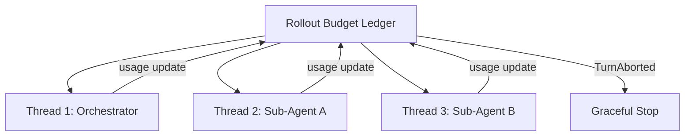
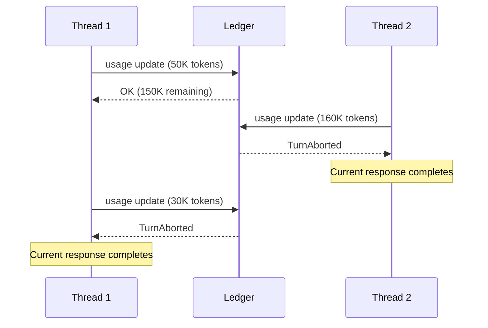
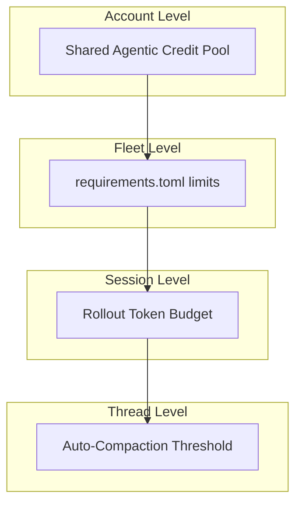

# Rollout Token Budgets: How Codex CLI's Session-Level Cost Control Finally Stops Runaway Agent Spend


---

Every senior engineer who has left a Codex CLI session running overnight knows the dread of checking usage the next morning. A single agentic rollout — especially one that spawns Multi-Agent V2 sub-agents — can burn through thousands of tokens per minute with no built-in ceiling. Until now.

Codex CLI's **rollout token budget** feature, landed across PRs #28746, #28494, #28707, and #29423 between June and July 2026 [^1][^2][^3][^4], introduces a shared token ledger that tracks weighted usage across every thread in a rollout, issues configurable reminders as the budget depletes, and gracefully aborts turns when the ceiling is reached. It is the first native mechanism that enforces a hard cost boundary at the session level — without killing threads mid-operation.

## The Problem: Unbounded Agentic Spend

Before rollout budgets, Codex CLI's cost controls operated at different granularities but left a critical gap:

| Control | Scope | Limitation |
|---------|-------|------------|
| `model_auto_compact_token_limit` | Per-thread | Manages context window, not total spend [^5] |
| Named profiles with model routing | Per-task | Requires manual discipline to select the right profile |
| Shared agentic credit pool | Per-account | Operates at subscription tier level, not per-session [^6] |
| `requirements.toml` model restrictions | Per-fleet | Prevents model selection, but cannot cap token volume |

None of these answer the question: *how do I cap what a single rollout costs?*

Multi-Agent V2 sessions compound the problem. A Sol-class orchestrator spawning Terra or Luna sub-agents draws from the same shared credit pool [^6], and each sub-agent's consumption is invisible to the others. Without a shared ledger, a single ambitious sub-agent can exhaust the entire session's practical budget before its siblings even begin meaningful work.

## Architecture: The Shared Ledger

The rollout budget introduces a **shared `RolloutBudgetState` ledger** that lives in the `AgentControl` structure — the per-rollout coordination point that already manages thread lifecycle [^2].



Every time a thread completes an API response (`response.completed()`), the system calculates weighted token consumption from the response's usage data, applies configured sampling and prefill weights, and deducts from `weighted_tokens_used` in the shared ledger [^2]. Sub-agent usage draws from the same pool, ensuring consistent enforcement across the session hierarchy [^3].

### Weighted Token Accounting

Not all tokens cost the same. The budget system distinguishes between **sampling tokens** (model-generated output) and **prefill tokens** (cached or prompted input), applying separate multipliers:

```toml
[features.rollout_budget]
enabled = true
limit_tokens = 500000
sampling_token_weight = 1.0
prefill_token_weight = 0.1
```

Setting `prefill_token_weight = 0.1` means a 100K-token prefill costs only 10K against the budget — reflecting that prefill tokens are typically cheaper than sampling tokens in OpenAI's pricing [^1]. This prevents large context windows from prematurely exhausting the budget on input alone.

## Configuration Reference

The full configuration lives under `[features.rollout_budget]` in `config.toml` [^7]:

| Key | Type | Default | Description |
|-----|------|---------|-------------|
| `enabled` | boolean | `false` | Activates rollout budget tracking |
| `limit_tokens` | integer | Required when enabled | Total weighted token ceiling |
| `sampling_token_weight` | number | `1.0` | Multiplier for model-generated tokens |
| `prefill_token_weight` | number | `1.0` | Multiplier for input/cached tokens |
| `reminder_at_remaining_tokens` | integer array | 10% intervals | Remaining-token thresholds that trigger warnings |

### Reminder Thresholds

The reminder system evolved from a simple interval (`reminder_interval_tokens`) to an explicit threshold array [^4]:

```toml
[features.rollout_budget]
enabled = true
limit_tokens = 200000
reminder_at_remaining_tokens = [65536, 32768, 16384, 8192, 4096, 2048, 1024, 512]
```

Each value represents a remaining-token boundary. When weighted consumption drops below a threshold, the system inserts a developer message into the thread context:

> *You have weighted 16,384 tokens left in the shared session token budget.*

Key behaviours:

- The **first request** in each thread receives the current remainder immediately [^2]
- Subsequent reminders fire only when a new threshold is crossed — not on every request
- Multiple crossed thresholds in a single turn produce **one reminder** with the latest balance
- Post-compaction reminders append after the compaction summary, so the model sees the budget state in its refreshed context [^2]

## Enforcement: Soft Boundaries, Clean Exits

When the ledger is exhausted, enforcement propagates through the existing `CodexErr::TurnAborted` pathway [^3]. This is deliberately a **soft boundary**:

1. There is **no cross-thread `Op::Interrupt` fanout** — in-flight threads finish their current API response
2. Every thread aborts at its **next usage-accounting boundary** (the next `response.completed()` call)
3. Compaction operations abort cleanly without retrying or emitting generic errors

This design prevents the most dangerous failure mode: a hard kill mid-operation that leaves half-applied patches, uncommitted state, or corrupted working trees. The active turn completes gracefully, then the session stops [^3].



## Practical Configurations

### Conservative Solo Development

For individual work where you want a safety net without aggressive limits:

```toml
[features.rollout_budget]
enabled = true
limit_tokens = 300000
sampling_token_weight = 1.0
prefill_token_weight = 0.2
reminder_at_remaining_tokens = [50000, 25000, 10000, 5000]
```

This gives roughly 300K weighted tokens per session — enough for a substantial refactoring task with Sol, but will stop before an accidentally recursive agent loop burns through your daily credit allocation.

### Multi-Agent Orchestration Guard

For sessions using Multi-Agent V2 with sub-agent spawning, tighter control is essential:

```toml
[features.rollout_budget]
enabled = true
limit_tokens = 150000
sampling_token_weight = 1.0
prefill_token_weight = 0.1
reminder_at_remaining_tokens = [30000, 15000, 7500, 3000, 1000]
```

The lower `prefill_token_weight` accounts for the heavy context inheritance that sub-agents receive from their orchestrator. The tighter reminder schedule ensures the orchestrating model sees budget pressure early enough to prioritise remaining work.

### Fleet Enforcement via requirements.toml

Administrators can combine rollout budgets with `requirements.toml` to enforce organisation-wide ceilings [^8]:

```toml
# requirements.toml (admin-controlled, immutable by users)
[features.rollout_budget]
enabled = true
limit_tokens = 200000
```

When `requirements.toml` specifies rollout budget parameters, users cannot override the ceiling in their personal `config.toml` — the resolver applies the stricter constraint [^8]. This complements existing `requirements.toml` controls for model restrictions and sandbox enforcement.

## Interaction with Existing Cost Controls

Rollout budgets sit alongside, not above, existing mechanisms:

- **Auto-compaction** fires independently at the `model_auto_compact_token_limit` threshold. Compaction token usage charges against the rollout budget [^2], so aggressive compaction actually *accelerates* budget consumption — a subtle interaction worth monitoring.
- **Named profiles** route tasks to appropriate models. A profile that selects Luna (25 credits/M tokens input) [^6] stretches the same rollout budget significantly further than one using Sol (125 credits/M tokens input).
- **The shared agentic credit pool** operates at the account level. Rollout budgets provide per-session granularity within that broader allocation.



## Caveats and Limitations

The rollout budget feature is still maturing. Several points warrant attention:

- **Feature flag gated**: The feature defaults to `enabled = false` and is under active development [^7]. Expect configuration surface changes.
- **No retroactive accounting**: Budget tracking begins when the rollout starts. Historical usage from previous sessions does not carry forward.
- **Compaction tax**: Auto-compaction responses consume budget tokens. In long sessions with aggressive compaction settings, a meaningful fraction of the budget goes to summarisation rather than productive work.
- **No per-thread sub-budgets**: All threads share a single ledger. There is no mechanism to allocate a fraction of the budget to a specific sub-agent — the orchestrator must manage priorities through its own judgement. **This is an area where future granularity would significantly improve multi-agent cost predictability.**

## What This Means for Your Workflow

Rollout token budgets transform Codex CLI from a tool that requires external cost monitoring into one that self-limits. For teams running Codex at scale — particularly those using Multi-Agent V2 orchestration or overnight batch workflows — this is the difference between hoping your agents behave and knowing they will stop.

The practical recommendation: start with a generous budget, monitor the reminder thresholds to understand your typical session consumption, then tighten. The soft-boundary design means you will not lose work when the budget hits — the worst case is a session that stops one turn earlier than you wanted.

---

## Citations

[^1]: GitHub PR #28746 — `[codex] add rollout token budget configuration (1/N)` by rka-oai, merged June 2026. [https://github.com/openai/codex/pull/28746](https://github.com/openai/codex/pull/28746)

[^2]: GitHub PR #28494 — `[codex] rollout budget implementation (2/N)` by rka-oai, merged June 2026. [https://github.com/openai/codex/pull/28494](https://github.com/openai/codex/pull/28494)

[^3]: GitHub PR #28707 — `[codex] abort turns when rollout budgets expire (token budget 3/3)` by rka-oai, merged June 19, 2026. [https://github.com/openai/codex/pull/28707](https://github.com/openai/codex/pull/28707)

[^4]: GitHub PR #29423 — `[codex] configure rollout budget reminder thresholds` by rka-oai. [https://github.com/openai/codex/pull/29423](https://github.com/openai/codex/pull/29423)

[^5]: OpenAI Codex CLI Configuration Reference — `model_auto_compact_token_limit` documentation. [https://learn.chatgpt.com/docs/config-file/config-reference](https://learn.chatgpt.com/docs/config-file/config-reference)

[^6]: OpenAI token credit pricing and shared agentic credit pool — Plus, Pro \$100, Pro \$200 tier allocations. [https://learn.chatgpt.com/docs/changelog](https://learn.chatgpt.com/docs/changelog)

[^7]: OpenAI Codex CLI Configuration Reference — `features.rollout_budget` section. [https://learn.chatgpt.com/docs/config-file/config-reference](https://learn.chatgpt.com/docs/config-file/config-reference)

[^8]: OpenAI Codex CLI Enterprise Managed Configuration — `requirements.toml` enforcement documentation. [https://learn.chatgpt.com/docs/config-file/config-reference](https://learn.chatgpt.com/docs/config-file/config-reference)
