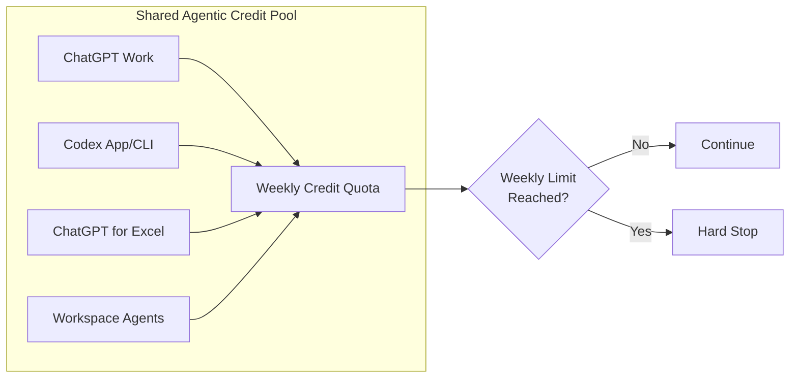
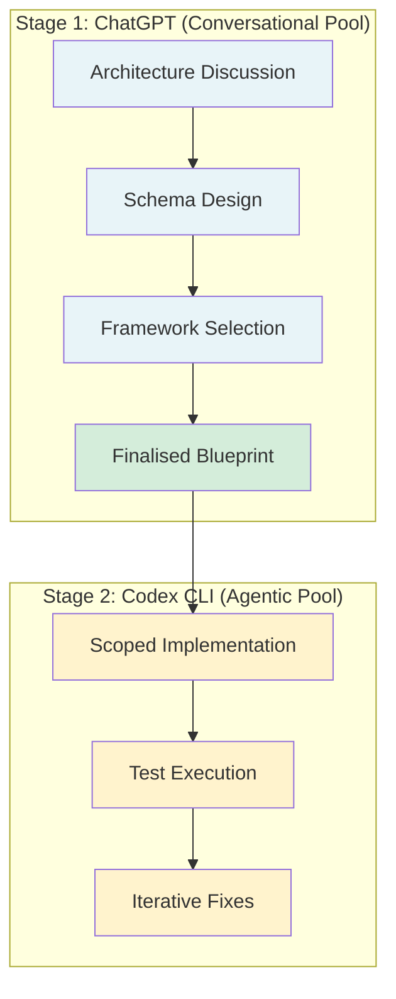

# The Shared Agentic Credit Pool: How OpenAI's Quota Architecture Silently Drains Your Codex CLI Budget — and What the 5-Hour Limit Removal Actually Changes


---

On 12 July 2026, Tibo Sottiaux announced three simultaneous changes to Codex usage limits: the rolling 5-hour window was temporarily removed, every subscriber's weekly quota was reset to 100%, and GPT-5.6 Sol efficiency improvements were rolling out [^1]. The community celebrated. What most developers missed is that the structural problem — a single shared credit pool feeding ChatGPT, Work, Codex, ChatGPT for Excel, and Workspace Agents — remained entirely unchanged [^2].

This article dissects the quota architecture as it stands in late July 2026, maps it to the Codex CLI configuration surface, and provides a defensive configuration playbook for developers who need predictable agent capacity.

## The Shared Pool Problem

ChatGPT Work and Codex draw from the same metered usage bucket [^2]. A product manager drafting a strategy document in Work and a developer running a multi-file refactor in Codex are competing for the same credits. When Workspace Agents became credit-priced on 6 July 2026, that pool expanded further [^3].

The consequences are not theoretical. GitHub Issue #30918 documents a Plus subscriber whose quota jumped from 9% to 70% consumed with no visible session activity, then reached 100% in under six minutes — a drain rate of approximately 5.7% per minute [^4]. The reporter questioned whether the problem involved "incorrect usage accounting, hidden/background usage attribution, or a serious regression in per-turn weighting." OpenAI acknowledged a usage-drain fix on 30 June but the behaviour persisted into July.



The UX does not make this pooling obvious across surfaces [^2]. A developer working exclusively in the CLI has no visibility into whether a colleague's Work session has already consumed a substantial portion of the shared allocation.

## What the 5-Hour Removal Actually Changes

Before 12 July, the quota system enforced a dual-layer constraint: a rolling 5-hour window and a separate weekly cap [^1]. Developers could exhaust the 5-hour bucket while their weekly quota remained largely untouched, creating frustrating mid-session hard stops.

The temporary removal collapses this to a single constraint: the weekly cap becomes the sole governing limit [^5]. For CLI-heavy developers who burned through rolling windows during deep coding sessions, this is a genuine improvement — sessions can now run longer without arbitrary interruption.

However, two critical caveats apply:

1. **The removal is explicitly temporary.** No reinstatement date has been published [^1].
2. **The weekly cap itself has not increased.** Removing the 5-hour window simply allows developers to consume their weekly allocation faster, not to consume more of it.

## Quota Numbers by Tier and Model

Credit consumption varies dramatically by model family. The following table reflects the subscription-tier limits as of July 2026 [^6]:

| Plan | GPT-5.6 Sol (5h) | GPT-5.6 Terra (5h) | GPT-5.6 Luna (5h) | Multiplier |
|------|-------------------|---------------------|--------------------|------------|
| Plus (\$20) | 15–90 | 20–110 | 50–280 | 1× |
| Pro \$100 | 75–450 | 100–550 | 250–1,400 | 5× |
| Pro \$200 | 300–1,800 | 400–2,200 | 1,000–5,600 | 20× |
| Business | Plus-equivalent | Plus-equivalent | Plus-equivalent | 1× |

⚠️ With the 5-hour window temporarily removed, these ranges now represent approximate consumption capacity within a rolling period rather than hard boundaries. The weekly cap remains the binding constraint.

Token-based credit pricing reveals the cost asymmetry between models [^6]:

| Model | Input (credits/M tokens) | Output (credits/M tokens) |
|-------|--------------------------|---------------------------|
| GPT-5.6 Sol | 125 | 750 |
| GPT-5.6 Terra | 62.50 | 375 |
| GPT-5.6 Luna | 25 | 150 |

Sol consumes 5× the credits of Luna per million tokens. For routine tasks — file organisation, test scaffolding, documentation updates — routing to Luna or Terra rather than Sol is the single highest-impact budget defence available.

## Defensive Configuration for CLI Developers

### Named Profiles for Tier Routing

Since Codex CLI 0.134.0, profiles live in separate files rather than `[profiles.name]` tables [^7]. Create task-appropriate profiles that route to cheaper models by default:

```toml
# ~/.codex/scout.config.toml
# Lightweight tasks: file ops, docs, simple refactors
model = "gpt-5.6-luna"
model_reasoning_effort = "low"
```

```toml
# ~/.codex/deep.config.toml
# Complex multi-file refactors, architecture decisions
model = "gpt-5.6-sol"
model_reasoning_effort = "high"
```

```toml
# ~/.codex/ci.config.toml
# CI/CD pipelines: predictable, low-cost
model = "gpt-5.6-terra"
model_reasoning_effort = "medium"
```

Invoke with `--profile`:

```bash
# Routine task — Luna at low effort
codex --profile scout "organise these test files by module"

# Deep refactor — Sol at high effort
codex --profile deep "refactor the payment module to use the new billing API"

# CI pipeline — Terra at medium effort
codex exec --profile ci "run the full test suite and fix failures"
```

### Auto-Compaction as Budget Guard

The 272K context window pricing threshold means requests exceeding 272,000 tokens incur a 2× input pricing multiplier [^8]. Set `model_auto_compact_token_limit` below this boundary to prevent sessions from silently crossing it:

```toml
# ~/.codex/config.toml
model_auto_compact_token_limit = 250000
```

This forces compaction before the session reaches the pricing threshold, keeping per-request costs within the standard band.

### Reasoning Effort as a Quota Lever

Reasoning effort directly affects token consumption and therefore credit drain. The available levels — `minimal`, `low`, `medium`, `high`, `xhigh` — map to progressively more expensive inference [^7]. For the vast majority of CLI tasks, `medium` provides an adequate quality-to-cost ratio:

```toml
# ~/.codex/config.toml
model_reasoning_effort = "medium"
```

Reserve `high` and `xhigh` for security reviews, architectural decisions, and tasks where reasoning depth genuinely matters. A profile-based approach makes this switching friction-free.

## Banked Resets: The Emergency Valve

Codex app 26.609 (June 2026) introduced rate-limit reset banking for Plus, Pro, and Business subscribers [^9]. A banked reset is essentially a recovery coupon — when you hit a rate limit mid-session, you can deploy a banked reset to unblock immediately rather than waiting for the natural reset or switching to API-key billing.

Key constraints:

- Banked resets operate through the Codex app's usage menu, not via a CLI command [^9].
- Each reset expires 30 days after grant — no carryover [^2].
- Resets do not increase total quota; they give control over timing [^2].
- One free reset is provided as starting allocation; additional resets may be earned through referral campaigns [^9].

For CLI developers, the practical implication is clear: when `codex exec` hits a rate limit mid-pipeline, a banked reset can unblock you without switching to API-key billing. But this is a tactical measure, not a strategic defence.

## The Two-Stage Workflow

A practical pattern for conserving Codex credits is the two-stage approach [^10]:

1. **Stage 1 (ChatGPT):** Complete architectural planning, schema design, and framework comparison in the standard chat interface. This draws from the conversational quota pool — separate from the agentic pool.
2. **Stage 2 (Codex CLI):** Execute implementation with a finalized blueprint. This draws from the agentic pool but with a clear scope, reducing wasted exploratory tokens.

The embedded chat panel inside the Codex tab retains standard ChatGPT billing rules [^10], so lightweight conversations within Codex do not drain the agentic budget.



## GPT-5.6 Sol Efficiency Improvements

OpenAI's announced efficiency improvements for Sol report approximately 10% less quota consumption for equivalent tasks [^9], with some sources citing up to 54% token efficiency gains for standard mode [^2]. The discrepancy likely reflects the difference between standard and high-compute modes — the latter consumes significantly more credits and does not benefit equally from the efficiency rollout.

⚠️ These figures have not been independently verified by the community. Issue #34225 documents a 3.3× latency regression during 12–19 July 2026, suggesting that the efficiency improvements may have introduced performance trade-offs [^11].

## What Happens When Limits Return

The 5-hour window will almost certainly be reinstated — OpenAI has been explicit that the removal is temporary [^1]. When it returns, developers who have optimised their workflows around unlimited session length will face a sharp adjustment.

The defensive configuration described above — named profiles, auto-compaction, reasoning effort tuning — provides durable protection regardless of whether the 5-hour window is active. The shared credit pool problem, however, requires an architectural solution from OpenAI: either separate quotas for Work and Codex, or at minimum, per-surface visibility into credit consumption.

Until then, the only reliable defence is treating your weekly allocation as a budget and routing tasks to the cheapest model that can handle them competently.

## Citations

[^1]: Tibo Sottiaux, OpenAI Codex announcement, 12 July 2026. [GitHub Issue #34035](https://github.com/openai/codex/issues/34035)
[^2]: ChatForest, "OpenAI Pulls the 5-Hour Wall: Codex Limit Temporarily Removed, But the Shared Agentic Credit Pool Problem Remains," July 2026. [ChatForest](https://chatforest.com/builders-log/openai-codex-5-hour-limit-removed-shared-agentic-credit-pool-builder-guide/)
[^3]: Daniel Vaughan, "Workspace Agents Credit Pricing Starts July 6: A Codex CLI Practitioner's Budget Preparation Guide," Codex Knowledge Base, June 2026. [Codex KB](https://codex.danielvaughan.com/2026/06/14/workspace-agents-credit-pricing-july-2026-codex-cli-budget-preparation-cost-optimisation/)
[^4]: GitHub Issue #30918, "Usage limits draining abnormally fast on Plus: 70% to 100% in about 6 minutes on July 2, 2026." [GitHub](https://github.com/openai/codex/issues/30918)
[^5]: ExplainX, "ChatGPT 5-Hour Limit Removed — July 2026." [ExplainX](https://explainx.ai/blog/chatgpt-codex-5-hour-limit-removed-weekly-reset-july-2026)
[^6]: SimpleMetrics, "ChatGPT Codex Limits 2026: GPT-5.6, Plus, Pro 5x/20x." [SimpleMetrics](https://simplemetrics.xyz/chatgpt-codex-limits-2026/)
[^7]: OpenAI, "Advanced Configuration," ChatGPT Learn / Codex CLI docs. [OpenAI Docs](https://developers.openai.com/codex/config-advanced)
[^8]: Daniel Vaughan, "The 272K Tripwire: How GPT-5.6's Context Window Cap Silently Doubles Your Codex CLI Bill," Codex Knowledge Base, July 2026. [Codex KB](https://codex.danielvaughan.com/2026/07/25/codex-cli-gpt-5-6-272k-context-window-pricing-threshold-auto-compaction-cost-defence/)
[^9]: KnightLi, "Is the 5-hour limit of Codex temporarily cancelled: shared quota, Banked Reset and usage view," July 2026. [KnightLi](https://knightli.com/en/2026/07/15/codex-five-hour-limit-banked-reset-usage-guide/)
[^10]: TreeRouter, "ChatGPT vs Codex Quotas: Stop Wasting Agent Credits." [TreeRouter](https://api.treerouter.ai/en/blog/chatgpt-codex-quota-workflow-guide)
[^11]: GitHub Issue #34225, "Starting from 2026-July-12, Codex performance dropped 3X." [GitHub](https://github.com/openai/codex/issues/34225)
