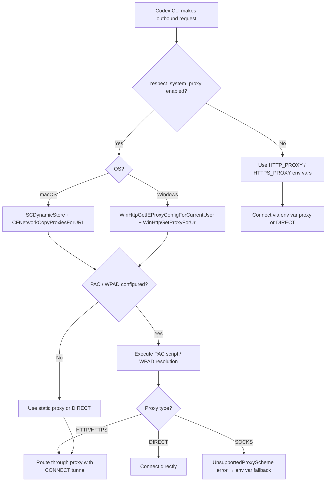
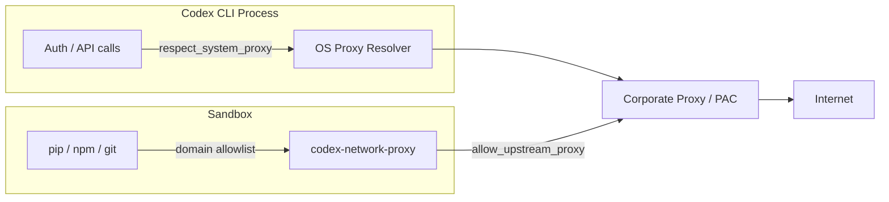

# System Proxy, PAC, and WPAD: How Codex CLI Finally Speaks Your Corporate Network's Language


---

If you have ever tried to run Codex CLI on a locked-down corporate laptop — the kind where every packet traverses a TLS-inspecting proxy, a PAC file decides which traffic goes where, and WPAD auto-discovers the proxy nobody remembers configuring — you know the pain. Environment variables like `HTTP_PROXY` and `HTTPS_PROXY` get you part of the way, but they are a blunt instrument: they ignore the per-URL routing logic your network team has encoded in PAC scripts, they miss WPAD entirely, and they fall over the moment the OS applies different proxy rules for different destinations.

Codex CLI v0.143.0, released 8 July 2026, closes this gap. Two merged pull requests — PR #26708 for Windows and PR #26709 for macOS — add native system proxy resolution that honours PAC scripts, WPAD auto-discovery, static proxy configurations, and bypass rules, all through the same OS APIs your browser already uses [^1][^2]. A third PR (#31335) extended coverage from authentication traffic to the Responses API itself, meaning the model's reasoning calls now route correctly through corporate infrastructure [^3].

## Why Environment Variables Were Never Enough

Corporate networks rarely run a single flat proxy. A typical Fortune 500 deployment might use:

- A PAC file that routes internal traffic directly, sends `*.openai.com` through a dedicated AI gateway, and pushes everything else through a general-purpose Zscaler or Palo Alto appliance.
- WPAD auto-discovery so laptops pick up proxy settings from DHCP or DNS without manual configuration.
- Bypass rules that exempt `localhost`, the corporate intranet CIDR range, and specific internal services.

Environment variables (`HTTP_PROXY`, `HTTPS_PROXY`, `NO_PROXY`) cannot express this routing logic. They offer a single proxy URL and a coarse bypass list. When Codex CLI relied solely on these, enterprises faced two unpleasant choices: flatten their proxy topology into a single URL (losing per-URL routing), or wrap Codex in a helper script that approximated PAC logic in shell — fragile, unmaintainable, and invisible to the tool itself.

## How the New System Proxy Resolution Works

The implementation is OS-native, using the same APIs that browsers and system services already trust.

### macOS: SystemConfiguration and CFNetwork

On macOS, the resolver reads proxy settings from `SCDynamicStore` — the same dynamic configuration store that `System Settings > Network` writes to — and resolves each target URL with `CFNetworkCopyProxiesForURL` [^2]. This means:

- **MDM-pushed profiles** that configure proxies via `.mobileconfig` are picked up automatically.
- **PAC scripts** (both remote URLs and inline JavaScript) are executed through a bounded run loop with a five-second timeout, preventing indefinite hangs if the PAC server is unreachable [^2].
- **HTTPS proxies** are handled via HTTP CONNECT tunnelling when CFNetwork returns an HTTPS proxy entry.
- **IPv6 hosts** get proper bracket notation in the proxy URL.

The fallback chain is: system proxy resolution → environment variables → `DIRECT`.

### Windows: WinHTTP APIs

On Windows, the resolver calls `WinHttpGetIEProxyConfigForCurrentUser` to read the current user's proxy settings, then `WinHttpGetProxyForUrl` to process PAC and WPAD results [^1]. The resolution order is:

1. Explicit PAC URL from Windows proxy settings
2. WPAD auto-discovery (if OS-enabled)
3. Static proxy configuration and bypass rules
4. Environment variable fallback

Windows bypass rules support `<local>` for local network detection, host and suffix matching, wildcards, and port-qualified entries — all parsed natively rather than reimplemented in application code [^1].

A notable privacy detail: URL-specific PAC decisions are cached using SHA-256 hashing, so raw URLs and query strings never persist in memory beyond what is strictly necessary [^1].



## Configuration

The feature is controlled by a single flag and is **disabled by default**, preserving existing behaviour for users who do not need it [^1][^2]:

```toml
# ~/.codex/config.toml

# Enable OS-native proxy resolution for auth + Responses API traffic
respect_system_proxy = true
```

When enabled, this setting applies to:

- **Authentication traffic** — OAuth device-code flows and token refresh requests route through the system proxy, solving the long-standing issue documented in GitHub Issue #6849 where OAuth login failed behind corporate proxies with custom CA certificates [^4].
- **Responses API traffic** — Model inference calls (added in PR #31335) also honour the system proxy, so the reasoning pathway is no longer a special case [^3].

### Interaction with the Managed Network Proxy

Codex CLI's managed network proxy (`codex-network-proxy`) and the system proxy feature operate at different layers and can be combined:

```toml
# System proxy for auth + API traffic
respect_system_proxy = true

# Managed proxy for sandboxed subprocess traffic
[features.network_proxy]
enabled = true
allow_upstream_proxy = true   # Chain managed proxy → corporate proxy

[features.network_proxy.domains]
"pypi.org"             = "allow"
"registry.npmjs.org"   = "allow"
"github.com"           = "allow"
```

When `allow_upstream_proxy = true`, the managed proxy respects `HTTP_PROXY` / `HTTPS_PROXY` / `ALL_PROXY` environment variables for upstream requests, including CONNECT tunnels [^5]. This creates a two-tier proxy architecture:

1. **Tier 1 (system proxy):** Codex CLI's own auth and API requests use OS-native resolution (PAC/WPAD).
2. **Tier 2 (managed proxy):** Sandboxed subprocess network traffic (pip install, npm install, git clone) routes through `codex-network-proxy`, which itself chains to your corporate proxy.



## Enterprise Deployment: Putting It Together

For a corporate macOS fleet managed via Jamf or Kandji, the deployment recipe is:

1. **Push proxy configuration** via an MDM profile (`.mobileconfig`) — this populates `SCDynamicStore` and is picked up by `CFNetworkCopyProxiesForURL` automatically.
2. **Push custom CA certificates** via the same MDM profile so TLS inspection does not break certificate validation. As of v0.129.0, Codex CLI's unified custom-CA subsystem covers every outbound connection [^6].
3. **Set `respect_system_proxy = true`** in the organisation's `requirements.toml` to enforce it fleet-wide:

```toml
# requirements.toml (pushed via MDM or config management)
respect_system_proxy = true

[permissions.default.network]
mode = "limited"
allow_upstream_proxy = true
```

4. **Domain-allowlist** the managed proxy to restrict sandboxed traffic to approved registries and repositories.

For Windows fleets managed via Intune or Group Policy, the equivalent is: push proxy settings via GPO (which WinHTTP reads natively), deploy the internal root CA to the machine certificate store, and enforce `respect_system_proxy = true` via `requirements.toml`.

## Limitations and Caveats

The current implementation has two documented constraints worth noting:

- **SOCKS proxies are not supported** through the system proxy path. If CFNetwork (macOS) or WinHTTP (Windows) returns a SOCKS entry, the resolver returns an `UnsupportedProxyScheme` error and falls back to environment variables [^1][^2]. This is intentional — SOCKS support exists separately via `socks_url` in the managed proxy configuration.
- **Only the first viable proxy candidate is used.** PAC scripts can return an ordered list of proxies (e.g., `PROXY a:8080; PROXY b:8080; DIRECT`), but the current implementation takes the first entry and does not fail over to subsequent alternatives if the connection fails [^2]. This matches the Windows behaviour and is flagged as a known limitation.

## Why This Matters

With Codex CLI reaching 5 million weekly users as of July 2026 [^7] and becoming generally available on 9 July 2026, enterprise adoption is no longer aspirational — it is happening. The system proxy feature removes what was arguably the single largest deployment friction for corporate networks: the mismatch between how the OS routes traffic and how Codex CLI routed its own. By delegating proxy resolution to the OS, Codex CLI inherits decades of corporate network engineering — PAC scripts, WPAD auto-discovery, bypass rules, TLS inspection chains — without reimplementing any of it.

For teams still using `export HTTPS_PROXY=...` in their shell profiles, that continues to work. But if your network team has spent years encoding routing policy in PAC files and MDM profiles, `respect_system_proxy = true` is the one line that makes Codex CLI a first-class citizen on your corporate network.

## Citations

[^1]: canvrno-oai, "PAC 3 - Add Windows system proxy resolver," GitHub PR #26708, openai/codex, merged July 2026. [https://github.com/openai/codex/pull/26708](https://github.com/openai/codex/pull/26708)

[^2]: canvrno-oai, "PAC 4 - Add macOS system proxy resolver," GitHub PR #26709, openai/codex, merged July 2026. [https://github.com/openai/codex/pull/26709](https://github.com/openai/codex/pull/26709)

[^3]: "core: route Responses API through system proxy," GitHub PR #31335, openai/codex, merged July 2026. [https://github.com/openai/codex/pull/31335](https://github.com/openai/codex/pull/31335)

[^4]: "OAuth Login Fails Behind Corporate Proxy with Custom CA Certificates," GitHub Issue #6849, openai/codex. [https://github.com/openai/codex/issues/6849](https://github.com/openai/codex/issues/6849)

[^5]: "Support configuring outbound HTTP proxy via http_proxy in config.toml," GitHub Issue #6060, openai/codex. [https://github.com/openai/codex/issues/6060](https://github.com/openai/codex/issues/6060)

[^6]: "Codex CLI Behind TLS-Inspecting Proxies: Custom CA Certificates for Enterprise Networks," Codex Knowledge Base, 8 May 2026. [https://codex.danielvaughan.com/2026/05/08/codex-cli-tls-inspecting-proxies-custom-ca-certificates-enterprise/](https://codex.danielvaughan.com/2026/05/08/codex-cli-tls-inspecting-proxies-custom-ca-certificates-enterprise/)

[^7]: "OpenAI Codex Statistics 2026: Key Numbers, Data & Facts," Gradually.ai. [https://www.gradually.ai/en/codex-statistics/](https://www.gradually.ai/en/codex-statistics/)
