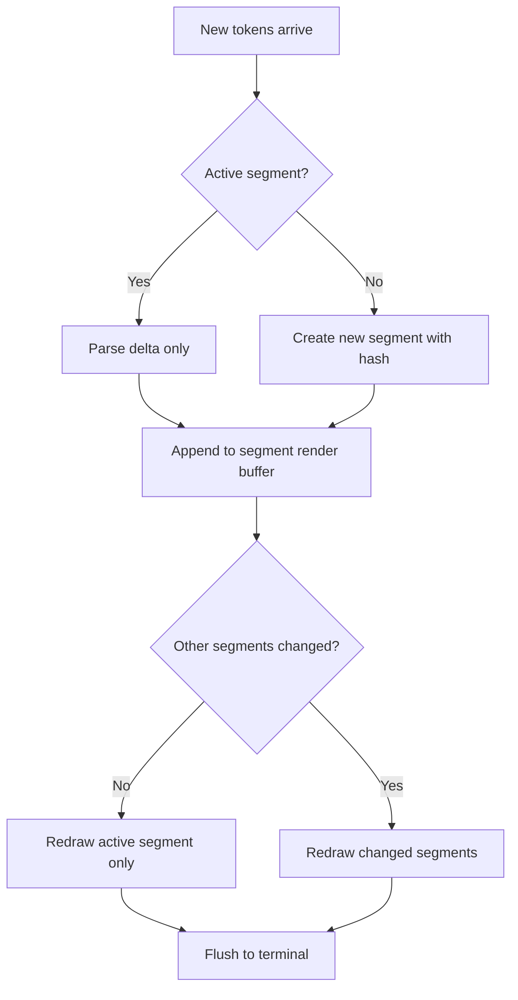
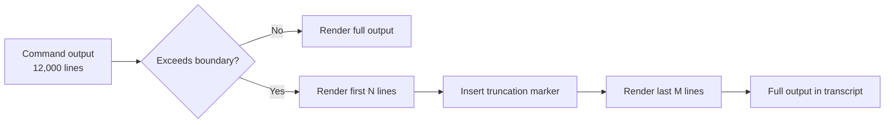

# Inside v0.145's Terminal Rendering Pipeline: How Incremental Markdown, Inline Visualisation Links, and Bounded Output Fixed Codex CLI's Long-Session Performance


---

## The Problem Nobody Talked About

For months, the most persistent complaint in the Codex CLI issue tracker was not about model quality or sandbox escapes — it was about the terminal becoming unusable during long sessions. Issue #18693 documented desktop profiles collapsing under large conversation histories: typing lag, scrolling judder, delayed UI updates, and occasional hard exits [^1]. Issue #9290 traced input lag back to v0.84 and linked it to I/O churn in the FileProvider layer [^2]. By the time sessions accumulated dozens of tool calls and multi-thousand-line diffs, the TUI was re-rendering the entire Markdown AST on every frame.

v0.145.0, shipped on 21 July 2026, addressed this with a three-pronged overhaul of the terminal rendering pipeline: incremental Markdown rendering with caching, secure inline visualisation links, and bounded command output [^3]. Together, these changes transform the experience of running Codex CLI sessions that last hours rather than minutes.

## Incremental Markdown Rendering

### The Old Model

Prior to v0.145, Codex CLI's TUI re-parsed and re-rendered the full conversation on every update. The rendering pipeline used `pulldown-cmark` to parse GFM Markdown into an event stream, walked the stream to emit styled terminal output, and flushed the result to the screen. This worked acceptably for short exchanges. In sessions with 50+ turns, each containing code blocks, tables, and inline citations, the cost scaled linearly with conversation length.

The community reported the effect most sharply in mixed-language contexts. Issue #30007 documented how Chinese-English text with inline mathematics produced display-width mismatches, triggering expensive width-recalculation passes on every re-render [^4].

### The New Pipeline

PRs #34045 and #34049 introduced a segment-based caching layer between the Markdown parser and the terminal renderer [^5]. The key changes:

1. **Segment identity tracking** — each assistant turn, tool output, and user message is assigned a stable content hash. When streaming completes for a segment, its rendered output is cached.
2. **Dirty-region detection** — on update, only segments whose content hash has changed are re-parsed and re-rendered. Completed turns are never re-processed.
3. **Incremental append** — during streaming, only the delta (new tokens since last frame) is parsed and appended to the active segment's render buffer.



PRs #34216, #34223, and #34359 extended this with fewer full redraws by batching terminal escape sequences and caching ANSI colour state across segments [^5].

### Measured Impact

The changelog notes describe these as improvements to "terminal responsiveness for long conversations and streamed output" [^3]. Community reports on Issue #18693 confirm that sessions with 100+ turns no longer exhibit the typing lag that previously forced users to start fresh threads [^1].

## Secure Inline Visualisation Links

### From OSC 8 to Visualisation Directives

Codex CLI first adopted OSC 8 terminal hyperlinks in v0.136 (June 2026), allowing file paths and URLs to render as clickable links in supporting terminals like iTerm2, kitty, and Ghostty [^6]. Issue #17922 had requested this feature since early 2026, noting that Markdown links rendered as expanded `"Label (https://url)"` text rather than semantic hyperlinks [^7].

v0.145 takes this further with PRs #33925, #34217, and #34346, introducing "secure, clickable inline visualization links in the terminal UI" [^3]. The distinction from basic OSC 8 links is significant:

- **Visualisation directives** — the model can emit structured directives during streaming that reference generated visualisations (Mermaid diagrams, charts, images). These are rendered as clickable links that open the visualisation in a browser or preview pane.
- **Security boundary** — visualisation links are validated against a URI allowlist before rendering. The TUI will not emit OSC 8 sequences for arbitrary URLs embedded in model output, preventing potential phishing via crafted hyperlinks in assistant responses.
- **Streaming tracking** — PR #34346 specifically tracks visualisation directives during streaming, ensuring links appear at the correct position even as content is being incrementally rendered [^3].

### Configuration

Inline visualisation links respect the existing terminal capabilities detection. Codex CLI probes for OSC 8 support at startup and falls back to expanded URL rendering on terminals that do not support the escape sequence. No additional configuration is required — the feature activates automatically on capable terminals.

```toml
# config.toml — terminal rendering is largely automatic,
# but you can influence related behaviour:
[tui]
# Existing OSC 8 support from v0.136 remains:
# hyperlinks are enabled by default on supporting terminals.
# Visualization links build on the same transport.
```

### Practical Effect

When the model generates a Mermaid diagram in response to an architecture question, v0.145 renders a compact clickable link labelled with the diagram type rather than dumping raw Mermaid source into the scrollback. The diagram source is still available via the link target. This significantly reduces visual noise in sessions heavy on diagramming or data visualisation.

## Bounded Command Output

The third pillar of v0.145's rendering overhaul addresses a different class of performance problem: unbounded tool output. When `codex exec` or an interactive session runs a command that produces thousands of lines — a full test suite, a large `find` result, a verbose build log — the TUI previously attempted to render the entire output inline.

v0.145 introduces bounded command output, capping the rendered portion of tool output at a configurable threshold. Content beyond the boundary is still captured in the session transcript and accessible via scrollback, but the TUI only renders the head and tail of large outputs during streaming. This prevents a single `npm test` run from freezing the rendering pipeline for seconds while the parser walks 10,000 lines of Jest output.



## How These Changes Interact

The three improvements are deliberately layered:

1. **Incremental rendering** ensures that cached, completed segments are never re-processed when new content arrives.
2. **Inline visualisation links** reduce the volume of rendered content per segment by replacing verbose diagram source with compact clickable references.
3. **Bounded output** caps the worst-case cost of any single segment, preventing pathological tool outputs from overwhelming the rendering pipeline.

The compound effect is most noticeable in goal-mode sessions and multi-agent workflows where Codex CLI orchestrates dozens of sub-agent turns, each producing tool outputs of varying length. Without these changes, such sessions degraded to unusable latency within 30–40 minutes. With them, the rendering cost stays roughly constant regardless of session length.

## What Remains Unsolved

The v0.145 rendering pipeline does not address all terminal rendering challenges:

- **Table rendering** — Issue #22015 reports that GFM pipe tables still do not render correctly in narrow terminals. The `pulldown-cmark` parser supports priority-based column shrinking, but the heuristics for when to activate the fallback row-card layout remain imperfect [^4].
- **Mathematical notation** — bare bracket syntax (`[ ]`) used for inline mathematics is not standard Markdown. Supporting it would require format-sniffing heuristics that risk false positives [^4].
- **Image rendering** — inline image rendering depends on terminal protocol support (Sixel, iTerm2 inline images, kitty graphics protocol). Codex CLI does not yet attempt inline image rendering in the TUI, relying instead on the visualisation link mechanism to delegate to external viewers.

## Practical Recommendations

For teams running long Codex CLI sessions, v0.145's rendering improvements eliminate the need for the workaround of periodically starting fresh threads to reclaim TUI responsiveness. To maximise the benefit:

1. **Update to v0.145.0 or later** — the incremental rendering pipeline is not backported to the 0.144.x line.
2. **Use a terminal with OSC 8 support** — iTerm2, kitty, Ghostty, and Windows Terminal all support OSC 8 hyperlinks. This unlocks the inline visualisation link feature.
3. **Review `.codexignore`** — excluding large generated files and build artefacts from the agent's context reduces the volume of tool output that hits the rendering pipeline.
4. **Monitor session length** — while v0.145 dramatically improves rendering performance, the underlying model context window (272K tokens for GPT-5.6 Sol) remains the binding constraint on session duration [^3].

## Citations

[^1]: GitHub Issue #18693, "Desktop performance collapses in profiles with a few very large local conversation histories," openai/codex, 2026. [https://github.com/openai/codex/issues/18693](https://github.com/openai/codex/issues/18693)

[^2]: GitHub Issue #9290, "Codex CLI slow startup / severe input lag," openai/codex, 2026. [https://github.com/openai/codex/issues/9290](https://github.com/openai/codex/issues/9290)

[^3]: Release 0.145.0, openai/codex, 21 July 2026. [https://github.com/openai/codex/releases/tag/rust-v0.145.0](https://github.com/openai/codex/releases/tag/rust-v0.145.0)

[^4]: GitHub Issue #30007, "Improve terminal Markdown rendering for wide mixed-language math/table output," openai/codex, 2026. [https://github.com/openai/codex/issues/30007](https://github.com/openai/codex/issues/30007)

[^5]: PRs #34045, #34049, #34216, #34223, #34359, "Incremental Markdown rendering and terminal performance improvements," openai/codex, July 2026. [https://github.com/openai/codex/releases/tag/rust-v0.145.0](https://github.com/openai/codex/releases/tag/rust-v0.145.0)

[^6]: Codex CLI v0.136 Release Guide, Codex Knowledge Base, June 2026. [https://codex.danielvaughan.com/2026/06/02/codex-cli-v0136-release-guide-osc8-hyperlinks-session-archiving-app-server-stdio-windows-elevated-sandbox/](https://codex.danielvaughan.com/2026/06/02/codex-cli-v0136-release-guide-osc8-hyperlinks-session-archiving-app-server-stdio-windows-elevated-sandbox/)

[^7]: GitHub Issue #17922, "Feature request: native OSC 8 clickable terminal links in interactive TUI," openai/codex, 2026. [https://github.com/openai/codex/issues/17922](https://github.com/openai/codex/issues/17922)
