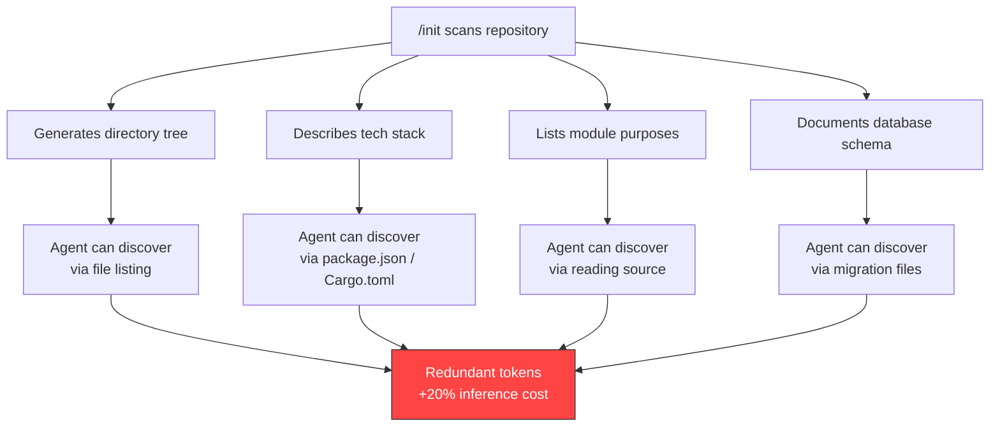
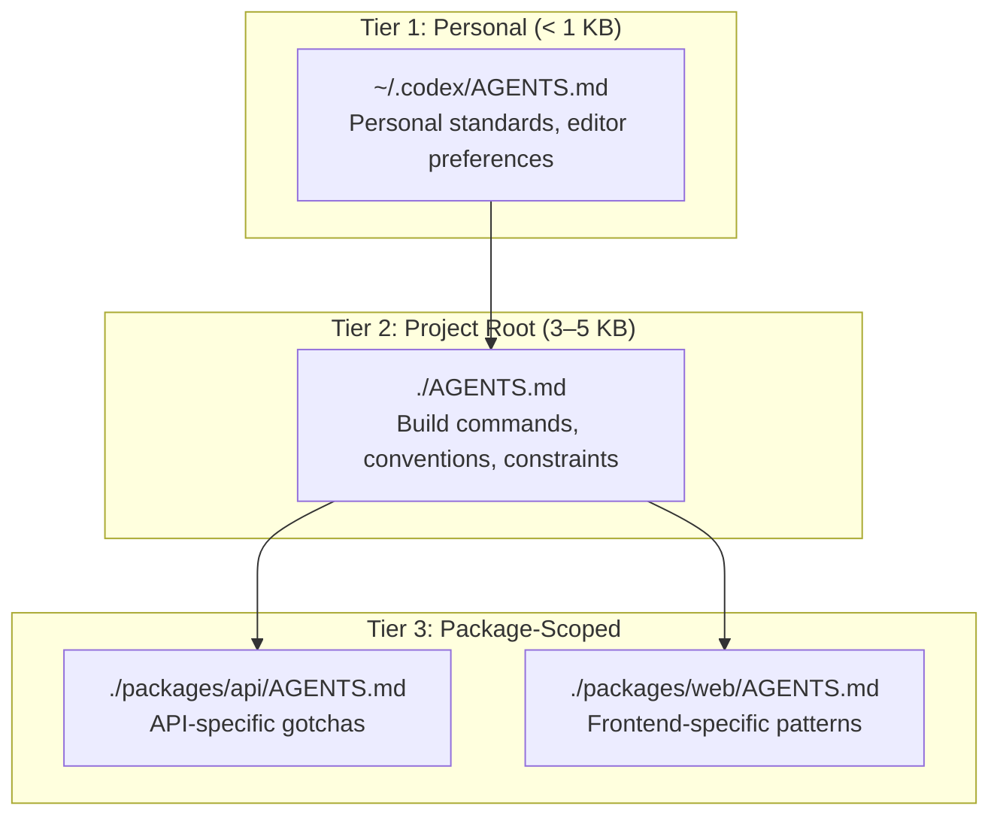

# Do Auto-Generated AGENTS.md Files Actually Help? What Four Studies Reveal About /init, Context Bloat, and the Real Cost of Repository Guidance


---

Every Codex CLI guide tells you the same thing: run `/init`, let the agent scan your repository, and get on with the real work. The generated AGENTS.md becomes part of your system prompt, loaded on every session, shaping every tool call. Sixty thousand repositories on GitHub now ship some form of agent instruction file [^1]. But a growing body of research — four independent studies published between January and June 2026 — suggests the conventional wisdom is wrong. Auto-generated context files do not improve task success rates. They inflate inference costs by 20% or more. And they may actively degrade agent performance.

This matters because the token overhead is invisible. You do not see the extra cost per session; you see it on the monthly invoice. For teams running Codex CLI across CI/CD pipelines, the compounding effect is substantial.

## The Evidence: Four Studies, One Uncomfortable Conclusion

### Gloaguen et al. — ETH Zurich (February 2026)

The most comprehensive study comes from the SRI Lab at ETH Zurich [^1]. Gloaguen, Mündler, Müller, Raychev, and Vechev evaluated AGENTS.md files across multiple LLMs and coding agents using SWE-bench tasks, testing both developer-committed and LLM-generated context files.

Their headline finding: providing context files **does not generally improve task success rates**, whilst increasing inference cost by over 20% on average. LLM-generated files fared worst, reducing task success by 2–3%. Developer-written files improved success by roughly 4% but still raised costs by up to 19%.

The killer detail: "repository overviews, although popular and recommended by model providers, are not helpful" [^1]. The architectural descriptions that `/init` loves to generate — your directory tree, your technology stack, your module breakdown — are information the agent can already discover by reading code and package manifests.

### Lulla et al. — ICSE JAWs (January 2026)

A Princeton-led paired experiment across 10 repositories and 124 merged pull requests tells a more nuanced story [^2]. With a **human-authored** AGENTS.md, median wall-clock runtime dropped 28.64% and output token consumption fell 16.58%. The key qualifier: these were handcrafted files containing project-specific knowledge that agents could not derive from source code alone — tooling gotchas, non-obvious conventions, deployment landmines.

The distinction is critical. Human-curated files that encode genuinely non-discoverable information help. Auto-generated files that restate what the agent can already see do not.

### McMillan — Factorial Study (May 2026)

Damon McMillan's factorial study [^3] attacked a different assumption: that structural choices in configuration files — size, instruction position, file architecture, contradictions between adjacent files — measurably affect agent adherence. The study ran 1,650 Claude Code CLI sessions (16,050 function-level observations) across two TypeScript codebases, three frontier models (Sonnet 4.6, Opus 4.6, Opus 4.7), and five coding tasks.

The result: **none of the four structural variables or their two-way interactions produced a detectable contrast** after multiple-testing correction. Moving instructions to the top of the file, splitting into hierarchical files, making files shorter — none of it mattered in a statistically meaningful way. The agent either followed the instruction or it did not, regardless of structural packaging.

### Shepard & Albrecht — Probe-and-Refine (June 2026)

The most recent study introduces an automated alternative to both `/init` and manual authoring [^4]. Probe-and-refine tuning uses synthetic bug-fix probes to iteratively diagnose and patch a repository's guidance file through single-shot LLM calls. On SWE-bench Verified, refined guidance achieved a 33.0% mean resolve rate versus 28.3% for the static knowledge base and 25.5% for an unguided baseline.

The improvement came from **coverage rather than precision**: refined guidance helped agents locate the correct file 14.5 percentage points more often, whilst per-patch precision remained constant at roughly 59% [^4]. Better guidance does not make the agent write better code — it helps the agent find where to write it.

## Why /init Generates the Wrong Things



Codex CLI's `/init` command analyses your project structure and scaffolds a starter AGENTS.md [^5]. The output typically includes a directory tree, technology stack overview, module descriptions, database schema summary, and setup commands. The problem, as Addy Osmani articulated in March 2026, is that "auto-generated AGENTS.md files hurt agent performance and inflate costs because they duplicate what agents can already discover" [^6].

The agent does not need you to tell it that `src/` contains source code. It can read `package.json` and infer you are using TypeScript. It can inspect `prisma/schema.prisma` and understand your data model. Every line of `/init` output that restates discoverable information consumes tokens from the context window without adding signal.

## What Actually Earns a Line in AGENTS.md

The research converges on a simple heuristic: **include only information the agent cannot derive from reading code, manifests, or existing documentation**. Osmani frames it as treating AGENTS.md "as a living list of codebase smells you haven't fixed yet rather than a permanent configuration" [^6].

In practice, this means:

```toml
# What belongs in AGENTS.md (non-discoverable)
# ─────────────────────────────────────────────
# - Use `uv` not `pip` for package management
# - Run tests with `make test-integration` not `pytest` directly
# - The legacy auth module uses a custom JWT format — do not refactor
# - Deployments require VPN; `make deploy` handles the tunnel
# - The CI matrix uses Node 22 despite engines field saying 20

# What does NOT belong (discoverable)
# ─────────────────────────────────────────────
# - Directory structure
# - Technology stack descriptions
# - Module purpose explanations
# - Database schema documentation
# - Codebase architectural overviews
```

The Lulla et al. study quantifies the effect: agents with files encoding tooling-specific knowledge (`uv` was used 1.6× more when documented versus 0.01× when not) showed measurable efficiency gains [^2]. The ETH study confirms the inverse: architecture sections can be removed entirely "while keeping only commands, constraints, and non-standard patterns" with no change in agent behaviour but lower token spend [^1].

## The Codex CLI Configuration

Codex CLI enforces a 32 KiB default size limit on AGENTS.md, roughly 8,000 tokens of instruction [^5]. Content beyond this limit is silently truncated. The limit is configurable:

```toml
# ~/.codex/config.toml
project_doc_max_bytes = 32768  # default; increase with caution
```

The `--print-instructions` flag (available since April 2026) dumps the merged AGENTS.md content loaded for the current session, making the token cost visible [^5]:

```bash
codex --print-instructions
```

For teams running Codex CLI at scale, a three-tier layering strategy minimises redundancy [^5]:



## The Anchoring Effect: Why Mentioning Deprecated Tech Hurts

One of Osmani's most practical observations concerns the **anchoring effect** [^6]. When an AGENTS.md file mentions a deprecated technology — even in a "do not use" context — the model struggles to distinguish between "what we used" and "what you should do." Mentioning an old framework by name creates attention weight that biases generation.

This is not speculation. The ETH study found that instructions in context files were indeed followed by agents; the problem was that redundant or misleading instructions consumed attention budget that could have been spent on the actual task [^1]. Every line competes for the model's finite attention.

## Practical Recommendations

Based on the combined evidence from all four studies:

1. **Do not trust `/init` output.** Use it as a starting point, then delete everything the agent can discover independently. The ETH study suggests this is 80% or more of what `/init` generates [^1].

2. **Front-load non-discoverable constraints.** Build commands, testing gotchas, deployment quirks, and naming conventions that deviate from framework defaults. The Lulla study shows this category drives the 28.64% runtime reduction [^2].

3. **Delete architectural overviews.** Repository structure descriptions, module explanations, and technology stack summaries add tokens without adding signal. Both the ETH and Princeton studies confirm this [^1] [^2].

4. **Audit the cost.** Run `codex --print-instructions` to see the merged context. Calculate the per-session token overhead. At scale, 20% cost inflation compounds across every CI pipeline run, every developer session, every automated review [^1].

5. **Consider probe-and-refine approaches.** Automated optimisation of guidance files outperforms both manual authoring and `/init` generation, achieving measurably higher resolve rates [^4].

6. **Treat AGENTS.md as temporary.** When you find yourself documenting a workaround, fix the underlying code instead. The best AGENTS.md file is the shortest one [^6].

## The Uncomfortable Implication

The four studies collectively suggest that the industry's enthusiasm for agent instruction files has outpaced the evidence. Sixty thousand repositories now ship AGENTS.md files [^1], most generated by `/init` or equivalent commands, most containing redundant information that inflates costs without improving outcomes.

The nuance matters: human-curated files encoding genuinely non-discoverable knowledge **do** help. But the default developer workflow — run `/init`, commit the output, move on — produces files that are "not useless, but redundant" [^6]. And redundancy, in a system where every token costs money and competes for attention, is a liability.

The right mental model is not "more context is better." It is "only context the agent cannot derive from code is worth the token cost."

## Citations

[^1]: Gloaguen, T., Mündler, N., Müller, M., Raychev, V. & Vechev, M. (2026). "Evaluating AGENTS.md: Are Repository-Level Context Files Helpful for Coding Agents?" arXiv:2602.11988. [https://arxiv.org/abs/2602.11988](https://arxiv.org/abs/2602.11988)

[^2]: Lulla, J. L., Mohsenimofidi, S., Galster, M., Zhang, J. M., Baltes, S. & Treude, C. (2026). "On the Impact of AGENTS.md Files on the Efficiency of AI Coding Agents." arXiv:2601.20404. Presented at ICSE JAWs 2026. [https://arxiv.org/abs/2601.20404](https://arxiv.org/abs/2601.20404)

[^3]: McMillan, D. (2026). "Instruction Adherence in Coding Agent Configuration Files: A Factorial Study of Four File-Structure Variables." arXiv:2605.10039. [https://arxiv.org/abs/2605.10039](https://arxiv.org/abs/2605.10039)

[^4]: Shepard, A. & Albrecht, J. (2026). "Probe-and-Refine Tuning of Repository Guidance for Coding Agents." arXiv:2606.20512. [https://arxiv.org/abs/2606.20512](https://arxiv.org/abs/2606.20512)

[^5]: OpenAI. "Custom instructions with AGENTS.md." ChatGPT Learn / Codex Documentation. [https://developers.openai.com/codex/guides/agents-md](https://developers.openai.com/codex/guides/agents-md)

[^6]: Osmani, A. (2026). "Stop Using /init for AGENTS.md." [https://addyosmani.com/blog/agents-md/](https://addyosmani.com/blog/agents-md/)
