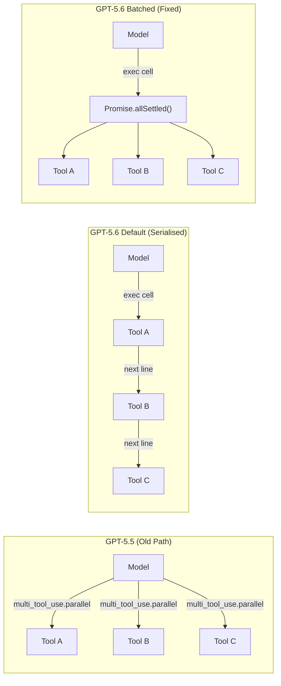
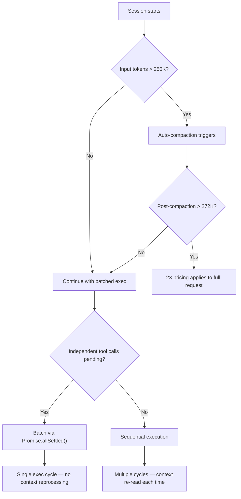

# The GPT-5.6 Serialisation Tax: How Explicit Batching in Code Mode Cuts Your Codex CLI Token Bill by 27–45%


---

When OpenAI shipped GPT-5.6 on 9 July 2026, the headline feature was programmatic tool calling — the model writes JavaScript inside an isolated V8 sandbox to orchestrate your tools, replacing the older one-call-per-round-trip pattern[^1]. In theory, this should make Codex CLI sessions faster and cheaper: instead of twelve sequential round trips to check twelve files, the model writes a loop that handles them all in a single exec cell. In practice, GPT-5.6 frequently serialises independent operations that could run concurrently, silently inflating your token consumption by 27–45%[^2].

This article explains the architectural root cause, the community-discovered fix, and how to deploy it across your Codex CLI configuration.

## The Architectural Shift: From `multi_tool_use.parallel` to Code Mode

GPT-5.2 through GPT-5.5 exposed a `multi_tool_use.parallel` instruction that explicitly told the model to fire independent tool calls concurrently at the top level of a response[^2]. The Codex CLI harness would receive a batch of tool-call requests, execute them in parallel, and return the results in one pass.

GPT-5.6 replaced this with the Responses Lite and Code Mode path[^1]. Native top-level parallel tool calls are disabled. Instead, the model generates JavaScript that runs in a sandboxed V8 runtime with no network access — your declared tools are its only external interface[^3]. Concurrency is still possible: calls inside `Promise.all()` or `Promise.allSettled()` execute concurrently within the exec cell. But the model must choose to write concurrent JavaScript rather than sequential imperative code.

The problem: GPT-5.6 shipped with generic guidance that demonstrates only single nested calls, not batched operations[^2]. Without explicit instruction, the model defaults to sequential execution.



## Measuring the Cost

GitHub Issue #35050, opened on 24 July 2026 by MakerOfToys, documented the impact across two real codebases[^2]:

| Metric | Large work codebase | Personal finance app |
|--------|-------------------|---------------------|
| Model cycle reduction | 52.1% fewer | 54.7% fewer |
| Weighted usage reduction | **45%** | **27%** |
| Cached input token reduction | 65% | 56% |
| Uncached input token reduction | 26% | 5% |

The dominant cost driver is not the tool calls themselves but the **context reprocessing**. Each sequential round trip forces the model to re-read the accumulated context — your `AGENTS.md`, conversation history, prior tool output, and the growing exec trace. Batching eliminates these redundant re-reads by collapsing multiple operations into a single exec cycle.

At Sol pricing ($5.00 / $0.50 cached / $30.00 output per million tokens)[^4], a developer running 20 sessions daily could see savings of $15–25 per day from this single configuration change.

## The Fix: An AGENTS.md Batching Directive

The fix is an instruction block in your `AGENTS.md` (or the global `~/.codex/agents.md`) that teaches GPT-5.6 when and how to batch:

```toml
# In config.toml — ensure code mode is enabled (default for GPT-5.6)
model = "gpt-5.6-sol"
```

```markdown
<!-- In AGENTS.md -->
## Code Mode Batching Policy

In Code Mode, within each bounded stage, run independent tool calls
concurrently in one exec call:

- Group independent operations using `Promise.allSettled()` when partial
  results are useful (file reads, lint checks, test runs across modules).
- Reserve `Promise.all()` only when any single failure should abort the
  entire batch (e.g., all database migrations must succeed).
- Maintain sequential execution for dependent operations, adaptive logic
  that branches on prior results, or operations that conflict on shared
  state (e.g., two writes to the same file).

### Classification heuristic

Before writing an exec cell, classify each pending tool call as:
1. **Independent** — no data dependency on other pending calls
2. **Dependent** — requires output from a prior call
3. **Conflicting** — writes to the same resource as another call

Batch all (1) calls into a single `Promise.allSettled()`. Chain (2) calls
sequentially after their dependencies resolve. Serialise (3) calls.
```

The directive is deliberately declarative rather than prescriptive: it tells the model *what to do* without hard-coding tool names, so it generalises across MCP servers, shell commands, and file operations.

## The Effort-Gating Effect

Community replication by ForrestGrump revealed a critical nuance: the batching benefit varies dramatically by reasoning effort level[^2].

| Reasoning effort | Uninstructed behaviour | Batched behaviour | Improvement |
|-----------------|----------------------|-------------------|-------------|
| `low` | Mostly sequential | Consistently batched | Moderate |
| `medium` | Mixed | Consistently batched | Significant |
| `high` | Often sequential | Consistently batched | Significant |
| `max` | Sometimes parallel | Mostly batched | Marginal |
| `ultra` | Spawns 23–25 sub-sessions | Spawns 23–25 sub-sessions | **None** |

At Ultra effort, the model ignores the batching directive entirely and spawns autonomous sub-agents regardless of whether `multi_agent=false` is set — consuming 267–605 credits per task[^2]. This is a known behaviour where Ultra's cooperative sub-agent architecture overrides exec-level concurrency directives[^5].

The practical recommendation: pair the batching directive with `model_reasoning_effort = "high"` in `config.toml` for the best cost-efficiency ratio. Reserve Ultra for genuinely complex, decomposable problems where sub-agent parallelism is the correct strategy.

```toml
# config.toml — balanced configuration
model = "gpt-5.6-sol"
model_reasoning_effort = "high"
model_auto_compact_token_limit = 250000
```

## The Output Truncation Caveat

MakerOfToys acknowledged a methodological caveat: some batched responses showed output truncation, which could overstate savings by undercounting output tokens[^2]. Independent audit suggested truncation explains only a partial gap — cached-input re-reading accounts for the dominant cost difference. Nevertheless, teams should monitor output completeness after deploying the directive.

A pragmatic safeguard: add a post-hoc verification step to your workflow.

```markdown
<!-- In AGENTS.md — add after the batching policy -->
## Batch Verification

After each batched exec cell, verify that all `Promise.allSettled()` results
contain either a `fulfilled` or `rejected` status. If any tool call result
is missing or truncated, re-run the affected calls individually.
```

## Interaction with the 272K Pricing Threshold

GPT-5.6's pricing structure applies a 2× input and 1.5× output multiplier to the **entire request** when input tokens exceed 272,000[^6]. The serialisation tax compounds this problem: each unnecessary round trip adds context, and once the session crosses 272K tokens, every subsequent token costs double.

Batching reduces context accumulation rate, which delays or prevents crossing the threshold. Combined with `model_auto_compact_token_limit = 250000`, this creates a two-layer defence against the pricing cliff:



## Named Profiles for Task-Appropriate Batching

Not every task benefits equally from aggressive batching. Use Codex CLI's named profiles to route tasks to appropriate configurations:

```toml
# ~/.codex/config.toml

[profile.batch-heavy]
model = "gpt-5.6-terra"
model_reasoning_effort = "high"
# Terra at half Sol's price — ideal for batch-heavy read operations

[profile.precision]
model = "gpt-5.6-sol"
model_reasoning_effort = "max"
# Sol at max effort — for tightly coupled architectural work
# where sequential reasoning matters more than throughput
```

Launch with `codex --profile batch-heavy` for codebase-wide linting, test runs across modules, or multi-file refactors where independent operations dominate. Switch to `codex --profile precision` for work requiring careful sequential reasoning — security reviews, complex migrations, or architecture decisions where each step depends on the last.

## When Not to Batch

The directive includes explicit carve-outs for sequential execution, and these matter:

- **Database migrations**: Order matters. Batch verification checks, but serialise the actual migration steps.
- **File modifications with dependencies**: If tool call B modifies a file that tool call A just created, they cannot run concurrently.
- **Adaptive workflows**: When the next action depends on inspecting the result of the previous one (e.g., "read the error log, then fix the error it reveals"), sequential execution is correct.
- **Conflicting writes**: Two concurrent writes to the same file produce race conditions even within a single exec cell.

The classification heuristic in the AGENTS.md directive handles these cases — the model classifies calls as independent, dependent, or conflicting before choosing a concurrency strategy.

## Deploying Across a Team

For teams using `requirements.toml` to enforce fleet-wide configuration, the batching directive belongs in a shared `AGENTS.md` at the repository root. Individual developers can supplement it with their own `~/.codex/agents.md` for personal preferences, but the batching policy should be consistent across the team to produce comparable token-usage metrics.

```toml
# requirements.toml — fleet enforcement
[model]
allowed = ["gpt-5.6-sol", "gpt-5.6-terra", "gpt-5.6-luna"]

[reasoning]
max_effort = "high"  # Prevent Ultra from overriding batching
```

⚠️ The `max_effort` constraint in `requirements.toml` is documented but its enforcement behaviour at Ultra level has not been independently verified across all Codex CLI versions.

## Conclusion

GPT-5.6's shift from `multi_tool_use.parallel` to Code Mode JavaScript orchestration is architecturally sound — it gives the model more flexibility to compose complex workflows. But the default behaviour serialises independent operations, creating a hidden tax that inflates token consumption by up to 45%. A targeted `AGENTS.md` directive teaching the model to batch via `Promise.allSettled()` eliminates most of this overhead, with the strongest gains at `medium` and `high` reasoning effort levels.

The fix takes five minutes to deploy and pays for itself within the first session.

## Citations

[^1]: OpenAI, "GPT-5.6: Frontier intelligence that scales with your ambition," openai.com, 9 July 2026. [https://openai.com/index/gpt-5-6/](https://openai.com/index/gpt-5-6/)

[^2]: MakerOfToys, "GPT-5.6 often serializes independent Code Mode calls; explicit batching reduced weighted usage by 27–45%," GitHub Issue #35050, openai/codex, 24 July 2026. [https://github.com/openai/codex/issues/35050](https://github.com/openai/codex/issues/35050)

[^3]: Apidog, "GPT-5.6 Programmatic Tool Calling: The Model Writes JavaScript to Orchestrate Your Tools," apidog.com, July 2026. [https://apidog.com/blog/gpt-5-6-programmatic-tool-calling/](https://apidog.com/blog/gpt-5-6-programmatic-tool-calling/)

[^4]: MarkTechPost, "OpenAI Releases GPT-5.6 (Sol, Terra, Luna): A Three-Tier Model Family With Programmatic Tool Calling in the Responses API," marktechpost.com, 9 July 2026. [https://www.marktechpost.com/2026/07/09/openai-releases-gpt-5-6-a-three-tier-model-family-with-programmatic-tool-calling/](https://www.marktechpost.com/2026/07/09/openai-releases-gpt-5-6-a-three-tier-model-family-with-programmatic-tool-calling/)

[^5]: Daniel Vaughan, "The Ultra Mode Trade-Off: When Bigger Reasoning Budgets Backfire in Codex CLI," Codex Knowledge Base, 24 July 2026. [https://codex.danielvaughan.com/2026/07/24/codex-cli-ultra-mode-trade-off-reasoning-budgets-subagent-cost-task-routing/](https://codex.danielvaughan.com/2026/07/24/codex-cli-ultra-mode-trade-off-reasoning-budgets-subagent-cost-task-routing/)

[^6]: Daniel Vaughan, "The 272K Tripwire: How GPT-5.6's Context Window Cap Silently Doubles Your Codex CLI Bill," Codex Knowledge Base, 25 July 2026. [https://codex.danielvaughan.com/2026/07/25/codex-cli-gpt-5-6-272k-context-window-pricing-threshold-auto-compaction-cost-defence/](https://codex.danielvaughan.com/2026/07/25/codex-cli-gpt-5-6-272k-context-window-pricing-threshold-auto-compaction-cost-defence/)
