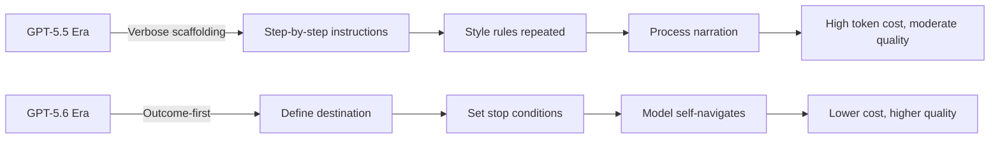

# Outcome-First Prompting: How GPT-5.6 Sol's Lean-Prompt Philosophy Reshapes Your Codex CLI Strategy


---

## The Paradigm Shift You Probably Missed

On 9 July 2026, alongside the GPT-5.6 model family launch, OpenAI quietly published a prompting guide that inverts years of accumulated best practice [^1]. The core message: **stop over-prompting**. In internal coding-agent evaluations, leaner system prompts improved eval scores by 10–15% whilst cutting total tokens by 41–66% and costs by 33–67% [^2]. If your AGENTS.md still looks like a GPT-5.5-era instruction manual, you are actively degrading your Codex CLI results.

This article dissects the shift, maps it to concrete Codex CLI configuration changes, and provides a migration path from verbose scaffolding to outcome-first prompting.

---

## Why GPT-5.6 Is Different

GPT-5.6 Sol is described by OpenAI as "proactive and persistent" by default [^1]. Unlike GPT-5.5, which required explicit nudges to continue multi-step tasks, Sol will autonomously:

- Resume work after tool failures without being told to retry
- Chain multiple file edits into atomic commits without step-by-step instructions
- Spawn sub-agents in Ultra mode when it judges parallelism beneficial

This behavioural shift means **instructions that were necessary for GPT-5.5 are now noise for GPT-5.6**. Worse, they can actively confuse the model by implying it should wait for permission at steps where it would otherwise proceed correctly.



---

## The Three Pillars of Outcome-First Prompting

OpenAI's guide distils effective GPT-5.6 prompting into three principles [^1][^2]:

### 1. Define the Destination, Not the Route

Tell the model *where* you want to end up. Do not prescribe the intermediate steps.

```toml
# BAD: Route-prescriptive (GPT-5.5 era)
# "First read the file, then identify the bug, then write a test,
#  then fix the bug, then run the test, then commit"

# GOOD: Destination-focused (GPT-5.6 era)
# "Fix the pagination bug in src/api/users.rs.
#  Done when: existing tests pass and a new regression test covers the edge case."
```

### 2. Set Stopping Conditions, Not Process Steps

The model needs to know when it has finished. It does not need to know how to get there.

Effective stop conditions for Codex CLI sessions:

- "All tests pass with no new warnings"
- "The migration compiles and the integration test suite is green"
- "PR is ready: diff under 200 lines, no TODO comments remain"

### 3. Remove Everything That Does Not Change Behaviour

OpenAI's internal testing methodology [^2]:

1. Run representative evaluations before touching the prompt
2. Remove obsolete scaffolding and repeated instructions incrementally
3. Add back only the smallest targeted instruction that addresses a measured regression

---

## What This Means for Your AGENTS.md

Codex CLI concatenates your global `~/.codex/AGENTS.md` with every `AGENTS.md` along the path from your git root to your current directory, capped at 32 KiB [^3]. Under GPT-5.6, that budget is precious — every redundant line displaces context that could hold actual code.

### The Audit Process

Review your AGENTS.md files against this checklist:

| Keep | Remove |
|------|--------|
| Architectural constraints the model cannot infer from code | Step-by-step workflow descriptions |
| Non-obvious conventions (e.g. "we use `anyhow` not `thiserror`") | Style rules already enforced by linters |
| Security boundaries ("never write to /etc") | Examples that merely restate the rule |
| Stop conditions for common task types | Process narration ("first, then, finally") |
| Domain-specific terminology mappings | Encouragement or politeness padding |

### Before and After

**Before (GPT-5.5-optimised, 847 tokens):**

```markdown
## Workflow
1. Always read the relevant files first
2. Understand the existing patterns
3. Write tests before implementation
4. Implement the minimal change
5. Run the test suite
6. If tests fail, fix and re-run
7. Commit with a conventional commit message
8. Include the ticket number in the commit

## Style
- Use British English in comments
- Prefer early returns
- No nested ternaries
- Maximum function length: 50 lines
- Always add JSDoc for exported functions
```

**After (GPT-5.6-optimised, 312 tokens):**

```markdown
## Constraints
- Test-first: no implementation without a failing test
- Commits: conventional format, include JIRA ticket from branch name
- British English in user-facing strings

## Done when
- `npm test` exits 0
- No new lint warnings (`npm run lint`)
- Diff is minimal — no unrelated reformatting
```

The style rules about early returns, ternaries, and function length? Your ESLint config already enforces those. The model reads `eslint.config.js` — it knows. The workflow steps? GPT-5.6 Sol does this naturally when given a failing test objective.

---

## Concrete Codex CLI Configuration Changes

### Trim Bundled Instructions

Since v0.144.6, Codex CLI ships refreshed bundled instructions for GPT-5.6 Sol, Terra, and Luna [^4]. These are already lean. Your job is to ensure your *project-level* instructions complement rather than contradict them.

Use `--print-instructions` to inspect what Codex actually injects:

```bash
codex --print-instructions
```

If you see duplication between your AGENTS.md and the bundled instructions, delete your duplicate.

### Set Reasoning Effort Appropriately

GPT-5.6 Sol's "proactive and persistent" behaviour means it will spend reasoning tokens exploring solutions. For routine tasks, reduce reasoning overhead:

```toml
# ~/.codex/config.toml
[model]
model = "gpt-5.6-sol"
reasoning = "standard"   # Use "max" only for complex architectural tasks
```

### Use Named Profiles for Prompt Density

Different task types benefit from different prompt strategies. Configure profiles:

```toml
# ~/.codex/profiles/refactor.config.toml
[model]
model = "gpt-5.6-terra"
reasoning = "standard"

# Terra handles routine refactors; minimal AGENTS.md guidance needed
```

```toml
# ~/.codex/profiles/security-review.config.toml
[model]
model = "gpt-5.6-sol"
reasoning = "max"

# Sol with max reasoning for security — tighter constraints justified here
```

---

## The Cost Arithmetic

The numbers from OpenAI's internal testing are striking [^2]:

| Metric | Verbose Prompts | Lean Prompts | Improvement |
|--------|----------------|--------------|-------------|
| Eval scores | Baseline | +10–15% | Quality up |
| Total tokens | Baseline | −41–66% | Significant savings |
| Total cost | Baseline | −33–67% | Direct budget impact |

At GPT-5.6 Sol pricing (\$5 input / \$30 output per million tokens) [^5], a team running 50 Codex sessions daily could save **\$200–400/month** purely by trimming system prompts — before any task-level routing optimisation.

---

## The GPT-5.5 → GPT-5.6 AGENTS.md Migration Checklist

1. **Baseline your current eval scores** — run your standard tasks, record pass rates
2. **Remove all process steps** — delete "first…then…finally" patterns
3. **Remove style rules enforced by tooling** — if a linter or formatter catches it, the model does not need telling
4. **Remove examples that restate rules** — keep only examples that disambiguate genuinely unclear conventions
5. **Remove encouragement and padding** — "You are an expert developer" adds zero signal
6. **Re-run evals** — confirm scores hold or improve
7. **Add back only what regresses** — one instruction at a time, measuring each

---

## When Lean Prompts Are Not Enough

This approach has limits. You still need explicit instructions for:

- **Security boundaries** that cannot be inferred from code (e.g. "never access production databases directly")
- **Business logic constraints** invisible in the codebase (e.g. "users in region X must not see feature Y")
- **Compliance requirements** with legal consequences (e.g. "all PII must be redacted before logging")
- **Novel architectural decisions** not yet reflected in existing code

The principle is not "write nothing" — it is "write only what the model cannot discover from your codebase, your tests, and your tooling configuration."

---

## Practical Experiment: The Broad Delegation Pattern

One pattern emerging from the GPT-5.6 community is what developers call "broad delegation" — giving Sol a maximally open-ended objective and letting it determine scope [^1]. Reports suggest Sol Ultra can produce 10,000+ lines of meaningful changes from prompts like:

> "Review this codebase for security issues, architectural improvements, and code quality. Be ruthless. Fix everything you find."

⚠️ **Caveat:** This pattern works best with Sol Ultra's parallel sub-agent capability and requires careful review of the output. It is inappropriate for production hotfixes or compliance-sensitive code. Independent verification of claimed improvements is essential.

---

## Citations

[^1]: OpenAI, "Model guidance: GPT-5.6 prompt guidance," OpenAI Developer Platform, July 2026. [https://developers.openai.com/api/docs/guides/prompt-guidance-gpt-5p6](https://developers.openai.com/api/docs/guides/prompt-guidance-gpt-5p6)

[^2]: "Stop Over-Prompting: OpenAI's New GPT-5.6 Guidelines Change Everything," Decrypt, July 2026. [https://decrypt.co/373439/openai-new-gpt-5-6-prompt-guide-chatgpt](https://decrypt.co/373439/openai-new-gpt-5-6-prompt-guide-chatgpt)

[^3]: OpenAI, "Custom instructions with AGENTS.md," ChatGPT Learn, 2026. [https://developers.openai.com/codex/guides/agents-md](https://developers.openai.com/codex/guides/agents-md)

[^4]: "Codex CLI Changelog — v0.144.6," OpenAI, July 2026. [https://releases.sh/openai/openai-codex-changelog](https://releases.sh/openai/openai-codex-changelog)

[^5]: "GPT-5.6 Prompting Guide: Lean System Prompts Now Outperform Elaborate Scaffolding," TechTimes, July 2026. [https://www.techtimes.com/articles/320650/20260715/gpt-56-prompting-guide-lean-system-prompts-now-outperform-elaborate-scaffolding.htm](https://www.techtimes.com/articles/320650/20260715/gpt-56-prompting-guide-lean-system-prompts-now-outperform-elaborate-scaffolding.htm)
