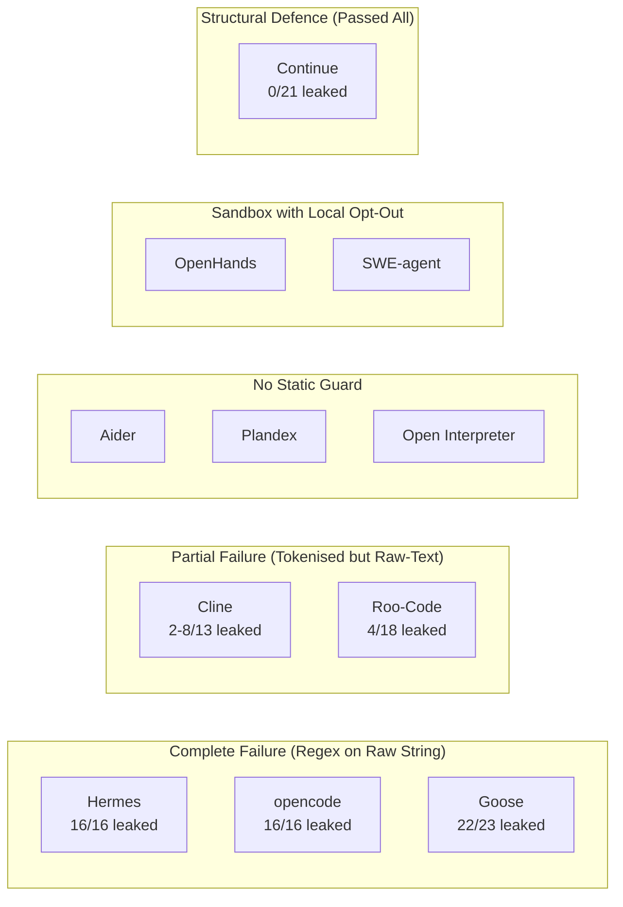
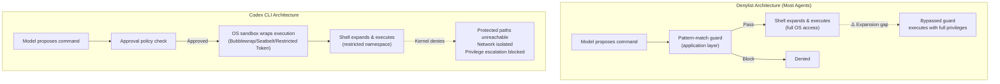

# GuardFall and ShellSieve: Why Denylist-Based Security Is a Losing Strategy for Coding Agents — and How Codex CLI's OS-Level Sandbox Changes the Calculus


---

Two independent security research efforts published in June 2026 have demolished any remaining confidence in denylist-based command gating as a viable security strategy for coding agents. Adversa AI's GuardFall disclosure demonstrated that decades-old shell-quoting tricks bypass pattern-based command guards in 10 of 11 popular open-source coding agents [^1]. Separately, Chen and Lin's ShellSieve paper (arXiv:2606.15549) applied an LLM-driven pipeline to 1,709 real-world denylists and found that 69.0–98.6% are fragile — meaning they overlook at least one bypass command for every operation category tested [^2].

The findings matter for anyone running a coding agent in production. If your security model relies on string-matching commands before they reach the shell, you are running an agent with a structurally broken safety boundary.

## The Core Problem: Guards and Shells See Different Text

Every denylist-based guard shares the same architectural flaw. The guard inspects the raw command string — the text the model proposed. But Bash rewrites that text before executing it. Quote removal, `$IFS` expansion, command substitution, and parameter expansion all transform the string between inspection and execution [^1]. The guard and the shell never see the same thing.

This is not a bug in any individual denylist. It is a structural property of the Unix shell. Pattern-matching a pre-expansion string against a post-expansion threat model is fundamentally unsound.

## Five Bypass Classes

Adversa AI categorised the attack surface into five classes [^1]:

| Class | Technique | Example | Why It Works |
|-------|-----------|---------|-------------|
| A | Quote removal | `r''m -rf /` | Regex sees `r''m`, Bash strips quotes to `rm` |
| B | `$IFS` expansion | `rm$IFS-rf$IFS/` | One token to the guard, three arguments to the shell |
| C | Command substitution | `$(echo rm) -rf /` | Destructive command hidden inside subshell |
| D | Base64 pipe chain | `echo <payload> \| base64 -d \| sh` | Three benign commands compose a malicious one |
| E | Alternative argv shapes | `find /x -delete`, `dd of=/dev/sda` | Different binaries, same destructive effect |

Class E proved the most devastating in practice. Denylists typically block `rm`, `chmod`, and a handful of obvious destructive commands. They rarely account for `install -m 4755 payload /usr/bin/backdoor` or `sed -i 's/key=.*/key=attacker/' ~/.aws/credentials` [^1].

## ShellSieve: Quantifying the Fragility at Scale

Chen and Lin formalised the problem by defining seven filesystem operation categories — read, write, create, delete, copy, permission change, and ownership change — then built ShellSieve, an LLM-driven pipeline that proposes bypass candidates, validates them in sandboxed environments with canary tokens, and iteratively repairs failures [^2].

Applied to 1,709 real-world denylists (containing 13,332 rules) collected from GitHub, the results were stark:

| Operation | Incomplete Blocking Rate |
|-----------|------------------------|
| `op_read` | 91.4% |
| `op_write` | 88.7% |
| `op_create` | 93.2% |
| `op_delete` | 69.0% |
| `op_copy` | 95.1% |
| `op_chmode` | 97.8% |
| `op_chowgr` | 98.6% |

Two root causes emerged [^2]:

1. **Ignorance**: Less popular commands are significantly more likely to bypass a denylist (logistic regression p < 10⁻⁶ for most operations). Guards block `rm` but miss `shred`, `truncate`, and `install`.
2. **Versatility**: Multi-function commands bypass a median of 664 denylists versus 281 for single-function commands (Mann-Whitney U=2482, p=0.006, Cliff's δ=0.30). A single `awk` invocation is Turing-complete and can invoke `bash` directly.

Fully blocking even a single operation category requires a staggering number of rules — 217 additional commands on average for `op_read` alone, with maximums reaching 603 commands to block all seven operations simultaneously [^2].

## 10 of 11 Agents Fell

GuardFall tested 11 popular open-source coding agents with a combined 548,000 GitHub stars [^1]. Only Continue — which implements structural command parsing with recursive evaluation — blocked all bypass variants. The remaining ten agents fell to one or more bypass classes:



The Plandex result was especially concerning: researchers achieved end-to-end exploitation against a real AWS credentials file using nothing more than a crafted `Makefile` target [^1].

## Why Codex CLI Is Architecturally Different

Codex CLI does not rely on a denylist as its primary security boundary. Its defence stack operates at a fundamentally different level — the operating system kernel.

### Three-Platform Kernel Sandbox

On every supported platform, Codex CLI wraps command execution in an OS-native isolation primitive [^3][^4]:

| Platform | Primary Sandbox | Key Mechanisms |
|----------|----------------|----------------|
| Linux | Bubblewrap + seccomp-BPF | Namespace isolation (`--unshare-user`, `--unshare-pid`, `--unshare-net`), read-only filesystem view, syscall filtering blocking `ptrace`, `process_vm_readv`, `io_uring_*` |
| macOS | Seatbelt (sandbox-exec) | Dynamically generated SBPL profiles, network restricted to loopback + detected proxy ports |
| Windows | Restricted Tokens + Job Objects | Synthetic SIDs, ACL-based deny rules, WFP network filtering, AppContainer isolation |

The critical architectural difference: these sandboxes operate *below* the shell. When Bash expands `r''m` into `rm`, it does not matter — the `rm` binary cannot reach protected paths because the kernel denies the filesystem access. When `$IFS` expansion produces `rm -rf /`, the command executes inside a namespace where `/` is mounted read-only. The entire class of bypass-via-expansion attacks is rendered structurally irrelevant [^3].



### Defence in Depth, Not Defence by Pattern

Codex CLI layers multiple independent security boundaries [^3][^4][^5]:

1. **Sandbox policy** (`workspace-write` default): Commands execute in a restricted namespace. Even `full-auto` mode runs inside the sandbox — the approval policy governs *whether* to run, not *what protection applies*.

2. **Network isolation** (default off): In `workspace-write` mode, all network access is blocked by kernel-level filtering. The managed `codex-network-proxy` provides domain-allowlisted access when network is explicitly enabled.

3. **Approval policy** (`suggest` default): Every command requires explicit user approval before execution. In `auto-edit` or `full-auto` modes, the Guardian auto-review subagent evaluates risk before approving [^5].

4. **Guardian auto-review**: A purpose-built `codex-auto-review` model produces structured risk assessments (low/medium/high/critical). Critical-risk actions are always denied. High-risk actions require explicit user authorisation [^5].

5. **PreToolUse/PostToolUse hooks**: User-defined scripts that intercept tool calls before and after execution, enabling custom validation logic.

6. **Dangerous-command detection** (`is_dangerous_command`): Codex CLI *does* maintain a denylist for obviously destructive commands like `rm -rf /` and `Remove-Item -Recurse -Force` — expanded in v0.144.5 to catch more flag-reordering variants [^6]. But this is a UX safety net, not the security boundary. It catches accidental model hallucinations, not adversarial bypasses.

### The Layering Principle

The architectural insight is that no single layer needs to be perfect. The denylist catches the obvious cases. The approval policy catches the unusual ones. The sandbox constrains what a command can actually do even if it passes both gates. And the kernel enforces access control regardless of how the shell expands the command string.

This is why the GuardFall bypass classes are structurally irrelevant to Codex CLI:

| GuardFall Class | Codex CLI Response |
|----------------|-------------------|
| A (Quote removal) | Sandbox restricts filesystem regardless of how `rm` is spelled |
| B (`$IFS` expansion) | Namespace isolation means expanded command cannot reach protected paths |
| C (Command substitution) | Subshell executes inside same restricted namespace |
| D (Base64 pipe chain) | `sh` inherits the sandbox; decoded payload is equally constrained |
| E (Alternative binaries) | `find -delete`, `dd`, `install` all blocked by read-only mounts and ACLs |

## What This Means for Your Configuration

The ShellSieve and GuardFall findings should prompt a reassessment of how you think about coding agent security:

### If You Are Using an Open-Source Agent

Check whether your agent relies primarily on a denylist. If it does, you are running with a structurally broken safety boundary. The ShellSieve data shows that even well-maintained denylists (including Claude Code's built-in list) contain overlooked bypasses [^2]. Consider layering a container sandbox (Docker, Bubblewrap) around the agent process.

### If You Are Using Codex CLI

The default `workspace-write` + `suggest` configuration already provides OS-level isolation. Verify your setup:

```toml
# config.toml — confirm sandbox and approval defaults
[sandbox]
permission_profile = "workspace-write"  # OS-level isolation

[policy]
approval_policy = "suggest"  # Require human approval

[network]
# Default: network disabled in workspace-write mode
# Only enable with domain allowlisting if needed
```

For CI pipelines using `codex exec`, ensure the sandbox is active even in headless mode — it is by default, but verify that no environment variable overrides disable it.

### For Enterprise Fleet Governance

Use `requirements.toml` to enforce sandbox policy across your organisation [^7]:

```toml
# requirements.toml — admin-enforced, cannot be overridden
[sandbox]
permission_profile = "workspace-write"  # Minimum isolation level

[network]
allow_network = false  # Default network off

[policy]
approval_policy = "suggest"  # Prevent full-auto without Guardian
```

## The Broader Lesson

The ShellSieve and GuardFall research demonstrates what security engineers have known for decades: application-level input validation is not a substitute for OS-level access control. Denylists are a heuristic — they make common mistakes harder. Sandboxes are an enforcement boundary — they make prohibited actions impossible.

The 10 agents that fell to GuardFall were not badly engineered. They made a reasonable-sounding architectural choice: check commands before running them. The problem is that "check before run" requires the checker to understand every possible transformation the shell will apply — an open-ended, unbounded problem that grows with every new shell built-in, every alternative binary, every flag combination.

Codex CLI's approach inverts the problem. Instead of trying to enumerate everything dangerous, it restricts the execution environment so that even dangerous commands cannot cause harm beyond the defined boundaries. The sandbox does not need to understand shell expansion. It does not need to know about `$IFS` or quote removal. It operates at the kernel level, below the point where any of these transformations occur.

That is the difference between a denylist and a sandbox. One tries to predict every possible attack. The other makes the prediction unnecessary.

## Citations

[^1]: Adversa AI. "GuardFall Shell Injection: Open-Source AI Coding Agents Vulnerability." Adversa AI Blog, 30 June 2026. [https://adversa.ai/blog/opensource-ai-coding-agents-shell-injection-vulnerability/](https://adversa.ai/blog/opensource-ai-coding-agents-shell-injection-vulnerability/)

[^2]: Chen, C. and Lin, Z. "One Goal, Many Commands: Characterizing Denylist Fragility in AI Agents." arXiv:2606.15549, 14 June 2026 (revised 20 June 2026). [https://arxiv.org/abs/2606.15549](https://arxiv.org/abs/2606.15549)

[^3]: DeepWiki. "Sandboxing Implementation — openai/codex." [https://deepwiki.com/openai/codex/5.6-sandboxing-implementation](https://deepwiki.com/openai/codex/5.6-sandboxing-implementation)

[^4]: Takahashi, H. "How Claude Code and Codex Sandbox Untrusted Code." Medium, June 2026. [https://medium.com/@Koukyosyumei/how-claude-code-and-codex-sandbox-untrusted-code-ba39b493046a](https://medium.com/@Koukyosyumei/how-claude-code-and-codex-sandbox-untrusted-code-ba39b493046a)

[^5]: OpenAI. "Auto-review of agent actions without synchronous human oversight." OpenAI Alignment, 2026. [https://alignment.openai.com/auto-review/](https://alignment.openai.com/auto-review/)

[^6]: OpenAI. "Codex CLI Changelog — v0.144.5." ChatGPT Learn, July 2026. [https://developers.openai.com/codex/changelog](https://developers.openai.com/codex/changelog)

[^7]: OpenAI. "Advanced Configuration — Codex CLI." ChatGPT Learn, 2026. [https://developers.openai.com/codex/config-advanced](https://developers.openai.com/codex/config-advanced)
