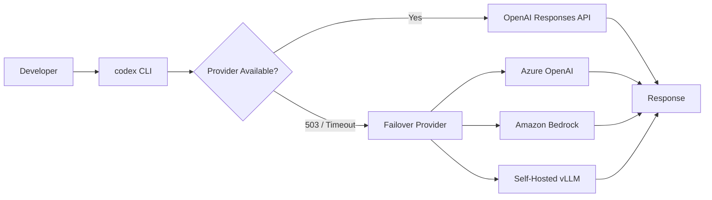
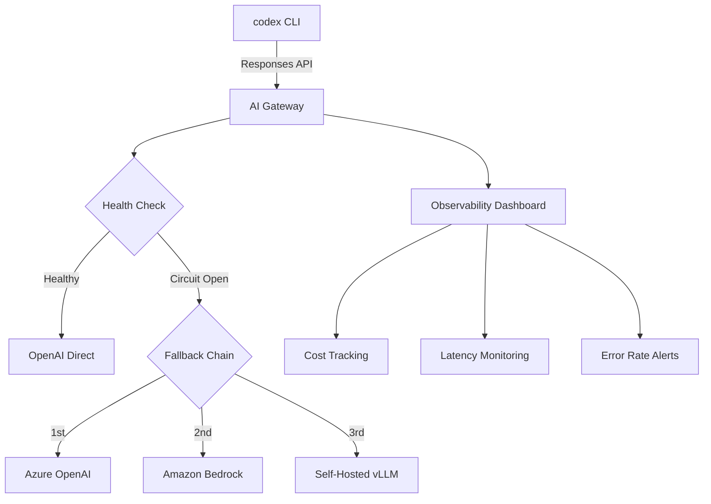

# Nine Outages in Seven Days: Building Codex CLI Resilience with Multi-Provider Failover


---

Between 21 and 25 July 2026, OpenAI's status page logged nine separate incidents affecting ChatGPT, the Responses API, and Codex — including a 24-hour ChatGPT outage on 23 July and a Codex-specific disruption spanning 11 hours on 24 July[^1]. Users encountered 503 errors bearing the internal label `biscuit_baker_service_me_circuit_open`, a circuit-breaker signal indicating that the load-balancing layer was rejecting requests before they reached inference servers[^2]. For developers who had wired Codex CLI into their daily workflow — or worse, into CI pipelines via `codex exec` — the week was a sharp reminder that cloud-dependent tooling needs a fallback plan.

This article walks through the resilience architecture available to Codex CLI users today: native multi-provider configuration, AI gateway failover chains, and the defensive configuration patterns that keep your development loop running when OpenAI's infrastructure does not.

## The July Outage Pattern

StatusGator's incident log for July 2026 paints a clear picture[^1]:

| Date | Affected Services | Duration |
|------|------------------|----------|
| 21 Jul | API image generation, logins, signups | ~7 hours |
| 22 Jul | Workspace Agent errors, file uploads, image generation | ~7 hours |
| 23 Jul | ChatGPT (broad), Codex, image generation, file uploads | ~24 hours |
| 24 Jul | Codex API, Codex Web, Codex CLI, VS Code extension | ~11 hours |
| 25 Jul | ChatGPT, APIs (two separate incidents) | 20 min + 2 hours |

Since autumn 2025, the status page has logged roughly 166 incidents across nine months — an average of 18 per month[^2]. ChatGPT's 90-day uptime is the weakest of any OpenAI product surface[^2]. The pattern is not catastrophic, but it is persistent enough to make single-provider dependence a genuine risk for any team running Codex CLI at scale.



## Native Multi-Provider Configuration

Codex CLI's `config.toml` supports defining multiple model providers at the top level. Each provider block specifies a name, base URL, API key environment variable, and wire API format[^3]. Since February 2026, all providers must support the Responses API — Chat Completions is no longer accepted[^3].

### Azure OpenAI

```toml
model = "gpt-5-6-sol"
model_provider = "azure"

[model_providers.azure]
name = "Azure OpenAI"
base_url = "https://your-resource.openai.azure.com"
env_key = "AZURE_OPENAI_API_KEY"
wire_api = "responses"
```

Azure requires the `model` value to match your deployment name, not the canonical OpenAI model identifier. Set the environment variable `AZURE_OPENAI_API_KEY` to your Azure resource key[^3].

### Amazon Bedrock

Bedrock is a built-in provider with AWS SigV4 signing and credential-chain authentication[^4]:

```toml
model = "openai.gpt-5.5"
model_provider = "amazon-bedrock"
```

Authentication follows the standard AWS SDK credential chain — environment variables, `~/.aws/credentials`, or IAM role assumption. No separate `model_providers` block is required for Bedrock[^4].

### Switching Providers Manually

When an outage hits, a manual switch takes one line:

```bash
# Normal operation
codex --model gpt-5-6-sol "fix the failing test"

# OpenAI down — switch to Azure
codex --model gpt-5-6-sol --model-provider azure "fix the failing test"
```

Named profiles make this cleaner. Define a `[profile.outage]` block in `config.toml` with your fallback provider pre-configured, then invoke it with `codex --profile outage`[^3].

```toml
[profile.outage]
model = "gpt-5-6-sol"
model_provider = "azure"
model_reasoning_effort = "medium"
```

**Limitation:** Codex CLI does not natively support automatic failover between providers. If OpenAI returns a 503, the CLI surfaces the error rather than retrying against a secondary provider[^3]. For automatic failover, you need a gateway.

## AI Gateway Failover

AI gateways sit between Codex CLI and the inference provider, offering automatic retries, fallback chains, circuit breakers, and observability. Two solutions dominate the Codex CLI ecosystem in 2026.

### Portkey

Portkey routes Codex CLI requests through a unified endpoint with automatic failback[^5]:

```toml
model_provider = "portkey"
model = "@openai-prod/gpt-5-6-sol"

[model_providers.portkey]
name = "Portkey"
base_url = "https://api.portkey.ai/v1"
env_key = "PORTKEY_API_KEY"
wire_api = "responses"
request_max_retries = 4
stream_idle_timeout_ms = 300000
```

Portkey's dashboard configures the failover chain server-side — if OpenAI returns a 5xx, the gateway retries against Azure; if Azure is over budget, it falls to Bedrock. Circuit breakers trip on P99 latency or error-rate thresholds, and the gateway sends probe requests to test recovery before resuming traffic to a tripped provider[^5].

⚠️ Note: Palo Alto Networks announced its intent to acquire Portkey on 30 April 2026, with the gateway becoming the AI Gateway for Prisma AIRS[^5]. The long-term pricing and open-source status may shift.

### Bifrost

Bifrost (from Maxim) takes a similar approach but emphasises governance and cost control[^6]:

```bash
export OPENAI_BASE_URL=http://localhost:8080/openai
export OPENAI_API_KEY=your-bifrost-virtual-key
codex
```

With Bifrost, Codex CLI sees a fully OpenAI-compatible endpoint. The gateway handles provider translation transparently, routing to Anthropic, Google, Mistral, or self-hosted models without any change to the developer-facing CLI[^6]. For air-gapped environments, the same mechanism routes to self-hosted vLLM, Ollama, or SGL instances.



## Defensive Configuration Patterns

Beyond provider failover, several configuration practices reduce the blast radius of an outage.

### 1. Separate CI and Interactive Providers

Your CI pipeline via `codex exec` should not share a provider with your interactive sessions. If OpenAI hits capacity and rate-limits your organisation, CI jobs competing with interactive use make both worse:

```toml
# Default interactive profile
model = "gpt-5-6-sol"
model_provider = "openai"

# CI profile routes through Azure
[profile.ci]
model = "gpt-5-6-sol"
model_provider = "azure"
model_reasoning_effort = "low"
```

```bash
# In GitHub Actions
codex exec --profile ci "run the full test suite and report failures"
```

### 2. Rollout Token Budgets as Circuit Breakers

Codex CLI v0.144+ supports session-level token budgets via `[features.rollout_budget]`[^7]. During degraded service, partially completed requests can consume tokens without producing useful output. Setting a budget prevents runaway spend during retry storms:

```toml
[features.rollout_budget]
enabled = true
limit_tokens = 500000
reminder_at_remaining_tokens = 50000
```

### 3. Reasoning Effort Downgrade

When your primary provider is under load, dropping reasoning effort reduces queue time and cost. A named profile makes this a one-flag switch:

```toml
[profile.degraded]
model = "gpt-5-6-terra"
model_provider = "openai"
model_reasoning_effort = "low"
```

Terra at low reasoning effort costs roughly 85% less than Sol at high effort whilst still handling routine code generation and test authoring competently[^3].

### 4. Local State Preservation

Codex CLI stores session state in `~/.codex/state_5.sqlite`. During an outage, your thread history, memories, and session context remain intact locally. When service resumes, `codex --resume` picks up exactly where the API left off[^7]. This is not a workaround — it is the designed recovery path.

### 5. The `codex doctor` Diagnostic

When Codex CLI fails silently or behaves unexpectedly during degraded service, `codex doctor` produces a diagnostic report covering runtime, auth, terminal, network, provider reachability, and WebSocket status[^7]:

```bash
codex doctor --json > /tmp/codex-diag.json
```

The JSON output is structured for automated monitoring. A CI job that runs `codex doctor --summary` before `codex exec` can detect provider issues before committing to a long-running agent session.

## Fleet-Level Resilience with requirements.toml

For enterprise teams managing Codex CLI across an organisation, `requirements.toml` enforces provider and budget policy at the fleet level[^7]:

```toml
# Enforce gateway routing for all developers
[requirements.model_providers]
allowed = ["portkey", "azure"]

[requirements.features.rollout_budget]
enabled = true
limit_tokens = 1000000
```

This prevents individual developers from bypassing the gateway and routing directly to OpenAI, which would circumvent failover chains and cost controls.

## What This Week Taught Us

The July outage storm exposed a structural reality: Codex CLI's value proposition depends entirely on API availability, and OpenAI's infrastructure is not yet reliable enough for single-provider dependence. The mitigations are straightforward — multi-provider configuration, gateway failover, and defensive profiles — but they require upfront investment in configuration that most developers skip until the first outage costs them a morning.

The developers who sailed through this week's disruptions had one thing in common: they had already configured a fallback provider before they needed one.

## Citations

[^1]: StatusGator, "OpenAI Outage History — July 2026," [https://statusgator.com/services/openai/outage-history](https://statusgator.com/services/openai/outage-history)

[^2]: The Next Web, "OpenAI hit by another outage as ChatGPT, Codex, and APIs go down together," 25 July 2026, [https://thenextweb.com/news/openai-outage-chatgpt-codex-api-july-2026](https://thenextweb.com/news/openai-outage-chatgpt-codex-api-july-2026)

[^3]: Codex CLI Custom Model Providers Configuration Guide, [https://codex.danielvaughan.com/2026/04/23/codex-cli-custom-model-providers-configuration-guide/](https://codex.danielvaughan.com/2026/04/23/codex-cli-custom-model-providers-configuration-guide/)

[^4]: OpenAI Help Centre, "Use Codex with Amazon Bedrock," [https://help.openai.com/en/articles/20001252-use-codex-with-amazon-bedrock](https://help.openai.com/en/articles/20001252-use-codex-with-amazon-bedrock)

[^5]: Portkey, "OpenAI Codex CLI Integration," [https://portkey.ai/docs/integrations/libraries/codex](https://portkey.ai/docs/integrations/libraries/codex)

[^6]: Maxim, "Bifrost AI Gateway for Codex CLI: Governance, Cost Control, and Provider Flexibility at Scale," [https://www.getmaxim.ai/articles/bifrost-ai-gateway-for-codex-cli-governance-cost-control-and-provider-flexibility-at-scale/](https://www.getmaxim.ai/articles/bifrost-ai-gateway-for-codex-cli-governance-cost-control-and-provider-flexibility-at-scale/)

[^7]: OpenAI, Codex CLI Releases, [https://github.com/openai/codex/releases](https://github.com/openai/codex/releases)
