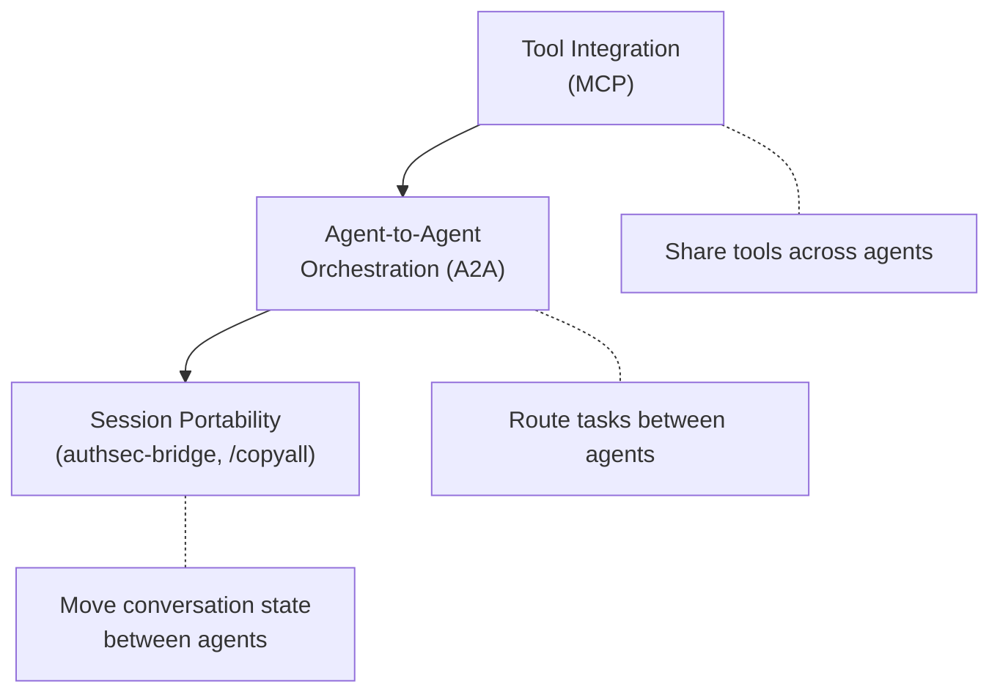
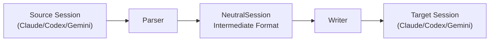

# Cross-Agent Context Transfer: Why Interop Is the Next Bottleneck for Coding Agents


---

The model intelligence race has a ceiling problem. GPT-5.6 Sol, Claude Fable, and Gemini 2.5 Pro all score within a few points of each other on SWE-bench and Terminal-Bench. The differentiator is no longer which model produces the best single-turn answer — it is whether you can move accumulated context between agents without starting from scratch every time you switch tools.

If you have ever pasted a `/copyall` dump from one agent into another and watched half the nuance evaporate, you have already hit the interop bottleneck. This article maps the problem, surveys the emerging solutions, and provides practical configuration for Codex CLI and Claude Code developers who work across both.

## The Cost of Context Loss

A senior developer's typical multi-agent session accumulates three categories of context that do not survive a tool switch:

1. **Conversation history** — the chain of reasoning, rejected approaches, and architectural decisions that led to the current state.
2. **Tool-call artefacts** — file diffs, test results, shell output, and error traces that informed the agent's next move.
3. **Implicit project knowledge** — conventions discovered during the session (naming patterns, test frameworks, deployment targets) that the agent inferred but never wrote down.

Copying the final assistant message captures none of this. The receiving agent has no visibility into *why* the code looks the way it does, and will cheerfully suggest refactors that reverse decisions the first agent made for good reasons.

The New Stack reported in June 2026 that the bottleneck for AI agent capability has shifted decisively from model intelligence to context infrastructure — the ability to feed an agent the right files, tool definitions, conversation history, and retrieved facts at every turn without collapsing the context window [^1].

## Three Layers of the Interop Stack

Agent interoperability is not a single problem. It decomposes into three distinct layers, each with its own protocol contenders.



### Layer 1: Tool Integration — MCP

The Model Context Protocol, now at 97 million monthly SDK downloads [^2], solves tool sharing. Both Codex CLI and Claude Code are first-class MCP clients. A Codex CLI session can call the same MCP servers — database connectors, browser automation, CI/CD pipelines — that a Claude Code session uses. This layer is effectively solved: tool access is portable.

### Layer 2: Agent-to-Agent Orchestration — A2A and codex-as-mcp

Google's Agent-to-Agent (A2A) protocol reached v1.0.0 in January 2026 and is now in production at over 150 organisations [^3]. It defines Agent Cards for capability discovery, a task lifecycle (submitted → working → completed), and structured payloads for cross-agent delegation.

For coding agents specifically, the `codex-as-mcp` server by kky42 provides a more pragmatic bridge. It wraps Codex CLI as an MCP server exposing two tools — `spawn_agent(prompt)` and `spawn_agents_parallel(agents)` — allowing Claude Code or Cursor to delegate execution tasks to Codex without parsing CLI output [^4]. The pattern inverts the traditional relationship: Claude Code handles planning and decomposition; Codex CLI handles parallel execution of well-defined sub-tasks.

```toml
# Claude Code MCP configuration — delegate to Codex
[mcpServers.codex]
command = "uvx"
args = ["codex-as-mcp@latest"]
env = { OPENAI_API_KEY = "sk-..." }
```

The limitation is that context flows one-directionally. The calling client passes prompts to Codex agents, which execute independently and return results. There is no persistent state between invocations — each spawned process is isolated.

### Layer 3: Session Portability — The Unsolved Problem

This is where the bottleneck bites. Moving a full conversation — with its reasoning chain, tool-call history, and accumulated project knowledge — from one agent to another remains unsolved at protocol level.

The crude approach is clipboard transfer. Codex CLI's `@`-mention pattern lets you reference a ChatGPT conversation to bring its context into a coding session. Claude Code's `/copyall` dumps the conversation to clipboard. Both lose tool-call artefacts and compress the reasoning chain into a flat text blob.

## authsec-bridge: Session Translation Without the SaaS

The most promising concrete solution is `authsec-bridge`, an open-source CLI utility that translates session files between agent formats [^5]. It works as a three-stage pipeline:



The tool reads native session files from disk:

- **Claude Code:** `~/.claude/projects/<encoded-cwd>/<uuid>.jsonl`
- **Codex CLI:** `~/.codex/sessions/<Y>/<M>/<D>/rollout-<ts>-<uuid>.jsonl`
- **Gemini CLI:** `~/.gemini/tmp/<project>/chats/session-*.json`

It converts to a `NeutralSession` dataclass, then writes to the target format. Tool invocations are converted to prose summaries — "Each tool invocation becomes a one-line summary attached to the assistant turn that produced it" — preserving understanding whilst eliminating crashes from schema mismatches.

The output drops into the target's session folder so its native `/resume` flow finds the conversation as if you had conducted it there all along. No SaaS, no sync daemon — local files in, local files out.

### What It Preserves and What It Loses

| Preserved | Lost |
|-----------|------|
| Conversation flow and reasoning chain | Raw tool-call schemas |
| Decision rationale and rejected approaches | Exact file diffs (summarised) |
| Project conventions discovered | Agent-specific memory/embeddings |
| Error traces (summarised) | Token counts and billing metadata |

The tool-call summarisation is the key design trade-off. Exact replay of tool calls across incompatible schemas would be brittle and crash-prone. Prose summaries trade fidelity for reliability.

## The Bidirectional Bridge: Real-Time Cross-Agent Collaboration

Rayson Meng's Claude-Codex bidirectional MCP bridge, announced in a GitHub discussion on the openai/codex repository, demonstrated the first real-time cross-agent collaboration within a single live session [^6]. Unlike `authsec-bridge` (which transfers completed sessions), this bridge enables mid-execution context exchange:

- Agents share execution state and code artefacts in real-time via JSON-RPC over a local MCP server
- No cloud intermediary — pure local communication
- The bridge was itself co-written by Claude Code and Codex whilst using the bridge to build itself

The discussion highlighted critical architectural patterns for production deployment:

1. **Session identity separation** — maintain separate provider lineage (Claude session ID + Codex thread ID) despite logical collaboration
2. **Replay safety** — each cross-agent message needs stable IDs, sequence tracking, and explicit acknowledgement for recovery
3. **Permission separation** — MCP notifications should inform rather than automatically authorise actions

## Practical Configuration for Codex CLI

For developers who regularly switch between Codex CLI and Claude Code, the most immediately actionable pattern combines `codex-as-mcp` for task delegation with `authsec-bridge` for session continuity.

### Codex CLI as Execution Backend

Configure Claude Code to delegate well-defined execution tasks to Codex:

```json
{
  "mcpServers": {
    "codex": {
      "command": "uvx",
      "args": ["codex-as-mcp@latest"],
      "timeout": 120
    }
  }
}
```

Set `timeout` generously — Codex sub-agents default to 60 seconds, which is insufficient for test suites or builds.

### Session Handoff Workflow

When switching primary agents mid-task:

```bash
# Transfer a Claude Code session to Codex CLI
authsec-bridge convert \
  --from claude \
  --to codex \
  --session ~/.claude/projects/my-project/abc123.jsonl

# Resume in Codex CLI using the printed session ID
codex --resume <session-id>
```

### AGENTS.md as the Portable Context Layer

The one context artefact that *does* transfer perfectly between agents is the project instruction file. Both Codex CLI (`AGENTS.md`) and Claude Code (`CLAUDE.md`) read project-root instruction files on session start. Maintaining a shared file — or symlinking one to the other — ensures both agents start with identical project knowledge regardless of which tool opens the session.

```bash
# Symlink for bidirectional compatibility
ln -s AGENTS.md CLAUDE.md
```

This is crude but effective. The instruction file captures the conventions, constraints, and architectural decisions that would otherwise be lost in a tool switch. ⚠️ Note that `AGENTS.md` and `CLAUDE.md` have slightly different directive syntaxes; a shared file works for common conventions but agent-specific directives may need conditional sections.

## Where the Protocols Fall Short

None of the current solutions address three fundamental gaps:

1. **Semantic context compression** — when a 200-turn conversation must fit into a 32K instruction budget, which turns matter? Current tools either dump everything or summarise indiscriminately.
2. **Memory and embedding portability** — both Codex CLI and Claude Code maintain session-specific memory stores. These are opaque, proprietary, and non-transferable.
3. **Trust and permission chains** — if Agent A approved a file write, does Agent B inherit that approval? The A2A protocol defines task lifecycles but not permission inheritance across agent boundaries.

The governance gap is particularly acute for enterprise teams. A June 2026 paper on agent interoperability protocols found that MCP, A2A, and ACP collectively cannot express audit trails, liability assignment, or compliance constraints across agent boundaries [^7].

## The Path Forward

The interop bottleneck will not be solved by a single protocol. The likely resolution is a layered stack:

- **MCP** for tool sharing (solved)
- **A2A** for task routing and capability discovery (maturing)
- **A session portability standard** for conversation state transfer (missing)

Until that third layer exists, the practical answer is defensive: keep your project knowledge in portable files (`AGENTS.md`, `CLAUDE.md`), use `authsec-bridge` for session handoffs, and treat `codex-as-mcp` as the delegation bridge for real-time cross-agent work.

The model that wins the next round of benchmarks matters less than the toolchain that lets you use *all* of them without re-explaining your codebase every time you switch.

## Citations

[^1]: The New Stack, "AI Agent Infrastructure Bottleneck", June 2026 — [https://thenewstack.io/ai-agent-infrastructure-bottleneck/](https://thenewstack.io/ai-agent-infrastructure-bottleneck/)
[^2]: Zylos Research, "Agent Interoperability Protocols 2026: MCP, A2A, ACP and the Path to Convergence", March 2026 — [https://zylos.ai/research/2026-03-26-agent-interoperability-protocols-mcp-a2a-acp-convergence/](https://zylos.ai/research/2026-03-26-agent-interoperability-protocols-mcp-a2a-acp-convergence/)
[^3]: Google, "A2A Protocol: Agent-to-Agent Coordination", 2026 — [https://atlan.com/know/google-a2a-protocol/](https://atlan.com/know/google-a2a-protocol/)
[^4]: kky42, "codex-as-mcp: Convert Codex CLI to an MCP Server", GitHub — [https://github.com/kky42/codex-as-mcp](https://github.com/kky42/codex-as-mcp)
[^5]: AuthSec, "Transfer Claude Code Sessions to OpenAI Codex and Gemini", 2026 — [https://authsec.ai/blogs/stop-re-explaining-bridge-claude-codex-gemini](https://authsec.ai/blogs/stop-re-explaining-bridge-claude-codex-gemini)
[^6]: Rayson Meng, "Claude Code Channels (MCP) now talks bidirectionally to Codex App Server", GitHub Discussion #15374 — [https://github.com/openai/codex/discussions/15374](https://github.com/openai/codex/discussions/15374)
[^7]: "Governance Gaps in Agent Interoperability Protocols: What MCP, A2A, and ACP Cannot Express", arXiv, June 2026 — [https://arxiv.org/pdf/2606.31498](https://arxiv.org/pdf/2606.31498)
