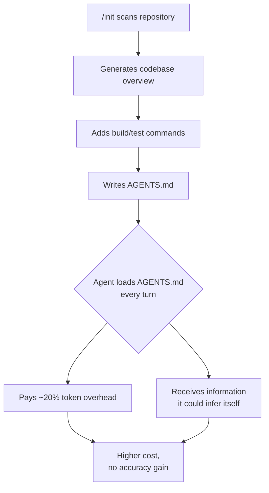
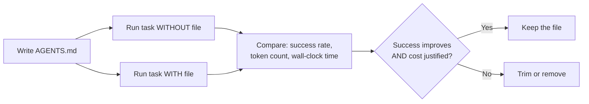

# Do Auto-Generated AGENTS.md Files Actually Help? What Three Studies Say About Instruction File Effectiveness


---

AGENTS.md has become the de facto standard for telling coding agents how to behave in your repository. Over 60,000 repositories now ship one [^1]. Codex CLI, Gemini CLI, Cursor, Copilot, Aider, and Windsurf all read it natively. The pitch is straightforward: drop a markdown file into your repo root describing architecture, conventions, and workflow constraints, and the agent does better work.

But does it?

Three peer-reviewed studies published in the first half of 2026 paint a more complicated picture than the "just run `/init`" advice suggests. The headline finding: **auto-generated instruction files can make your agent worse**, and even hand-written ones need careful engineering to justify their inference cost.

## The Three Studies

### 1. Lulla et al. — Presence vs Absence (January 2026)

Lulla, Mohsenimofidi, Galster, Zhang, Baltes, and Treude ran a paired experiment across 10 repositories and 124 pull requests, comparing Codex agent performance with and without AGENTS.md files [^2].

**Results:**

| Metric | Without AGENTS.md | With AGENTS.md | Change |
|---|---|---|---|
| Median wall-clock time | 98.57s | 70.34s | -28.64% |
| Median output tokens | 2,925 | 2,440 | -16.58% |

The agent ran faster and cheaper with an AGENTS.md present. But this study measured efficiency, not correctness — it did not track whether task outcomes improved. The files used were developer-written, not auto-generated.

### 2. Gloaguen et al. — The ETH Zurich Counterpoint (February 2026)

Gloaguen, Mundler, Muller, Raychev, and Vechev from ETH Zurich and LogicStar.ai tested four major coding agents against 138 real GitHub issues across 12 repositories [^3]. They compared three conditions: no context file, an LLM-generated context file, and developer-committed context files.

**Key findings:**

- LLM-generated context files **decreased** task success rates by approximately 3%
- Both LLM-generated and developer-written files increased inference cost by over 20%
- Developer-written files improved success by only 4%, barely offsetting the cost increase
- 100% of Sonnet-4.5-generated context files contained codebase overviews — information the agent could already discover by reading the repository
- Repository overviews, despite being universally recommended by model providers, were "not helpful"

The core problem: auto-generated files are almost entirely **redundant** with documentation the agent can already find. You are paying a 20% token tax to tell the agent things it already knows.

### 3. dos Santos et al. — Configuration Smells (June 2026)

dos Santos, Costa, Montandon, Silva, and Valente from UFMG catalogued six "configuration smells" — recurring anti-patterns in AGENTS.md and CLAUDE.md files — across 100 popular open-source repositories [^4].

**Smell prevalence:**

| Smell | Files Affected |
|---|---|
| Lint Leakage | 62% |
| Context Bloat | 42% |
| Skill Leakage | 35% |

**91% of popular AGENTS.md and CLAUDE.md files carry at least one configuration smell.** Lint Leakage — duplicating linter rules the agent can read from existing config files — was the most common. Context Bloat — stuffing files with information already available in the codebase — came second. Both smells directly increase token consumption without improving outcomes.

## Why `/init` Falls Short

Codex CLI's `/init` command generates an AGENTS.md scaffold by scanning your repository [^5]. It is a reasonable starting point. But the ETH Zurich findings explain why stopping there is counterproductive:



The `/init` output typically contains:

1. **Repository overview** — the agent can read your README and source tree
2. **Build commands** — the agent can read your `Makefile`, `package.json`, or `Cargo.toml`
3. **Test commands** — same source files, same inference

Every line that restates discoverable information is a line that costs tokens on every turn for zero benefit. The 32 KiB combined AGENTS.md budget in Codex CLI loads on **every single turn** [^6], so bloat compounds across a session.

Currently, `/init` only creates a new file — if AGENTS.md already exists, the command skips entirely. Issue #21932 proposes allowing `/init` to update existing files [^5], but even with updates, the fundamental problem remains: auto-generation optimises for coverage, not signal density.

## What Actually Belongs in AGENTS.md

Cross-referencing all three studies, the pattern is clear. Effective AGENTS.md files contain **information the agent cannot infer from the codebase**:

### Include

- **Non-obvious conventions**: "We use `snake_case` for database columns but `camelCase` for API responses" — a rule that contradicts what the agent might infer from a mixed codebase
- **Deployment constraints**: "Never modify `infrastructure/` without Terraform plan output" — not discoverable from code alone
- **Approval workflows**: "All changes to `auth/` require a security review label"
- **Architecture decisions that contradict defaults**: "We deliberately avoid ORMs — use raw SQL with prepared statements"
- **Known traps**: "The `legacy/` directory uses a different build system — do not apply `src/` conventions there"

### Exclude

- Repository structure summaries
- Build and test commands (already in config files)
- Language-specific linting rules (already in `.eslintrc`, `ruff.toml`, etc.)
- Generic coding best practices ("write clean code", "add tests")

### Practical Template

```markdown
# AGENTS.md

## Non-Obvious Conventions
- Database columns: snake_case. API responses: camelCase. Never mix.
- Error codes follow `ERR_{DOMAIN}_{CODE}` pattern (see errors/registry.ts).

## Forbidden Patterns
- No ORMs. Raw SQL with prepared statements only.
- Never import from `legacy/` into `src/` — they have incompatible build systems.

## Deployment
- All infra changes require `terraform plan` output in the PR description.
- Staging deploys automatically on merge to `develop`. Production requires manual approval.

## Review Requirements
- Changes to `auth/` or `payments/`: security review label required.
- Changes to `api/v1/`: backwards compatibility check required.
```

Note what is absent: no repository overview, no "how to run tests", no architectural description the agent can derive from reading the code. Every line exists because the agent would get it **wrong** without explicit instruction.

## The CLAUDE.md Complication

Claude Code does not read AGENTS.md natively [^1]. If your team uses both Codex CLI and Claude Code, you need a bridging strategy:

```bash
# Option 1: Symlink
ln -s AGENTS.md CLAUDE.md

# Option 2: Import (inside CLAUDE.md)
# @AGENTS.md
```

The symlink approach keeps a single source of truth. The import approach lets you add Claude-specific instructions (such as Claude Code's richer three-layer memory model) alongside the shared file. Either way, the same quality principles apply: every line must earn its place.

## Measuring Your Own AGENTS.md

The research gives us a clear evaluation framework. Before committing an AGENTS.md, test it:

```bash
# Codex CLI: dump what the agent actually loads
codex --print-instructions

# Check combined size
wc -c $(find . -name 'AGENTS.md') | tail -1
```



The ETH Zurich study's methodology is directly replicable: run the same task with and without your AGENTS.md, compare success rate and token consumption. If the file does not measurably improve outcomes, it is expensive noise.

## Recommendations

1. **Never ship a raw `/init` output.** Treat it as a draft, then delete everything the agent can discover on its own.
2. **Target under 100 lines.** The 32 KiB budget is a ceiling, not a goal. Signal density matters more than coverage [^6].
3. **Audit for configuration smells.** If 91% of popular files carry smells [^4], yours probably does too. Check for Lint Leakage (duplicating linter config), Context Bloat (restating README content), and Skill Leakage (embedding tool-specific instructions that belong in skills).
4. **Measure, do not assume.** Run `--print-instructions` to see exactly what loads. Compare task outcomes with and without the file. The 20% cost overhead is real [^3].
5. **Prefer non-obvious constraints.** Every line should encode something the agent would get wrong without it. If the agent would figure it out from your code, the line is waste.

## Citations

[^1]: Blink, "AGENTS.md vs CLAUDE.md: The Definitive Guide (2026)," [https://blink.new/blog/agents-md-vs-claude-md](https://blink.new/blog/agents-md-vs-claude-md)

[^2]: J. L. Lulla, F. Mohsenimofidi, M. Galster, H. Zhang, S. Baltes, and C. Treude, "On the Impact of AGENTS.md Files on the Efficiency of AI Coding Agents," arXiv:2601.20404, January 2026. [https://arxiv.org/abs/2601.20404](https://arxiv.org/abs/2601.20404)

[^3]: T. Gloaguen, N. Mundler, M. Muller, V. Raychev, and M. Vechev, "Evaluating AGENTS.md: Are Repository-Level Context Files Helpful for Coding Agents?" arXiv:2602.11988, February 2026. [https://arxiv.org/abs/2602.11988](https://arxiv.org/abs/2602.11988)

[^4]: H. V. F. dos Santos, V. Costa, J. E. Montandon, L. L. Silva, and M. T. Valente, "Configuration Smells in AGENTS.md Files: Common Mistakes in Configuring Coding Agents," arXiv:2606.15828, June 2026. [https://arxiv.org/abs/2606.15828](https://arxiv.org/abs/2606.15828)

[^5]: "Allow /init to update existing AGENTS.md," GitHub Issue #21932, openai/codex, May 2026. [https://github.com/openai/codex/issues/21932](https://github.com/openai/codex/issues/21932)

[^6]: CodeGateway, "AGENTS.md for Codex CLI (2026): Lookup Order, Limits & Monorepo Templates," [https://www.codegateway.dev/en/blog/agents-md-playbook-2026](https://www.codegateway.dev/en/blog/agents-md-playbook-2026)
