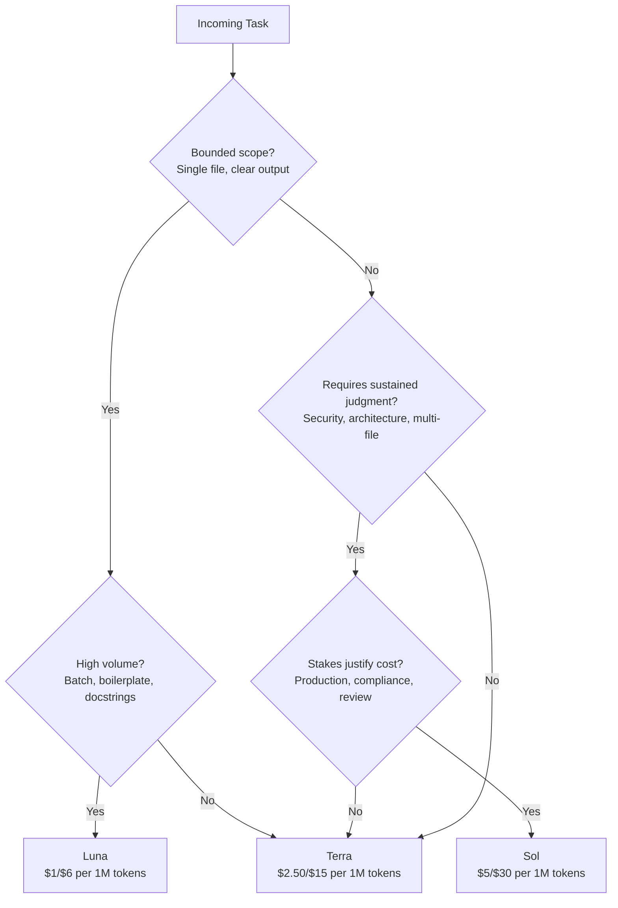

# Model Routing Patterns for Coding Agents: A Sol, Terra, Luna Decision Framework


---

GPT-5.6 landed on 9 July 2026 as the first OpenAI model family shipped explicitly as a three-tier hierarchy: Sol for frontier reasoning, Terra as the balanced workhorse, and Luna for high-volume throughput [^1]. For Codex CLI developers, this creates a new operational question that previous single-model releases never posed: which tier does a given task deserve?

This article provides a practical decision framework for routing tasks across the three tiers, with concrete Codex CLI configuration, cost analysis, and guidance on where each tier excels and where it wastes tokens.

## The Three-Tier Hierarchy

All three models share a 1-million-token context window and 128,000-token maximum output, with a knowledge cutoff of 16 February 2026 [^2]. What differs is reasoning depth and cost:

| Tier | Model ID | Input (per 1M tokens) | Output (per 1M tokens) | Reasoning Depth |
|------|----------|----------------------|------------------------|-----------------|
| Sol | `gpt-5.6-sol` | \$5.00 | \$30.00 | Deepest — six effort levels (Low through Ultra) |
| Terra | `gpt-5.6-terra` | \$2.50 | \$15.00 | Balanced — competitive with GPT-5.5 |
| Luna | `gpt-5.6-luna` | \$1.00 | \$6.00 | Shallowest — optimised for speed and volume |

The bare `gpt-5.6` API alias routes to Sol [^3]. Developers who accept the default without configuring routing are paying flagship prices for every task — including docstring generation and boilerplate scaffolding.

## Benchmark Reality Check

Raw benchmarks suggest the performance gap between tiers is narrower than the price gap:

- **Artificial Analysis Coding Agent Index**: Sol 80, Terra 77.4, Luna 74.6 [^4]
- **Terminal-Bench 2.1** (agentic coding): Sol 88.8%, Sol Ultra 91.9% [^4]
- **DeepSWE cost efficiency**: Luna delivers approximately 24 benchmark points per estimated API dollar versus Sol's ~6 [^4]

The critical nuance: Sol's advantage concentrates on long-horizon agentic tasks requiring sustained judgment — security reviews, architecture refactors, multi-file dependency analysis. For bounded, well-scoped tasks, Terra and Luna approach Sol's quality at a fraction of the cost.

One gap worth noting: SWE-Bench Pro (repository-level coding) remains a weakness across all GPT-5.6 tiers, with Sol at 64.6% trailing Claude Fable 5's 80.3% [^4]. Model routing does not fix a model-family-level gap; it optimises within the family.

## Programmatic Tool Calling: The Hidden Multiplier

GPT-5.6 introduced programmatic tool calling in the Responses API, allowing models to compose and execute JavaScript in-memory to coordinate tool calls without round-tripping every intermediate result through the expensive inference path [^1]. This reduces output tokens by approximately 24% and completes multi-tool tasks 28% faster [^1].

For routing decisions, the implication is significant: Terra with programmatic tool calling may outperform Sol without it on complex multi-tool workflows, simply because the coordination overhead drops. If your workflow chains shell commands, file reads, and API calls, enabling programmatic tool calling at the Terra tier is often the correct first move before escalating to Sol.

## The Decision Framework



The decision tree encodes a single principle: **default to Terra, escalate to Sol only when sustained judgment is required and the stakes justify it, drop to Luna for volume work**.

### Task-Tier Mapping

| Task Category | Recommended Tier | Rationale |
|--------------|-----------------|-----------|
| Security review, architecture decisions | Sol | Benefits from deepest reasoning chain |
| Complex multi-file refactors | Sol | Cross-file dependency tracking |
| Daily feature development | Terra | Competitive quality at half Sol's price |
| Code review of bounded PRs | Terra | Sufficient judgment for scoped review |
| Docstring generation, formatting | Luna | Bulk operation, quality floor is adequate |
| Test scaffolding, boilerplate | Luna | Predictable output, speed matters |
| Sub-agent delegation | Luna | Volume and latency trump peak reasoning [^5] |

## Codex CLI Configuration

### Named Profiles

Named profiles are the cleanest mechanism for task-tier routing. When you pass `--profile <name>`, Codex CLI loads `~/.codex/config.toml` then overlays `~/.codex/<name>.config.toml` [^5]:

```toml
# ~/.codex/sol.config.toml
model = "gpt-5.6-sol"
model_reasoning_effort = "high"
```

```toml
# ~/.codex/terra.config.toml
model = "gpt-5.6-terra"
model_reasoning_effort = "high"
```

```toml
# ~/.codex/luna.config.toml
model = "gpt-5.6-luna"
model_reasoning_effort = "medium"
```

Launch with the appropriate profile:

```bash
# Architecture review — bring Sol
codex --profile sol "Review the auth module for security vulnerabilities"

# Daily development — Terra as default
codex --profile terra "Add pagination to the users endpoint"

# Bulk docstrings — Luna for volume
codex --profile luna "Add JSDoc comments to all exported functions in src/utils/"
```

### Runtime Model Switching

For sessions where the task scope shifts, use `/model` interactively to switch without restarting:

```
/model gpt-5.6-sol
```

This requires Codex CLI v0.144.0 or later [^3]. The model switch applies immediately to subsequent turns.

### The Sub-Agent Inheritance Problem

A critical caveat: when Sol Ultra spawns sub-agents, every child inherits the parent's model and reasoning effort [^5]. The `spawn_agent` tool does not support per-child model selection. If your parent agent runs Sol Ultra, each sub-agent also runs Sol Ultra — creating a token multiplication effect of 6-12x [^6].

The practical workaround is to avoid Ultra for orchestration-heavy tasks. Use Sol at High or Max reasoning effort for the parent, and structure your AGENTS.md to prefer explicit sequential work over sub-agent delegation when token budgets matter.

## Cost Modelling: A Worked Example

Consider a typical day of Codex CLI usage across a moderately complex codebase:

| Task | Tier | Est. Input Tokens | Est. Output Tokens | Cost |
|------|------|-------------------|-------------------|------|
| Morning architecture review | Sol | 200K | 50K | \$2.50 |
| 4 feature implementations | Terra | 800K | 200K | \$5.00 |
| Bulk test generation | Luna | 400K | 300K | \$2.20 |
| 2 PR reviews | Terra | 300K | 80K | \$1.95 |
| **Total** | | **1.7M** | **630K** | **\$11.65** |

The same workload on Sol alone would cost approximately \$19.90 — a 71% premium for marginal quality improvement on the bounded tasks. Over a month of weekday usage, that gap compounds to roughly \$165.

## Reasoning Effort as the Second Axis

Model tier is only half the routing equation. GPT-5.6 Sol exposes six reasoning effort levels: Low, Medium, High, Extra High, Max, and Ultra [^6]. Combined with tier selection, this creates an 18-cell matrix — but most cells are redundant.

The practical sweet spots:

```toml
# Quick Sol — architecture questions, fast judgment
model = "gpt-5.6-sol"
model_reasoning_effort = "medium"

# Deep Sol — security audit, compliance review
model = "gpt-5.6-sol"
model_reasoning_effort = "high"

# Terra daily driver
model = "gpt-5.6-terra"
model_reasoning_effort = "high"

# Luna bulk — maximum throughput
model = "gpt-5.6-luna"
model_reasoning_effort = "low"
```

Avoid Sol Ultra unless the task genuinely requires multi-agent coordination that you cannot decompose into sequential steps. The token multiplication and sub-agent inheritance issues make Ultra an expensive default [^6].

## Fleet Enforcement with requirements.toml

For teams, `requirements.toml` prevents individual developers from defaulting to Sol for everything:

```toml
# .codex/requirements.toml — project-level
[model]
default = "gpt-5.6-terra"
allowed = ["gpt-5.6-sol", "gpt-5.6-terra", "gpt-5.6-luna"]

[rollout]
max_tokens_per_session = 500000
```

This sets Terra as the project default whilst allowing developers to escalate to Sol when needed, with a token budget as a natural circuit breaker [^5].

## When to Ignore the Framework

Three scenarios where rigid routing hurts:

1. **Exploratory work** — when you do not know the task's complexity upfront, start with Terra and escalate if the model struggles. Watching for repeated failed attempts is a clearer signal than guessing tier requirements in advance.

2. **Latency-critical workflows** — Luna's speed advantage matters in CI pipelines and automated checks where wall-clock time directly affects developer feedback loops.

3. **Context-heavy sessions** — if a session has already built substantial context (large files read, complex state), switching models mid-session loses cached prompt prefixes. The cost of rebuilding context may exceed the savings from dropping a tier. Use prompt cache breakpoints [^2] to mitigate this.

## Conclusion

GPT-5.6's three-tier architecture shifts the optimisation target from "pick the best model" to "route each task to the appropriate tier." The framework is straightforward: Terra as default, Sol for sustained judgment under high stakes, Luna for volume. Named profiles, runtime `/model` switching, and fleet-level `requirements.toml` provide the configuration surface. The real discipline is resisting the reflex to run everything on Sol — the benchmarks show the gap rarely justifies the cost, and the sub-agent inheritance problem makes Ultra actively counterproductive for most orchestration patterns.

---

## Citations

[^1]: OpenAI, "GPT-5.6: Frontier intelligence that scales with your ambition," openai.com, 9 July 2026. [https://openai.com/index/gpt-5-6/](https://openai.com/index/gpt-5-6/)

[^2]: Simon Willison, "The new GPT-5.6 family: Luna, Terra, Sol," simonwillison.net, 9 July 2026. [https://simonwillison.net/2026/Jul/9/gpt-5-6/](https://simonwillison.net/2026/Jul/9/gpt-5-6/)

[^3]: QCode, "Use GPT-5.6 (Sol / Terra / Luna) in Codex CLI: 4-Step Setup Guide," qcode.cc, July 2026. [https://qcode.cc/en/codex-enable-gpt-5-6](https://qcode.cc/en/codex-enable-gpt-5-6)

[^4]: Vellum, "GPT-5.6 Sol vs Terra vs Luna: Which Tier Should You Actually Use?" vellum.ai, July 2026. [https://www.vellum.ai/blog/gpt-5-6-benchmarks-explained](https://www.vellum.ai/blog/gpt-5-6-benchmarks-explained)

[^5]: OpenAI Developers, "Advanced Configuration," developers.openai.com, July 2026. [https://developers.openai.com/codex/config-advanced](https://developers.openai.com/codex/config-advanced)

[^6]: Daniel Vaughan, "The Ultra Mode Trade-Off: When GPT-5.6 Sol's Bigger Reasoning Budgets Backfire in Codex CLI," codex.danielvaughan.com, 27 July 2026. [https://codex.danielvaughan.com/2026/07/27/gpt56-sol-ultra-mode-tradeoff-reasoning-budgets-subagent-cost-codex-cli/](https://codex.danielvaughan.com/2026/07/27/gpt56-sol-ultra-mode-tradeoff-reasoning-budgets-subagent-cost-codex-cli/)
