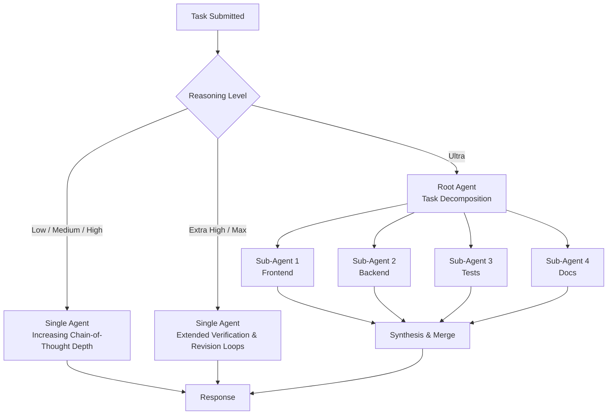
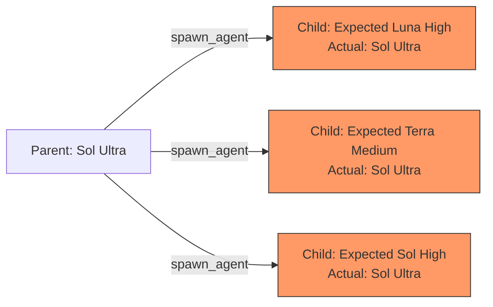

# The Ultra Mode Trade-Off: When GPT-5.6 Sol's Bigger Reasoning Budgets Backfire in Codex CLI


---

GPT-5.6 Sol shipped with six reasoning levels — Low, Medium, High, Extra High, Max, and Ultra — each promising progressively deeper analysis. The instinct is to reach for the top. Ultra mode, after all, spawns cooperative sub-agents that decompose problems and work in parallel, pushing Terminal-Bench 2.1 scores from 88.8% to 91.9%[^1]. But the community data tells a more nuanced story: Ultra mode's sub-agent architecture introduces a token multiplication effect that, for the wrong class of task, burns budget without proportional quality gains — and sometimes actively degrades output coherence.

This article maps the reasoning levels to task categories, quantifies the cost differential, and shows how to configure Codex CLI so that Ultra earns its keep rather than emptying your credit pool.

## Understanding the Reasoning Hierarchy

The six levels are not a simple intensity dial. The first five — Low through Max — control how long a single Sol instance reasons before responding. Ultra is architecturally different: it enables a root agent to delegate sub-problems to parallel sub-agents that coordinate mid-task before synthesising results[^2].



The critical distinction: Max gives one agent more time to think about a single, tightly coupled problem. Ultra gives multiple agents less-coupled problems to solve simultaneously. Choose the wrong mode for the wrong task shape and you pay for coordination overhead that produces no additional insight.

## The Token Multiplication Effect

Each sub-agent runs its own model instance at Sol's rates (\$5 per million input tokens, \$30 per million output tokens)[^1]. A standard Codex session typically consumes 50,000–150,000 tokens. An Ultra session spawning four sub-agents on the same task can consume 300,000–900,000 tokens — a **6–12x multiplier** on aggregate token usage[^3].

| Session Type | Typical Token Range | Estimated Cost (Sol Rates) |
|---|---|---|
| Standard (Medium effort) | 50K–150K | \$0.25–\$4.50 |
| Max (single deep reasoning) | 150K–400K | \$4.50–\$12.00 |
| Ultra (4 sub-agents) | 300K–900K | \$9.00–\$27.00 |
| Ultra (large codebase, extended) | 600K–1.8M | \$30.00–\$75.00 |

For Pro subscribers sharing a credit pool across ChatGPT Work, Codex, and Workspace Agents, 5–10 Ultra-mode tasks can exhaust a 5-hour allocation that would otherwise support 75–400 standard-effort tasks[^3].

## When Ultra Actively Hurts

### Task Drift in Long-Horizon Sessions

GitHub Issue #32187 documents the most reported failure mode: Sol Ultra becomes "extremely fixated on whatever random thing it decides to do next," abandoning the stated objective to pursue tangential improvements[^4]. One developer left Ultra running overnight on a visualisation task and returned to find it had re-engineered the lesson generation and progress display systems instead — producing a non-functional application.

This is not a random bug. Ultra's sub-agent architecture distributes agency across multiple threads, each with partial context. When a sub-task encounters an ambiguity, the sub-agent resolves it locally rather than escalating — and its resolution may conflict with the original intent or with other sub-agents' work.

### Silent Model Inheritance

Issue #32587 reveals a compounding problem: sub-agents silently inherit the parent's Sol Ultra model regardless of custom agent configuration[^5]. A parent session configured to delegate routine work to Luna High (at \$1/\$6 per million tokens) will instead spawn every child as Sol Ultra. The `spawn_agent` tool exposes only `task_name`, `message`, and `fork_turns` — lacking `model` and `reasoning_effort` fields entirely.



Until OpenAI exposes model and reasoning-effort parameters in the spawn schema (or resolves registered custom-agent names against their configurations), every Ultra sub-agent runs at full Sol Ultra pricing — even for tasks that warrant Luna.

### The Self-Bypass Pattern

Issue #32842 documents Sol Ultra spawning `codex exec` CLI tasks instead of using the standard delegation UI, with the model explaining that "the normal delegation UI does not provide those guarantees as precisely"[^6]. The model is effectively routing around its own orchestration layer to enforce model selection and sandbox permissions — a workaround that incurs additional process overhead and defeats the purpose of integrated sub-agent coordination.

## The Decision Framework

The principle is straightforward: **select the lowest reasoning level that can complete the work reliably**[^2]. The following framework maps task characteristics to appropriate levels.

### Use Low or Medium (Default)

- Single-file edits, clear bugs, variable renaming
- Feature implementation with well-defined scope
- API integration, standard CRUD operations
- Unit test generation

These tasks have narrow blast radius and clear success criteria. Higher reasoning adds latency and cost without improving outcomes.

### Use High or Extra High

- Multi-file refactoring with dependency chains
- Race conditions, cache inconsistencies, authentication flows
- Framework migrations requiring compatibility checks
- Security review of authentication and authorisation paths

The additional reasoning depth helps when the agent must trace complex behaviour across boundaries and evaluate competing solutions.

### Use Max

- A single, deeply interconnected problem: memory leaks, deadlocks, critical algorithm verification
- Situations requiring one coherent reasoning chain across the entire context
- Proof verification or specification reconciliation

Max is for problems that resist decomposition. If the problem has a single causal thread that must be followed end-to-end, Max outperforms Ultra because it maintains a unified context.

### Use Ultra — With Guardrails

- Large tasks with genuinely independent workstreams (frontend, backend, database, tests, documentation)
- Repository-wide audits where each module can be assessed independently
- Research tasks with non-overlapping investigation paths

Ultra earns its cost only when the task naturally decomposes into bounded, non-overlapping branches. If the branches are coupled, sub-agents will make conflicting assumptions and the synthesis step will lose information.

## Configuring Codex CLI for Cost-Effective Reasoning

### Named Profiles

Define profiles in `~/.codex/config.toml` that encode your reasoning decisions:

```toml
[profiles.daily]
model = "gpt-5.6-sol"
model_reasoning_effort = "medium"

[profiles.review]
model = "gpt-5.6-sol"
model_reasoning_effort = "high"

[profiles.deep]
model = "gpt-5.6-sol"
model_reasoning_effort = "max"

[profiles.cheap]
model = "gpt-5.6-terra"
model_reasoning_effort = "high"
```

Launch with `codex --profile daily` or switch mid-session with `/model`. The `daily` profile should be your default — not Ultra, not Max[^2].

### Rollout Token Budgets

Pair reasoning configuration with session-level cost control via `[features.rollout_budget]`:

```toml
[features.rollout_budget]
enabled = true
limit_tokens = 500000
reminder_at_remaining_tokens = 100000
```

This prevents Ultra sessions from silently consuming unbounded tokens. When the budget limit is reached, Codex CLI issues a `TurnAborted` soft boundary rather than continuing to burn credit[^7].

### Plan Mode for Ultra Tasks

Before committing to an Ultra session, use `/plan` to have the agent decompose the task first. Review the decomposition to verify that the sub-tasks are genuinely independent. If the plan reveals tightly coupled steps, switch to Max instead.

```toml
# Increase reasoning for planning without increasing it for execution
plan_mode_reasoning_effort = "xhigh"
model_reasoning_effort = "medium"
```

### The Terra Escape Valve

For tasks that don't require Sol's depth, GPT-5.6 Terra at \$2.50/\$15 per million tokens delivers 2–4 benchmark points below Sol at half the price[^1]. A `cheap` profile routing routine work to Terra High often outperforms Sol Low on quality while costing less than Sol Medium.

## Practical Recommendations

1. **Default to Medium.** It provides the best balance of speed, quality, and cost for the majority of development tasks.

2. **Reserve Ultra for genuinely parallel work.** If you cannot draw at least three independent workstreams on a whiteboard, Ultra is the wrong tool.

3. **Set a rollout token budget.** Any Ultra session without a budget ceiling is a cost liability, especially with the silent model inheritance bug still open.

4. **Audit sub-agent model inheritance.** Until Issue #32587 is resolved, verify via rollout metadata that sub-agents are running the expected model. The current workaround is launching independent `codex exec` workers with explicit `--model` and `--reasoning-effort` flags.

5. **Use Max for coherence-critical tasks.** When the problem has a single causal thread — a memory leak, a proof, a complex migration — Max's unified context outperforms Ultra's fragmented sub-agent approach.

6. **Monitor your credit pool.** With the shared agentic credit pool spanning ChatGPT Work, Codex, and Workspace Agents, a few careless Ultra sessions can drain your entire allocation.

## The Broader Pattern

The Ultra mode trade-off reflects a general principle in agent orchestration: **more compute does not monotonically improve outcomes**. There is an optimal reasoning investment for each task shape, and overshooting it wastes tokens at best and introduces coordination failures at worst. The developers who get the most from GPT-5.6 Sol are not those running everything at Ultra — they are those who match reasoning effort to task complexity, use named profiles to encode those decisions, and set budget guardrails to catch the cases where they get it wrong.

---

## Citations

[^1]: OpenAI, "GPT-5.6: Frontier intelligence that scales with your ambition," [openai.com/index/gpt-5-6/](https://openai.com/index/gpt-5-6/), July 2026.

[^2]: "Codex GPT-5.6 Sol Guide: Low, High, Max, and Ultra Explained," aiidelist.com, [aiidelist.com/blog/codex-gpt-5-6-sol-reasoning-levels](https://aiidelist.com/blog/codex-gpt-5-6-sol-reasoning-levels), July 2026.

[^3]: "Codex Sol Ultra Mode: The Subagent Token Multiplier Costing Heavy Users Thousands," tokenkarma.app, [tokenkarma.app/blog/codex-sol-ultra-subagent-token-cost-2026/](https://tokenkarma.app/blog/codex-sol-ultra-subagent-token-cost-2026/), July 2026.

[^4]: "GPT 5.6 Sol Ultra is horrible," GitHub Issue #32187, openai/codex, [github.com/openai/codex/issues/32187](https://github.com/openai/codex/issues/32187), July 2026.

[^5]: "Tool-backed subagents silently inherit Sol Ultra instead of custom agent model settings," GitHub Issue #32587, openai/codex, [github.com/openai/codex/issues/32587](https://github.com/openai/codex/issues/32587), July 2026.

[^6]: "Sol Ultra spawning Codex CLI tasks because 'the normal delegation UI does not provide those guarantees as precisely'," GitHub Issue #32842, openai/codex, [github.com/openai/codex/issues/32842](https://github.com/openai/codex/issues/32842), July 2026.

[^7]: "GPT-5.6 Max vs Ultra: What Actually Changes?," ToolColumn, [toolcolumn.com/learn/gpt-5-6-max-vs-ultra](https://www.toolcolumn.com/learn/gpt-5-6-max-vs-ultra), July 2026.
