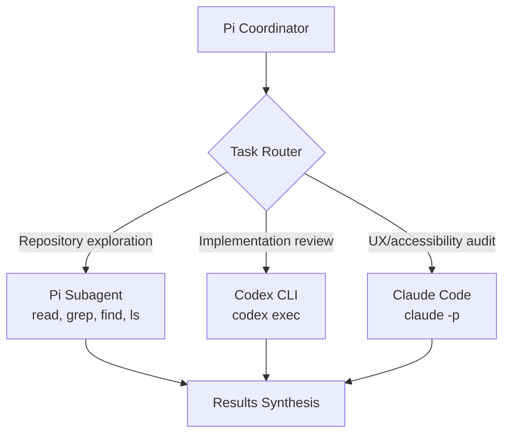
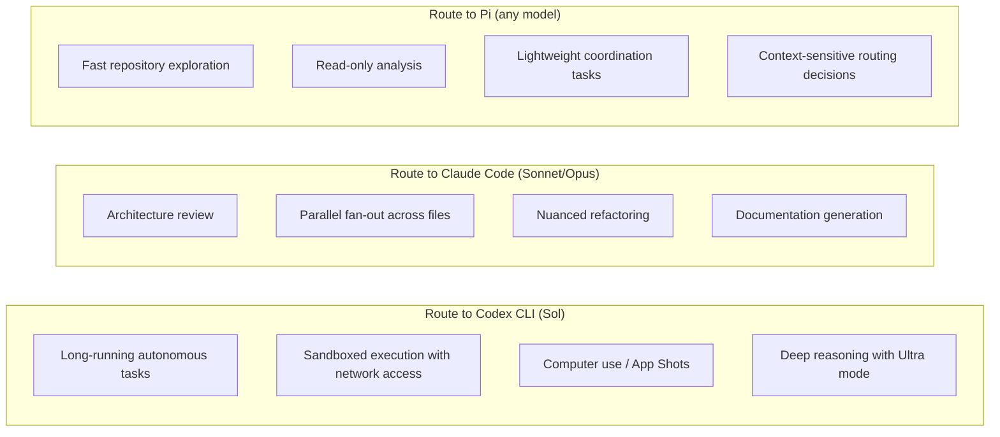
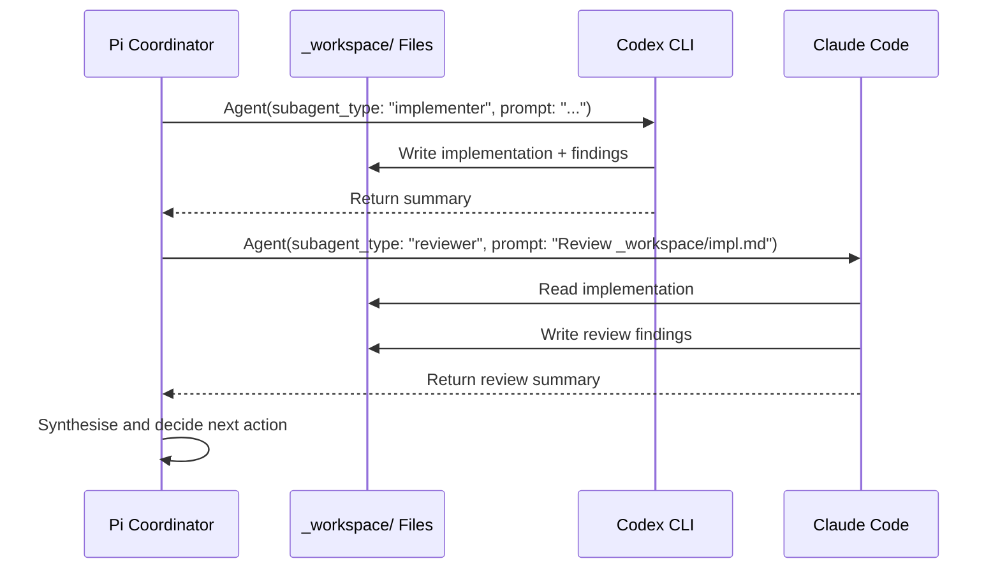

# The Meta-Harness Pattern: Orchestrating Codex CLI and Claude Code as Sub-Agents Through Pi


---

## The Problem: One Agent Is Never Enough

Every coding agent has a shape. Codex CLI excels at long-running autonomous tasks with its kernel-level sandbox and GPT-5.6 Sol's deep reasoning. Claude Code dominates architecture review, nuanced refactoring, and parallel fan-out through its Task tool. Pi — Mario Zechner's minimal open-source harness — ships four core tools (read, write, edit, bash) and a TypeScript extension system that makes it trivially composable [^1].

The question senior developers increasingly face is not *which* agent to use, but *how to use all three simultaneously* — routing each task to whichever agent handles it best. This is the meta-harness pattern: a lightweight coordinator that spawns competing coding agents as sub-agents, dispatching work by model strength rather than brand loyalty.

## How Pi Became a Coordinator

Pi's architecture thesis is radical minimalism: a coding agent needs exactly four tools and a system prompt under 1,000 tokens [^1]. Everything else — tools, context management, skills, themes, UI — is a replaceable TypeScript extension running in-process with full access to the harness API.

This makes Pi uniquely suited as a coordinator. Where Codex CLI's multi-agent V2 delegates only to other Codex instances [^2], and Claude Code's Task tool spawns only Claude sub-agents [^3], Pi's extension system imposes no such constraint. An extension can shell out to any CLI binary — including `codex exec` and `claude -p`.

Two community projects have formalised this into reusable frameworks:

### pi-flow: Profile-Based Cross-Harness Delegation

pi-flow (by kky42) introduces two primitives — **Agent** for single focused tasks and **workflow** for parallel independent tasks — with a profile system that routes each delegation to a specific backend [^4].



Profiles live as Markdown files in `~/.pi/agent/subagents/`, where the filename becomes the subagent type. Each profile specifies a backend, model, thinking level, tools, and role instructions:

```markdown
---
description: Reviews implementation changes for correctness.
backend: codex
model: gpt-5.5
thinking: high
---
Review the current diff. Lead with concrete findings.
```

```markdown
---
description: Reviews frontend for UX and accessibility.
backend: claude
model: sonnet
thinking: high
---
Inspect frontend changes and recommend improvements.
```

Invocation is straightforward — the coordinator calls `Agent()` with a subagent type and prompt:

```typescript
Agent({
  description: "Map the authentication flow",
  subagent_type: "explorer",
  prompt: "Trace login from HTTP entry to session creation.",
});
```

The `session_key` parameter enables review-and-revise loops by resuming the same backend conversation across calls [^4].

### pi-agent-harness: Team Architecture Factory

pi-agent-harness (by Baryon Labs) takes a higher-level approach: give it a domain description and it generates agent definitions, skills, and orchestration prompts automatically [^5]. It implements six architecture patterns mapped to Pi's delegation modes:

| Pattern | Delegation Mode | Use Case |
|---------|----------------|----------|
| Pipeline | `chain` | Sequential steps with `{previous}` context passing |
| Fan-out/Fan-in | `parallel` | Independent concurrent work, coordinator integrates |
| Expert Pool | `single` | Selective task routing by speciality |
| Producer-Reviewer | `chain` | Iterative refinement loops |
| Supervisor | Dynamic `parallel` | Coordinator orchestrates adaptive workflows |
| Hierarchical | Nested delegation | Two-level delegation trees |

Each delegation spawns a separate Pi process. Results exchange through workspace files in `_workspace/` rather than live messaging, which avoids the context-window pollution that plagues deeply nested agent trees [^5].

## The Routing Decision Framework

The meta-harness pattern's value depends entirely on routing intelligence. Ben Davis's original demonstration — using Pi to route tasks to Codex for computer use and long-running work, and to Claude (via Anthropic's Fable model) for architecture and code aesthetics — illustrates the principle [^6].

A practical routing matrix for 2026:



The key insight is that model capability matters more than harness capability. GPT-5.6 Sol at Ultra reasoning spawns cooperative sub-agents internally, pushing Terminal-Bench 2.1 from 88.8% to 91.9% — but at 6–12× token multiplication [^7]. Claude Code's Task tool caps at 7 concurrent sub-agents but achieves 50–70% time reduction on multi-file work [^3]. Pi's minimal overhead means it adds almost nothing to the coordination cost.

## Cross-Agent Context Transfer

The meta-harness pattern's weakest link is context transfer. Each agent maintains its own conversation history in isolation. pi-flow addresses this partially through two mechanisms:

1. **Workspace file handoffs**: Results written to `_workspace/` files are readable by all subsequent agents
2. **Session keys**: The `session_key` parameter in pi-flow resumes backend conversations, maintaining context within a single agent across multiple delegations

What remains missing is a proper interop standard. Davis's approach — using Pi's `/copyall` command to copy entire conversation threads to clipboard for pasting into another agent — is crude but effective [^6]. The emerging pattern resembles MCP's approach to tool sharing but applied at the conversation level rather than the tool level.



## Headless Execution and CI Integration

pi-flow exposes a headless API for non-interactive pipelines [^4]:

```typescript
import { executeWorkflow } from "@kky42/pi-flow/headless";

const run = await executeWorkflow({
  script,
  cwd: process.cwd(),
  args: { topic: "auth-migration" },
  signal,
  maxConcurrentSubagents: 4,
  subagentTimeoutMs: 30 * 60_000,
  allowedBackends: ["pi", "codex"],
  onUsage: (usage) => console.log("cumulative", usage),
});
```

Runtime policies enforce bounded concurrency (shared queue across all subagents), cancellation propagation (aborts cascade to child processes), and usage tracking (duration, tokens, cache hits, estimated costs). The `allowedBackends` whitelist lets CI pipelines restrict which external CLIs are permitted — critical for environments where only one provider is approved.

## Security Considerations

Pi-flow's security model assumes a trusted development environment. Codex executes with its own sandbox but approval bypassed; Claude runs with permission checks bypassed [^4]. This is acceptable for local development but alarming for shared CI.

Three mitigations worth implementing:

1. **Backend allowlisting**: Use `allowedBackends` to restrict to approved CLIs in CI
2. **Codex sandbox preservation**: Even when called via `codex exec`, Codex CLI's Bubblewrap/Seatbelt kernel sandbox remains active — file writes are confined and network access defaults to off [^2]
3. **Timeout enforcement**: The `subagentTimeoutMs` parameter prevents runaway agents from consuming unbounded resources

⚠️ Pi-backed children cannot nest agents or workflows, preventing unbounded recursion. However, Codex and Claude sub-agents retain their native tool access, meaning a Codex sub-agent *can* spawn its own multi-agent V2 tree if the model chooses to. This is not currently bounded by pi-flow.

## When the Meta-Harness Pattern Breaks Down

The pattern has clear failure modes:

- **Token overhead**: Each cross-agent delegation serialises context to workspace files, adding latency and losing conversational nuance. For tasks requiring tight iterative loops, staying within a single agent is faster.
- **Debugging opacity**: When a Codex sub-agent spawns its own V2 sub-agents, the resulting delegation tree is three levels deep across two harnesses. Codex V2's encrypted inter-agent payloads make the bottom two levels opaque [^2].
- **Cost multiplication**: Running Sol Ultra through Pi coordination can trigger Ultra's own sub-agent spawning, meaning a single pi-flow delegation could fan out to 23–25 internal Codex sub-sessions [^7].

The meta-harness is most effective for **heterogeneous review workflows** — where different agents inspect the same artefact from different angles — and **staged pipelines** — where one agent implements and another reviews. It is least effective for tight edit-test-fix loops where context continuity matters more than model diversity.

## Practical Setup

Getting started requires Pi, Codex CLI, and Claude Code installed with valid authentication:

```bash
# Install pi-flow into Pi
pi install npm:@kky42/pi-flow

# Verify backends are accessible
codex --version   # v0.145.0+
claude --version  # v2.x+

# Create a reviewer profile
mkdir -p ~/.pi/agent/subagents
cat > ~/.pi/agent/subagents/code-reviewer.md << 'EOF'
---
description: Reviews code changes for correctness and security.
backend: codex
model: gpt-5.6-sol
thinking: high
---
Review the diff. Flag security issues, logic errors, and performance concerns.
Lead with concrete findings, not style nits.
EOF
```

## What This Means for Codex CLI Users

The meta-harness pattern validates a prediction embedded in Codex CLI's architecture: that coding agents would become composable infrastructure rather than monolithic tools. Pi's extension system — not Codex's, not Claude Code's — became the coordination layer because it imposed the fewest constraints on what a sub-agent could be.

For Codex CLI users, the practical takeaway is that `codex exec` is now a first-class delegation target for external orchestrators. Your AGENTS.md configuration, named profiles, and sandbox settings all apply regardless of whether Codex is invoked directly or through a pi-flow profile. The agent doesn't know or care who called it — which is exactly the right abstraction.

---

## Citations

[^1]: Mario Zechner, "Pi Coding Agent," pi.dev, 2026. [https://pi.dev](https://pi.dev) — Pi's core architecture: four tools, sub-1000-token system prompt, TypeScript extension system.

[^2]: OpenAI, "Codex CLI Multi-Agent V2," GitHub openai/codex, 2026. [https://github.com/openai/codex](https://github.com/openai/codex) — spawn_agent tool, agent_max_depth limits, encrypted inter-agent payloads in V2, Bubblewrap/Seatbelt kernel sandbox.

[^3]: Anthropic, "Claude Code Sub-Agents and Dynamic Workflows," docs.anthropic.com, May 2026. [https://docs.anthropic.com/en/docs/claude-code](https://docs.anthropic.com/en/docs/claude-code) — Task tool spawning up to 7 concurrent sub-agents, 50–70% time reduction on multi-file work, dynamic workflows fan-out.

[^4]: kky42, "pi-flow: Use Claude Code, Codex, Pi as subagents in complex workflows," GitHub, 2026. [https://github.com/kky42/pi-flow](https://github.com/kky42/pi-flow) — Profile system, Agent/workflow primitives, headless API, session_key continuation, security model, runtime policies.

[^5]: Baryon Labs, "pi-agent-harness: Team architecture factory for Pi," GitHub, 2026. [https://github.com/baryonlabs/pi-agent-harness](https://github.com/baryonlabs/pi-agent-harness) — Six orchestration patterns (pipeline, fan-out/fan-in, expert pool, producer-reviewer, supervisor, hierarchical), workspace file handoffs, subagent delegation modes.

[^6]: Ben Davis, "I Created the Ultimate Coding Agent by Combining Pi, Codex, and Claude Code," YouTube, 2026-07-24. [https://www.youtube.com/watch?v=5Qu2SkSQeBU](https://www.youtube.com/watch?v=5Qu2SkSQeBU) — First practical demonstration of Pi as meta-harness routing to Codex (Sol for computer use) and Claude Code (Fable for architecture), /copyall context transfer pattern.

[^7]: Daniel Vaughhan, "The Ultra Mode Trade-Off: When GPT-5.6 Sol's Bigger Reasoning Budgets Backfire in Codex CLI," codex-resources, 2026-07-27. Ultra mode 6–12× token multiplication, 23–25 internal sub-sessions, Terminal-Bench 2.1 improvement from 88.8% to 91.9%.
