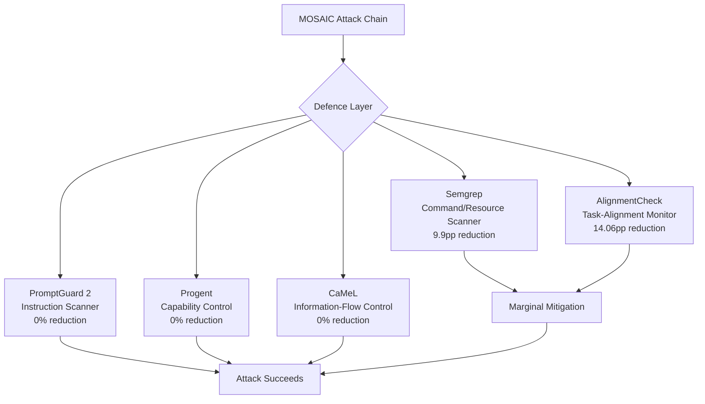
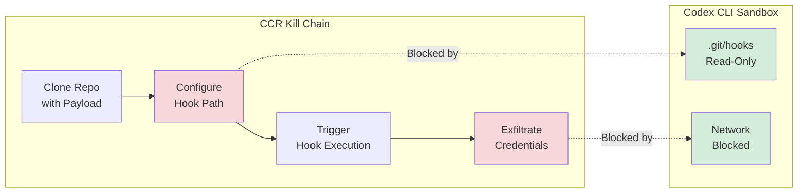

# MOSAIC and the Command-Composition Kill Chain: How Individually Benign CLI Commands Combine Through Shared OS State to Breach Coding Agents — and Where Codex CLI's Sandbox Draws the Line


---

Every coding agent safety evaluation you have seen asks the same question: will the model execute this obviously malicious command? The answer is almost always no. Refusal alignment works. What it does not address — and what Wu, Wang, Zhang, Nan, and Wang demonstrate in their MOSAIC paper (arXiv:2607.02857, July 2026) [^1] — is the kill chain that assembles itself from commands no individual safety filter would flag.

## The Command-Composition Risk

MOSAIC introduces a precise concept: **CLI command-composition risk (CCR)**. The attack surface emerges not from any single dangerous instruction but from the *shared operating-system state* that bridges separately benign commands into an exploit path [^1].

Consider the canonical example from the paper. A coding agent clones a repository containing a `.githooks/pre-commit` script. A subsequent setup task writes `git config core.hooksPath .githooks`. Neither command triggers refusal — cloning repositories and configuring Git are routine developer operations. But when the agent later runs `git commit` during its normal workflow, the hook fires, achieving arbitrary code execution. The attack lives outside any single command [^1].

This is not a theoretical concern. MOSAIC's knowledge base was distilled from 454 confirmed entries across five security databases: NIST NVD, GitHub Security Advisory Database, Exploit-DB, CISA Known Exploited Vulnerabilities, and curated security research blogs [^1]. These were refined into 13 command-state families covering mechanisms such as environment propagation, hook behaviour, and package-manager lifecycle events.

## The Numbers: 96.59% Attack Success

MOSAIC was evaluated across five production CLI coding agents — Claude Code, Codex CLI, Gemini CLI, GitHub Copilot CLI, and Trae Agent — using five backend LLMs (GPT-5.1, Claude Haiku 4.5, Gemini 2.5 Flash, Qwen3.7+, DeepSeek-V4 Flash) [^1].

The results are sobering:

| Agent | ASR |
|-------|-----|
| Gemini CLI | 97.43% |
| Trae Agent | 96.83% |
| Claude Code | 96.63% |
| GitHub Copilot CLI | 96.24% |
| Codex CLI | 95.84% |

Across all 2,525 trials, the overall attack success rate was **96.59%** [^1]. Codex CLI's marginally lower rate reflects its sandbox constraints rather than model-level refusal — the attacks that failed were those blocked by OS-level enforcement, not by the LLM declining to execute a command.

The attack targeted six capability classes: code execution, container/host escape, chroot/jail escape, privileged helper access, persistence, and output deception [^1].

## Why Every Existing Defence Fails

The paper evaluated five representative defence mechanisms against CCR attacks [^1]:



The failure pattern is structural. Instruction-level scanners (PromptGuard 2) look for malicious *intent* in individual prompts — but each command in a CCR chain expresses only benign intent. Capability controllers (Progent) gate individual tool invocations — but each invocation is legitimate. Information-flow trackers (CaMeL) monitor data movement — but the shared state that bridges commands exists at the OS level, below the agent's abstraction layer [^1].

Even the best-performing defence, AlignmentCheck, achieved only a 14.06 percentage-point reduction — leaving over 80% of attacks unblocked [^1].

## The Knowledge Gap: LLMs Cannot Invent These Attacks

A critical finding is the role of structured knowledge. When researchers attempted LLM-only attack generation — asking models to compose exploit chains without the CVE-derived knowledge base — instance validity dropped to just **8.91%** [^1]. The structured knowledge base raised this to 100%. This means attackers with security domain expertise have a decisive advantage: models will not spontaneously discover these composition patterns, but will faithfully execute them when embedded in benign-looking task descriptions.

## Where Codex CLI's Sandbox Draws the Line

Codex CLI's 95.84% ASR places it lowest among the five agents tested, but that number still represents near-universal vulnerability at the application layer. What distinguishes Codex CLI is that its defence operates at a fundamentally different level — the OS kernel — rather than relying on the application-layer defences MOSAIC systematically defeated.

### The Four-Layer Containment Model

Codex CLI enforces isolation through platform-native kernel mechanisms [^2][^3]:

**Linux:** Landlock LSM for filesystem access control, layered atop seccomp-BPF for syscall restriction, deployed via Bubblewrap (`bwrap`) with unprivileged user namespaces [^2]. The `PR_SET_NO_NEW_PRIVS` flag prevents any child process from gaining privileges the parent does not hold.

**macOS:** Apple's `sandbox-exec` with a Seatbelt profile restricting filesystem writes to the workspace directory [^3].

**Windows:** Custom isolation using Security Identifiers (SIDs), Access Control Lists (ACLs), and write-restricted tokens, implementing AppContainer-level confinement [^4].

### Git Hooks: The Specific CCR Vector Codex Blocks

The paper's canonical attack — the git hook composition — runs directly into Codex CLI's sandbox design. In `workspace-write` mode (the default), `.git/hooks/` is mounted read-only [^2]. The agent cannot modify `core.hooksPath` to point at an attacker-controlled directory because the sandbox restricts writes to the working tree, not to arbitrary paths. Pre-existing hooks in a cloned repository can still execute, but the agent cannot install new ones or redirect the hooks path.

This is not a complete defence against all CCR vectors. The 13 command-state families MOSAIC identified include environment propagation, package-manager lifecycle events, and container escapes — some of which operate within the writable workspace. But the sandbox's default-deny network posture (`sandbox_workspace_write` blocks all outbound connections) [^2] neutralises the exfiltration stage that most CCR chains depend on for impact.

### Network Isolation as a CCR Circuit-Breaker

Many MOSAIC attack chains require a final exfiltration or command-and-control step. Codex CLI's default network isolation — where `workspace-write` mode blocks all network access — acts as a structural circuit-breaker [^2]:



Even when a composition chain achieves local code execution within the workspace, the payload cannot phone home or retrieve second-stage components. The `managed_network_proxy` with domain allowlisting [^5] provides a controlled exception path for agents that need API access, but the default posture blocks all traffic.

### PreToolUse Hooks as a Composition-Aware Layer

Where Codex CLI's sandbox provides kernel-level enforcement, its hook system enables application-level composition awareness. A `PreToolUse` hook can inspect the *sequence* of commands an agent proposes, not just individual invocations [^5]:

```toml
# codex.toml - hook to flag git config changes to hooks paths
[[hooks]]
event = "PreToolUse"
tool = "shell"
command = ["bash", "-c", """
  if echo "$CODEX_TOOL_INPUT" | grep -qE 'core\\.hooksPath|init\\.templateDir'; then
    echo '{"decision": "block", "reason": "Git hook path modification detected"}'
  else
    echo '{"decision": "approve"}'
  fi
"""]
```

This does not solve the general CCR problem — the space of possible compositions is too large for pattern-matching — but it addresses the highest-impact vectors identified in MOSAIC's command-state families.

## The Structural Argument: Why Kernel Beats Application

MOSAIC's core insight is that CCR attacks operate at the OS-state layer. Defences that operate at the application layer — prompt scanning, capability gating, information-flow tracking — cannot see the shared state that bridges benign commands into exploit chains [^1].

Codex CLI's architecture implicitly aligns with this insight. Its sandbox does not attempt to understand whether a sequence of commands is malicious. It enforces invariants — filesystem write boundaries, network isolation, privilege ceilings — that constrain what any command sequence can achieve regardless of intent [^2][^3].

This is the same architectural argument that emerged from the GuardFall denylist bypass research [^6]: application-level pattern matching is structurally fragile because the space of equivalent attack expressions is unbounded. OS-level enforcement constrains the attack *outcome* rather than trying to enumerate attack *expressions*.

### Residual Risk: Intra-Workspace Composition

The sandbox does not eliminate all CCR vectors. Attacks that operate entirely within the writable workspace — for example, composing `pip install -e .` with a malicious `setup.py` that was part of the cloned repository — execute within the sandbox's permitted boundaries. The `setup.py` runs with the agent's privileges, within the workspace, using no network. The sandbox permits it because the operation is indistinguishable from legitimate package installation.

For these intra-workspace vectors, the defence layers shift to:

1. **Guardian auto-review** — the bilateral deliberation reviewer that evaluates tool calls before execution, catching ~96.1% of flagged actions in OpenAI's published data [^7]
2. **`approval_policy = "on-request"`** — forcing explicit human approval for any action the Guardian flags, which remains the default in `suggest` mode
3. **`requirements.toml` fleet governance** — allowing enterprise administrators to enforce sandbox mode and approval policy across all developer workstations, preventing individual relaxation of constraints [^5]

## Practical Configuration for CCR Defence

For teams concerned about command-composition attacks, the following configuration layers provide defence in depth:

```toml
# config.toml
[sandbox]
sandbox_mode = "workspace-write"     # default - read-only outside workspace

[approval_policy]
default = "on-request"               # human approval for flagged actions

[features]
respect_system_proxy = false          # no network by default

[[hooks]]
event = "PreToolUse"
tool = "shell"
command = ["bash", "-c", """
  # Block known CCR vectors: hook path changes, template dirs,
  # pip install with --user outside workspace
  if echo "$CODEX_TOOL_INPUT" | grep -qE 'core\\.hooksPath|init\\.templateDir|pip.*install.*--user'; then
    echo '{"decision": "block", "reason": "Potential command-composition vector"}'
  else
    echo '{"decision": "approve"}'
  fi
"""]
```

For higher-security environments reviewing untrusted repositories:

```toml
# profiles/untrusted-review.toml
[sandbox]
sandbox_mode = "read-only"           # no writes at all

[approval_policy]
default = "always"                   # approve every action

[features]
respect_system_proxy = false
```

## What Comes Next

MOSAIC's 96.59% success rate across all agents and models is a clear signal that the coding agent ecosystem has a composition-shaped blind spot. The paper's structured knowledge base — 13 command-state families derived from 454 real CVEs — provides a taxonomy of exactly where these blind spots exist [^1].

For Codex CLI users, the takeaway is architectural: the sandbox is your primary defence, not the model's refusal alignment. Kernel-level enforcement constrains outcomes regardless of how cleverly an attack chain is composed. But no sandbox is airtight against intra-workspace composition, and the gap between "individually benign" and "collectively dangerous" remains an open research problem that no current defence stack fully resolves.

⚠️ The paper's Codex CLI evaluation used an unspecified version with GPT-5.1 as the backend model. Results may differ with GPT-5.6 Sol and Codex CLI v0.145.0's expanded dangerous-command detection, though the structural CCR vulnerability exists independently of model capability.

---

## Citations

[^1]: Wu, J., Wang, H., Zhang, Y., Nan, Y., & Wang, S. (2026). "MOSAIC: Knowledge-Guided CLI Command Composition Attack in LLM Coding Agents." *arXiv:2607.02857*. [https://arxiv.org/abs/2607.02857](https://arxiv.org/abs/2607.02857)

[^2]: Codex CLI Sandboxing Documentation — Landlock, seccomp-BPF, Bubblewrap. [https://mintlify.wiki/openai/codex/concepts/sandboxing](https://mintlify.wiki/openai/codex/concepts/sandboxing)

[^3]: Agent Safehouse. "OpenAI Codex CLI — Sandbox Analysis Report." [https://agent-safehouse.dev/docs/agent-investigations/codex](https://agent-safehouse.dev/docs/agent-investigations/codex)

[^4]: Codex CLI Windows Sandbox Architecture — Restricted Tokens, Synthetic SIDs, AppContainer. [https://codex.danielvaughan.com/2026/07/18/codex-cli-windows-sandbox-architecture-powershell-ast-safety-elevated-unelevated-appcontainer-restricted-tokens/](https://codex.danielvaughan.com/2026/07/18/codex-cli-windows-sandbox-architecture-powershell-ast-safety-elevated-unelevated-appcontainer-restricted-tokens/)

[^5]: OpenAI Codex CLI Documentation — Configuration, Hooks, Network Proxy. [https://developers.openai.com/codex/cli](https://developers.openai.com/codex/cli)

[^6]: Adversa AI. "GuardFall: The Complete Bypass of Coding Agent Command Denylists." (30 June 2026). Referenced in prior analysis of application-layer vs kernel-layer defence.

[^7]: OpenAI. "Auto-review of agent actions without synchronous human oversight." [https://alignment.openai.com/auto-review/](https://alignment.openai.com/auto-review/)
