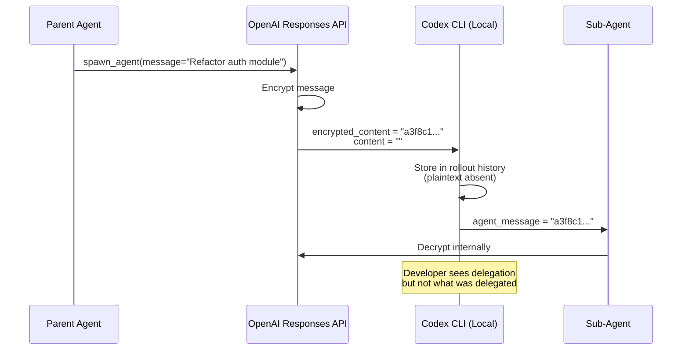
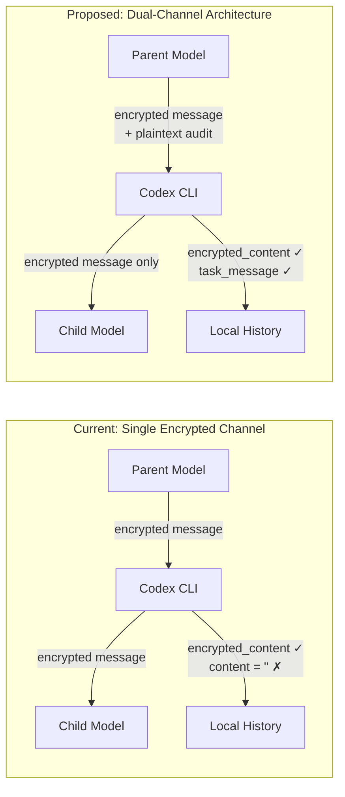

# The Multi-Agent Auditability Gap: Why Encrypted Delegation Blinds Your Debugging — and What It Means for Enterprise Compliance


---

Codex CLI's Multi-Agent V2 architecture lets a parent agent spawn sub-agents, delegate tasks, and coordinate complex work across isolated threads. Since v0.138.0, those delegation instructions travel as ciphertext — encrypted by OpenAI's Responses API before they ever reach your local storage[^1]. The parent tells a child agent what to do, but your rollout history records only that a delegation happened, not what was delegated.

This is not a theoretical concern. It is an active regression that breaks debugging workflows, blocks enterprise compliance requirements, and arrives weeks before the EU AI Act's broad enforcement date. Understanding what changed, why it matters, and what you can do about it today is essential for any team running Codex CLI in production.

## What Changed: PR #26210 and the Encryption Shift

Pull request #26210, merged on 5 June 2026, introduced message-level encryption for inter-agent communication[^1]. The mechanism is straightforward: when a parent model calls one of three delegation tools — `spawn_agent`, `send_message`, or `followup_task` — OpenAI's Responses system encrypts the `message` argument before returning it to Codex CLI. Codex forwards the ciphertext to the sub-agent via the `agent_message` field. Decryption occurs only server-side when the receiving model processes its input[^2].

The local storage impact is immediate. The `InterAgentCommunication` structure now stores `encrypted_content` whilst leaving the `content` field as an empty string. This persists across rollout history, trace reduction, compaction, and the `list_agents` inspection surface[^2].



The change became unavoidable with Codex CLI v0.144.4 (14 July 2026), which shipped a model catalogue mandating Multi-Agent V2 for GPT-5.6 Sol and Terra[^3]. Luna remains on V1 and is unaffected.

## The Debugging Black Hole

When a sub-agent produces unexpected output — wrong files modified, tests broken, architectural decisions that violate your AGENTS.md constraints — the first debugging question is always: *what was it told to do?*

With encrypted delegation, that question has no answer locally. You can see:

- That `spawn_agent` was called at timestamp T
- That a child thread existed for N seconds
- What the child agent produced as output

You cannot see:

- The task description the parent formulated
- Any context the parent chose to include or exclude
- Whether the parent's delegation matched your original intent

This is the debugging equivalent of having application logs that record HTTP status codes but redact request bodies. You know something went wrong; you cannot determine whether the fault lies in the delegation logic, the child's execution, or the parent's interpretation of your prompt.

### A Concrete Example

Consider a multi-agent session where you ask Codex CLI to "refactor the authentication module to use JWT tokens and update all tests." The parent agent might spawn three sub-agents:

1. One to refactor the auth module
2. One to update unit tests
3. One to update integration tests

If sub-agent 2 breaks the test suite, you need to know whether the parent told it "update tests to use JWT" (correct) or "rewrite the test suite" (overly broad). With encrypted delegation, you see three `spawn_agent` calls and a broken test suite. The causal chain between delegation and failure is invisible.

## The Enterprise Compliance Problem

The debugging gap is uncomfortable. The compliance gap is potentially disqualifying.

### EU AI Act Article 12

The EU AI Act's broad enforcement provisions apply from 2 August 2026[^4]. Article 12 requires that high-risk AI systems be "technically capable of automatically recording events (logs) throughout the system's lifetime" sufficient for "full reconstructability of algorithmic decisions"[^4]. For multi-agent systems, this means logging not just what each agent did, but what it was instructed to do and why.

Encrypted delegation creates a structural gap: the logs exist, but they contain ciphertext that only OpenAI can decrypt. An organisation using Codex CLI in a regulated delivery chain cannot independently reconstruct a material delegation decision without requesting decryption from a third party[^5].

### FINRA's 2026 Regulatory Oversight Report

FINRA's 2026 report flags three novel risks specific to autonomous agents: autonomy (agents acting without human validation), scope creep (agents exceeding intended authority), and auditability (multi-step reasoning making decisions hard to trace)[^6]. Encrypted delegation touches all three — you cannot validate what you cannot read, you cannot detect scope creep in opaque instructions, and you cannot trace reasoning through ciphertext.

### The Broader Pattern

McKinsey's security playbook for agentic systems specifies that organisations should "record agent actions, prompts, decisions, changes in internal state, and intermediate reasoning to ensure auditability and regulatory compliance"[^6]. The word *prompts* is doing heavy lifting: it means the instructions agents receive, not just the instructions humans type.

## Issue #28058: The Community Response

Ignat Remizov, CTO at payment service Zolvat, opened GitHub Issue #28058 on 13 June 2026 to document the regression and propose a fix[^2]. The issue has accumulated 27 interactions and remains open without an official OpenAI response as of 27 July 2026.

### The Proposed Fix: Dual-Field Architecture

Remizov's proposal is architecturally clean: separate the delivery channel from the audit channel.



The implementation defines three delivery modes[^2]:

| Mode | Model Delivery | Local Storage | Use Case |
|------|---------------|---------------|----------|
| `encrypted` | Ciphertext only | Ciphertext only | Current upstream default |
| `encrypted_with_audit` | Ciphertext | Ciphertext + plaintext audit copy | Enterprise/debugging |
| `plaintext` | Plaintext | Plaintext | Development/testing |

The `encrypted_with_audit` mode is the key innovation. The child model still receives only ciphertext — preserving whatever privacy or security properties OpenAI intended — but a parallel plaintext `task_message` field (bounded at 8 KiB) is persisted in local rollout metadata, communication logs, and the TUI rendering surface[^2].

### The Fork

Remizov's fork provides a complete reference implementation covering all three affected tools (`spawn_agent`, `send_message`, `followup_task`), tool schema changes, handler modifications, rollout-trace retention, TUI rendering, and history projection[^2]. It is functional today for teams willing to run a fork.

## What You Can Do Today

Whilst Issue #28058 remains unresolved upstream, several mitigation strategies exist within current Codex CLI configuration.

### 1. Use Luna for Auditable Sessions

GPT-5.6 Luna uses Multi-Agent V1, which does not encrypt delegation[^3]. For sessions where auditability matters more than Sol/Terra's reasoning capabilities, route through Luna via a named profile:

```toml
# ~/.codex/config.toml
[profiles.auditable]
model = "gpt-5.6-luna"
```

Invoke with:

```bash
codex --profile auditable "refactor the auth module"
```

The trade-off is real: Luna scores lower on complex reasoning benchmarks and has a weaker long-context capability (41.3% MRCR)[^7]. For straightforward refactoring or test generation, it is often sufficient.

### 2. Pre-Delegation Logging via AGENTS.md

You can instruct the parent agent to log its delegation intent before calling delegation tools:

```markdown
<!-- AGENTS.md -->
## Multi-Agent Delegation Protocol

Before calling spawn_agent, send_message, or followup_task:
1. Write the intended task description to `.codex/delegation-log.md`
2. Include the target sub-agent role, task summary, and success criteria
3. Then proceed with the delegation call
```

This is a soft control — the model may not always comply — but it creates a parallel audit trail in the workspace that persists independently of the encrypted communication channel.

### 3. PostToolUse Hook for Delegation Tracking

A deterministic PostToolUse hook can log delegation events with whatever metadata the parent agent exposed:

```toml
# ~/.codex/config.toml
[hooks.post_tool_use]
command = "bash -c 'echo \"$(date -u +%Y-%m-%dT%H:%M:%SZ) $TOOL_NAME $TOOL_ARGS\" >> .codex/delegation-audit.log'"
tools = ["spawn_agent", "send_message", "followup_task"]
```

⚠️ Note: `TOOL_ARGS` will contain the encrypted message content, not plaintext. This hook captures the *structure* of delegation (which tools, when, how many) but not the *content*. It is still useful for detecting unexpected delegation patterns.

### 4. Run the Fork

For teams with the operational capacity to maintain a fork, Remizov's implementation is the most complete solution available today. Evaluate it at the linked Issue #28058[^2] and weigh the maintenance burden against your auditability requirements.

## The Bigger Picture: Trust Architecture in Multi-Agent Systems

The encrypted delegation decision reveals a fundamental tension in multi-agent coding tools. OpenAI likely encrypted inter-agent messages to prevent prompt extraction attacks — a legitimate security concern where adversarial inputs could trick a sub-agent into revealing its parent's system prompt or delegation instructions.

But security through opacity creates a different trust problem. When developers cannot inspect what their tools are doing, they must trust the vendor's assertion that the system behaves correctly. This is precisely the trust model that the EU AI Act, FINRA, and enterprise governance frameworks are designed to move beyond.

The `encrypted_with_audit` proposal resolves this tension elegantly: the model-facing channel remains encrypted (preventing prompt extraction), whilst the developer-facing channel provides plaintext (enabling audit). The two channels serve different threat models and different stakeholders. Conflating them, as the current implementation does, forces a choice between security and transparency that neither developers nor regulators should have to make.

## Conclusion

Encrypted multi-agent delegation in Codex CLI is not a minor implementation detail. It is a structural decision that removes a debugging surface, creates a compliance gap, and arrives at precisely the wrong moment in the regulatory calendar. The community has proposed a clean architectural fix. OpenAI has not responded.

For teams running Codex CLI in production today: audit your multi-agent usage, assess your compliance exposure, and implement the mitigations above. For teams evaluating Codex CLI for regulated environments: Issue #28058's resolution — or lack thereof — should be a material factor in your decision.

---

## Citations

[^1]: OpenAI, "Pull Request #26210: Encrypt MultiAgentV2 message payloads," GitHub, merged 5 June 2026. [https://github.com/openai/codex/pull/26210](https://github.com/openai/codex/pull/26210)

[^2]: Ignat Remizov, "Regression: encrypted MultiAgentV2 messages remove readable task audit trail," GitHub Issue #28058, opened 13 June 2026. [https://github.com/openai/codex/issues/28058](https://github.com/openai/codex/issues/28058)

[^3]: XenoSpectrum, "OpenAI Codex MultiAgentV2 Encrypts Subagent Tasks, Blocking Local Audits," July 2026. [https://xenospectrum.com/en/openai-codex-multiagent-encrypted-instructions-auditability/](https://xenospectrum.com/en/openai-codex-multiagent-encrypted-instructions-auditability/)

[^4]: EU, "EU AI Act Article 12: Record-Keeping and Automatic Logging," 2024. [https://certifieddata.io/eu-ai-act/article-12-record-keeping](https://certifieddata.io/eu-ai-act/article-12-record-keeping)

[^5]: InfoWorld, "Codex Multi-Agent V2 update raises developer concerns over agent transparency," July 2026. [https://www.infoworld.com/article/4197328/codex-multi-agent-v2-update-raises-developer-concerns-over-agent-transparency.html](https://www.infoworld.com/article/4197328/codex-multi-agent-v2-update-raises-developer-concerns-over-agent-transparency.html)

[^6]: Zylos Research, "AI Agent Governance and Compliance in 2026: Frameworks, Audit Trails, and the Regulatory Reckoning," May 2026. [https://zylos.ai/research/2026-05-01-ai-agent-governance-compliance-2026/](https://zylos.ai/research/2026-05-01-ai-agent-governance-compliance-2026/)

[^7]: Daniel Vaughan, "Model Routing Patterns for Codex CLI: A Sol, Terra, Luna Decision Framework," Codex Knowledge Base, July 2026. [https://codex.danielvaughan.com/articles/2026-07-26-codex-cli-model-routing-patterns-gpt56-sol-terra-luna-decision-framework/](https://codex.danielvaughan.com/articles/2026-07-26-codex-cli-model-routing-patterns-gpt56-sol-terra-luna-decision-framework/)
