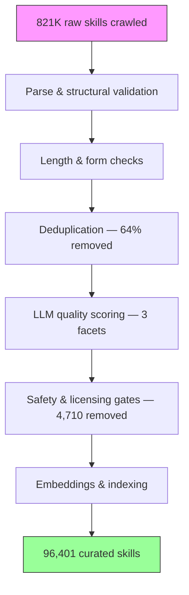
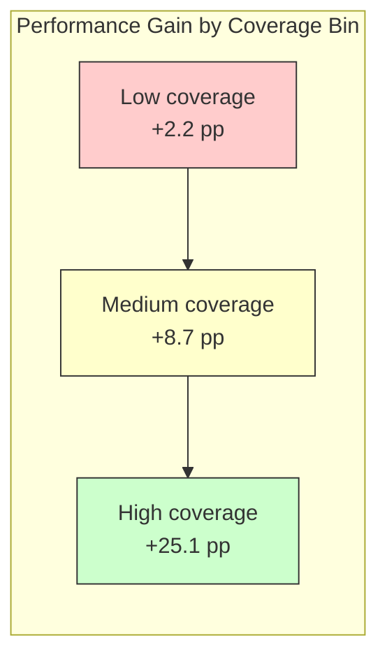

# SkillCorpus and the 821K Skill Audit: What Crawling the Open Skill Ecosystem Reveals About Quality, Curation, and Your Codex CLI Skill Stack


---

Agent skills — the `SKILL.md` files that package reusable procedural knowledge for LLM agents — have become the dominant extension mechanism across every major coding agent. Codex CLI, Claude Code, Gemini CLI, Cursor, and GitHub Copilot all load the same format [^1]. The ecosystem has grown fast: over 490,000 skills across three major marketplaces as of early 2026, with unofficial repositories pushing the real total far higher [^2].

But how good are these skills, actually? Two papers published in July 2026 answer that question with data rather than vibes — and the findings should change how you manage your Codex CLI skill stack.

## The SkillCorpus Framework: 821K Skills, 96K Survivors

Wang et al. published SkillCorpus on 17 July 2026, presenting the first large-scale audit of the open skill ecosystem [^3]. The numbers are striking:

- **821,000 skills crawled** from 62 public sources
- **96,401 skills survived** a six-stage curation pipeline — an 88.3% attrition rate
- **64% reduction from deduplication alone** — exact matching collapsed 59.7% of inputs before semantic deduplication removed further near-duplicates

The pipeline stages reveal where quality breaks down:



The deduplication stage is the most revealing. When nearly two-thirds of crawled skills are duplicates or near-duplicates, the ecosystem is not growing — it is echoing. Many published skills are forks-of-forks with cosmetic changes to the description but identical procedural bodies [^3].

## Three Quality Facets: Utility, Robustness, Safety

SkillCorpus scores every surviving skill across three independent facets using an LLM-as-judge approach:

| Facet | Weight | What it measures |
|-------|--------|------------------|
| **Utility** | 50% | Description clarity, task scope, applicability conditions |
| **Robustness** | 35% | Body consistency with the description's promise |
| **Safety** | 15% | Harm risks: prompt injection, credential leakage, unsafe execution |

The facets are deliberately independent — the correlation between utility and safety is only r=0.15, meaning a skill can score highly on usefulness whilst still containing safety risks [^3].

The composite quality distribution across the 96,401 curated skills:

- **58.8%** scored 0.7 or above (high quality)
- **32.9%** scored 0.5–0.7 (adequate but flawed)
- **8.3%** scored below 0.5 (poor quality)

Those bottom 8.3% survived the pipeline's structural and safety gates — they are syntactically valid and free of hard-gate risks — but their descriptions are vague, their bodies inconsistent with their stated scope, or both.

## Skill Smells: 99% of SKILL.md Files Have At Least One

A companion paper by Hong, Imani, and Ahmed from UC Irvine digs deeper into the anatomy of `SKILL.md` files themselves [^4]. After analysing 238 real-world skills, they identified 13 higher-level and 44 lower-level semantic components that a well-authored skill should contain, then catalogued violations as "skill smells" — analogous to code smells in software engineering.

The headline finding: **over 99% of SKILL.md files contain at least one skill smell**, and once introduced, smells rarely disappear as skills evolve [^4].

This matters for Codex CLI because skill matching relies heavily on the `name` and `description` fields in YAML frontmatter. At startup, Codex reads only these fields from every installed skill, using a capped budget of roughly 2% of context [^1]. When your task arrives, the matching engine compares it against descriptions to select the best fit. A vague or misleading description does not merely waste context — it causes the wrong skill to load, or the right skill to be skipped entirely.

## Coverage Determines Outcomes — Not Retrieval Precision

SkillCorpus's benchmark evaluation tested the curated corpus across three benchmarks (SkillsBench, GDPVal, QwenClawBench) with two harnesses and two model backbones. The results confirm a pattern that Codex CLI users should internalise:



- **+7.5 pp** average on SkillsBench (largest gains on deterministic-verifier tasks)
- **+2.79 pp** on QwenClawBench (real-user-distribution tasks)
- **+1.51 pp** on GDPVal (high-baseline economic tasks)
- **Zero** gain — not regression — for tasks without matching skills [^3]

The strongest predictor of improvement is retrieval-match quality (r=0.31–0.40), and gains climb from +2.2 pp in low-coverage bins to +25.1 pp in high-coverage bins. Having the right skill available matters more than having sophisticated retrieval [^3].

The harness also matters enormously: the Raven harness realised +13.4 pp on SkillsBench versus OpenClaw's +5.7 pp using identical pre-computed skill selections. Codex CLI's own matching and injection mechanics — how it loads the full skill body, how much context it allocates, how it handles multiple matching skills — are as consequential as the skills themselves.

## What This Means for Your Codex CLI Skill Stack

### Audit your installed skills

Run a quick inventory:

```bash
ls ~/.agents/skills/*/SKILL.md | wc -l
```

If you have more than 30–40 skills installed, you are likely carrying duplicates. SkillCorpus found that 59.7% of the ecosystem is exact duplicates [^3]. Check for skills with near-identical descriptions:

```bash
for f in ~/.agents/skills/*/SKILL.md; do
  head -10 "$f" | grep -A1 'description:'
  echo "---"
done | less
```

### Write better descriptions

The SkillCorpus data shows that utility — driven primarily by description clarity — carries 50% of the composite quality weight. The skill smells study confirms that vague descriptions are the most common smell [^4]. A good `SKILL.md` description should specify:

```yaml
---
name: rust-clippy-fix
description: >
  Run clippy on a Rust workspace, parse warnings into a structured list,
  apply automatic fixes where available, and report remaining warnings
  with suggested manual fixes. Requires cargo and clippy installed.
---
```

Not:

```yaml
---
name: rust-helper
description: Helps with Rust code
---
```

The first description gives the matching engine concrete tokens to compare against a task like "fix the clippy warnings in this crate." The second matches almost any Rust-related prompt — and will therefore be selected when a more specific skill should have been.

### Prioritise coverage gaps over retrieval tuning

SkillCorpus's data shows that expanding coverage in thin domains yields far more benefit than improving retrieval precision for well-covered domains [^3]. The 16-class taxonomy reveals that Dev, Data, Writing, and DevOps-Infra categories dominate the corpus, whilst mathematics, finance, and domain-specific workflows are under-served.

If you work in a specialist domain, writing one well-structured skill for your specific workflow will deliver more value than installing ten generic skills from a marketplace.

### Check licensing

88.3% of SkillCorpus's curated set is MIT-licensed and 10.5% is Apache-2.0 [^3]. However, the curation pipeline removed 3,795 skills with non-permissive licences. Skills installed from unofficial sources may carry GPL, AGPL, or proprietary restrictions that propagate to the outputs they help generate. Codex CLI does not currently enforce licence checks on installed skills — that responsibility sits with you.

### Use the plugin system for curation

Since v0.117.0, Codex CLI's plugin system bundles skills alongside MCP servers and app connectors into installable packages [^5]. Plugins from the official marketplace have at least basic vetting. Installing raw `SKILL.md` files from GitHub gists bypasses this entirely. The SkillCorpus data suggests that the difference between curated and uncurated skill sources is not marginal — it is the difference between an 88.3% attrition rate and zero filtering.

## The Safety Dimension

SkillCorpus's safety gate removed 915 skills flagged for prompt injection, command injection, credential exposure, unsafe execution, or copyrighted content [^3]. These are skills that would have loaded into your agent's context and influenced its behaviour.

Codex CLI's defence stack — sandbox isolation, approval policies, and `PreToolUse` hooks — mitigates the execution-time consequences of a malicious skill, but the context-poisoning risk is harder to address. A skill that subtly reshapes the agent's approach to a task (e.g., instructing it to pipe output through a particular endpoint) operates upstream of the sandbox. The SkillSec-Eval framework, published earlier in July 2026, proposes lifecycle-aware admission controls for exactly this threat surface [^6].

For now, the practical defence is straightforward: only install skills from sources you trust, review the body of any skill before installation, and use Codex CLI's `enabled_tools` and `disabled_tools` configuration to restrict what installed skills can invoke.

## Where This Goes Next

The SkillCorpus authors explicitly frame their 96,401-skill set as a "2026-Q2 snapshot rather than a one-shot artefact" [^3]. The ecosystem is growing fast enough that any static corpus will drift within months. The real contribution is not the dataset but the pipeline — a reproducible method for crawling, deduplicating, scoring, and indexing skills at scale.

For Codex CLI, the implication is that skill curation is becoming an engineering discipline rather than an editorial one. The days of browsing a marketplace and installing whatever looks useful are numbered. The data is clear: a small set of well-described, high-coverage, safety-vetted skills outperforms a large set of unvetted ones — and the gap widens with task complexity.

## Citations

[^1]: OpenAI, "Codex CLI Skills: Install & Use SKILL.md," [https://www.agensi.io/learn/codex-cli-skills-install-skill-md](https://www.agensi.io/learn/codex-cli-skills-install-skill-md), accessed July 2026.

[^2]: OpenAI, "Codex CLI Plugin System: Bundling Skills, MCP Servers, and App Connectors," [https://codex.danielvaughan.com/2026/03/30/codex-cli-plugin-system/](https://codex.danielvaughan.com/2026/03/30/codex-cli-plugin-system/), March 2026.

[^3]: Y. Wang et al., "SkillCorpus: Consolidating and Evaluating the Open Skill Ecosystem for Real-World LLM Agents," arXiv:2607.15557, July 2026. [https://arxiv.org/abs/2607.15557](https://arxiv.org/abs/2607.15557)

[^4]: D. B. Hong, A. Imani, and I. Ahmed, "From Anatomy to Smells: An Empirical Study of SKILL.md in Agent Skills," arXiv:2607.01456, July 2026. [https://arxiv.org/abs/2607.01456](https://arxiv.org/abs/2607.01456)

[^5]: OpenAI, "Codex CLI v0.117.0 Release Notes," March 2026. [https://codex.danielvaughan.com/2026/03/30/codex-cli-plugin-system/](https://codex.danielvaughan.com/2026/03/30/codex-cli-plugin-system/)

[^6]: SkillSec-Eval framework, "Lifecycle-Aware Skill Security for Codex CLI," July 2026. [https://codex.danielvaughan.com/2026/07/25/skillsec-eval-lifecycle-aware-skill-security-codex-cli-admission-retrieval-runtime-evolution-defence/](https://codex.danielvaughan.com/2026/07/25/skillsec-eval-lifecycle-aware-skill-security-codex-cli-admission-retrieval-runtime-evolution-defence/)
