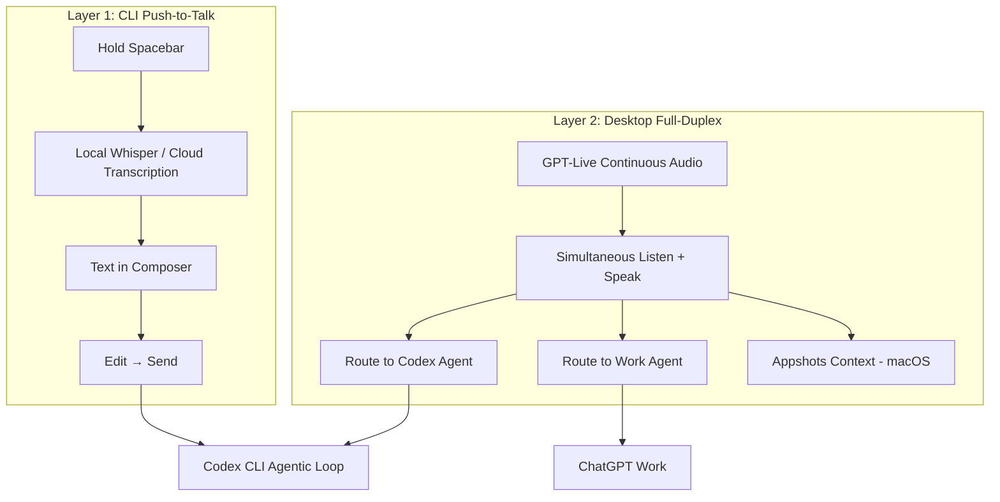
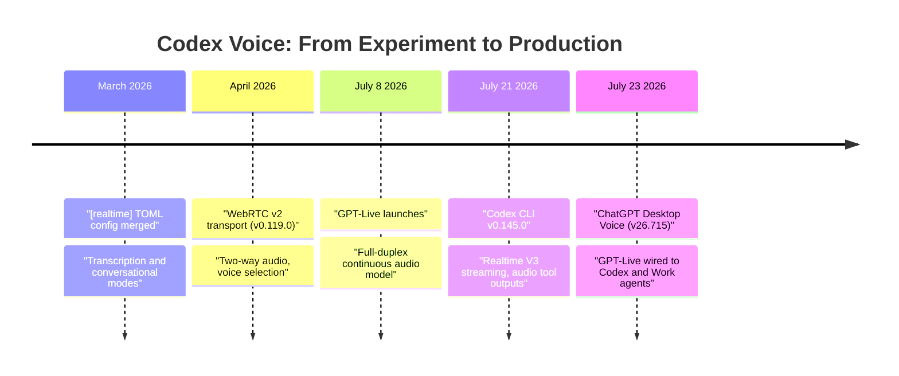

# Voice-Driven Development: How Codex CLI's Realtime V3 and ChatGPT Desktop Voice Reshape the Hands-Free Coding Loop


---

Within four days of each other in July 2026, two releases converged on the same thesis: your voice is a legitimate control plane for coding agents. Codex CLI v0.145.0 shipped streaming Realtime V3 conversations with native audio inputs and tool outputs on 21 July [^1]. Two days later, ChatGPT Desktop v26.715 wired GPT-Live — OpenAI's full-duplex continuous audio model — directly into Codex and ChatGPT Work, letting developers speak instructions whilst agents execute in the background [^2]. Together they form a two-layer voice stack: CLI-native push-to-talk for terminal sessions, and desktop-level full-duplex orchestration for multi-agent workflows.

This article maps the architecture, walks through practical configuration, identifies where voice genuinely outperforms the keyboard, and flags the hard limitations you will hit.

## The Two-Layer Voice Architecture

Voice in the Codex ecosystem is not a single feature — it is two distinct interaction surfaces with different transports, latencies, and use cases.



### Layer 1 — CLI Push-to-Talk

Codex CLI ships a built-in push-to-talk interface: hold the spacebar whilst the composer is focused, speak, release, and transcribed text lands in the composer for editing before submission [^3]. It is speech-to-text, not speech-to-agent — the transcription populates the input field, giving you a chance to correct before the model sees it.

Under the hood, v0.145.0 upgraded the transport from the earlier WebRTC v2 path to streaming Realtime V3 conversations, adding support for common local audio formats and audio tool outputs [^1]. The `[realtime]` TOML configuration block, unified in early 2026, supports two modes:

```toml
# ~/.codex/config.toml

[features]
voice_transcription = true

[realtime]
type = "transcription"     # or "conversational" for pair-programming
```

The `transcription` type is the push-to-talk mode: dictation flows into the composer. The `conversational` type opens a persistent low-latency session where the model can speak back — voice pair programming with real-time audio feedback [^4].

Audio device selection persists under a top-level `[audio]` section, and the TUI exposes an `/audio` slash command for interactive device switching mid-session.

### Layer 2 — ChatGPT Desktop Full-Duplex

ChatGPT Desktop Voice, powered by GPT-Live, is a fundamentally different beast. GPT-Live is a continuous audio model capable of listening and speaking simultaneously — full-duplex, no rigid turn-taking [^2]. On desktop, it connects directly to Codex and ChatGPT Work agents, meaning a single spoken instruction can spin up multiple concurrent coding threads whilst you keep talking.

The critical difference: CLI push-to-talk is speech-to-text-to-agent (with a human editing step). Desktop Voice is speech-to-agent (the model acts on your utterance directly). The editing step disappears, which is both the power and the risk.

On macOS, Voice gains access to Appshots — automatic context from the frontmost window — so you can say "fix the failing test visible in the terminal" and the model sees the terminal output without manual screenshots [^5].

## Where Voice Outperforms the Keyboard

After testing both layers across common development workflows, the pattern is clear: voice excels at orchestration and degrades at specification.

### Orchestration Commands

Voice is faster and more natural for:

- **Status checks**: "Status of all running Codex agents; interrupt only if one is blocked on me" [^5]
- **Task routing**: "In the primary Git root only, fix the failing unit test named X and open a draft PR"
- **Context switching**: "Summarise what the frontmost window is asking me to decide, then wait"
- **Triage**: speaking through a list of issues and assigning priority is faster than typing each one

These are high-level, low-precision commands where the cost of a transcription error is low and the cognitive savings of not context-switching to a keyboard are significant.

### Specification Commands

Voice degrades noticeably for:

- **File paths and code identifiers**: `src/lib/auth/middleware.ts` is faster to type or tab-complete than to dictate
- **Configuration values**: TOML keys, JSON schemas, and regex patterns are adversarial for speech recognition
- **Dense logic**: "Add a guard clause that checks whether the user's role includes admin OR the request originates from an internal subnet matching 10.0.0.0/8" — by the time you have dictated this precisely, you could have typed it

The practical pattern is mixed-mode: speak the intent, type the specifics. Codex CLI supports this naturally — voice and typed input coexist within the same session [^3].

## Practical Configuration for Voice-Driven Workflows

### Minimal CLI Setup

```toml
# ~/.codex/config.toml

[features]
voice_transcription = true

[realtime]
type = "transcription"

[audio]
# Omit to use system defaults, or specify:
# input_device = "MacBook Pro Microphone"
# output_device = "MacBook Pro Speakers"
```

This enables spacebar push-to-talk with automatic transcription. No API key changes required — transcription uses the same OpenAI credentials as the agentic loop.

### Conversational Mode for Pair Programming

```toml
[realtime]
type = "conversational"
```

This opens a persistent WebSocket to the Realtime API, enabling two-way audio. The model speaks progress updates, asks clarifying questions aloud, and you respond without touching the keyboard. Useful for extended debugging sessions where you are staring at a separate screen.

### Extending Voice Beyond the Composer with MCP

The built-in push-to-talk only covers the prompt box — once Codex asks a follow-up question mid-task, you are back to typing [^3]. The Spokenly MCP server extends voice to follow-up interactions:

```bash
codex mcp add spokenly --url http://localhost:51089
```

Then in your project's `AGENTS.md`:

```markdown
ALWAYS ask questions via the ask_user_dictation tool from the spokenly MCP server, never as plain text.
```

Spokenly supports local transcription models (Whisper, Parakeet on Apple Silicon) for privacy-sensitive workflows, and cloud options (GPT-4o Transcribe, Deepgram Nova) for higher accuracy [^6].

## The Limitations You Will Hit

### Linux Support Gap

GPT-Live desktop Voice requires the ChatGPT desktop app, which ships for macOS and Windows only. Codex CLI's built-in push-to-talk works on Linux, but the full-duplex orchestration layer — arguably the more transformative feature — is unavailable. For a tool whose core audience skews heavily towards Linux, this is a notable omission [^3].

### Spacebar Binding Is Hardcoded

Push-to-talk in the CLI uses the spacebar and cannot be rebound. If your workflow involves typing in the composer and switching to voice mid-sentence, the spacebar conflict is real. There is an open issue requesting configurable keybindings, but no resolution as of v0.145.0 [^3].

### Quota Sharing

Voice-triggered agent work consumes standard Codex quotas — there is no separate voice metering [^5]. A long refactoring session directed entirely by voice burns the same tokens as a typed one, but the conversational overhead of voice (natural language is less token-efficient than terse commands) can increase consumption.

### Appshots Is macOS Only

The frontmost-window context that makes desktop Voice so powerful for debugging is an Appshots feature, currently macOS only. Windows users get voice agent control but not visual context [^5].

### Precision Ceiling

Full-duplex Voice does not provide an editing step before agent execution. If you misspeak — "delete the test file" when you meant "delete the temp file" — the agent may act before you can correct. The same sandbox and approval_policy protections apply to voice-triggered actions, but the latency between intent and execution shrinks, which increases the blast radius of errors in permissive modes.

## Voice in a Defence-in-Depth Configuration

Voice is an input modality, not a trust elevation. Every governance structure — sandbox isolation, approval policies, PreToolUse hooks, AGENTS.md constraints — applies identically to voice-initiated actions [^5]. A sensible named profile for voice-heavy sessions might tighten the approval policy:

```toml
# ~/.codex/profiles/voice.toml

[model]
name = "gpt-5.6-sol"
reasoning_effort = "high"

[sandbox]
approval_policy = "suggest"    # Force confirmation before execution

[features]
voice_transcription = true

[realtime]
type = "conversational"
```

The `suggest` approval policy ensures every tool call requires explicit confirmation — typed or spoken — before execution. This compensates for the reduced precision of voice input without disabling the workflow entirely.

## The Evolution Timeline



## What This Means for Your Workflow

Voice-driven development is not about replacing the keyboard. It is about adding an orchestration layer that matches how senior developers already think about their work — in spoken, high-level intent rather than keystroke-level specification.

The immediate practical value is in multi-agent orchestration: directing parallel Codex threads, triaging results, and making architectural decisions without breaking flow. The long-term implication is that voice becomes the routing layer for a multi-tool agent stack — you speak the what, the agent determines the how, and the keyboard handles the exceptions.

Start with CLI push-to-talk for dictation. Graduate to conversational mode for debugging sessions. Use desktop Voice for multi-agent orchestration. Keep the keyboard for precision. That is the stack.

---

## Citations

[^1]: OpenAI, "Codex CLI v0.145.0 Release Notes," GitHub, 21 July 2026. [https://github.com/openai/codex/releases/tag/rust-v0.145.0](https://github.com/openai/codex/releases/tag/rust-v0.145.0)

[^2]: VentureBeat, "Agentic coding goes hands-free as OpenAI brings GPT-Live's full duplex voice control to Codex and ChatGPT on the desktop," 23 July 2026. [https://venturebeat.com/orchestration/agentic-coding-goes-hands-free-as-openai-brings-gpt-lives-full-duplex-voice-control-to-codex-and-chatgpt-on-the-desktop](https://venturebeat.com/orchestration/agentic-coding-goes-hands-free-as-openai-brings-gpt-lives-full-duplex-voice-control-to-codex-and-chatgpt-on-the-desktop)

[^3]: Spokenly, "Codex Voice Mode: Voice Input for OpenAI Codex CLI (2026)," 2026. [https://spokenly.app/blog/voice-dictation-for-developers/codex](https://spokenly.app/blog/voice-dictation-for-developers/codex)

[^4]: Codex Knowledge Base, "Codex CLI Realtime Sessions: Voice Pair Programming, Transcription Mode, and the [realtime] Config," 31 March 2026. [https://codex.danielvaughan.com/2026/03/31/codex-cli-realtime-sessions-voice-transcription/](https://codex.danielvaughan.com/2026/03/31/codex-cli-realtime-sessions-voice-transcription/)

[^5]: ExplainX, "ChatGPT Voice Desktop: GPT-Live for Codex Work," July 2026. [https://explainx.ai/blog/chatgpt-voice-desktop-gpt-live-codex-work-july-2026](https://explainx.ai/blog/chatgpt-voice-desktop-gpt-live-codex-work-july-2026)

[^6]: Spokenly, "Codex Voice Mode: Voice Input for OpenAI Codex CLI (2026)," 2026. [https://spokenly.app/blog/voice-dictation-for-developers/codex](https://spokenly.app/blog/voice-dictation-for-developers/codex)
