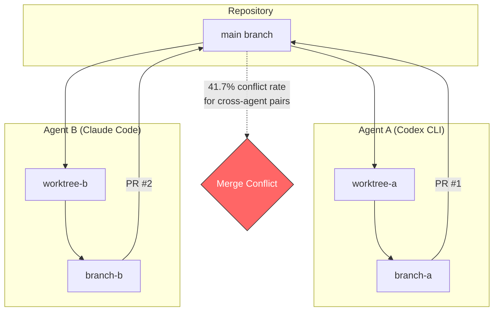
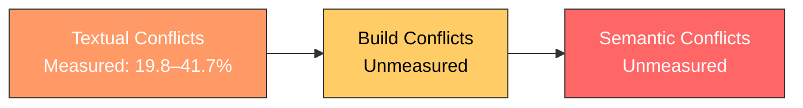
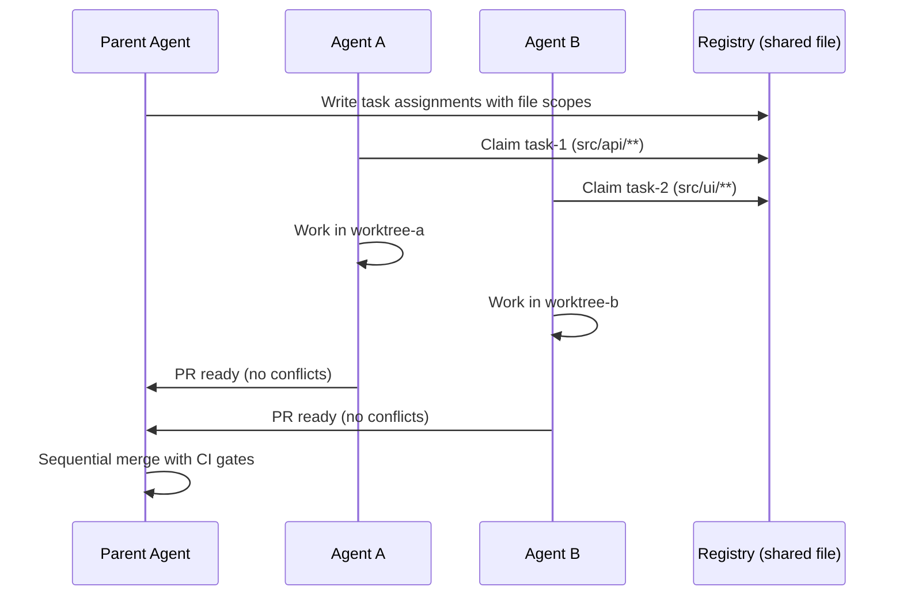

# When Agents Collide: What 33,596 Pull Requests Reveal About Merge Conflicts in Multi-Agent Development


---

Running multiple coding agents in parallel is no longer an edge case — it is the emerging default for teams using Codex CLI, Claude Code, Copilot, and Devin. The promise is straightforward: isolate each agent in its own worktree, point it at a task, and merge the results. The reality, quantified for the first time by two independent research teams in 2026, is that uncoordinated parallel agents produce merge conflicts at rates that can waste substantial CI compute, burn token budgets on resolution attempts, and exhaust the maintainers who must reconcile what the agents cannot.

This article examines the numbers, explains why cross-agent conflicts are twice as frequent as intra-agent ones, and maps the findings onto Codex CLI's worktree isolation, multi-agent V2, and hook-based coordination patterns.

## The Scale of the Problem

Xu, Subramanian, and Karthik analysed 33,596 agent-authored pull requests across 2,807 repositories in the AIDev-pop dataset, covering contributions from OpenAI Codex, GitHub Copilot, Devin, Cursor, and Claude Code between December 2024 and July 2025 [^1]. Their headline finding: **40.2% of repositories contained agent-authored PR pairs with exact temporal overlap**, and those overlapping pairs accounted for 79.4% of all agent-generated PRs. Widen the window to one week and the numbers climb to 53.4% of repositories and 95.0% of PRs.

This is not a theoretical concern. Four in five agent PRs are competing with at least one other agent PR for the same merge target at the same time.

The earlier AgenticFlict dataset, presented at AIware 2026 in Montréal, corroborates the pattern at an even larger scale: 142,000+ agent PRs across 59,000+ repositories yielded a 27.67% overall conflict rate, with 336,000+ fine-grained conflict regions extracted [^2].

## Cross-Agent Conflicts Are Twice as Frequent

The Xu et al. study replayed 716 three-way git merges using headless `git merge-tree` and found a stark divergence:

| Pair type | Textual conflict rate | 95% CI |
|---|---|---|
| Intra-agent (same agent, same repo) | 19.8% | 16.8%–23.2% |
| Cross-agent (different agents, same repo) | 41.7% | 33.1%–50.9% |

The confidence intervals do not overlap, confirming the difference is statistically significant [^1]. Cross-agent pairs conflict at roughly twice the rate of intra-agent pairs.

Why? The researchers identified two contributing factors. First, different agents make different architectural choices about the same problem — one might refactor a function in place whilst another deletes it and adds a replacement, producing modify/delete conflicts that accounted for 26.8% of all conflict regions. Second, agents lack any coordination protocol: they cannot see each other's branches and have no mechanism to claim or lock files.



## The Conflict Taxonomy

Not all conflicts are equal. The study categorised conflict regions into three types [^1]:

- **Content conflicts (57.6%)** — both agents edited overlapping lines in the same file. These are the classic merge conflicts that `git merge` surfaces as conflict markers.
- **Modify/delete conflicts (26.8%)** — one agent modified a file that the other deleted or moved. These represent fundamental disagreements about whether a component should exist.
- **Add/add conflicts (15.1%)** — both agents independently created files with the same path but different contents.

Critically, **84.4% of conflicts involved source code files** rather than dependency lockfiles (3.9%), confirming that agents are clashing over logic, not just `package-lock.json` churn.

The structural conflicts (modify/delete plus add/add, totalling ~42%) are the most expensive to resolve because they cannot be mechanically merged — they require a judgment call about which agent's architectural decision should prevail.

## Language and Throughput Patterns

Co-activity rates varied significantly by language [^1]:

| Language | Co-activity rate |
|---|---|
| Go | ~92% |
| Ruby | ~87% |
| Python | ~84% |
| TypeScript | ~75% |
| C++ | ~56% |
| HTML | ~44% |

Go's dominance is likely explained by its prevalence in infrastructure repositories that run multiple automated agents (Dependabot, Renovate, Codex). High-throughput repositories (>100 PRs) showed ~90% co-activity, whilst low-throughput ones (<6 PRs) sat at 53%.

## Three Layers of Integration Friction

The authors frame their textual conflict measurements as **conservative lower-bound estimates**, identifying three layers of integration friction that compound in practice [^1]:



1. **Textual conflicts** — git cannot merge the diff (measured in the study).
2. **Build conflicts** — the merge succeeds textually but the code fails to compile or pass linting.
3. **Semantic conflicts** — the code builds and passes tests but contains logical contradictions that produce incorrect behaviour at runtime.

For teams running multiple Codex CLI agents, this means a clean `git merge` is necessary but not sufficient — CI must validate every merge, and semantic review remains a human (or agent-assisted) responsibility.

## Defending Against Agent Collisions in Codex CLI

Codex CLI provides several mechanisms that directly address the patterns identified in the research.

### Worktree Isolation as the Baseline

The `/agent` command in Codex CLI spawns sub-agents in isolated git worktrees by default. Each agent gets its own directory, branch, index, and file state whilst sharing the same commit history [^3]. This prevents the most destructive failure mode — two agents simultaneously writing to the same working directory — but it does not prevent the merge conflicts that arise when both branches touch the same files.

```toml
# config.toml — multi-agent V2 with explicit worktree isolation
[agent]
isolation = "worktree"
max_concurrent = 3

[agent.sub_agent]
model = "gpt-5.6-terra"
reasoning = "medium"
```

### Task Scoping to Reduce Conflict Surface

The research shows that conflict rates are highest when agents work on overlapping problem domains. The practical defence is **task decomposition along file boundaries**: each agent should own a distinct set of files or modules.

```markdown
<!-- AGENTS.md task scoping example -->
## Parallel Task Boundaries

- Agent 1: `src/api/**` — API endpoint changes only
- Agent 2: `src/ui/**` — frontend component changes only
- Agent 3: `tests/**` — test coverage expansion only

⚠️ No agent should modify `src/shared/**` without explicit approval.
```

This maps directly to the study's finding that 84.4% of conflicts involve source code files — if agents are scoped to non-overlapping source directories, the textual conflict rate drops dramatically.

### PostToolUse Hooks for Conflict Detection

Codex CLI's `PostToolUse` hooks can detect emerging conflicts before they become expensive to resolve. A hook that runs `git merge-tree` against the target branch after every file write would surface conflicts in real time rather than at PR submission [^4]:

```bash
#!/bin/bash
# .codex/hooks/post-tool-use-conflict-check.sh
# Run after file writes to detect emerging merge conflicts

TARGET_BRANCH="${CODEX_TARGET_BRANCH:-main}"
CURRENT_BRANCH=$(git rev-parse --abbrev-ref HEAD)

if [ "$CURRENT_BRANCH" != "$TARGET_BRANCH" ]; then
  MERGE_BASE=$(git merge-base "$TARGET_BRANCH" "$CURRENT_BRANCH")
  CONFLICTS=$(git merge-tree "$MERGE_BASE" "$TARGET_BRANCH" "$CURRENT_BRANCH" 2>&1 | grep -c "CONFLICT")

  if [ "$CONFLICTS" -gt 0 ]; then
    echo "⚠️ $CONFLICTS merge conflict(s) detected against $TARGET_BRANCH"
    echo "Consider rebasing or coordinating with other agents."
  fi
fi
```

### Multi-Agent V2 Coordination

Codex CLI v0.145.0 stabilised the multi-agent V2 experience with configurable sub-agent models and reasoning levels [^5]. For conflict avoidance, the key capability is the parent agent's ability to assign non-overlapping file scopes to child agents and enforce them via the task delegation message. Combined with `requirements.toml` fleet enforcement, teams can mandate that all agents in a repository operate under the same isolation and scoping rules.

### The Claim Protocol Pattern

Community tooling such as `agent-traffic-control` implements an **issue-pickup claim protocol** where agents must claim a task (and by extension, a file scope) before beginning work [^6]. This converts the uncoordinated reactive model that the research identifies as the root cause of high conflict rates into a coordinated proactive one.



## The Operational Cost Iceberg

The Xu et al. study hypothesises three downstream costs of uncoordinated agent concurrency that most teams are not measuring [^1]:

1. **Wasted CI compute** — every conflicting PR that triggers a CI run before being discovered as unmergeable burns pipeline minutes. At cross-agent conflict rates of 41.7%, nearly half of cross-agent CI runs may be wasted.
2. **Token budget depletion** — automated conflict resolution attempts (whether by the original agent or a dedicated resolver) consume tokens. Given GPT-5.6 Sol pricing at \$5/\$30 per million tokens [^5], a complex structural conflict requiring multiple resolution attempts could cost \$1–5 in tokens alone.
3. **Maintainer fatigue** — the study found that most agentic PRs pass through a single human reviewer. When that reviewer must also manually resolve structural conflicts that agents cannot handle, the productivity gains from parallel agents erode rapidly.

## Practical Recommendations

Based on the research findings, teams running multiple Codex CLI agents should:

1. **Scope tasks to non-overlapping file sets.** The 42% structural conflict rate for cross-agent pairs drops to near zero when agents cannot touch the same files.
2. **Merge sequentially, not concurrently.** Have the parent agent merge child PRs one at a time, rebasing each subsequent PR against the updated target branch.
3. **Run `git merge-tree` in PostToolUse hooks** to detect conflicts during development rather than at PR time.
4. **Prefer intra-agent parallelism over cross-agent.** The 19.8% intra-agent conflict rate is half the cross-agent rate, because a single agent's internal consistency reduces architectural disagreements.
5. **Enforce task boundaries via AGENTS.md and requirements.toml** to ensure all agents in a repository respect the same scoping rules.

## What Comes Next

The research explicitly calls for "programmatic orchestration mechanisms for coordinating concurrent agents" and "formalised live workspace communication protocols" [^1]. Until these emerge as standards — potentially through extensions to MCP or the emerging Agent-to-Agent (A2A) protocol — the burden of coordination falls on the harness layer. Codex CLI's multi-agent V2, combined with hook-based conflict detection and community claim protocols, provides the most complete toolkit available today, but the 41.7% cross-agent conflict rate is a clear signal that uncoordinated parallelism does not scale.

The data is unambiguous: more agents running in parallel means more merge conflicts unless coordination is built into the workflow from the start. The question is no longer whether to coordinate, but how.

## Citations

[^1]: Xu, G., Subramanian, A., & Karthik, N. (2026). "AI Agent Pull Requests on GitHub: Frequency, Structure, and Merge Conflict Rates." arXiv:2607.04697. [https://arxiv.org/abs/2607.04697](https://arxiv.org/abs/2607.04697)

[^2]: AgenticFlict dataset, presented at AIware 2026 (3rd ACM International Conference on AI-Powered Software), Montréal, 6–7 July 2026. arXiv:2604.03551. [https://arxiv.org/abs/2604.03551](https://arxiv.org/abs/2604.03551)

[^3]: Codex CLI documentation — worktree isolation and `/agent` command. [https://learn.chatgpt.com/docs/features/agents](https://learn.chatgpt.com/docs/features/agents) ⚠️ URL inferred from official documentation structure; verify current path.

[^4]: Codex CLI hooks documentation — PostToolUse event hooks. [https://learn.chatgpt.com/docs/features/hooks](https://learn.chatgpt.com/docs/features/hooks) ⚠️ URL inferred from official documentation structure; verify current path.

[^5]: Codex CLI v0.145.0 changelog, 21 July 2026. Multi-agent V2 stabilisation, configurable sub-agent models and reasoning levels. [https://learn.chatgpt.com/docs/changelog](https://learn.chatgpt.com/docs/changelog)

[^6]: agent-traffic-control — coordination toolkit for parallel coding agent sessions. [https://github.com/wan-huiyan/agent-traffic-control](https://github.com/wan-huiyan/agent-traffic-control)
