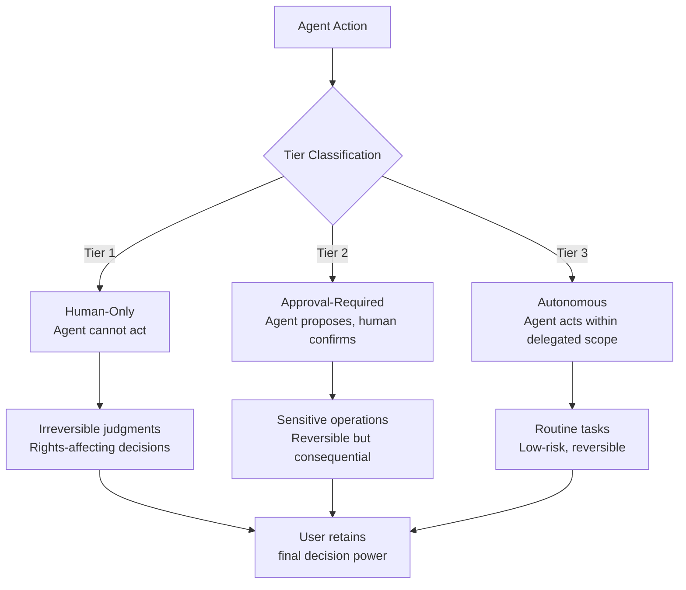
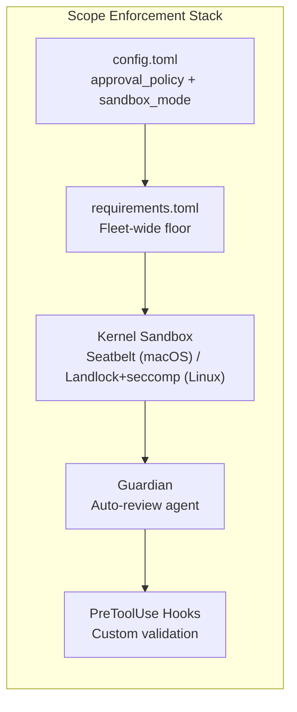

# China's Three-Tier Authority Framework for AI Agents: How Codex CLI's Permission Architecture Maps to the World's First Agent Regulation


---

On 15 July 2026, China's Cyberspace Administration (CAC), National Development and Reform Commission (NDRC), and Ministry of Industry and Information Technology (MIIT) jointly enacted the *Implementation Opinions on the Standardised Application and Innovative Development of Intelligent Agents* — the world's first national regulatory framework dedicated specifically to AI agents [^1]. The Opinions define AI agents as "intelligent systems capable of autonomous perception, memory, decision-making, interaction, and execution" and impose a mandatory three-tier decision-authority classification that every deployed agent must satisfy before it ships [^2].

For engineering teams running coding agents against production repositories, this is not an abstract policy document. If your organisation operates in Chinese markets — or serves customers who do — your coding agent's permission model is now a compliance surface. This article maps the three regulatory tiers to Codex CLI's existing permission architecture, identifies what already satisfies the framework, and flags the gaps that remain.

## The Three Tiers

Article 6 of the Opinions requires that every agent's decision authority be sorted into three categories before deployment [^1]:



The separation logic rests on two axes: **action sensitivity** and **reversibility**. Heavy, irreversible outcomes (financial transfers, contract signing, credential rotation) sit in Tier 1. Lighter, reversible actions (search summarisation, schedule adjustments, code formatting) drop to Tier 3. Everything in between — consequential but correctable — lands in Tier 2 [^3].

Critically, even Tier 3 autonomous actions carry a transparency obligation: the user retains "the right to know and the final decision-making power regarding the autonomous decisions made by the intelligent agent, and that the intelligent agent's actions do not exceed the scope authorised by the user" [^2].

## Codex CLI's Permission Architecture

Codex CLI ships with a three-mode permission system that predates the Chinese regulation but aligns with it structurally [^4]:

| Codex CLI Mode | Behaviour | Regulatory Tier Mapping |
|---|---|---|
| **suggest** | Agent proposes changes; human applies them manually | Tier 1–2: agent cannot execute |
| **auto-edit** | File edits applied automatically; shell commands require confirmation | Tier 2–3: split authority |
| **full-auto** | Agent executes both file edits and shell commands autonomously | Tier 3: autonomous within sandbox |

The mapping is not one-to-one — the regulation classifies *actions*, while Codex classifies *capability surfaces*. But the structural correspondence holds: suggest mode prevents autonomous execution entirely (Tier 1 compliance), auto-edit mode introduces selective approval gates (Tier 2), and full-auto mode delegates within a constrained sandbox (Tier 3).

### Configuration in Practice

Permission modes are set in `config.toml` or via CLI flags:

```toml
# config.toml — Tier 2 equivalent: auto-edit with sandbox constraints
[defaults]
approval_policy = "auto-edit"
sandbox_mode = "workspace-write"
```

```bash
# CLI override — Tier 1 equivalent: suggest-only, read-only sandbox
codex --approval-policy suggest --sandbox read-only "Review this PR for security issues"
```

For enterprise fleet enforcement, `requirements.toml` sets a floor that individual developers cannot lower [^5]:

```toml
# requirements.toml — enforced across all machines via MDM
[minimum]
approval_policy = "auto-edit"    # Developers cannot drop below Tier 2
sandbox_mode = "workspace-write"  # No danger-full-access allowed
```

## Mapping the Compliance Requirements

The Opinions impose five categories of obligation. Here is how Codex CLI's existing architecture addresses each:

### 1. Decision-Authority Documentation (Article 6)

The regulation requires that authority tiers be "clarified" before deployment. Codex CLI's `AGENTS.md` file — committed to version control alongside the codebase — serves as the declaration surface:

```markdown
## Permissions

This agent operates in auto-edit mode (Tier 2 equivalent).

### Human-Only Actions (Tier 1)
- Production deployments
- Credential rotation
- Database migrations with data loss potential

### Approval-Required Actions (Tier 2)
- File modifications (auto-applied)
- Shell commands (require confirmation)
- Network requests (sandboxed)

### Autonomous Actions (Tier 3)
- File reads within workspace
- Code analysis and search
- Test execution within sandbox
```

This pattern satisfies the documentation requirement, but it depends on teams actually writing it. The regulation demands it; Codex CLI enables it.

### 2. Audit Trail (Article 7)

Article 7 mandates "verifiable, traceable mechanisms" to reconstruct agent behaviour after incidents [^3]. Codex CLI generates structured logs with session IDs, tool call analytics, and connector identifiers for MCP interactions. The `codex doctor --json` diagnostic output provides a support-ready snapshot of environment, Git state, terminal configuration, and thread inventory [^4].

However, Codex CLI does not natively record *decision rationale* — the "data and documents consulted for judgment" that the regulation requires. This is a gap. Teams needing compliance would need to combine Codex logs with external audit infrastructure, or use `PostToolUse` hooks to capture rationale:

```bash
#!/bin/bash
# .codex/hooks/post-tool-use.sh — audit logging hook
# Captures tool name, arguments, and outcome for compliance trail
echo "$(date -u +%Y-%m-%dT%H:%M:%SZ) | tool=$CODEX_TOOL_NAME | args=$CODEX_TOOL_ARGS | exit=$CODEX_EXIT_CODE" \
  >> .codex/audit-log.jsonl
```

### 3. User Override Rights

The Opinions guarantee users "the right to know and the final decision-making power" over all agent actions [^2]. In suggest mode, this is trivially satisfied — nothing executes without explicit human action. In auto-edit mode, the split authority model (auto-apply edits, confirm commands) preserves override for the most consequential surface. In full-auto mode, the Guardian auto-review agent provides a secondary review layer: eligible escalations go to a separate reviewer agent that approves or denies actions without widening the sandbox [^4].

Users can also interrupt any running Codex session with `Ctrl+C`, and the `--always-confirm-before-full-access` flag (strengthened in v0.145.0) prevents accidental scope escalation.

### 4. Scope Constraints

The regulation requires that agent actions "do not exceed the scope authorised by the user" [^2]. Codex CLI enforces this at the kernel level through platform-native sandboxing:



The sandbox modes (`read-only`, `workspace-write`, `danger-full-access`) map to progressively wider scopes of autonomous action. The `workspace-write` mode — which restricts file modifications to the project directory and denies network access during agent execution — is the natural Tier 2/3 boundary for most coding workflows [^5].

### 5. Sector-Specific Filing (Article 11)

High-risk sectors (healthcare, transportation, media, public safety) face mandatory filing, compliance testing, and product recall authority [^1]. This is outside Codex CLI's scope — it is a regulatory obligation on the deploying organisation, not the tool. However, `requirements.toml` provides the enforcement mechanism: a compliance team can lock the permission floor across a fleet of developer machines via MDM, ensuring no developer drops below the mandated tier.

## What the Regulation Gets Right

The three-tier model captures a genuine architectural insight: the interesting governance question is not whether an agent *can* act autonomously, but which *specific actions* warrant which *level of human involvement*. This action-level classification is more nuanced than the binary "autonomous vs. supervised" framing that dominates Western AI governance discourse.

Codex CLI's permission modes operate at the capability-surface level (files vs. commands), not the action-semantic level (deployment vs. formatting). The regulation pushes towards the latter, and that is a harder problem. An `rm -rf /` and an `rm test-output.log` are both shell commands, but they sit in different tiers. Codex CLI's dangerous-command detection — strengthened in v0.144.5 to recognise more forced `rm` forms [^4] — is a step towards action-semantic classification, but it covers a narrow surface.

## What Remains Missing

Three gaps stand between Codex CLI's current architecture and full regulatory compliance:

1. **Decision rationale logging.** The Opinions require recording not just *what* the agent did, but *why*. Codex CLI logs tool calls and outcomes, but not the reasoning chain that led to a specific action. ⚠️ This would likely require model-level instrumentation that OpenAI has not yet exposed.

2. **Tier classification metadata.** There is no first-class mechanism in `config.toml` or `AGENTS.md` to tag specific actions with their regulatory tier. The mapping exists implicitly through permission modes, but the regulation wants explicit documentation.

3. **Recall and incident response.** Article 11 requires product recall provisions for high-risk deployments. Codex CLI has no built-in mechanism for remotely disabling or rolling back an agent's actions across a fleet. `requirements.toml` can tighten future sessions, but cannot undo past ones.

## Practical Recommendations

For teams operating Codex CLI in environments where the Chinese regulation applies:

1. **Default to auto-edit mode** (`approval_policy = "auto-edit"`) as your Tier 2 baseline. This ensures shell commands — the most consequential action surface — always require human confirmation.

2. **Document your tier mapping** in `AGENTS.md` and commit it to version control. List which actions your agent performs autonomously, which require approval, and which are forbidden.

3. **Deploy audit hooks.** Use `PostToolUse` hooks to log tool calls with timestamps and outcomes to a compliance-ready store. Feed these into your existing audit infrastructure.

4. **Enforce via `requirements.toml`.** Set a fleet-wide permission floor via MDM. This prevents individual developers from dropping below your compliance baseline.

5. **Watch for upstream support.** OpenAI's permission architecture is evolving rapidly — the Guardian auto-review system, introduced as the default in 2026, already adds a secondary decision layer. Future versions may expose decision rationale in structured logs.

## The Bigger Picture

China's framework is the first, but it will not be the last. The EU AI Act's implementing regulations for general-purpose AI models are due in 2027. Illinois's AI Accountability Act mandates third-party safety audits [^6]. The structural pattern — classify actions by consequence, require human involvement proportional to risk, maintain an audit trail — is converging across jurisdictions.

Codex CLI's three-mode permission system, kernel-level sandboxing, and fleet enforcement via `requirements.toml` provide the mechanical foundation. What the regulation adds is the *obligation to document the mapping* — to declare, before deployment, which actions sit in which tier, and to prove, after the fact, that the agent respected those boundaries.

The tool is ready. The paperwork is on you.

## Citations

[^1]: CAC, NDRC, MIIT, "Implementation Opinions on the Standardised Application and Innovative Development of Intelligent Agents," effective 15 July 2026. [NYU Shanghai AI Law Centre analysis](https://rits.shanghai.nyu.edu/ai/china-issues-first-national-policy-framework-dedicated-to-ai-agents/)

[^2]: Pebblous AI, "China's AI Agent Rules: Three Tiers of Decision Authority," July 2026. [https://blog.pebblous.ai/blog/china-ai-agent-decision-tiers/en/](https://blog.pebblous.ai/blog/china-ai-agent-decision-tiers/en/)

[^3]: AI Governance Institute, "China's Agent Rules Take Effect July 15 and Illinois Mandates Third-Party Safety Audits," July 2026. [https://aigovernance.com/news/chinas-agent-rules-take-effect-july-15-and-illinois-mandates-third-party-safety-audits](https://aigovernance.com/news/chinas-agent-rules-take-effect-july-15-and-illinois-mandates-third-party-safety-audits)

[^4]: OpenAI, "Codex CLI Changelog," July 2026. [https://learn.chatgpt.com/docs/changelog](https://learn.chatgpt.com/docs/changelog)

[^5]: OpenAI, "Codex CLI Configuration Basics," 2026. [https://developers.openai.com/codex/config-basic](https://developers.openai.com/codex/config-basic)

[^6]: AI Governance Institute, "AI Governance Weekly — July 16, 2026," July 2026. [https://aigovernance.com/news/ai-governance-weekly-july-16-2026](https://aigovernance.com/news/ai-governance-weekly-july-16-2026)
