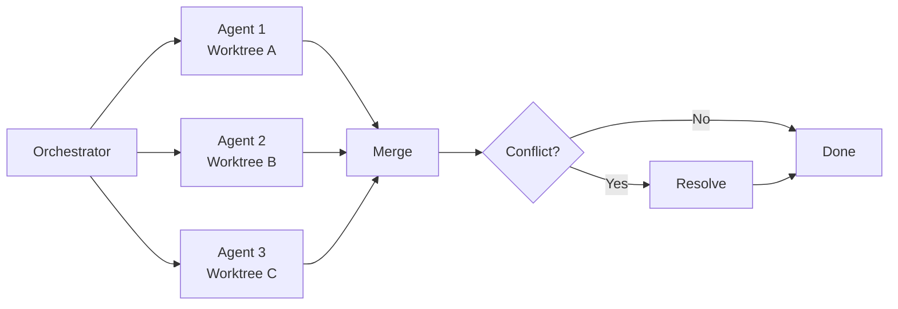
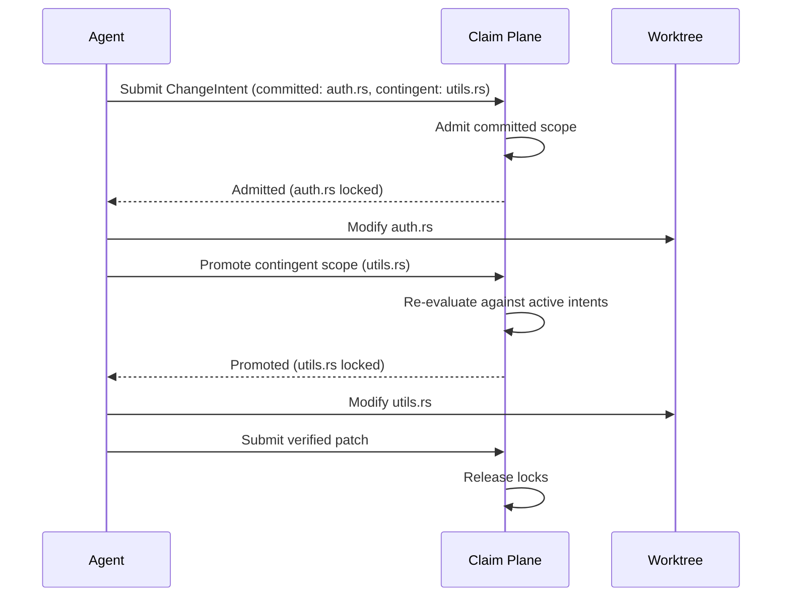

# Claim Plane and Pre-Write Admission Control: Why Parallel Coding Agents Need Coordination Before the First Keystroke


---

The merge conflict rate for cross-agent pull requests sits at 41.7%, roughly double the intra-agent rate [^1]. When two or more coding agents work on the same repository simultaneously — the pattern the community calls _agentmaxxing_ — interference is not an edge case but a near-certainty. The standard response has been to isolate agents in separate git worktrees and resolve conflicts at merge time. A paper published on 24 July 2026 argues that this is backwards: coordination should happen _before_ any agent writes its first line of code, not after [^2].

This article examines Nikolaev's **Claim Plane** architecture, maps its mechanisms to what Codex CLI already provides, and identifies the gaps where pre-write admission control could transform multi-agent workflows from conflict-tolerant to conflict-free.

## The Problem with Post-Hoc Coordination

Today's parallel agent workflows follow a pattern that will be familiar to anyone who has run multiple Codex CLI sub-agents via Multi-Agent V2:



Each agent works in its own worktree, blissfully unaware of what the others are doing. Conflicts surface only at integration time. This works, but it creates three categories of waste:

1. **Content conflicts** — two agents modify the same file region (57.6% of all conflicts in the AIDev-pop dataset) [^1].
2. **Semantic conflicts** — changes compile independently but produce incompatible runtime behaviour (not caught by merge tooling at all).
3. **Scope creep** — an agent expands beyond its assigned task, inadvertently trampling into another agent's territory.

The Claim Plane paper's central insight is that all three failure modes share a root cause: agents begin writing before declaring what they intend to change [^2].

## What Claim Plane Proposes

Claim Plane is a model-agnostic coordination layer that sits between task assignment and code execution. It introduces three mechanisms that do not exist in any shipping coding agent today.

### 1. ChangeIntent Declarations

Before an agent touches any file, it submits a versioned **ChangeIntent** specifying:

- The exact base commit it is working from
- Typed resources it intends to modify (file paths, line ranges, symbols)
- Dependencies on other intents
- Whether operations are **committed** (definitely needed) or **contingent** (might be needed depending on what the agent discovers)

This is structurally different from a git branch name or a task description. It is a machine-readable contract that the control plane can reason about deterministically [^2].

### 2. Atomic Admission Control

The control plane evaluates each ChangeIntent against all currently active intents and applies five rules:

| Rule | Effect |
|---|---|
| Same-file parallelism constrained to declared regions | Two agents can edit the same file if their declared line ranges do not overlap |
| Unresolved overlaps serialised | If regions overlap, the second intent queues until the first completes |
| Dependency invalidation tracked | If Agent A's change invalidates a premise Agent B declared, Agent B is notified |
| Monotonic tokens for ordering | All intents receive monotonically increasing tokens to establish a total order |
| Fail closed on ambiguous authority | If the control plane cannot determine whether two intents are compatible, it rejects the later one |

The "fail closed" default is critical. It means the system never allows a potentially conflicting change through on the assumption that things will work out. This is the opposite of how git worktree isolation behaves, where everything is allowed and conflicts are discovered later [^2].

### 3. Dynamic Scope Promotion

Real agent workflows are not fully plannable. An agent assigned to "fix the authentication bug" might discover it needs to modify a utility function it did not anticipate. Claim Plane handles this through **contingent mutations**:



A contingent operation does not initially claim write ownership. When the agent attempts its first mutation on a contingent resource, the system atomically promotes the scope and re-evaluates admission against all active intents. If promotion would create a conflict, the agent is blocked — not the other agent that was there first [^2].

## Preliminary Results

Nikolaev's evaluation is deliberately modest. Six agent pairs ran on a CooperBench-derived task set:

- **Static mode** (all resources declared upfront): 6/6 pairs completed without conflict, fully serialised where necessary.
- **Dynamic mode** (contingent scope allowed): 3/6 pairs achieved genuine parallel admission; 7 successful scope promotions; 2 failures from undeclared mutations (the agent tried to write a file it had not declared even as contingent).

The author explicitly notes the sample size is insufficient for comparative claims [^2]. But the qualitative finding matters: when agents declare intent before writing, the control plane can prevent the entire category of content and scope conflicts that dominate the AIDev-pop dataset [^1].

## How Codex CLI Compares Today

Codex CLI's Multi-Agent V2 (stabilised in v0.145.0, 21 July 2026) provides the isolation layer but not the admission layer [^3]. Here is how the current architecture maps to Claim Plane's mechanisms:

| Claim Plane Mechanism | Codex CLI Equivalent | Gap |
|---|---|---|
| ChangeIntent declaration | None — agents receive task descriptions in natural language | No machine-readable intent format |
| Atomic admission control | None — worktree isolation assumes independence | No pre-write conflict detection |
| Same-file region locking | Worktree isolation (entire repo copy) | Over-provisioned — each agent gets a full copy rather than scoped access |
| Dependency tracking | None — parent agent manually coordinates | No automated invalidation |
| Scope promotion | None — agents can modify any file in their worktree | No scope enforcement |
| Fail-closed default | Sandbox deny-by-default for tools, but not for file scope | Security scope exists, coordination scope does not |

### What Codex CLI Does Well

The worktree isolation pattern is genuinely effective at preventing the worst category of conflict: two agents writing to the same file simultaneously. As of v0.145.0, spawned sub-agents reliably inherit sandbox and network rules from the parent session [^3], and the configurable sub-agent models, reasoning levels, and concurrency settings give developers fine-grained control over resource allocation.

The **PostToolUse hook** mechanism also provides a natural extension point. A hook that validates each file write against a coordination manifest could approximate region-level locking without requiring changes to the Codex CLI core:

```toml
# config.toml — hypothetical coordination hook
[hooks.post_tool_use]
command = "claim-plane-check --intent-file .codex/intents/$AGENT_ID.json --file $FILE_PATH"
on_failure = "block"
```

### What Is Missing

The fundamental gap is that Codex CLI's multi-agent coordination is **advisory, not enforced**. The parent agent can tell sub-agents what to work on, but nothing prevents a sub-agent from modifying files outside its assigned scope. The `requirements.toml` mechanism enforces security policy (sandbox modes, network access) but does not enforce coordination policy (which files each agent may modify) [^4].

## The Broader Coordination Landscape

Claim Plane is not the only recent work addressing this problem. It sits within a rapidly developing family of pre-execution governance architectures:

- **Agent Control Protocol (ACP)** v1.30 (March 2026) provides cryptographic admission control for agent actions, validating identity, capability scope, and delegation chain before execution [^5].
- **ActPlane** (June 2026) enforces OS-level policy for agent harnesses, translating natural-language policy intent into concrete system-call restrictions [^6].
- The **deterministic control plane** architecture from RelAIBuild (June 2026) treats agent configuration itself as a supply-chain artefact requiring governance [^7].

What distinguishes Claim Plane from these is its focus on **coordination** rather than **security**. ACP and ActPlane prevent agents from doing things they should not do. Claim Plane prevents agents from doing things that are individually valid but collectively incompatible — a distinction that becomes critical as multi-agent workflows scale beyond two or three concurrent agents.

## Practical Implications for Codex CLI Users

Until a formal coordination layer ships, Codex CLI developers running parallel agents can approximate Claim Plane's benefits with existing mechanisms:

### 1. Explicit Scope Assignment in AGENTS.md

Declare file ownership boundaries in your `AGENTS.md` or task delegation prompts:

```markdown
## Agent Coordination Rules

- Agent 1 owns: src/auth/**, tests/auth/**
- Agent 2 owns: src/api/**, tests/api/**
- Shared files (src/config.ts, src/types.ts): Agent 1 only, Agent 2 reads only
- Any modification outside owned scope requires human approval
```

This is advisory, not enforced, but frontier models (GPT-5.6 Sol, Terra) respect explicit boundary instructions with reasonable reliability.

### 2. PostToolUse Hooks for Scope Validation

Write a hook that checks each file write against a manifest:

```bash
#!/bin/bash
# .codex/hooks/scope-check.sh
AGENT_ID="$1"
FILE_PATH="$2"
MANIFEST=".codex/scope-manifest.json"

if ! jq -e ".agents[\"$AGENT_ID\"].allowed_paths[] | select(. == \"$FILE_PATH\" or (endswith(\"/**\") and ($FILE_PATH | startswith(rtrimstr(\"/**\")))))" "$MANIFEST" > /dev/null 2>&1; then
  echo "SCOPE VIOLATION: Agent $AGENT_ID attempted to modify $FILE_PATH outside declared scope"
  exit 1
fi
```

### 3. Sequential Merge with Rebase

Rather than merging all worktrees simultaneously, merge them sequentially with rebasing to surface conflicts incrementally:

```bash
# Merge agents in priority order
git checkout main
git merge --no-ff agent-1/auth-fix
git checkout agent-2/api-refactor
git rebase main
# If rebase conflicts, the second agent's changes are reviewed against the first
git checkout main
git merge --no-ff agent-2/api-refactor
```

## What Comes Next

The Claim Plane paper is a position piece with a preliminary evaluation, not a shipping system. But it identifies a coordination primitive — pre-write intent declaration — that is absent from every current coding agent and demonstrably needed given the 41.7% cross-agent conflict rate [^1].

The most likely path to adoption is not a standalone coordination server but integration into existing agent runtimes. Codex CLI's PostToolUse hooks, Herdr's socket API, and OMX's worktree automation layer all provide natural extension points where ChangeIntent-style declarations could be bolted on without requiring changes to the underlying models [^3].

⚠️ Whether models can reliably generate accurate ChangeIntents — declaring the right file regions before they have explored the code — remains an open question. The paper's two undeclared-mutation failures in six pairs suggest this is a non-trivial challenge.

The gap between "agents work in isolation and hope for the best" and "agents declare intent and coordinate deterministically" is the same gap the industry crossed with database transactions decades ago. Claim Plane makes the case that coding agents need the same transition.

---

## Citations

[^1]: Xu, Subramanian & Karthik. "AIDev-pop: Understanding Multi-Agent PR Conflicts at Scale." arXiv:2607.04697, July 2026. [https://arxiv.org/abs/2607.04697](https://arxiv.org/abs/2607.04697)

[^2]: Nikolaev, M. "Claim Plane: Enforceable Change Intents and Dynamic Scope for Parallel Coding Agents." arXiv:2607.21909, July 24, 2026. [https://arxiv.org/abs/2607.21909](https://arxiv.org/abs/2607.21909)

[^3]: OpenAI. "Codex CLI v0.145.0 Release Notes." GitHub, July 21, 2026. [https://github.com/openai/codex/releases/tag/rust-v0.145.0](https://github.com/openai/codex/releases/tag/rust-v0.145.0)

[^4]: OpenAI. "Codex CLI Documentation — Requirements and Configuration." GitHub, 2026. [https://github.com/openai/codex](https://github.com/openai/codex)

[^5]: Agent Control Protocol v1.30. "Admission Control for Agent Actions." arXiv:2603.18829, March 2026. [https://arxiv.org/abs/2603.18829](https://arxiv.org/abs/2603.18829)

[^6]: ActPlane. "Programmable OS-Level Policy Enforcement for Agent Harnesses." arXiv:2606.25189, June 2026. [https://arxiv.org/abs/2606.25189](https://arxiv.org/abs/2606.25189)

[^7]: RelAIBuild. "A Deterministic Control Plane for LLM Coding Agents." arXiv:2606.26924, June 2026. [https://arxiv.org/abs/2606.26924](https://arxiv.org/abs/2606.26924)
