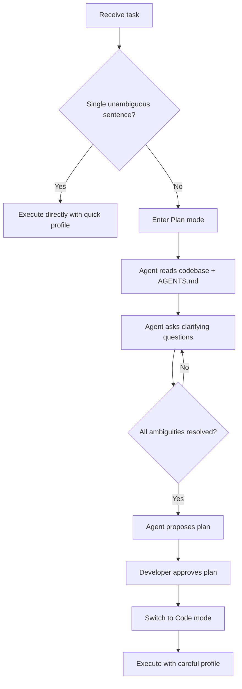

# ClarifyCodeBench and the Clarification Gap: Why Your Codex CLI Agent Writes Wrong Code from Ambiguous Prompts


---

A new benchmark published in July 2026 quantifies what most senior developers already suspect: frontier LLMs are dramatically better at writing code than they are at asking whether they should write *that* code. ClarifyCodeBench (Fang et al., arXiv:2607.00711) [^1] exposes a structural gap between code synthesis ability and requirement clarification ability — and the numbers are sobering. This article examines the research, maps its findings onto Codex CLI's interactive workflow, and offers practical defences against the clarification gap.

## The Research: What ClarifyCodeBench Measures

ClarifyCodeBench evaluates six frontier LLMs on 419 ambiguous programming tasks drawn from real-world problems [^1]. Each task carries manually annotated ambiguity types, associated clarification questions, and ground-truth answers. The benchmark introduces two metrics:

- **Turn-discounted Key Question Rate (TKQR)**: Measures whether the model asks the *right* clarifying questions, penalising inefficient questioning rounds.
- **Optimal Round Adherence (ORA)**: Measures whether the model asks the right *number* of clarification rounds — neither under-asking nor over-asking.

### The Ambiguity Taxonomy

The researchers identified ten distinct ambiguity types across their task corpus [^1]:

| Ambiguity Type | Description |
|---|---|
| Terminology | Undefined or overloaded terms |
| Behaviour | Unspecified functional semantics |
| Edge Cases | Undefined handling of boundary inputs |
| Indices & Ranges | Ambiguous zero/one-based indexing or slice semantics |
| Ordering & Atomicity | Unclear operation sequence or transaction guarantees |
| Output Format | Unspecified return structure or display rules |
| Comparison Rules | Ambiguous equality, sorting, or ranking criteria |
| Units | Missing or conflicting measurement units |
| Collection Semantics | Unclear set/list/multiset behaviour |
| Numerical Precision | Unspecified rounding or floating-point handling |

## The Headline Numbers

The results reveal a consistent pattern: models that excel at code generation stumble at requirement elicitation.

### Code Generation Drops Under Ambiguity

Pass@1 scores fall sharply when requirements are ambiguous versus complete [^1]:

| Model | Ambiguous | Complete | Drop |
|---|---|---|---|
| GPT-5 (reasoning) | 41.1% | 52.5% | -11.4 pts |
| Claude Sonnet 4.5 | 38.2% | 48.8% | -10.6 pts |
| DeepSeek-V3.2 | 39.1% | 50.0% | -10.9 pts |
| Qwen3-235B-A22B | 27.7% | 47.5% | -19.8 pts |
| Gemini 2.5 Flash | 29.8% | 43.8% | -14.0 pts |
| GPT-4o | 27.2% | 35.0% | -7.8 pts |

Qwen3 suffers the largest drop: nearly 20 percentage points of performance evaporates simply because the requirement is underspecified.

### Clarification Ability Doesn't Track Code Ability

TKQR scores — measuring the quality of clarifying questions — show a strikingly different ranking from code generation ability [^1]:

| Model | TKQR | ORA | Avg Clarification Turns |
|---|---|---|---|
| DeepSeek-V3.2 | 0.30 | 0.50 | 1.54 |
| Gemini 2.5 Flash | 0.29 | 0.23 | 2.22 |
| GPT-4o | 0.22 | 0.33 | 1.26 |
| GPT-5 | 0.21 | 0.26 | 0.70 |
| Claude Sonnet 4.5 | 0.12 | 0.22 | 0.29 |
| Qwen3-235B-A22B | 0.07 | 0.13 | 0.46 |

DeepSeek-V3.2 leads in clarification quality despite not being the strongest code generator. Claude Sonnet 4.5 averages just 0.29 clarification turns — it almost never asks a question before diving into code. GPT-5's reasoning capabilities improve its code correctness but yield only marginal gains in ambiguity detection.

### The Multi-Ambiguity Cliff

Performance degrades catastrophically as ambiguity density increases [^1]:

- **Single ambiguity**: ~30% success rate (best model)
- **Dual ambiguity**: ~8% success rate
- **Triple ambiguity**: approaching 0% across all models

This is the most practically significant finding. Real-world tasks rarely contain a single ambiguity — they compound. A requirement like "sort the transactions by date and group duplicates" contains at least three ambiguities (sort stability, date granularity, duplicate definition), and no model reliably resolves all three.

### Ambiguity Blind Spots

Models show strong performance on explicit, constrained ambiguity types (Numerical Precision: 100% hit rate for top models; Units: 66.7%) but consistently fail on semantic ambiguities [^1]:

- **Ordering & Atomicity**: 0% for most models
- **Comparison Rules**: at most 12.5%
- **Collection Semantics**: at most 16.7%

These are precisely the ambiguities that cause the most expensive bugs in production systems.

## Three Structural Insights

The paper surfaces three findings that should reshape how we interact with coding agents:

**1. Capability Decoupling.** Strong code generation does not imply strong clarification. The skills are orthogonal. An agent that writes excellent code from a clear specification may still charge ahead with wrong assumptions when the specification is fuzzy.

**2. The Reasoning Paradox.** Enhanced reasoning (as in GPT-5) improves code correctness but yields marginal gains in ambiguity identification. The model reasons better *about code* but not better *about what code to write*.

**3. Premature Code Generation.** Most models generate code prematurely rather than asking clarifying questions. Claude Sonnet 4.5 averages 0.29 clarification turns — it asks a question roughly once every three tasks. The default behaviour is to guess and build, not to ask and confirm.

## Mapping to Codex CLI: Defence Against the Clarification Gap

Codex CLI provides several mechanisms to counteract these weaknesses. None are automatic — they require deliberate workflow design.

### Plan Mode as Forced Elicitation

Codex CLI's Plan mode (`/plan` or `Shift+Tab`) [^2] changes the agent's default behaviour from "write code" to "investigate, ask questions, and propose a plan." This directly addresses premature code generation:

```bash
# Start Codex in plan mode for underspecified tasks
codex --mode plan "Implement the transaction reconciliation module"
```

In Plan mode, Codex reads relevant files, identifies unknowns, and asks clarifying questions before touching any code [^2]. The ClarifyCodeBench data suggests this is not optional — it is a necessary defence against the 10-20 percentage point accuracy drop caused by ambiguity.

**When to use it**: If your prompt contains any of the ten ambiguity types from the taxonomy above, start in Plan mode. A practical heuristic: if you cannot describe the task in a single, unambiguous sentence, force planning first.

### AGENTS.md as Pre-Answered Clarification

The most effective defence against ambiguity is eliminating it before the model ever sees the prompt. AGENTS.md [^3] serves as a repository-level answer key for the most common ambiguities:

```markdown
# AGENTS.md

## Edge Cases
- Null inputs: return empty collection, never null
- Empty strings: treat as valid input, not missing
- Negative indices: raise ValueError with descriptive message

## Output Format
- All API responses: JSON with snake_case keys
- Date format: ISO 8601 (UTC), never locale-dependent
- Monetary values: integer pence/cents, never floating-point

## Collection Semantics
- Lists preserve insertion order; duplicates allowed
- Sets use value equality, not reference equality
- Maps: last-write-wins on key collision

## Comparison Rules
- String sorting: case-insensitive, locale-aware (en_GB)
- Numeric equality: epsilon 1e-9 for floating-point
- Date comparison: calendar day granularity unless specified
```

This directly addresses the ambiguity types where models are weakest. The ClarifyCodeBench data shows that Ordering & Atomicity and Collection Semantics have near-zero hit rates — precisely the areas where explicit AGENTS.md conventions have the most impact.

### The Reverse Interview Pattern

Rather than hoping the model will spontaneously ask the right questions (TKQR scores suggest it will not), you can force a structured elicitation round:

```
Before writing any code for this task, ask me 5 clarifying questions
about edge cases, output format, and error handling. Do not proceed
until I have answered all questions.
```

This leverages the `AskUserQuestion` tool [^4], which lets Codex present structured clarifying questions with constrained answer options. The ClarifyCodeBench data shows models perform best when they do ask questions — the problem is that they rarely choose to.

### Named Profiles for Ambiguity-Sensitive Workflows

Codex CLI's named profiles [^5] let you encode a "clarify first" policy per project:

```toml
# ~/.codex/config.toml

[profile.careful]
model = "gpt-5.6-sol"
approval_policy = "suggest"
plan_mode_reasoning_effort = "high"

[profile.quick]
model = "gpt-5.6-luna"
approval_policy = "auto-edit"
```

The `careful` profile uses a stronger model with higher reasoning effort and `suggest` mode, which requires explicit approval before code changes — creating a natural checkpoint for requirement validation. The `quick` profile is for well-specified, low-ambiguity tasks.

### Workflow: The Clarification Defence

Combining these mechanisms into a practical workflow:



## The Broader Implication

ClarifyCodeBench quantifies something that the Codex CLI team has been building towards with Plan mode, AskUserQuestion, and AGENTS.md: **static code synthesis is insufficient for real-world software engineering**. The paper's conclusion — that AI4SE research must transition from static synthesis to interactive elicitation [^1] — validates the interactive, multi-turn workflow that terminal-native agents like Codex CLI are uniquely positioned to support.

The practical takeaway for senior developers is straightforward: treat every underspecified prompt as a source of 10-20% accuracy loss. Use Plan mode, write explicit AGENTS.md conventions for your weakest ambiguity types, and force clarification rounds before code generation. The models will not do this by themselves — the data shows they would rather guess than ask.

## Citations

[^1]: Fang, Z., Jin, D., Dong, Y., Li, Y., Zhang, K., Jin, Z. & Li, G. (2026). "ClarifyCodeBench: Evaluating LLMs on Clarifying Ambiguous Requirements for Code Generation." arXiv:2607.00711. [https://arxiv.org/abs/2607.00711](https://arxiv.org/abs/2607.00711)

[^2]: OpenAI (2026). "Codex CLI Plan Mode." OpenAI Developers Documentation. [https://developers.openai.com/codex/cli/slash-commands](https://developers.openai.com/codex/cli/slash-commands)

[^3]: OpenAI (2026). "AGENTS.md Specification." GitHub. [https://github.com/openai/codex/blob/main/AGENTS.md](https://github.com/openai/codex/blob/main/AGENTS.md)

[^4]: OpenAI (2026). "Codex CLI Interactive Clarification: AskUserQuestion Tool." GitHub Issue #9926. [https://github.com/openai/codex/issues/9926](https://github.com/openai/codex/issues/9926)

[^5]: OpenAI (2026). "Codex CLI Configuration Reference: Named Profiles." OpenAI Developers Documentation. [https://developers.openai.com/codex/cli/configuration](https://developers.openai.com/codex/cli/configuration)
