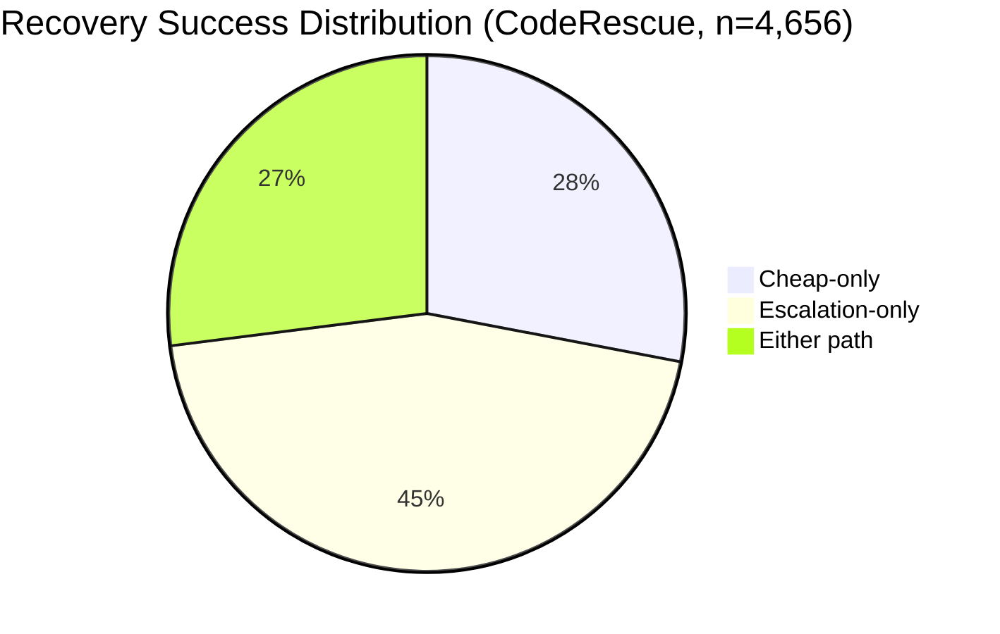
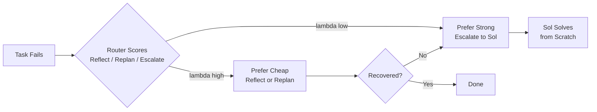
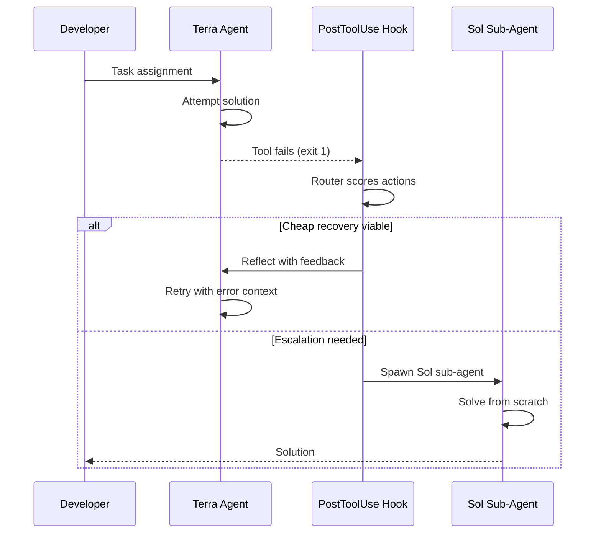

# CodeRescue and Budget-Calibrated Recovery Routing: When Your Codex CLI Agent Should Retry Cheap and When It Should Escalate


---

Every coding agent fails. The question that determines your token bill is what happens next. A naive cascade — try the cheap model, then throw the problem at the expensive one — leaves significant value on the table. He et al.'s CodeRescue framework (arXiv:2607.19338, July 2026) demonstrates that a trained router with a single budget-calibration knob can match always-escalate solve rates at 35% of the cost [^1]. This article unpacks the research, maps it onto Codex CLI's existing primitives — rollout token budgets, named profiles, and the PostToolUse hook pipeline — and provides practical configuration patterns for teams running mixed Sol/Terra/Luna fleets.

## The Problem: Failure Is Not Binary

Traditional cost-aware model selection treats tasks as a cascade: try a cheap model first, escalate hard cases to a strong one. CodeRescue reframes this by observing that execution feedback — compiler errors, failed tests, stack traces — makes post-failure recovery a richer decision than a binary cheap/expensive choice [^1].

The framework defines three recovery actions after a tool invocation fails:

| Action | Model | What happens |
|---|---|---|
| **Reflect** | Cheap | Revise the existing solution using execution feedback and error traces |
| **Replan** | Cheap | Generate a fresh solution from a different approach |
| **Escalate** | Strong | Solve from scratch, seeded with the cheap model's failure context |

This distinction matters because cheap recovery and escalation exhibit *complementary* success patterns. Across 27,300 problems on five benchmarks (APPS, TACO, BigCodeBench, LiveCodeBench, CodeContests), 28% of failures were solvable only by cheap actions, 45% required escalation, and 27% could be rescued by either path [^1].



## How the Router Works

CodeRescue trains a supervised router — a fine-tuned Qwen3.5-4B model — on 4,656 labelled recovery examples. Each example pairs a failed attempt (problem statement, execution verdict, stderr trace) with the cheapest successful action [^1].

The router produces per-action scores normalised via softmax. Without budget constraints, an unconstrained argmax policy achieves an 81.7% solve rate at 5.51 millicents mean cost — already exceeding the always-escalate baseline (68.6% at 7.22 millicents) [^1].

### Conformal Risk Control: One Knob for Every Budget

The key innovation is a Conformal Risk Control (CRC) layer that converts the router into a budget-aware policy without retraining. A single cost-penalty parameter *lambda* adjusts the action selection:

```
pi_lambda(x) = argmax { s_theta(a|x) - lambda * c(a,x) }
```

Where `s_theta` is the normalised router probability and `c` is the action cost. Higher *lambda* penalises expensive actions more aggressively. The CRC guarantee ensures the marginal expected cost stays within the target budget *B* under exchangeability [^1].

The practical result: one trained router generates an entire Pareto frontier of operating points. At one key efficiency point, the system achieves a 71.7% solve rate at 2.56 millicents — using only 35% of the always-escalate cost [^1].



## Mapping CodeRescue to Codex CLI

Codex CLI does not ship a built-in recovery router. But its configuration primitives — named profiles, rollout token budgets, the hook pipeline, and multi-agent V2 — provide the building blocks for implementing CodeRescue-style recovery routing today.

### Named Profiles as Action Tiers

Named profiles map directly onto CodeRescue's three-tier action space. A `config.toml` can define profiles that correspond to reflect, replan, and escalate [^2]:

```toml
# ~/.codex/config.toml

[profile.reflect]
model = "gpt-5.6-luna"
reasoning_effort = "low"
# Cheap retry with execution context

[profile.replan]
model = "gpt-5.6-terra"
reasoning_effort = "medium"
# Fresh approach, mid-tier model

[profile.escalate]
model = "gpt-5.6-sol"
reasoning_effort = "high"
# Full-power solve from scratch
```

Luna at \$1/\$6 per 1M tokens handles the reflect action. Terra at \$2.50/\$15 covers replanning. Sol at \$5/\$30 serves as the escalation tier [^3]. This maps to CodeRescue's finding that cheap models with execution feedback rescue 28% of failures that escalation cannot [^1].

### Rollout Token Budgets as the Lambda Knob

Codex CLI v0.142.0 introduced configurable rollout token budgets that track usage across agent threads and abort turns when exhausted [^4]. This is functionally equivalent to CodeRescue's *lambda* parameter — it controls how aggressively the system favours cheap actions:

```toml
[profile.cost-controlled]
model = "gpt-5.6-terra"
rollout_token_budget = 500000
# When budget is tight, cheap recovery gets priority
```

A tight budget forces the agent to exhaust cheap recovery before spending tokens on escalation. A generous budget permits early escalation. The key insight from CodeRescue is that this tradeoff is *not monotone* — sometimes spending more on cheap retries yields better results than early escalation [^1].

### PostToolUse Hooks for Failure Detection

The PostToolUse hook fires after every tool call, providing access to stdout, stderr, and exit codes [^5]. This is the natural integration point for routing logic:

```json
{
  "hooks": {
    "PostToolUse": [
      {
        "tool_name": "shell",
        "command": "codex-recovery-router"
      }
    ]
  }
}
```

However, there is a gap: PostToolUse fires only after *successful* tool execution. The proposed `PostToolUseFailure` hook (Issue #24907) would provide a dedicated event surface for failure routing — covering errors, non-zero exits, and timeouts with an `error_kind` discriminator [^6]. Until this ships, teams must parse PostToolUse output for non-zero exit codes and test failure patterns.

### Multi-Agent V2 for Escalation Delegation

Codex CLI v0.145.0 stabilised multi-agent V2 with configurable sub-agent models, reasoning levels, and concurrency [^4]. This enables a direct implementation of the escalation action: when the primary agent (running Luna or Terra) fails, it spawns a Sol sub-agent with the failure context as input.



## The AgentDebugX Connection

CodeRescue addresses *when* to recover; AgentDebugX (arXiv:2607.18754, July 2026) addresses *what* to recover from. AgentDebugX organises debugging as a closed loop of Detect, Attribute, Recover, and Rerun — recognising that the step where an error surfaces is often not the one that caused it [^7].

On GAIA benchmarks, AgentDebugX's DeepDebug module repairs 13 of 73 failed tasks in a single rerun (compared with 4-6 for baseline self-correction), improving overall accuracy from 55.8% to 63.6% [^7]. The attribution step — tracing symptoms backward to the responsible agent and step — is precisely the diagnostic signal CodeRescue's router needs to choose between reflect (local fix) and replan (wrong approach entirely).

For Codex CLI users, the practical takeaway is that failure telemetry quality determines recovery routing quality. Structured error traces from PostToolUse hooks feed better routing decisions than raw stderr.

## A Practical Recovery Profile

Combining these primitives into a working configuration:

```toml
# ~/.codex/config.toml

[profile.recovery-routing]
model = "gpt-5.6-terra"
reasoning_effort = "medium"
rollout_token_budget = 1000000

[profile.recovery-routing.escalation]
model = "gpt-5.6-sol"
reasoning_effort = "high"
# Triggered by hook when Terra exhausts cheap recovery

[profile.recovery-routing.reflect]
model = "gpt-5.6-luna"
reasoning_effort = "low"
rollout_token_budget = 200000
# Tight budget for cheap retries
```

The corresponding AGENTS.md should encode the recovery strategy:

```markdown
## Error Recovery Protocol

When a tool call fails:
1. **Reflect first**: Re-read the error trace. If the failure is a syntax error,
   missing import, or type mismatch, fix it directly without changing approach.
2. **Replan if stuck**: If two reflect attempts fail on the same error class,
   step back and choose a different algorithm or architecture.
3. **Escalate explicitly**: If the task requires reasoning beyond your current
   model tier, say so. Do not loop indefinitely.

Budget discipline: prefer the cheapest recovery action that has historically
worked for this error class. Compiler errors almost always yield to reflection.
Algorithmic failures require replanning.
```

## What CodeRescue Gets Wrong (and What It Means for You)

The paper acknowledges several limitations worth noting:

- **Single recovery step**: CodeRescue models one post-failure decision, not multi-round agent trajectories. Real Codex CLI sessions often involve chains of failures across multiple files [^1].
- **Expected cost, not solve rate**: The CRC layer controls expected recovery cost rather than solve rate. Quality improvements remain empirical, not guaranteed [^1].
- **Training label bias**: Using the cheapest successful action as the training label is a useful proxy but not a calibrated estimate of each action's success probability [^1].

For teams deploying this pattern, the implication is clear: start with coarse-grained routing (Luna for syntax errors, Sol for algorithmic failures) and refine based on your own failure telemetry. CodeRescue's Pareto frontier is a guide, not a prescription.

## Key Takeaways

1. **28% of coding failures are cheaply recoverable** — escalating every failure to Sol wastes tokens on problems Luna can solve with execution feedback.
2. **Rollout token budgets function as a budget-calibration knob** — tighter budgets force cheap recovery, matching CodeRescue's *lambda* parameter.
3. **The PostToolUseFailure hook gap matters** — until Issue #24907 ships, failure routing requires parsing PostToolUse output for error signals.
4. **Multi-agent V2 enables native escalation delegation** — spawning a Sol sub-agent with failure context implements the escalate action directly.
5. **Failure telemetry quality determines routing quality** — structured error traces from hooks feed better routing decisions than raw output.

## Citations

[^1]: He, Q., Cheng, J., Le, C., Wang, R., Liu, X., Chen, Y., Mei, J., Wang, Z., Chen, X., Chen, Y. & Wang, T. (2026). "CodeRescue: Budget-Calibrated Recovery Routing for Coding Agents." arXiv:2607.19338. [https://arxiv.org/abs/2607.19338](https://arxiv.org/abs/2607.19338)

[^2]: OpenAI. (2026). "Codex CLI Configuration Reference — Named Profiles." [https://developers.openai.com/codex/configuration](https://developers.openai.com/codex/configuration)

[^3]: OpenAI. (2026). "GPT-5.6 Model Family — Sol, Terra, Luna Pricing." [https://openai.com/api/pricing/](https://openai.com/api/pricing/)

[^4]: OpenAI. (2026). "Codex CLI Changelog — v0.142.0 through v0.145.0." [https://developers.openai.com/codex/changelog](https://developers.openai.com/codex/changelog)

[^5]: OpenAI. (2026). "Codex CLI Hooks Reference — PostToolUse Event." [https://developers.openai.com/codex/hooks](https://developers.openai.com/codex/hooks)

[^6]: GitHub Issue #24907. (2026). "Feature: PostToolUseFailure hook (failure-branch sibling of PostToolUse)." [https://github.com/openai/codex/issues/24907](https://github.com/openai/codex/issues/24907)

[^7]: AgentDebugX Team. (2026). "AgentDebugX: An Open-Source Toolkit for Failure Observability, Attribution, and Recovery in LLM Agents." arXiv:2607.18754. [https://arxiv.org/abs/2607.18754](https://arxiv.org/abs/2607.18754)
