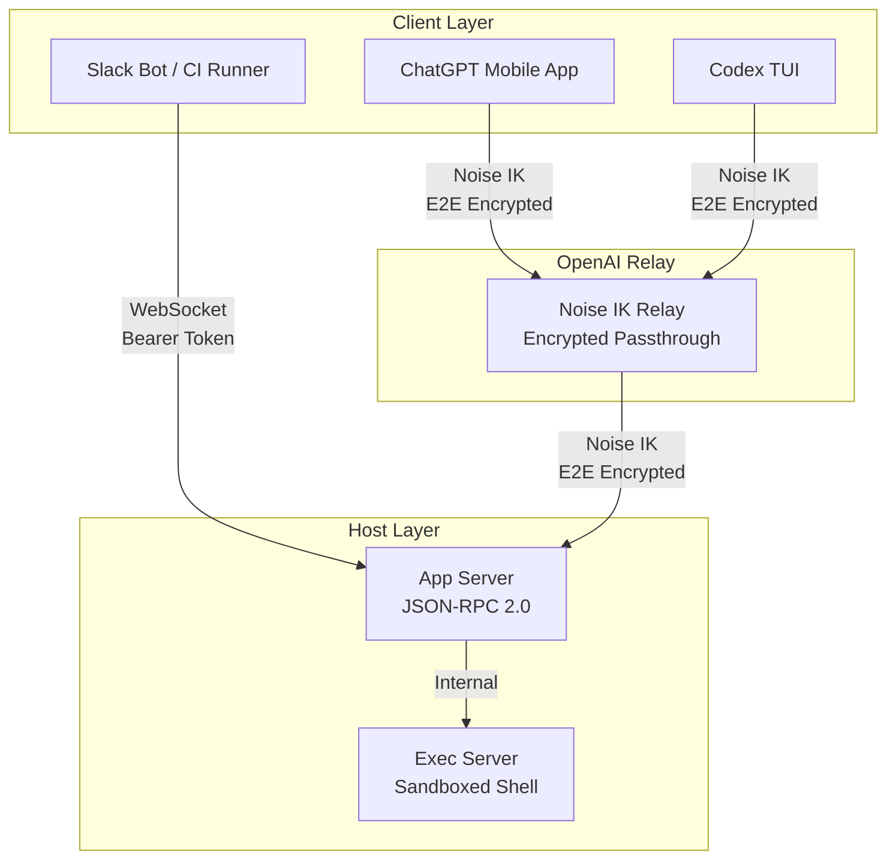

# Codex Remote from Beta to GA: Noise-Encrypted Relay, QR Pairing, and Headless Agent Services


---

Codex Remote reached general availability on 25 June 2026, graduating from a beta that began with the `codex remote-control` subcommand in v0.130.0 (8 May 2026) [^1][^2]. What ships today is not a simple screen-sharing trick. It is a three-layer architecture — Noise-encrypted relay, QR-bound device pairing, and a JSON-RPC app-server protocol — that lets you drive a coding agent from a phone on a train, a CI pipeline in GitHub Actions, or a DigitalOcean Droplet you provisioned with a single prompt.

This article dissects the architecture, walks through the security model, and shows how the headless `remote-control` daemon turns Codex CLI into a programmable agent service for automation beyond interactive use.

## Why Remote Matters

Most coding-agent discussion assumes a developer sitting at a laptop, terminal open, hands on keyboard. Codex Remote breaks that assumption in three directions:

1. **Mobile supervision** — approve a long-running refactor from an iPhone while walking the dog.
2. **Cloud-hosted agents** — run Codex on a beefy cloud VM and control it from a thin client.
3. **Headless automation** — embed Codex as a service behind Slack bots, web dashboards, or CI pipelines.

Each direction imposes different constraints on security, latency, and trust — and the GA release addresses all three with a single relay-based transport.

## Architecture: Three Layers



The relay sits between clients and the host. It routes sessions but never decrypts application payloads — prompts, code diffs, and approval decisions remain opaque to OpenAI's infrastructure [^2]. Custom clients (bots, dashboards) can bypass the relay entirely by connecting to the app server's WebSocket directly on a local or tunnelled network.

## The Noise Protocol: How Encryption Works

Codex Remote uses the **Noise IK** (Initiator Knows) handshake pattern, completing in a single round trip [^2][^3]. The cryptographic stack:

| Component | Algorithm |
|-----------|-----------|
| Key exchange | Curve25519 Diffie-Hellman |
| Symmetric encryption | ChaCha20-Poly1305 (AEAD) |
| Hash function | BLAKE2s |
| Key derivation | HKDF-BLAKE2s |

Both sides derive directional ChaCha20-Poly1305 keys via HKDF-BLAKE2s. Every message is wrapped in an encrypted envelope with monotonic counters for replay protection [^2]. The initiator (your phone or a second Codex instance) already knows the host's static public key from the pairing step, which is what makes the one-RTT handshake possible and prevents unknown-host attacks.

The practical upshot: the relay is a dumb pipe. It can see connection metadata — session IDs, device IDs, handshake control messages — but the payloads are ciphertext.

## QR Pairing: Binding Devices

The GA release replaced the earlier open-connection model with **authenticated one-to-one QR pairing** [^1]:

1. Open the Codex desktop app on your host machine (macOS or Windows).
2. Navigate to **Set up Remote** in the sidebar.
3. The app displays a QR code encoding a one-time pairing token.
4. Scan from the ChatGPT mobile app on iOS or Android.
5. Both endpoints must authenticate with the same ChatGPT account and workspace — MFA, SSO, and passkeys all apply.

Each phone-host pair requires its own QR scan. This is deliberate: the pairing binds a *specific device* to a *specific host*, not an account to a fleet [^1].

### Manual Pairing for Headless Hosts

Servers and VMs lack screens, so v0.143.0 added `codex remote-control pair`, which prints a short-lived alphanumeric pairing code to stdout [^4]. You type this code into the mobile app instead of scanning a QR. The security properties are identical — the code is a one-time token that expires after use or timeout.

```bash
# On the headless server
codex remote-control pair
# Output: PAIR-7K3M-X9QP (expires in 5 minutes)
```

### Connections and Persistence

Connections established since 8 June 2026 remain paired across app updates. Older connections require re-pairing after updating both the desktop and mobile apps [^1].

## Mobile Control: What Your Phone Actually Does

Your phone is a **thin client**. It renders the agent's state and relays your decisions back to the host [^3]. The host supplies:

- Repository files and local documents
- Shell command execution (sandboxed via Seatbelt on macOS, Bubblewrap on Linux)
- MCP servers, skills, browser access, and Computer Use
- Signed-in websites and apps accessible to the host

The mobile interface is best suited for quick prompts, status checks, approval of pending actions, and small follow-up instructions. Heavy code review or complex multi-file navigation is better done on a desktop client [^3].

### Approval Flow

When Codex proposes a shell command or file write that requires approval (under `suggest` or `writes` policies), the notification appears on your phone. You can approve, reject, or modify the command before it executes — the same trust boundary as sitting at the terminal, just mediated by an encrypted relay.

## The Headless Daemon: `codex remote-control`

The `codex remote-control` subcommand, introduced in v0.130.0, is where Codex Remote becomes genuinely interesting for infrastructure engineers [^4]. It wraps the app-server configuration into a single opinionated entrypoint:

```bash
# Minimal local start
codex remote-control

# Production configuration
codex remote-control \
  --listen ws://127.0.0.1:9742 \
  --ws-auth signed-bearer-token \
  --ws-shared-secret-file /etc/codex/hmac-secret
```

The daemon exposes a **JSON-RPC 2.0** protocol over WebSocket. Custom clients talk to the app server; they never interact with the exec server directly [^4].

### Authentication Modes

| Mode | Use Case | Setup |
|------|----------|-------|
| `capability-token` | Single user, local networks | Random token file |
| `signed-bearer-token` | Multi-client, production | HMAC shared secret with JWT validation |

For production deployments, signed bearer tokens support `--ws-issuer`, `--ws-audience`, and `--ws-max-clock-skew-seconds` for distributed environments [^4].

### Core JSON-RPC Methods

```json
// Create a new thread
{ "method": "thread/start", "id": 1,
  "params": { "model": "gpt-5.6-sol" } }

// Submit a prompt
{ "method": "turn/start", "id": 2,
  "params": { "threadId": "thread_xyz", "text": "Refactor auth module" } }

// Mid-turn steering
{ "method": "turn/steer", "id": 3,
  "params": { "threadId": "thread_xyz", "text": "Use JWT not session cookies" } }

// Paginated history retrieval
{ "method": "thread/turns/list", "id": 4,
  "params": { "threadId": "thread_xyz", "limit": 20 } }
```

Thread pagination supports three view modes — `unloaded` (metadata only), `summary` (condensed), and `full` (complete payloads with diffs) — enabling dashboards that drill down without loading entire conversation histories [^4].

### Deployment as a systemd Service

```toml
# /etc/systemd/system/codex-agent.service
[Unit]
Description=Codex Headless Agent
After=network.target

[Service]
Type=simple
User=codex
ExecStart=/usr/local/bin/codex remote-control \
  --listen ws://127.0.0.1:9742 \
  --ws-auth capability-token \
  --ws-token-file /var/run/codex/token
Restart=on-failure

[Install]
WantedBy=multi-user.target
```

**Critical**: never expose the WebSocket directly to the public internet. Use SSH port forwarding, a reverse proxy with TLS (nginx, Caddy), or a mesh network like Tailscale [^4].

## DigitalOcean Plugin: Cloud Workspaces in One Prompt

The GA release shipped alongside a **DigitalOcean plugin** that provisions cloud workspaces from within a Codex conversation [^2]:

```bash
codex plugin install digitalocean/CodexPlugin
```

Then, in a Codex thread:

> "Create a Droplet in lon1, s-4vcpu-8gb, for my project"

The plugin executes a five-step workflow: SSH key generation, public key registration, Droplet creation using the Codex Universal image (ID `233103029`), SSH config rendering with host key scanning, and manual registration in the Codex App settings [^2].

The provisioned Droplet runs as `root` by default — production deployments should create a non-root user post-provisioning. MCP servers and the full tool surface activate per-thread on the remote executor, matching local macOS behaviour [^2].

## Practical Patterns

### Pattern 1: CI/CD Code Review Agent

A GitHub Actions workflow that submits pull request diffs to a headless Codex agent and posts paginated review comments:


```yaml
- name: Codex Review
  run: |
    REVIEW=$(curl -s -X POST http://localhost:9742 \
      -H "Authorization: Bearer $CODEX_TOKEN" \
      -d '{"method":"turn/start","id":1,
           "params":{"threadId":"${{ github.event.pull_request.head.sha }}",
                     "text":"Review this diff for security issues:\n${{ steps.diff.outputs.content }}"}}')
    echo "$REVIEW" | jq -r '.result.text' >> $GITHUB_STEP_SUMMARY
```


### Pattern 2: Slack Bridge

A bot that bridges Slack messages to Codex threads, with summary-mode pagination for thread recaps:

```bash
# Recap last 50 turns in summary mode
curl -s -X POST http://localhost:9742 \
  -H "Authorization: Bearer $TOKEN" \
  -d '{"method":"thread/turns/list","id":5,
       "params":{"threadId":"thread_abc","limit":50,"viewMode":"summary"}}'
```

### Pattern 3: Overnight Batch Processing

A cron job that creates a fresh thread, submits a migration task, and pages results into a report:

```bash
0 2 * * * codex-batch --task "Run database migration dry-run" \
  --output /var/log/codex/migration-$(date +\%F).json
```

## Security Considerations

The five-layer security model for remote connections [^2]:

| Layer | Mechanism |
|-------|-----------|
| **Transport** | Noise IK relay with end-to-end encryption |
| **Authentication** | QR/manual one-to-one pairing with account binding |
| **Authorisation** | Workspace admin controls for remote access |
| **Execution** | Kernel sandbox (Seatbelt/Bubblewrap) for all commands |
| **Network** | Relay eliminates open ports; no inbound connections required |

The relay's dependency on OpenAI infrastructure is the one availability risk: if the relay is down, new mobile connections cannot be established (though existing SSH sessions and direct WebSocket connections continue independently) [^2].

## What This Changes

Codex Remote GA shifts coding agents from "tool you sit in front of" to "service you connect to". The headless daemon and JSON-RPC protocol are the real story — they make Codex programmable infrastructure rather than just an interactive terminal application.

For teams already running Codex at scale, the immediate wins are mobile approval workflows (unblock agents without opening a laptop), cloud-hosted agents (separate compute from the developer's machine), and CI integration (automated code review and batch processing through the same protocol humans use interactively).

The Noise-encrypted relay solves the trust problem that kept this pattern from being viable earlier: your code never transits OpenAI's infrastructure in cleartext, and the QR pairing ensures that "remote" does not mean "open to anyone who knows the URL".

---

## Citations

[^1]: OpenAI, "Remote connections," ChatGPT Learn documentation, June 2026. [https://learn.chatgpt.com/docs/remote-connections](https://learn.chatgpt.com/docs/remote-connections)

[^2]: Daniel Vaughan, "Codex Remote Reaches GA: QR Pairing, Noise-Encrypted Relay, and the DigitalOcean Plugin That Provisions Your Cloud Workspace in One Command," Codex Knowledge Base, 26 June 2026. [https://codex.danielvaughan.com/2026/06/26/codex-remote-ga-qr-pairing-noise-relay-digitalocean-plugin-remote-first-development/](https://codex.danielvaughan.com/2026/06/26/codex-remote-ga-qr-pairing-noise-relay-digitalocean-plugin-remote-first-development/)

[^3]: Revdoku, "Use Codex CLI remote control from your phone," 2026. [https://revdoku.com/blog/codex-cli-remote-control-from-phone/](https://revdoku.com/blog/codex-cli-remote-control-from-phone/)

[^4]: Daniel Vaughan, "Codex CLI v0.130: Building Headless Agent Services with remote-control and the Thread Pagination API," Codex Knowledge Base, 9 May 2026. [https://codex.danielvaughan.com/2026/05/09/codex-cli-v0130-remote-control-headless-agent-services-thread-pagination/](https://codex.danielvaughan.com/2026/05/09/codex-cli-v0130-remote-control-headless-agent-services-thread-pagination/)

[^5]: TechTimes, "OpenAI Codex Remote Goes Live for All Plans: Phone Control Now Secured by QR Relay," 27 June 2026. [https://www.techtimes.com/articles/319201/20260627/openai-codex-remote-goes-live-all-plans-phone-control-now-secured-qr-relay.htm](https://www.techtimes.com/articles/319201/20260627/openai-codex-remote-goes-live-all-plans-phone-control-now-secured-qr-relay.htm)

[^6]: Gradually.ai, "Codex CLI Changelog (July 2026)." [https://www.gradually.ai/en/changelogs/codex-cli/](https://www.gradually.ai/en/changelogs/codex-cli/)
