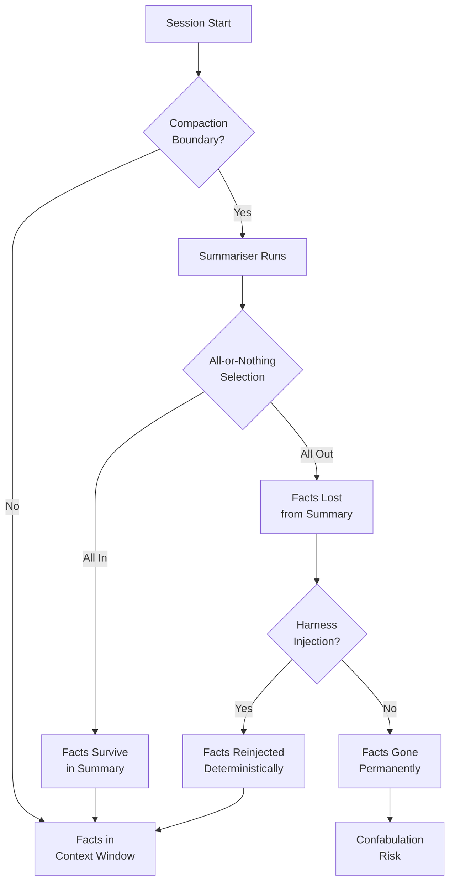
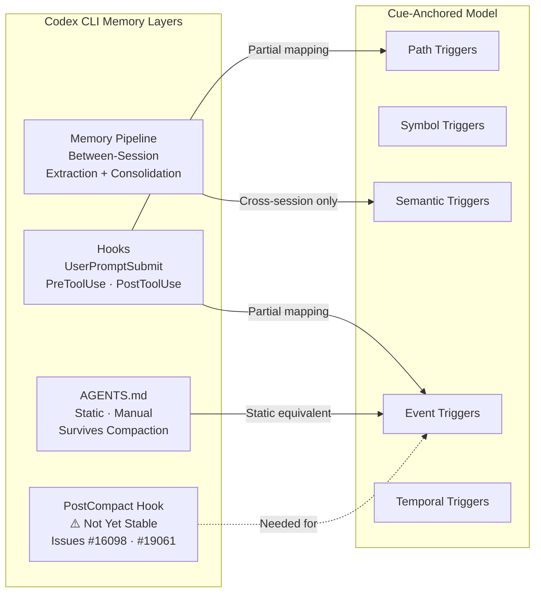

# Delivery, Not Storage: Why Cue-Anchored Working Memory Changes How You Think About Codex CLI's Memory Stack


---

Every senior developer who has run a long Codex CLI session knows the pattern: you teach the agent a critical project convention ("always use `pnpm`, never `npm`"), it follows it for forty turns, then context compaction fires and the convention vanishes. You re-teach it. It vanishes again. A new paper — *Delivery, Not Storage: Cue-Anchored Working Memory as a Harness Property for Coding Agents* [^1] — puts hard numbers on this failure mode and proposes a structural fix that has direct implications for how you configure Codex CLI today.

## The Two-Tier Memory Model

Saha's central argument is grounded in cognitive science. Human experts carry two kinds of operational knowledge [^1]:

- **Tier 1 — Documents.** Specs, ADRs, runbooks, AGENTS.md files. Deliberately authored, deliberately retrieved. The agent must choose to write them and choose to read them back.
- **Tier 2 — Brain memory.** Gotchas, file locations, local conventions. Encoded as a side effect of work, retrieved involuntarily when the situation cues them. You do not decide to remember that `src/legacy/parser.go` silently swallows errors — you simply know it when you open that file.

Coding agents today — Codex CLI included — operate almost entirely on Tier 1. AGENTS.md files, memory directories, plan artefacts: all require the model to decide to write and decide to read. The paper argues Tier 2 is the load-bearing tier for long-running sessions and must be a **harness property**, not an agent choice.

## Voluntary Memory Is Dead on Arrival

The paper's most striking finding: across 114 turns in a seeded experimental arm with task-relevant facts pre-loaded into a memory store, connected tools, and explicit written guidance, the agent produced **zero voluntary memory operations** [^1]. Five unseeded runs across all arms produced 0–1 voluntary memory writes total.

This is not a model deficiency in the narrow sense — it is a structural problem. Models optimise for the immediate task. Prospective memory (remembering to do something in the future) requires an interrupt mechanism that current autoregressive architectures do not possess. The agent cannot reliably self-trigger "I should store this for later" because doing so competes with the active reasoning chain.

Codex CLI's native memory extraction pipeline sidesteps this partially: it runs a background extraction phase at startup using `gpt-5.1-codex-mini`, scanning previous rollouts and distilling facts into `memory_summary.md` [^2]. But this is a **between-session** mechanism. Within a single long session, knowledge still lives only in the conversation context — and context compaction can erase it.

## Compaction Decay: The All-or-Nothing Cliff

The paper's decay probe is the most methodologically rigorous compaction measurement published to date. Ten synthetic facts were tracked across 138 compaction–resume cycles on a 100k-token pinned window [^1]:

| Arm | Compactions | Facts in final summary | Recovery method |
|-----|-------------|----------------------|-----------------|
| N (no memory tier) | 108 | 0/10 | 260 shell commands hand-building from disk artefacts |
| M (injected store) | 138 | 0/10 in summary, 10/10 via injection | Harness-owned injection at every boundary |

The critical observation: **no summary ever carried a subset of facts**. The summariser either folded all ten facts in or dropped all ten — an all-or-nothing selection pattern. For arm N, 106 of 108 summaries carried 0/10 facts. For arm M, facts survived in summaries for compactions 4–66, then vanished entirely for compactions 67–138. But because the harness injected them at every boundary, they remained available regardless.



Worse, arm N — starved of any memory tier — began **confabulating** task state, inventing references to "Phase 52: Files 203–206" in a 16-phase audit and spending 37 archaeology greps attempting recovery [^1].

## The Cue-Anchored Architecture

The paper's proposed solution is a per-memory trigger vocabulary with five composable condition types [^1]:

| Trigger Type | Condition | Example |
|-------------|-----------|---------|
| **Path** | File glob matches active context | `src/legacy/**/*.go` |
| **Symbol** | Named code entity referenced | `ResequencerProcessor.reverse` |
| **Semantic** | Embedding similarity above threshold | "error handling in stream mode" |
| **Event** | Session lifecycle moment | `pre-compaction`, `session-start` |
| **Temporal** | Not-before / cooldown constraint | "fire once per hour" |

Triggers are evaluated **deterministically by the harness**, not the model. The harness maintains a per-session fire ledger that resets at compaction boundaries, preventing duplicate injection. Content is delivered in a two-tier budget: compact index by default, full content on demand. Every evaluation, fire, and suppression is audit-logged as a system event.

The results: the native hooks arm delivered three notes at launch with immediate recall, fired a gotcha on first file touch, and achieved **zero false alarms across 75 audit-logged evaluations** [^1].

## Mapping to Codex CLI's Current Memory Stack

Codex CLI's memory architecture operates across three layers today:

### 1. Between-Session Extraction (Tier 1 — Exists)

The two-phase memory extraction pipeline runs at startup [^2]:

- **Phase 1 (Extraction):** Scans previous rollouts using `gpt-5.1-codex-mini` with low reasoning effort, extracting memories with secret sanitisation before anything reaches disc
- **Phase 2 (Consolidation):** Merges extracted memories under a global lock using `gpt-5.3-codex` with medium reasoning, producing `memory_summary.md` capped at 5,000 tokens

This addresses cross-session persistence but not within-session compaction decay.

### 2. AGENTS.md and Developer Instructions (Tier 1 — Exists)

AGENTS.md files are injected into the system prompt at session start and survive compaction because they sit outside the conversation context [^3]. This is structurally similar to cue-anchored memory with an `event: session-start` trigger — but it is static, manually authored, and not cue-responsive.

### 3. Hooks (Tier 2 — Partially Exists)

Codex CLI's hook system provides the plumbing for cue-anchored delivery [^4]:

```toml
# config.toml — hook-based memory injection pattern
[hooks.user_prompt_submit]
command = "python3 /path/to/memory-inject.py"
timeout_ms = 3000

[hooks.pre_tool_use]
command = "python3 /path/to/gotcha-check.py"
timeout_ms = 2000
```

`UserPromptSubmit` can inject relevant memories before each turn. `PreToolUse` can fire gotcha-style warnings when specific files are about to be edited. But the **critical gap** remains: Codex CLI does not yet expose a stable `PostCompact` hook [^5]. Issues #16098 and #19061 request this event, and it is partially implemented in v0.129's hook system, but not yet production-stable. Without it, the deterministic reinjection at compaction boundaries that the paper proves essential requires brittle workarounds.



## Practical Configuration for Compaction Resilience Today

While waiting for `PostCompact` hooks, you can build partial cue-anchored memory using what Codex CLI offers now:

### Redundant AGENTS.md Constraints

Place critical conventions in both the root `AGENTS.md` and directory-scoped `AGENTS.md` files. These survive compaction because they are re-read from disc, not from conversation context [^3]:

```markdown
<!-- project-root/AGENTS.md -->
## Critical Conventions (Compaction-Safe)
- Package manager: pnpm only, never npm or yarn
- Test runner: pytest -x --tb=short
- Database migrations: always use alembic, never raw SQL
```

### UserPromptSubmit Memory Injection

Use the `UserPromptSubmit` hook to reinject critical working state before every turn:

```bash
#!/usr/bin/env bash
# hooks/inject-memory.sh
# Read from a persistent memory store and inject as additional context
MEMORIES=$(cat .codex/working-memory.json 2>/dev/null || echo '[]')
echo "{\"additionalContext\": $MEMORIES}"
```

### Compaction Budget Tuning

Configure `model_auto_compact_token_limit` aggressively enough that compaction happens less frequently, buying more time within sessions [^6]:

```toml
# config.toml
[model]
model_auto_compact_token_limit = 180000  # GPT-5.6 Sol/Terra 272k window
```

### Named Profiles for Long-Horizon Work

For sessions where compaction decay is most dangerous — multi-hour refactoring, large migrations — use a named profile with higher context budgets:

```toml
# config.toml
[profile.marathon]
model = "gpt-5.6-sol"
model_auto_compact_token_limit = 200000
```

## What This Means for Agent Harness Design

The paper's conclusion — "memory for agents is not a content problem, it is a control-plane problem" [^1] — has implications beyond any single tool. The finding that voluntary memory adoption is effectively zero, even with tools, guidance, and seeded stores, means that every coding agent harness needs to own memory delivery as infrastructure, not delegate it to model behaviour.

For Codex CLI specifically, the priority is clear: stabilise the `PostCompact` hook (Issues #16098, #19061) [^5] to enable deterministic memory reinjection at compaction boundaries. The paper's 138/138 injection reliability through the harness channel versus 0/10 fact survival in summaries after compaction 67 makes the case unambiguously.

Until then, the combination of AGENTS.md redundancy, `UserPromptSubmit` hooks, and aggressive compaction thresholds provides partial but meaningful defence against the compaction decay cliff.

---

## Citations

[^1]: Saha, S. (2026). "Delivery, Not Storage: Cue-Anchored Working Memory as a Harness Property for Coding Agents." arXiv:2607.20972. [https://arxiv.org/abs/2607.20972](https://arxiv.org/abs/2607.20972)

[^2]: OpenAI. (2026). "Codex CLI Memories System — Memory Extraction Pipeline." DeepWiki. [https://deepwiki.com/openai/codex/3.9-memories-system](https://deepwiki.com/openai/codex/3.9-memories-system)

[^3]: OpenAI. (2026). "Developer commands — AGENTS.md layered discovery." ChatGPT Learn. [https://developers.openai.com/codex/cli/slash-commands](https://developers.openai.com/codex/cli/slash-commands)

[^4]: OpenAI. (2026). "Hooks — Codex CLI hook system documentation." ChatGPT Learn. [https://developers.openai.com/codex/hooks](https://developers.openai.com/codex/hooks)

[^5]: GitHub Issue #19061. (2026). "Add a post-compaction hook for deterministic memory reinjection." openai/codex. [https://github.com/openai/codex/issues/19061](https://github.com/openai/codex/issues/19061)

[^6]: Codex CLI Changelog. (2026). "v0.145.0 — Paginated history, Bedrock, audio I/O, multi-agent V2 stabilisation." [https://developers.openai.com/codex/changelog?type=codex-cli](https://developers.openai.com/codex/changelog?type=codex-cli)
