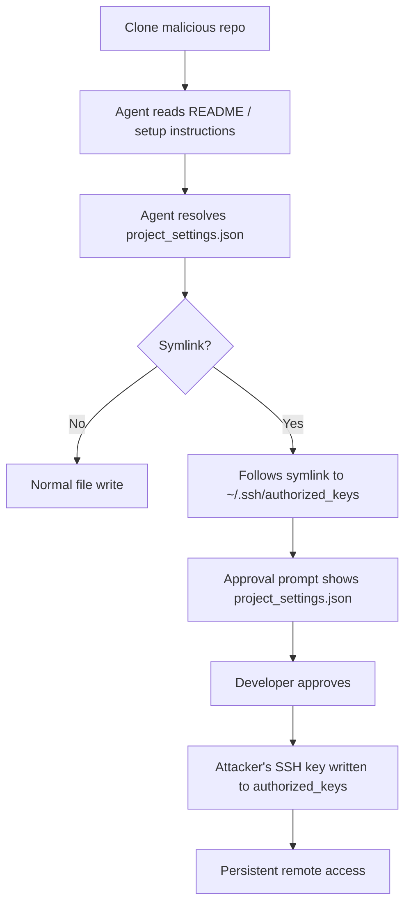
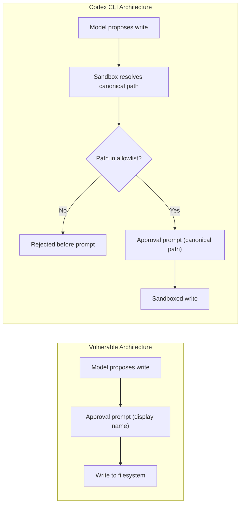

# GhostApproval and the Symlink Trust Boundary: Why Codex CLI's Sandbox Stops What Other Agents Cannot


---

On 8 July 2026, Wiz Research publicly disclosed **GhostApproval** — a trust-boundary flaw affecting six of the most widely deployed AI coding assistants [^1]. The attack weaponises a filesystem primitive older than most developers: the symbolic link. A malicious repository plants a symlink disguised as a project configuration file, pointing it at a sensitive target such as `~/.ssh/authorized_keys`. When the agent writes through the symlink, the developer's approval prompt shows only the harmless filename, not the real destination. The result is persistent remote access — or worse.

This article dissects the GhostApproval attack chain, examines how each vendor responded, and explains why Codex CLI's sandbox architecture was already hardened against this class of escape before Wiz's disclosure.

## The Attack Chain

GhostApproval operates in three stages:



The critical failure is at stage G: the **approval-box lie**. Several agents internally recognised the real target in their chain-of-thought reasoning yet still presented only the innocent filename to the developer [^1]. This is a textbook instance of **CWE-451** — User Interface Misrepresentation of Critical Information.

### Two Attack Variants

1. **SSH key injection** — a symlink pointing at `~/.ssh/authorized_keys` injects the attacker's public key, granting passwordless remote access.
2. **Shell startup modification** — a symlink targeting `~/.zshrc` or `~/.bashrc` injects code that executes every time a terminal opens, providing persistent command execution.

Both variants require nothing more than the developer cloning a repository and asking the agent to "set up the workspace."

## Who Was Affected

Wiz tested six tools. The results were sobering [^1] [^2]:

| Tool | Severity | CVE | Status (July 2026) |
|------|----------|-----|---------------------|
| Amazon Q Developer | High | CVE-2026-12958 | Fixed (v1.69.0) |
| Cursor | Critical | CVE-2026-50549 (CVSS 9.8) | Fixed (v3.0) |
| Google Antigravity | Critical | Pending | Fixed |
| Augment | Critical | — | In progress |
| Windsurf | Critical | — | In progress |
| Claude Code | Disputed | — | Rejected as vulnerability |

Windsurf exhibited the most dangerous variant: it wrote to disk **before** presenting the confirmation dialogue, transforming the approval mechanism from an authorisation gate into an undo button [^1].

Anthropic rejected the classification entirely, arguing that a developer who trusts a directory and approves an edit owns that decision [^1]. This is a defensible position if — and only if — the approval prompt shows the canonical path. When it does not, the developer is consenting to something they cannot see.

## Why Codex CLI Was Not Listed

Codex CLI's name is conspicuously absent from Wiz's affected-tool matrix. This is not because OpenAI declined to participate; it is because Codex CLI's sandbox architecture blocks this attack class at the OS level, before the approval prompt is ever reached.

### The `apply_patch` Boundary

Codex CLI routes all file modifications through a sandboxed `apply_patch` tool. Since May 2026, integration tests explicitly verify that symlink escapes fail [^3]:

> "Symlink escapes into a read-only outside root should fail and leave the outside file unchanged."

The test `apply_patch_cli_does_not_write_through_symlink_escape_outside_workspace` confirms that `apply_patch` cannot update a symlink targeting a file outside the writable workspace. The sandbox resolves symlinks to their canonical paths before checking the write-target allowlist [^3].

### Workspace-Write Mode

In the default `workspace-write` sandbox mode, Codex CLI enforces a strict write-target allowlist [^4]:

```
--cd ∩ (--add-dir ∪ workdir ∪ /tmp ∪ $TMPDIR)
```

Any write whose resolved canonical path falls outside this union is refused — regardless of what the symlink's display name suggests. This means the approval prompt never fires for an out-of-scope write; the sandbox rejects it before the model can even propose the edit.

### Hard-Link Semantics

The sandbox also handles the subtler hard-link case. If a user-created hard link pre-exists inside the workspace, sandboxed writes preserve normal hard-link semantics rather than silently breaking the relationship. However, the sandbox refuses to create new hard links that escape the boundary [^3].

## The Broader Pattern: SymJack

GhostApproval was not the first disclosure of this class. In May 2026, independent researchers published **SymJack**, testing the same symlink-based approval-prompt spoofing technique against six AI coding tools [^5]. The overlap between the two disclosures confirms that this is a systemic design flaw in the approval-prompt pattern, not an isolated vendor bug.

The core issue is architectural: any agent that treats the approval prompt as the sole trust boundary, without OS-level enforcement underneath, is vulnerable. Symlinks are the current payload; tomorrow it could be FIFO pipes, bind mounts, or FUSE filesystems.



## Defensive Configuration for Codex CLI Users

Although Codex CLI's sandbox blocks GhostApproval by default, defence in depth remains good practice when working with untrusted repositories.

### 1. Never Elevate Sandbox Permissions for Untrusted Code

```bash
# Default: safe. Symlink escapes blocked.
codex --approval-mode suggest "set up the workspace"

# Dangerous: full-auto with relaxed writes
codex --approval-mode auto-edit --sandbox disabled "set up the workspace"
```

Disabling the sandbox or running in `full-auto` mode on an untrusted repository removes the OS-level protection that makes Codex CLI resilient to GhostApproval.

### 2. Audit Symlinks Before Onboarding

```bash
# List all symlinks in a freshly cloned repository
find . -type l -exec ls -la {} \;
```

Any symlink pointing outside the repository root (`../`, absolute paths to `~/`, `/etc/`) is suspect.

### 3. Use `--add-dir` Sparingly

The `--add-dir` flag widens the write allowlist. Adding `$HOME` or `/` to it would re-expose the GhostApproval attack surface:

```bash
# Safe: scoped additional directory
codex --add-dir ./generated-output "generate the report"

# Dangerous: home directory in write scope
codex --add-dir ~ "set up the workspace"
```

### 4. Pin Sandbox Mode in `requirements.toml`

For team environments, enforce sandbox policy at the fleet level:

```toml
# requirements.toml — enforced for all team members
[sandbox]
mode = "workspace-write"

[sandbox.deny]
paths = ["~/.ssh", "~/.gnupg", "~/.config"]
```

This prevents individual developers from inadvertently widening the trust boundary when working with third-party code.

## Lessons for the Industry

GhostApproval exposes a fundamental design question: **where should the trust boundary sit?**

Anthropic's position — that the developer who trusts a folder owns the consequences — is philosophically coherent but operationally naive. Developers clone repositories to evaluate them; cloning is not consent. And when the approval UI actively conceals the write target (CWE-451), informed consent is impossible regardless.

Codex CLI's approach is more defensible: the trust boundary sits at the OS sandbox level, not the approval prompt. The prompt is a convenience for the developer; the sandbox is the actual enforcement mechanism. When the two disagree, the sandbox wins.

The GhostApproval disclosure should prompt every team using AI coding assistants to ask three questions:

1. Does our agent resolve symlinks before displaying write targets?
2. Does our agent enforce write boundaries at the OS level, or only at the prompt level?
3. What happens if a developer approves a write the sandbox would reject?

For Codex CLI users, the answers are: yes, yes, and the sandbox refuses the write regardless of approval. That is the correct architecture.

## Citations

[^1]: Wiz Research, "GhostApproval: A Trust Boundary Gap in AI Coding Assistants," 8 July 2026. [https://www.wiz.io/blog/ghostapproval-a-trust-boundary-gap-in-ai-coding-assistants](https://www.wiz.io/blog/ghostapproval-a-trust-boundary-gap-in-ai-coding-assistants)

[^2]: The Hacker News, "GhostApproval Symlink Flaws Could Let Malicious Repos Run Code in AI Coding Agents," 10 July 2026. [https://thehackernews.com/2026/07/ghostapproval-symlink-flaws-could-let.html](https://thehackernews.com/2026/07/ghostapproval-symlink-flaws-could-let.html)

[^3]: bolinfest, "tests: cover sandbox link write behavior," Pull Request #21819, openai/codex, merged 9 May 2026. [https://github.com/openai/codex/pull/21819](https://github.com/openai/codex/pull/21819)

[^4]: OpenAI, "Agent approvals & security — Codex documentation," 2026. [https://developers.openai.com/codex/agent-approvals-security](https://developers.openai.com/codex/agent-approvals-security)

[^5]: Infosecurity Magazine, "GhostApproval Flaw Hits Six Major AI Coding Assistants," July 2026. [https://www.infosecurity-magazine.com/news/ghostapproval-flaw-ai-coding/](https://www.infosecurity-magazine.com/news/ghostapproval-flaw-ai-coding/)
