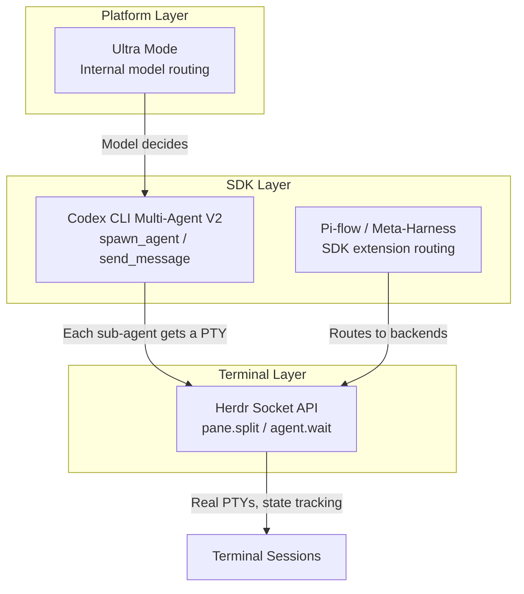
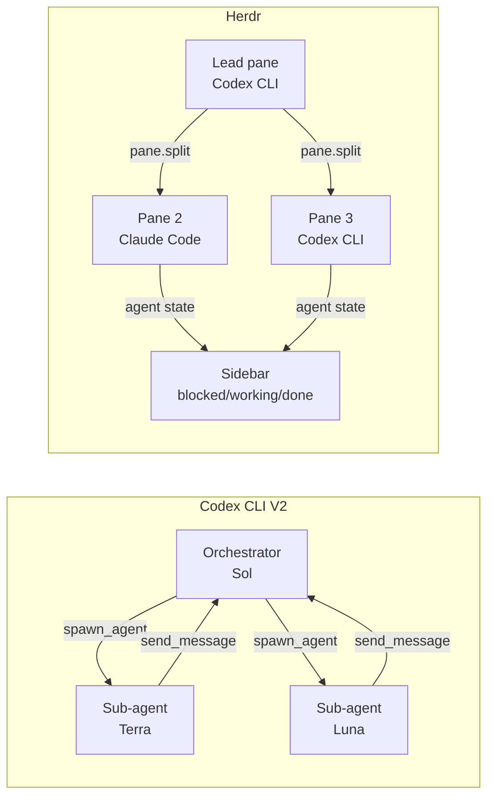
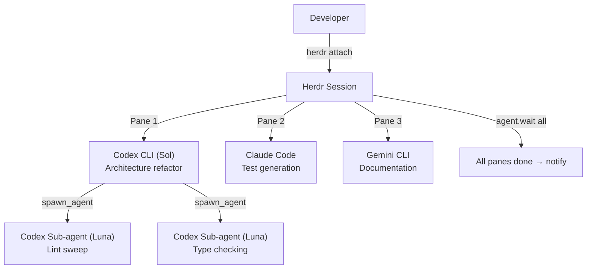

# Terminal-Level Agent Orchestration: Herdr's Socket API vs SDK-Based Multi-Agent Coordination for Codex CLI


---

Running a single coding agent is last year's problem. The question in July 2026 is how to run three or four simultaneously — Codex CLI on the backend refactor, Claude Code on the test suite, a linting agent sweeping formatting — and keep them from tripping over each other. Three distinct orchestration patterns have emerged, each operating at a different layer of the stack: **terminal-level** (Herdr), **SDK-level** (Codex CLI Multi-Agent V2 and Pi-flow), and **platform-level** (Ultra mode). This article compares them and shows where Herdr's socket API fits into a Codex CLI workflow.

## The Three Orchestration Layers



Each layer answers a different question. The platform layer asks *which model should handle this sub-task*. The SDK layer asks *how do I decompose work and collect results*. The terminal layer asks *where do these agents physically run, and how do I see what they are doing* [^1].

## Herdr: Agent-Aware Terminal Multiplexing

Herdr is a Rust-based terminal multiplexer that crossed 21,600 GitHub stars by late July 2026, roughly 105 days after its March release [^2]. Its core premise is that tmux and Zellij persist terminals; Herdr persists **agent workspaces** and understands **agent state**.

Every agent pane reports one of five semantic states — `idle`, `working`, `blocked`, `done`, `unknown` — to a sidebar without manual configuration [^3]. This is the feature that neither tmux nor Zellij can replicate: the multiplexer *knows* whether your Codex CLI session is waiting for approval, actively generating code, or finished.

### The Socket API

Herdr exposes a local Unix socket (or named pipe on Windows) at `~/.config/herdr/herdr.sock`, accepting newline-delimited JSON [^1]. The API surface is broad:

| Domain | Key Methods |
|--------|------------|
| Pane control | `pane.split`, `pane.read`, `pane.send_input`, `pane.wait_for_output` |
| Agent ops | `agent.list`, `agent.wait`, `agent.prompt`, `agent.explain` |
| Events | `events.subscribe` (long-lived streaming) |
| Layout | `layout.export`, `layout.apply`, `layout.set_split_ratio` |
| Plugins | `plugin.link`, `plugin.action.invoke` |

A lead agent can orchestrate helpers entirely through this socket. Here is the critical pattern — a Codex CLI session spawning a second agent in an adjacent pane and waiting for it to finish:

```bash
# Split a new pane to the right
herdr pane split w1:p1 --direction right

# Run Claude Code in the new pane
herdr pane run w1:p2 "claude --dangerously-skip-permissions 'Run the test suite and report failures'"

# Block until the helper finishes
herdr agent wait w1:p2 --until done

# Read the last 50 lines of output
herdr pane read w1:p2 --source recent --lines 50
```

The raw socket equivalent uses JSON requests:

```json
{"id":"req_1","method":"pane.split","params":{"pane_id":"w1:p1","direction":"right"}}
{"id":"req_2","method":"pane.send_input","params":{"pane_id":"w1:p2","input":"claude --dangerously-skip-permissions 'Run tests'\n"}}
{"id":"req_3","method":"agent.wait","params":{"pane_id":"w1:p2","until":"done"}}
```

### Environment Injection

Processes launched through Herdr receive environment variables — `HERDR_SOCKET_PATH`, `HERDR_WORKSPACE_ID`, `HERDR_PANE_ID` — so agents can discover the socket without configuration [^1]. A Codex CLI skill or AGENTS.md instruction can reference `$HERDR_SOCKET_PATH` to coordinate with sibling panes.

## Codex CLI Multi-Agent V2: SDK-Level Orchestration

Codex CLI's native multi-agent system operates one layer up. An orchestrator agent spawns sub-agents using `spawn_agent` or `send_message`, each running in its own context window and sandbox [^4]. Multi-Agent V2 replaced opaque thread IDs with path-based addressing and structured messaging, making complex delegation patterns practical.

```toml
# ~/.codex/agents/test-runner.toml
name = "test-runner"
description = "Runs the full test suite and reports failures"
developer_instructions = """
Run pytest with verbose output.
Report only failing tests with stack traces.
"""
model = "gpt-5.6-luna"
sandbox_mode = "workspace-write"
```

The difference from Herdr is fundamental: Codex CLI sub-agents share the same process tree, the same API key, and the same billing context. The orchestrator has **semantic** control — it understands the task graph. But it has **no visual** control — you cannot see what a sub-agent is doing until it returns.



## Pi-Flow: SDK Extension Routing

The Pi-flow pattern, demonstrated by Ben Davis in July 2026, uses Pi's extension system to route tasks to different agent backends — Sol for computer use, Fable for architecture [^5]. This is SDK-level orchestration with **cross-vendor** routing. The orchestrator understands which model suits which task, but coordination happens through SDK calls rather than terminal primitives.

## Comparison Matrix

| Dimension | Herdr (Terminal) | Codex V2 (SDK) | Pi-flow (SDK) | Ultra (Platform) |
|-----------|-----------------|----------------|---------------|-------------------|
| Agent awareness | Semantic state sidebar | Internal only | Internal only | Opaque |
| Cross-vendor | Any CLI agent | OpenAI models only | Multi-vendor | OpenAI only |
| Visual feedback | Real PTY per agent | None until return | None until return | None |
| Context sharing | Read terminal output | Structured messages | SDK handoff | Automatic |
| Cost control | Independent billing | Shared budget | Per-backend billing | Single budget |
| Failure visibility | See blocked state | Error on return | Error on return | Opaque |
| Persistence | Survives SSH drops | Session-bound | Session-bound | Session-bound |

## When Each Pattern Wins

**Herdr wins** when you run heterogeneous agents — Codex CLI, Claude Code, Gemini CLI — and need visual oversight. The socket API is agent-agnostic; any process that writes to a PTY works [^3]. It also wins for long-running sessions: the background server survives laptop sleep, WiFi drops, and SSH disconnects [^2].

**Codex V2 wins** when decomposition is the bottleneck. If you need to fan out across 50 CSV rows, `spawn_agents_on_csv` handles the plumbing [^4]. Sub-agents inherit configuration from the parent, share the sandbox, and return structured results. The overhead of spawning terminal panes for each would be absurd.

**Pi-flow wins** when you need model-specific routing across vendors. Routing architecture tasks to Fable and browser automation to Sol through a single orchestrator is something neither Herdr nor Codex V2 can do natively [^5].

**Ultra wins** when you want the platform to handle everything. You pay more, get less control, and cannot see what is happening — but you also write zero orchestration code.

## Combining the Layers: A Practical Setup

The layers are complementary, not competing. A production workflow might use all three:



The Herdr plugin system makes this repeatable. A `herdr-plugin.toml` manifest can declare a startup hook that spawns the three-pane layout automatically:

```toml
id = "dev.codex-triple"
min_herdr_version = "0.7.0"

[[actions]]
id = "spawn-fleet"
title = "Spawn three-agent fleet"
command = ["bash", "-c", """
herdr pane split w1:p1 --direction right
herdr pane split w1:p1 --direction down
herdr pane run w1:p2 'claude "Generate tests for src/"'
herdr pane run w1:p3 'gemini "Update API docs"'
"""]
```

### Event-Driven Coordination

The socket API supports long-lived event subscriptions, enabling reactive workflows:

```json
{
  "id": "sub_1",
  "method": "events.subscribe",
  "params": {
    "subscriptions": [
      {
        "type": "pane.agent_status_changed",
        "pane_id": "w1:p2",
        "agent_status": "blocked"
      }
    ]
  }
}
```

When Claude Code in pane 2 hits a permission prompt and transitions to `blocked`, the lead Codex CLI agent receives the event and can intervene — sending input, escalating to the developer, or killing the pane and retrying with different parameters.

## Caveats and Limitations

Herdr is pre-1.0 (v0.4.0 as of July 2026) and the socket API is explicitly flagged as unstable — "protocol changes are reviewed with release compatibility in mind" but breaking changes remain possible [^1]. Building production automation on it today means accepting adaptation costs.

The agent-state detection relies on heuristics and integration hooks rather than a universal standard. Codex CLI and Claude Code are well-supported, but niche agents may report `unknown` indefinitely without custom `pane.report_agent` calls.

Cross-agent context transfer through Herdr is crude: you read terminal output as text. There is no structured data channel, no shared memory, no type safety. For anything beyond "did it pass or fail," Codex V2's structured messaging or an MCP bridge remains necessary.

⚠️ Linux support for Herdr is confirmed but less battle-tested than macOS; Windows support is labelled beta [^2].

## Conclusion

Terminal-level orchestration through Herdr's socket API and SDK-level orchestration through Codex CLI V2 solve different problems. Herdr gives you eyes on heterogeneous agents and persistence across sessions. Codex V2 gives you structured decomposition within a single vendor's ecosystem. The sharpest setups in July 2026 use both — Herdr as the runtime layer managing panes and state, Codex V2 as the semantic layer managing task decomposition within each pane. The terminal multiplexer has become infrastructure, not interface.

---

## Citations

[^1]: Herdr Socket API Documentation, herdr.dev/docs/socket-api/ (accessed July 2026). Transport, methods, environment injection, and protocol stability notes.

[^2]: Herdr GitHub Repository, github.com/ogulcancelik/herdr (accessed July 2026). 21.6k stars, v0.4.0, Apache 2.0 licence, Rust single binary, March 2026 first release.

[^3]: Herdr Comparison Page, herdr.dev/compare/ (accessed July 2026). Feature matrix comparing Herdr, tmux, Zellij, cmux/Warp, Solo, and Conductor/Emdash/Superset.

[^4]: Codex CLI Multi-Agent Orchestration V2: Complete Guide, codex.danielvaughan.com (April 2026). Path-based addressing, structured messaging, spawn_agents_on_csv, custom TOML agent definitions.

[^5]: Ben Davis, "I Created the Ultimate Coding Agent by Combining Pi, Codex, and Claude Code" (YouTube, 24 July 2026). Pi-flow meta-harness routing Sol for computer use and Fable for architecture.
