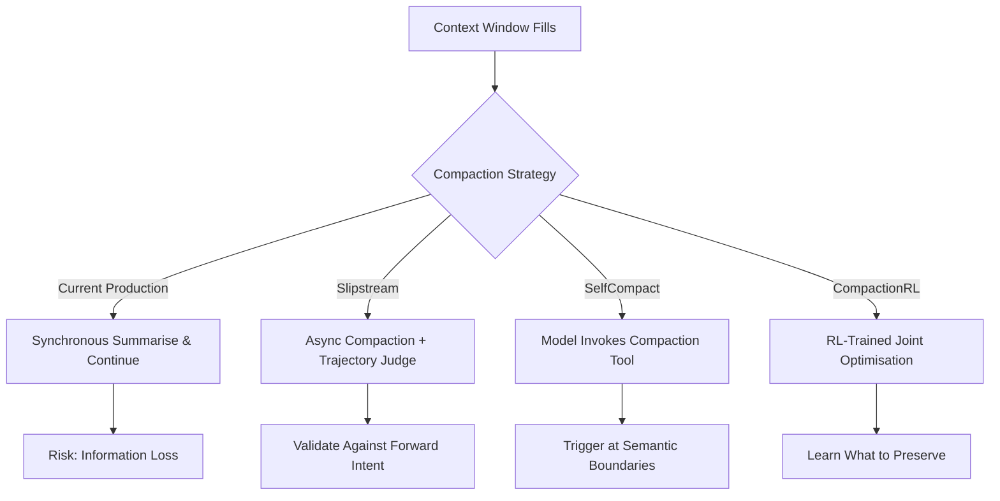
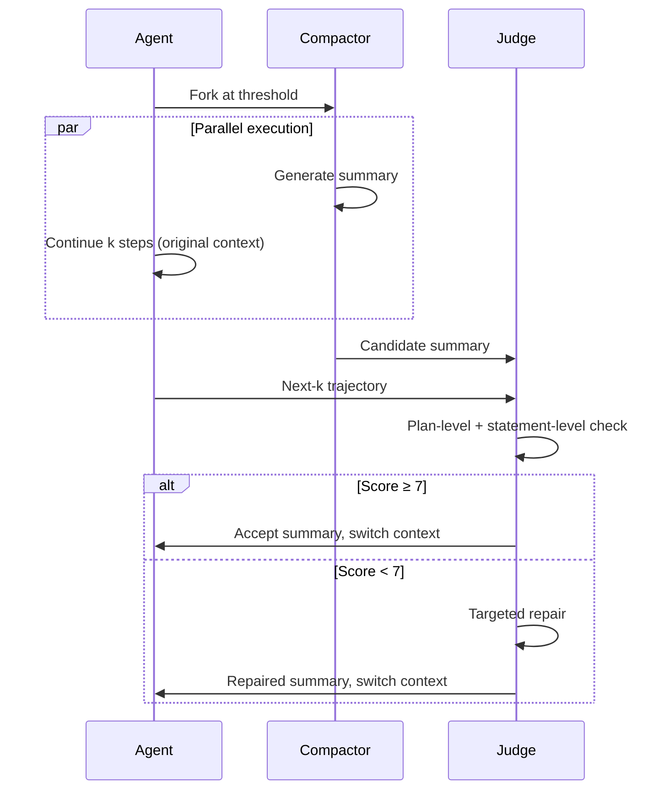

# Next-Generation Context Compaction: What Slipstream, SelfCompact, and CompactionRL Reveal About Keeping Long-Horizon Coding Agents on Track


---

Every coding agent that runs longer than a trivial session faces the same problem: the context window fills up, the agent must compress its history, and information gets lost. Three papers published between May and July 2026 attack this problem from fundamentally different angles — asynchronous validation, model-initiated triggers, and reinforcement learning — and their findings have direct implications for how you configure Codex CLI's compaction stack today.

## The Compaction Trilemma

Context compaction in coding agents involves a three-way trade-off: **accuracy** (preserving the information the agent needs next), **latency** (not blocking execution while summarising), and **cost** (not burning tokens on summaries the model will never reference). Current production compaction — including Codex CLI's `model_auto_compact_token_limit` — is reactive: it fires when context exceeds a threshold, summarises synchronously, and hopes the summary preserves what matters [^1].

The problem is structural. The compactor must decide what to keep *before* it knows what the agent will need. Three recent papers each propose a different solution to this forward-knowledge gap.



## Slipstream: Async Compaction with Trajectory-Grounded Validation

Chen, Pan, Dai, and Netravali at Princeton introduced Slipstream in May 2026 to address the synchronous bottleneck [^2]. The core insight: rather than blocking execution while the compactor works, run the compactor and the agent *in parallel* from the same pre-compaction state. This generates two independent signals — a candidate summary and the agent's actual next steps — which a judge can compare.

### How It Works

1. **Parallel fork**: When context hits the compaction threshold, Slipstream spawns two processes: the compactor (generating a summary) and the agent (continuing execution on the original, uncompacted context).
2. **Trajectory capture**: The agent produces *k* subsequent steps during the compaction window — typically 3–4 steps on SWE-bench Verified coding tasks [^2].
3. **Two-stage judge**: The judge evaluates the candidate summary against the next-*k* trajectory using:
   - A *plan-level check* — does the compacted state support the same forward intent as the original continuation?
   - A *statement-level check* — does it preserve the concrete facts, constraints, intermediate results, and tool observations used in those next steps?
4. **Scoring and repair**: Summaries scoring ≥7/10 are accepted. Below that threshold, the judge diagnoses the specific omission and performs a targeted repair rather than discarding the entire summary.



### Results

On SWE-bench Verified with Qwen3.5-9B at a 6K-token compaction threshold, Slipstream improved task accuracy from 22.0% to 30.8% — an 8.8 percentage point gain [^2]. On BrowseComp web-browsing workloads, accuracy rose by up to 4.6 points. Critically, end-to-end latency dropped by up to 39.7% because the agent no longer blocks while waiting for compaction to finish [^2].

The ablation is revealing: async execution *without* the trajectory judge (Async-only) did not produce accuracy gains. The validation, not the parallelism, is what matters.

## SelfCompact: Let the Model Decide When to Compress

Li, Zhang, Jurayj, Wang, Jin, Farajtabar, Nalisnick, and Khashabi took the opposite approach in June 2026 [^3]. Rather than firing compaction at a fixed token threshold, SelfCompact gives the model a *compaction tool* it can invoke whenever it judges the moment is right.

### The Mechanism

SelfCompact combines two components:

1. **A compaction tool**: Added to the model's tool inventory alongside existing tools (shell, file read/write, etc.), this tool summarises accumulated context when invoked.
2. **A lightweight rubric**: A set of heuristic triggers specifying *when* to fire (a sub-task has resolved, or the trajectory is converging on a solution) and *when* to suppress (mid-computation, or when recent tool outputs contain critical data) [^3].

The key advantage is semantic timing. Fixed-threshold compaction fires at arbitrary points — potentially mid-way through analysing a stack trace or while the agent is building up context for a complex refactor. SelfCompact fires at natural boundaries: after a file has been successfully edited and tested, or after a search has converged.

### Results

Across six benchmarks and seven language models, SelfCompact improved over no-summarisation baselines by up to 18.1 points on competitive maths and 5–9 points on agentic search tasks, at 30–70% lower per-question cost [^3]. It matched or exceeded fixed-interval summarisation while avoiding the arbitrary timing problem.

The 30–70% cost reduction is notable. By compacting at semantic boundaries rather than token thresholds, the model generates fewer but better-timed summaries.

## CompactionRL: Training Models to Compress Their Own Trajectories

Li, Hou, Jing, Tang, and Dong at Tsinghua University went further in July 2026, arguing that compaction should not be a separate heuristic layer at all — it should be a learned capability [^4].

CompactionRL uses reinforcement learning to jointly optimise task execution and summary generation. The training process employs token-level loss normalisation and cross-trajectory generalised advantage estimation, allowing the model to learn *what* to preserve during compaction as part of its core competency, not as an afterthought [^4].

### Results on Coding Benchmarks

| Model | Benchmark | Before | After | Gain |
|-------|-----------|--------|-------|------|
| GLM-4.5-Air | SWE-bench Verified | 59.8% | 66.8% | +7.0pp |
| GLM-4.5-Air | Terminal-Bench 2.0 | 21.4% | 24.5% | +3.1pp |
| GLM-4.7-Flash | SWE-bench Verified | 50.5% | 56.0% | +5.5pp |
| GLM-4.7-Flash | Terminal-Bench 2.0 | 13.4% | 20.2% | +6.8pp |

CompactionRL was subsequently deployed in training GLM-5.2, a 750-billion-parameter model [^4]. This suggests Tsinghua considers compaction-aware training essential for production-scale agents, not merely a research curiosity.

## The Safety Dimension: Governance Decay

These innovations must be read alongside a critical June 2026 finding: Chen demonstrated that compaction *systematically erases safety constraints* [^5]. Their ConstraintRot benchmark showed that across 1,323 episodes and seven model families, policy violations rose from 0% with full context to 30% after compaction — reaching 59% for some models [^5].

Their proposed fix, *constraint pinning* (copying governance rules into an excluded buffer that survives compaction), is orthogonal to the three strategies above but essential for any production deployment. None of Slipstream, SelfCompact, or CompactionRL explicitly address governance preservation — a gap worth watching.

## What This Means for Your Codex CLI Configuration

Codex CLI's compaction is currently reactive and synchronous — closer to the baseline these papers improve upon than to any of the three innovations. But the configuration surface already supports several defensive patterns informed by this research.

### Tune the Threshold Lower

```toml
# ~/.codex/config.toml
model_auto_compact_token_limit = 160000  # 60% of 272K GPT-5.6 window
```

Codex CLI defaults to roughly 80% of the context window [^1]. The SelfCompact and CompactionRL results suggest that earlier, more frequent compaction (at semantic boundaries) outperforms late, aggressive compaction. While you cannot make Codex CLI's compaction self-triggered, lowering the threshold gives the compactor smaller payloads to process — reducing the chance of information loss and stream disconnection [^6].

### Control Ingestion Volume

```toml
# Prevent tool outputs from flooding the context before compaction fires
tool_output_token_limit = 12000
```

Large tool outputs (build logs, test results, file listings) are the primary source of context bloat that pushes the window towards compaction [^6]. Capping ingestion at 12K tokens per tool call acts as a pre-compaction gate — similar in spirit to SelfCompact's suppression heuristic, which avoids compacting when recent tool outputs contain critical data.

### Use Named Profiles for Long Sessions

```toml
[profile.long-session]
model = "gpt-5.6-terra"
model_auto_compact_token_limit = 140000
reasoning_effort = "medium"
```

Terra's lower cost per token means compaction-induced re-prompting is cheaper [^6]. For sessions you expect to run long (multi-file refactors, test-driven loops), a dedicated profile with a more aggressive compaction threshold reduces the cost of multiple compaction cycles.

### Pin Constraints in AGENTS.md

The governance decay research [^5] has direct implications for AGENTS.md files in long sessions. If your AGENTS.md contains safety-critical rules (e.g., "never modify files in `production/`", "always run tests before committing"), those rules live in context and *can be erased by compaction*. Until Codex CLI implements constraint pinning natively, the defensive pattern is redundancy:

```markdown
<!-- AGENTS.md -->
# Critical Constraints (repeat in every section)

> **NEVER** modify files in `production/` without explicit approval.
> **ALWAYS** run `make test` before any commit.

## Architecture
[... project context ...]

> **Reminder:** Do not modify `production/` files. Run `make test` before commits.
```

Repeating constraints increases the probability that at least one instance survives compaction. This is crude but effective — the ConstraintRot benchmark showed that single-instance constraints were erased 30% of the time, while duplicated constraints had significantly lower erasure rates [^5].

### Monitor with Rollout Token Budgets

```toml
[features.rollout_budget]
enabled = true
limit_tokens = 500000
reminder_at_remaining_tokens = 100000
```

Rollout token budgets act as a circuit breaker for runaway compaction cycles. If compaction is firing repeatedly and the agent is spending tokens re-establishing context each time, the budget limit will halt execution before costs spiral [^6].

## Looking Ahead

The trajectory is clear: production compaction will move from reactive threshold-based firing to some combination of learned timing (CompactionRL), model-initiated triggers (SelfCompact), and validated summaries (Slipstream). The question for Codex CLI users is when these techniques arrive in the production stack — and whether OpenAI's implementation will be configurable or opaque.

In the meantime, the research provides a clear framework for tuning: compact earlier, compact smaller, control what enters the context window, and never assume your constraints survive compression.

## Citations

[^1]: OpenAI, "Configuration Reference — Codex CLI," [https://developers.openai.com/codex/config-reference](https://developers.openai.com/codex/config-reference), accessed July 2026.

[^2]: Z. Chen, R. Pan, Y. Dai, R. Netravali, "Slipstream: Trajectory-Grounded Compaction Validation for Long-Horizon Agents," arXiv:2605.08580, May 2026. [https://arxiv.org/abs/2605.08580](https://arxiv.org/abs/2605.08580)

[^3]: T. Li, J. Zhang, W. Jurayj, X. Wang, C. Jin, M. Farajtabar, E. Nalisnick, D. Khashabi, "Self-Compacting Language Model Agents," arXiv:2606.23525, June 2026. [https://arxiv.org/abs/2606.23525](https://arxiv.org/abs/2606.23525)

[^4]: Y. Li, Z. Hou, Y. Jing, J. Tang, Y. Dong, "CompactionRL: Reinforcement Learning with Context Compaction for Long-Horizon Agents," arXiv:2607.05378, July 2026. [https://arxiv.org/abs/2607.05378](https://arxiv.org/abs/2607.05378)

[^5]: S. Chen, "Governance Decay: How Context Compaction Silently Erases Safety Constraints in Long-Horizon LLM Agents," arXiv:2606.22528, June 2026. [https://arxiv.org/abs/2606.22528](https://arxiv.org/abs/2606.22528)

[^6]: OpenAI, "Advanced Configuration — Codex CLI," [https://developers.openai.com/codex/config-advanced](https://developers.openai.com/codex/config-advanced), accessed July 2026.
