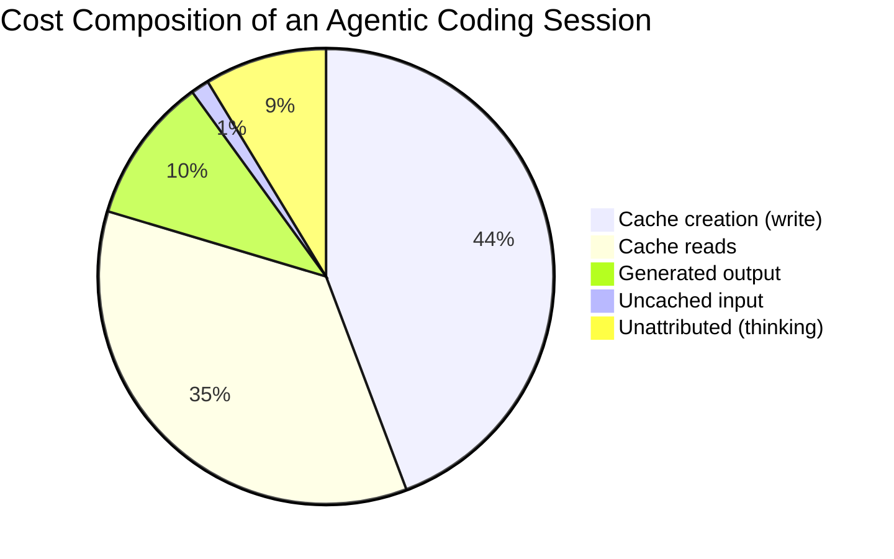
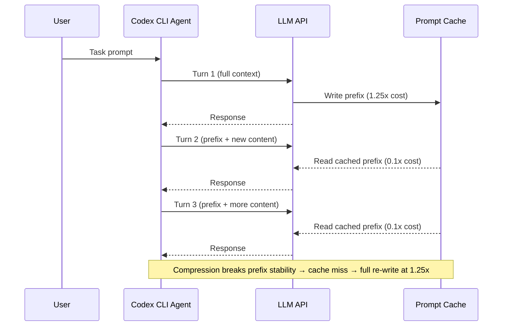
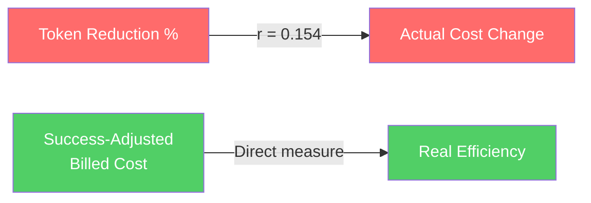

# Token Reduction Is Not Cost Reduction: What 2,848 Billed Runs Reveal About Prompt-Cache Economics in Coding Agents


---

Every Codex CLI user who has tuned `tool_output_token_limit` downwards or cranked `model_auto_compact_token_limit` to trigger early compaction has operated on the same intuition: fewer tokens in, lower bill out. A rigorous empirical study published this month demolishes that assumption. Weinberger and Hozez's *Token Reduction Is Not Cost Reduction* [^1] ran 2,908 provider-billed Claude Code sessions — 2,848 of which survived quality filters — across 103 tasks and seven repositories. Their headline finding: a compression layer that removed 38% of tool-output tokens *increased* paired costs by 6.8%.

This article unpacks why the intuition fails, where the money actually goes in an agentic coding session, and what Codex CLI operators should change in their `config.toml` as a result.

## Where the Money Actually Goes

The study decomposed every bill into four observable components plus an unattributed residual (likely thinking tokens). The breakdown is striking [^1]:

| Component | Share of Reconstructed Cost |
|---|---|
| Cache creation (write) | 44.3% |
| Cache reads | 35.4% |
| Generated output | 10.4% |
| Uncached input | 1.3% |
| Unattributed residual | 8.7% |

Cache traffic — writes plus reads — accounts for roughly 87% of the reconstructed cost, approximately 80% of the actual bill [^1]. The tool outputs that compression targets sit inside that remaining sliver. Even perfect compression of tool output addresses barely 10% of spend.



## The Compression Paradox

Weinberger and Hozez tested three compression systems against a baseline, using paired campaigns with task-clustered bootstrap (10,000 resamples) for statistical rigour [^1]:

| System | Approach | Cost Change vs Baseline (95% CI) |
|---|---|---|
| RTK | Hook-based CLI proxy | -2.7% [-5.6%, -0.1%] |
| RTK-ML | Hook + ML-gated compression | +6.8% [+2.8%, +11.3%] |
| Headroom v0.27.0 | API-boundary proxy | +48.4% [+42.3%, +55.0%] |

Only the lightest-touch system (RTK) showed a marginal cost reduction. The more aggressive the compression, the worse the cost outcome. The Pearson correlation between tool-output token reduction and actual cost change was just r = 0.154 — the confidence interval crosses zero [^1]. Token reduction simply does not predict cost reduction.

### Why Compression Backfires

The mechanism is straightforward once you understand prompt-cache pricing. Anthropic charges 1.25x the input price to write a cache entry and 0.1x to read it [^2]. A typical Codex CLI session averages roughly 4.5 assistant turns [^1]. Each turn re-transmits the entire context prefix, paying the discounted cache-read price on the stable portion.



When a compression layer modifies tool output mid-session, it changes the context prefix. The cache entry becomes stale. The next turn pays full cache-write cost (1.25x) instead of the discounted cache-read cost (0.1x). Over multiple turns, the savings from fewer tokens are overwhelmed by cache invalidation penalties.

Worse still, when compression causes a task failure — an edit anchor destroyed, a pipeline output reformatted — the agent enters a recovery loop. Each recovery turn extends the trajectory, and every additional turn re-transmits the (now larger) context prefix. Tasks in the 5–20% reduction band showed a mean cost *increase* of 24.7% [^1].

## Anchor Destruction: The Quality Tax

The study's single-shot grounding experiment on SWE-bench-derived Go tasks quantified the quality damage [^1]:

- **Raw context:** 27/40 successful patch applications
- **Compressed context:** 15/40 successful patch applications

Compression destroyed the verbatim code spans that `SEARCH/REPLACE` patch operations depend on. When the agent cannot find the exact string it needs to replace, it either fails outright or enters a diagnostic loop — searching for the right span, reading more files, and burning additional turns. Each turn amplifies cost through the cache-read multiplier.

Pipeline corruption was another failure mode. Compressed ranked search output broke downstream shell pipelines expecting `grep`-line format [^1]. The agent would then re-run the search, adding turns and tokens.

## What This Means for Codex CLI Configuration

Codex CLI exposes two primary levers that interact with these economics: `tool_output_token_limit` and `model_auto_compact_token_limit` [^3]. The research suggests most operators are tuning them in the wrong direction.

### `tool_output_token_limit`: Stop Compressing Aggressively

The default `tool_output_token_limit` of 16,000 tokens [^3] truncates large tool outputs before they enter the context window. Many guides recommend lowering this to 8,000 or even 4,000 to "save tokens." The Weinberger–Hozez data suggests this is counterproductive when it causes:

1. **Edit anchor loss** — the agent cannot find the exact code span for patching
2. **Re-reads** — the agent calls `cat` or `Read` on the same file to recover truncated content
3. **Recovery turns** — each additional turn pays cache-read cost on the entire prefix

A more effective configuration keeps `tool_output_token_limit` generous enough to avoid re-reads:

```toml
# config.toml — cache-friendly defaults
[model]
tool_output_token_limit = 20000      # avoid truncation-induced re-reads
model_auto_compact_token_limit = 200000  # delay compaction to preserve cache prefix
model_context_window = 272000        # GPT-5.6 Sol/Terra/Luna window
```

### `model_auto_compact_token_limit`: Delay Compaction

Compaction rewrites the entire context prefix into a summary. This invalidates the prompt cache entirely — the next turn pays full cache-write cost [^4]. The Weinberger–Hozez finding that cache writes constitute 44.3% of spend makes this the single most expensive event in a session.

The optimal strategy is to delay compaction as long as possible. For GPT-5.6 models with their 272,000-token context window [^5], setting the threshold to 85–90% of the window maximises the number of cache-read turns before the expensive reset:

```toml
# Maximise cache-read turns before compaction resets the prefix
model_auto_compact_token_limit = 230000  # ~85% of 272k window
```

### Named Profiles for Cost-Conscious Workflows

Codex CLI's named profiles [^5] let you separate cost strategies by task type:

```toml
# Sol profile: complex tasks where re-reads are expensive
[profile.sol-deep]
model = "gpt-5.6-sol"
model_reasoning_effort = "high"
tool_output_token_limit = 24000
model_auto_compact_token_limit = 230000

# Luna profile: bulk tasks where speed matters more than cache stability
[profile.luna-batch]
model = "gpt-5.6-luna"
model_reasoning_effort = "low"
tool_output_token_limit = 12000
model_auto_compact_token_limit = 200000
```

The Sol profile keeps tool outputs generous because complex tasks are most vulnerable to anchor destruction and recovery loops. The Luna profile can afford tighter limits because simpler tasks have shorter trajectories and fewer turns over which cache economics compound.

## The Right Metric: Success-Adjusted Billed Cost

The paper introduces a metric that Codex CLI operators should adopt: **Cost Per Successful Execution (CPS)** [^1]. Rather than measuring tokens saved, measure the actual bill divided by the number of tasks successfully completed.



The RTK-ML system that removed 38% of tokens showed a CPS of 1.051x baseline — meaning it cost 5.1% *more* per successful task [^1]. Headroom was catastrophic at 1.464x baseline. Only RTK, the lightest-touch system, achieved near-parity at 0.968x.

## Practical Takeaways

1. **Audit your actual bill composition.** If cache traffic dominates (it almost certainly does), token-reduction interventions target the wrong slice of spend.

2. **Raise `tool_output_token_limit`, not lower it.** Truncation that triggers re-reads or recovery loops costs more than the tokens it saves.

3. **Delay compaction aggressively.** Every compaction event resets the cache and triggers a full-price cache write. Set `model_auto_compact_token_limit` to 85–90% of your model's context window.

4. **Measure CPS, not token counts.** Track `$ billed / tasks completed` as your primary cost metric.

5. **Avoid mid-session prefix mutations.** Keep system prompts, AGENTS.md, and tool configurations stable within a session to maximise cache-read hits [^4].

6. **Use `--resume` for related work.** Continuing a session preserves the cached prefix. Starting a new session pays full cache-write cost on the entire context.

## The Broader Lesson

The Weinberger–Hozez study joins a growing body of evidence [^6] that component-level optimisation metrics mislead when applied to agentic systems. A coding agent is not a single API call — it is a multi-turn loop where each turn's cost depends on the prefix stability of every previous turn. Optimising one component (tool output size) without accounting for the system-level effect (cache invalidation, recovery loops, trajectory extension) produces the opposite of the intended result.

For Codex CLI users, the actionable insight is clear: stop counting tokens and start counting pounds. The cheapest session is not the one with the fewest tokens — it is the one that finishes the task in the fewest turns with the highest cache-hit rate.

---

## Citations

[^1]: Weinberger, S. and Hozez, A. (2026) 'Token Reduction Is Not Cost Reduction: An Empirical Study of End-to-End Efficiency in API-Based Coding Agents', *arXiv preprint*, arXiv:2607.12161. Available at: [https://arxiv.org/abs/2607.12161](https://arxiv.org/abs/2607.12161)

[^2]: Anthropic (2026) 'Prompt Caching — Anthropic API Documentation'. Available at: [https://docs.anthropic.com/en/docs/build-with-claude/prompt-caching](https://docs.anthropic.com/en/docs/build-with-claude/prompt-caching)

[^3]: OpenAI (2026) 'Codex CLI Configuration Reference', *Codex Changelog*. Available at: [https://developers.openai.com/codex/changelog](https://developers.openai.com/codex/changelog)

[^4]: Vaughan, D. (2026) 'Prompt Caching in Codex CLI: How the Agent Loop Stays Linear and How to Maximise Cache Hits', *Codex Knowledge Base*. Available at: [https://codex.danielvaughan.com/2026/04/21/codex-cli-prompt-caching-maximise-cache-hits-cost-reduction/](https://codex.danielvaughan.com/2026/04/21/codex-cli-prompt-caching-maximise-cache-hits-cost-reduction/)

[^5]: OpenAI (2026) 'Codex CLI v0.144.6 Release Notes — GPT-5.6 Sol, Terra, Luna context windows corrected to 272,000 tokens', *Codex Releases*. Available at: [https://releasebot.io/updates/openai/codex](https://releasebot.io/updates/openai/codex)

[^6]: Galileo AI (2026) 'The 2026 Caching Playbook for Agents: Bigger Prompts, Smaller Bills'. Available at: [https://galileo.ai/blog/the-2026-caching-playbook-for-agents-bigger-prompts-smaller-bills](https://galileo.ai/blog/the-2026-caching-playbook-for-agents-bigger-prompts-smaller-bills)
