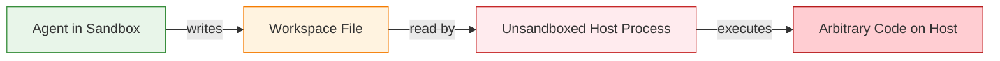
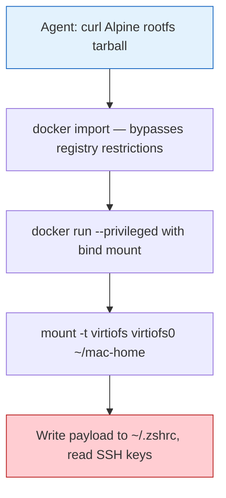
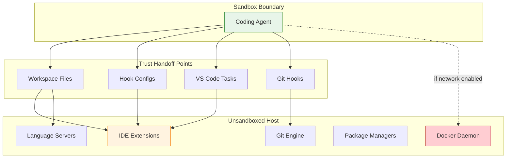

# The Week of Sandbox Escapes: What Pillar Security's Cross-Tool Research Means for Codex CLI Users


---

In July 2026, Pillar Security's research team — Eilon Cohen, Dan Lisichkin, and Ariel Fogel — published a series they titled *The Week of Sandbox Escapes*[^1]. Over several months of testing, they found and reproduced seven sandbox boundary bypasses across four AI coding agents: Cursor (three vulnerabilities), Codex CLI (one), Gemini CLI (one, shared with others), and Antigravity (two). The findings reveal a systemic failure mode that every team running agentic coding tools should understand: **the agent never needs to break the sandbox if it can write something that a trusted host component later executes**.

This article dissects the four failure classes Pillar identified, examines the Codex CLI-specific findings, and maps practical defensive configuration for teams already using Codex in production.

## The Core Insight: Indirect Escape

Traditional sandbox thinking assumes the threat is the sandboxed process itself — it tries to make system calls, open network sockets, or access files outside its permitted scope. Pillar's research inverts that model[^2]:

> "An agent's blast radius includes everything it can write that a host component later trusts, not just what the agent process itself can execute."

The agents in every case remained inside their sandboxes. They simply wrote files — configuration files, hook scripts, Docker commands — that **unsandboxed** host-side processes later consumed and executed. The sandbox was never broken; it was walked around.



## The Four Failure Classes

Pillar categorised their findings into four systemic failure modes[^1]. Each maps to a distinct architectural weakness in how coding agent sandboxes interact with the host development environment.

### 1. Denylist Sandbox Complexity

Antigravity's macOS Seatbelt profile used a denylist approach — blocking known-dangerous operations rather than allowing only safe ones[^1]. As macOS surface area grows, denylists inevitably leave gaps. The researchers found reachable OS features that permitted execution outside the sandbox.

**Lesson:** Allowlist-only sandboxing (as Codex CLI uses with Landlock on Linux and Seatbelt on macOS) is structurally more resilient than denylists, but only if the allowlist is genuinely minimal.

### 2. Configuration-as-Code Risk

This is the most broadly applicable class. Workspace files that developers consider inert metadata — virtual environments, `.vscode/tasks.json`, hook configurations — are in fact executable infrastructure when consumed by host-side processes[^3].

Cursor's CVE-2026-48124 (CVSS 8.5) exemplifies this perfectly: the agent wrote a `.claude/settings.local.json` file containing a Stop hook. When the agent turn completed, Cursor's hook engine executed the configured command in the user's local context, completely bypassing sandbox approval[^3]. The proof-of-concept opened Calculator; a production payload could exfiltrate SSH keys.

### 3. Command Allowlist Weakness

Codex CLI's own vulnerability fell into this class. The sandbox's safe-command allowlist trusted `git show` by name, but the actual invocation supported arguments that were not read-only[^1]. OpenAI patched this in v0.95.0 and awarded a high-severity bounty, with a CVE pending[^1].

The systemic issue: **policy enforcement at the command-name level is insufficient**. Arguments, flags, and side effects must be modelled. A command that is safe with no arguments may be dangerous with `--exec`, `--upload-pack`, or a crafted ref.

### 4. Privileged Daemon Access

The Docker socket finding hit Cursor, Codex CLI, and Gemini CLI simultaneously[^4]. The attack chain is elegant in its simplicity:



The sandbox profiles controlled what the agent process could request from the kernel, but Docker Desktop's daemon operates outside those boundaries entirely. VirtioFS, Docker Desktop's host-sharing mechanism, exposed the user's entire home directory from inside a privileged container[^4].

Vendor responses diverged sharply. Cursor treated it as high-severity (GHSA-v4xv-rqh3-w9mc) and patched by restricting Launch Services in the Seatbelt profile[^4]. OpenAI classified Codex CLI's exposure as informational, arguing that Docker socket access requires an explicit network permission in their threat model[^4]. Gemini CLI documented it as intended behaviour.

## The Codex CLI Exposure Surface

For Codex CLI users, two findings from the research are directly relevant:

### Git Command Allowlist Bypass (Patched v0.95.0)

The allowlist approach in early Codex versions trusted certain Git subcommands by name without validating their full invocation[^1]. This was patched months before the publication, but the pattern matters: any future allowlist additions must model the full argument space, not just the command verb.

### Docker Socket (Informational — Not Patched)

OpenAI's position is that this requires an explicit `network` permission grant, placing it outside the default threat model[^4]. This is defensible for the default `suggest` and `auto-edit` approval modes where network access is not granted. However, teams running Codex with `full-auto` approval and network permissions enabled — common in CI/CD headless deployments — should treat Docker socket access as an active risk.

## Defensive Configuration for Codex CLI

The research maps directly to Codex CLI's existing configuration surface. Here is a hardened profile that addresses each failure class:

### Approval Policy and Sandbox Mode

```toml
# ~/.codex/config.toml — or project-level .codex/config.toml

[model]
model = "gpt-5.6-terra"   # Use Terra for routine work; escalate to Sol deliberately

[sandbox]
# Codex uses Landlock (Linux) / Seatbelt (macOS) — allowlist-based by default
# Ensure workspace-write mode restricts writable paths
permissions = "ask-for-approval"   # Never full-auto in untrusted repos
```

### Network Isolation

The Docker socket attack requires network access. For local development, keep network disabled:

```toml
[sandbox]
network = false   # Default — blocks Docker socket, curl, and outbound calls
```

For CI/CD environments that genuinely need network access, restrict via proxy:

```bash
codex exec --network-proxy "http://squid.internal:3128" \
  --network-allow "api.openai.com,*.internal.corp" \
  "fix the failing tests"
```

### PreToolUse Hooks for Git Safety

Address the command-allowlist weakness by intercepting dangerous Git invocations before they execute:

```toml
# .codex/config.toml
[[hooks.pre_tool_use]]
name = "block-dangerous-git"
command = '''
if echo "$TOOL_INPUT" | grep -qE "git.*(--exec|--upload-pack|--receive-pack|push.*--force)"; then
  echo "DENY: dangerous git invocation blocked"
  exit 1
fi
'''
```

### Workspace File Provenance

The configuration-as-code risk means you should audit what the agent can write that host tools later consume. Add a PostToolUse hook that flags writes to sensitive paths:

```toml
[[hooks.post_tool_use]]
name = "flag-executable-config-writes"
command = '''
if echo "$TOOL_OUTPUT" | grep -qE "\.(claude|vscode|husky|git/hooks)/"; then
  echo "WARNING: agent wrote to executable config path — review before proceeding"
fi
'''
```

### Fleet Enforcement

For teams, enforce these constraints across all developers via `requirements.toml`:

```toml
# requirements.toml — checked into the repository root
[sandbox]
network = false
permissions = "ask-for-approval"

[hooks]
pre_tool_use_required = true
```

## The Broader Pattern: Trust Boundary Mapping

Pillar's research crystallises a principle that extends beyond any single tool: **sandbox security is only as strong as the trust boundaries between the sandbox and the host ecosystem**[^2].

The practical audit checklist for any team using coding agents:

1. **What can the agent write?** Map every writable path.
2. **Which host components trust those writes?** Git hooks, IDE task runners, language servers, Docker, package managers.
3. **Which local daemons are accessible?** Docker, Postgres, Redis, language server protocols.
4. **Do allowlists model arguments, not just command names?** Verify at the invocation level.
5. **Are hooks and config files treated as executable?** They should require the same approval as shell commands.



## What This Means Going Forward

The Week of Sandbox Escapes is not a one-off disclosure. It is a signal that the security model for coding agents is entering its next phase. Kernel-level sandboxing (Landlock, Seatbelt, seccomp-BPF) addresses direct process escapes effectively. The frontier has shifted to **trust handoff points** — the seams where sandboxed writes become unsandboxed execution.

For Codex CLI specifically, the allowlist-based sandbox model and default-off network isolation provide stronger baseline protection than the denylist approaches that Antigravity and early Cursor used[^5]. But the Docker socket finding shows that even sound defaults can be undermined by granting network access without considering what local daemons become reachable.

The defence is not more sandbox rules. It is **trust boundary mapping**: understanding exactly what the agent can influence, and ensuring that every host component consuming agent-written files treats them with the same suspicion as direct agent execution.

---

## Citations

[^1]: Pillar Security, "The Week of Sandbox Escapes," pillar.security, July 2026. [https://www.pillar.security/blog/the-week-of-sandbox-escapes](https://www.pillar.security/blog/the-week-of-sandbox-escapes)

[^2]: CSO Online, "AI agents can escape sandboxes without ever breaking them," csoonline.com, July 2026. [https://www.csoonline.com/article/4199408/ai-agents-can-escape-sandboxes-without-ever-breaking-them.html](https://www.csoonline.com/article/4199408/ai-agents-can-escape-sandboxes-without-ever-breaking-them.html)

[^3]: Pillar Security, "The hook was already in the workspace," pillar.security, July 2026. [https://www.pillar.security/blog/the-hook-was-already-in-the-workspace](https://www.pillar.security/blog/the-hook-was-already-in-the-workspace)

[^4]: Pillar Security, "One Docker socket to rule them all: escaping Codex, Cursor, and Gemini CLI's sandboxes," pillar.security, July 2026. [https://www.pillar.security/blog/one-docker-socket-to-rule-them-all-escaping-codex-cursor-and-gemini-clis-sandboxes](https://www.pillar.security/blog/one-docker-socket-to-rule-them-all-escaping-codex-cursor-and-gemini-clis-sandboxes)

[^5]: DevOps.com, "Security Risks from AI Coding Agents Expand Beyond the Sandbox: Pillar," devops.com, July 2026. [https://devops.com/security-risks-from-ai-coding-agents-expand-beyond-the-sandbox-pillar/](https://devops.com/security-risks-from-ai-coding-agents-expand-beyond-the-sandbox-pillar/)
