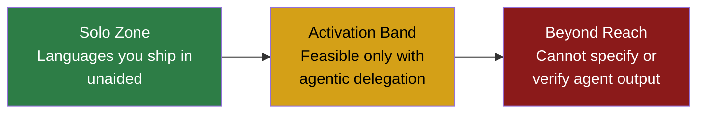
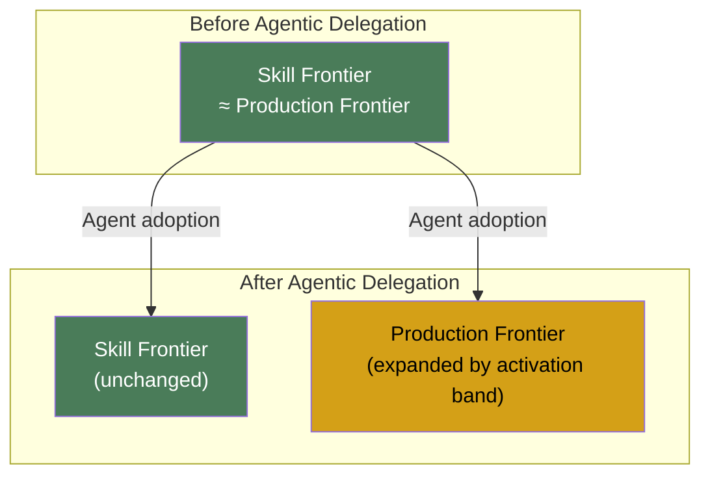

# Agentic Delegation and the Language Frontier: What 57 Million Changed Files Reveal About How Codex CLI Expands Your Production Range


---

Most developers have a handful of languages they ship in and a longer list of languages they can read but never commit. A new empirical study tracking 5,346 GitHub developers across 57 million changed files shows that agentic coding tools do not merely speed up work in familiar languages — they unlock an entirely new band of unfamiliar languages that become viable through delegation. The implications for how you configure Codex CLI are significant.

## The Study: From Conversational Augmentation to Agentic Delegation

Quispe and Xu's "Agentic Delegation and the Language Frontier of Software Developers" (arXiv:2605.25438, revised July 2026) draws a sharp line between two generations of AI-assisted coding [^1]:

- **Generation 1 — conversational augmentation.** Tools like Copilot autocomplete and ChatGPT propose code the developer must read, adapt, and integrate. Their value is proportional to existing skill, making them most useful in languages the developer already knows.
- **Generation 2 — agentic delegation.** Tools like Codex CLI, Claude Code, and Gemini CLI can inspect repositories, edit files, run commands, debug failures, and iterate autonomously. The developer retains specification, decomposition, and verification — but the agent executes a share of the work.

This distinction matters because it predicts a qualitatively different outcome: not just faster output in known languages, but new output in previously infeasible ones.

## The Activation Band

The paper's central theoretical contribution is the **activation band** — a range of programming languages that sit between two thresholds for any given developer:

1. **Below the solo threshold:** languages the developer can already ship in without help.
2. **Above the delegation threshold:** languages so unfamiliar that even directing an agent is impractical (the developer cannot specify or verify the output).
3. **The activation band:** languages between these thresholds, where the developer can decompose work and verify results but cannot efficiently produce the code alone.



The model predicts that the largest effects should appear among **high-ability specialists** — developers with strong skills in a narrow set of languages who have the most unfamiliar-language candidates and the lowest verification costs. The data confirm this prediction.

## The Numbers

Using doubly robust Callaway–Sant'Anna estimators on a monthly panel, the study finds sharp expansion at the point of first agentic tool adoption [^1]:

| Outcome | Effect Size | Baseline |
|---------|------------|----------|
| Active languages (monthly) | +2.5 | 0.9 |
| Newly used languages | +1.2 | ~0.3 |
| Language entropy (Shannon) | +0.38 | — |
| Cumulative lifetime languages | +1.6 | — |
| Monthly commits | +41 | — |
| Repositories contributed to | +1.5 | — |

Critically, the language expansion effects survive when **all Claude-coauthored commits are excluded** from the outcome measurement. This means developers are not simply rubber-stamping agent output in new languages — they are producing their own commits in those languages after the agent bootstraps their understanding.

The study also screens out developers with prior detectable use of competing tools (Copilot, Cursor, Devin), ensuring that adoption marks entry into the delegation mode itself rather than a tool switch [^1].

## What This Means for Codex CLI Configuration

If agentic delegation expands your production frontier into unfamiliar languages, your Codex CLI configuration needs to account for the different cost, risk, and token profiles of work outside your comfort zone.

### 1. Model Selection: Sol for the Activation Band

When working in an unfamiliar language, verification is harder and mistakes are costlier to spot. This is precisely when you want Codex CLI's highest-capability model.

```toml
# .codex/config.toml — project-level override for unfamiliar-language work
[profile.unfamiliar]
model = "gpt-5.6-sol"
approval_policy = "on-request"
```

GPT-5.6 Sol leads Terminal-Bench 2.1 at 83.4% and SWE-bench Verified at 96.2% [^2]. The 5× price premium over Luna is justified when you lack the domain knowledge to catch subtle errors. For familiar-language work, Terra or Luna remain cost-effective choices.

### 2. AGENTS.md: Language-Specific Verification Instructions

In the activation band, you can specify and verify but cannot produce. Structure your AGENTS.md to make verification explicit:

```markdown
# AGENTS.md — activation-band project

## Language: Rust
- I am not a Rust expert. Explain ownership and lifetime decisions in comments.
- Run `cargo clippy` before every commit. Fix all warnings.
- Include unit tests for every public function. I will verify behaviour, not idiom.
- Prefer standard library over third-party crates unless explicitly approved.

## Verification Protocol
- After each file change, summarise what changed and why in plain English.
- Flag any pattern that relies on language-specific idiom I might not recognise.
```

Subdirectory AGENTS.md files let you scope these instructions per language in a polyglot monorepo. Codex walks from the project root to the current working directory, loading each AGENTS.md it encounters, with the nearest file taking precedence [^3].

### 3. Named Profiles for Language Tiers

The activation band concept maps naturally to Codex CLI's named profiles. Rather than one-size-fits-all configuration, define profiles that match your relationship to each language:

```toml
# ~/.codex/config.toml

[profile.native]
# Languages you ship in daily — delegate freely
model = "gpt-5.6-luna"
approval_policy = "auto-edit"

[profile.activation]
# Activation band — can verify but not produce
model = "gpt-5.6-sol"
approval_policy = "on-request"
model_auto_compact_token_limit = 80000

[profile.exploration]
# Beyond your frontier — read-only research
model = "gpt-5.6-terra"
approval_policy = "suggest"
```

Activate per session with `--profile activation` or `CODEX_PROFILE=activation` [^4].

### 4. Token Budget Awareness

The tokenmaxxing research from Wu, Anderson, and Guha (arXiv:2607.22807) shows that agents burn 1.07–1.69× more tokens in unfamiliar languages compared to Python [^5]. When you are working in your activation band, you are by definition working in a language where the agent (and you) may struggle more. Combine this with the higher per-token cost of Sol and you have a compelling reason to set explicit token limits:

```toml
[profile.activation]
model = "gpt-5.6-sol"
model_auto_compact_token_limit = 80000
tool_output_token_limit = 16000
```

These limits trigger compaction before the context window fills, preserving prompt-cache hits and avoiding the cost spiral documented in recent cache-economics research.

### 5. Sandbox Mode for Safe Exploration

Unfamiliar languages mean unfamiliar build tools, unfamiliar dependency managers, and unfamiliar footguns. The sandbox is not optional in the activation band:

```toml
[profile.activation]
sandbox = "workspace-write"
# Network blocked by default — enable only for package installation
```

Codex CLI enforces isolation at the OS kernel layer (Seatbelt on macOS, Landlock on Linux), ensuring that a misunderstood `cargo install` or `pip install` cannot escape the project directory [^4].

## The Production Frontier vs. the Skill Frontier

The paper's most important distinction for practitioners is that agentic delegation expands the **production frontier** — what you can ship — without necessarily expanding the **skill frontier** — what you deeply understand.



This gap creates a verification risk. You can ship Rust from a Python background, but your ability to review the agent's Rust for subtle correctness issues (unsafe blocks, lifetime elision, trait-object coercion) is weaker than in your native languages. The mitigation is not to avoid the activation band — the productivity gains are real — but to **configure your tooling to compensate**:

- Use `on-request` approval policy, not `auto-edit`, in unfamiliar languages.
- Require the agent to explain decisions in comments and summaries.
- Run all available static analysis (`clippy`, `mypy`, `eslint --strict`) automatically via AGENTS.md instructions.
- Set a verification checkpoint cadence: review every N file changes rather than batching.

## Implications for Enterprise Rollout

The activation band effect has direct implications for organisations planning Codex CLI rollouts. The Microsoft rollout study (arXiv:2607.01418) found that CLI coding agent adopters merged 24% more pull requests [^6]. Combined with the language frontier research, this suggests that the productivity lift is not just about speed in familiar territory — it includes contributions to repositories and services that developers would previously have avoided.

For engineering managers, this means:

- **Code review load shifts.** Reviewers must now evaluate contributions in languages the author may not deeply understand. Review checklists should account for this.
- **AGENTS.md becomes a team agreement.** Language-specific instructions in AGENTS.md are not just personal preferences — they are the verification protocol that compensates for the production-skill gap.
- **Model cost governance matters.** Developers in the activation band should be using Sol, not Luna, which changes the token budget calculus for teams.

## Conclusion

The Quispe and Xu study provides the first rigorous empirical evidence that agentic coding tools create a qualitatively new mode of software production — not faster typing but broader reach. For Codex CLI users, the practical takeaway is clear: configure your tool differently when you are in the activation band versus your comfort zone. Use Sol for unfamiliar languages, Luna for familiar ones. Write AGENTS.md instructions that make verification explicit. Set token limits that account for the higher cost of cross-language work. And use the sandbox, always, when you are operating beyond your skill frontier.

The activation band is where agentic AI delivers its most distinctive value — not as a faster pair programmer, but as a trusted delegate executing work you could not have done alone.

---

## Citations

[^1]: Quispe, A. & Xu, K. (2026). "Agentic Delegation and the Language Frontier of Software Developers: A Model and Evidence from Claude Code on GitHub." arXiv:2605.25438v2, revised July 7, 2026. [https://arxiv.org/abs/2605.25438](https://arxiv.org/abs/2605.25438)

[^2]: GPT-5.6 Sol benchmark results: Terminal-Bench 2.1 score 83.4%, SWE-bench Verified 96.2% as reported in model documentation and independent evaluations (July 2026). [https://www.vellum.ai/blog/gpt-5-6-benchmarks-explained](https://www.vellum.ai/blog/gpt-5-6-benchmarks-explained)

[^3]: OpenAI. "Custom instructions with AGENTS.md." ChatGPT Learn — Codex documentation, 2026. [https://developers.openai.com/codex/guides/agents-md](https://developers.openai.com/codex/guides/agents-md)

[^4]: OpenAI. "Codex CLI Features." ChatGPT Learn — Codex documentation, 2026. [https://developers.openai.com/codex/cli/features](https://developers.openai.com/codex/cli/features)

[^5]: Wu, S., Anderson, C. & Guha, N. (2026). "Tokenmaxxing: Programming Language Choice and Coding Agent Token Cost." arXiv:2607.22807, July 24, 2026. ⚠️ Preprint; exact token multipliers (1.07–1.69×) may shift with peer review.

[^6]: Murphy-Hill, E., Butler, J. & Savelieva, A. (2026). "Adoption and Impact of Command-Line AI Coding Agents: A Study of Microsoft's Early 2026 Rollout of Claude Code and GitHub Copilot CLI." arXiv:2607.01418, July 1, 2026. [https://arxiv.org/abs/2607.01418](https://arxiv.org/abs/2607.01418)
