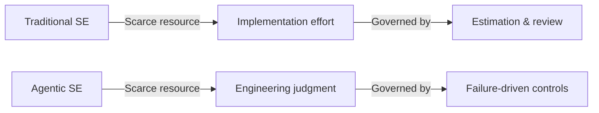
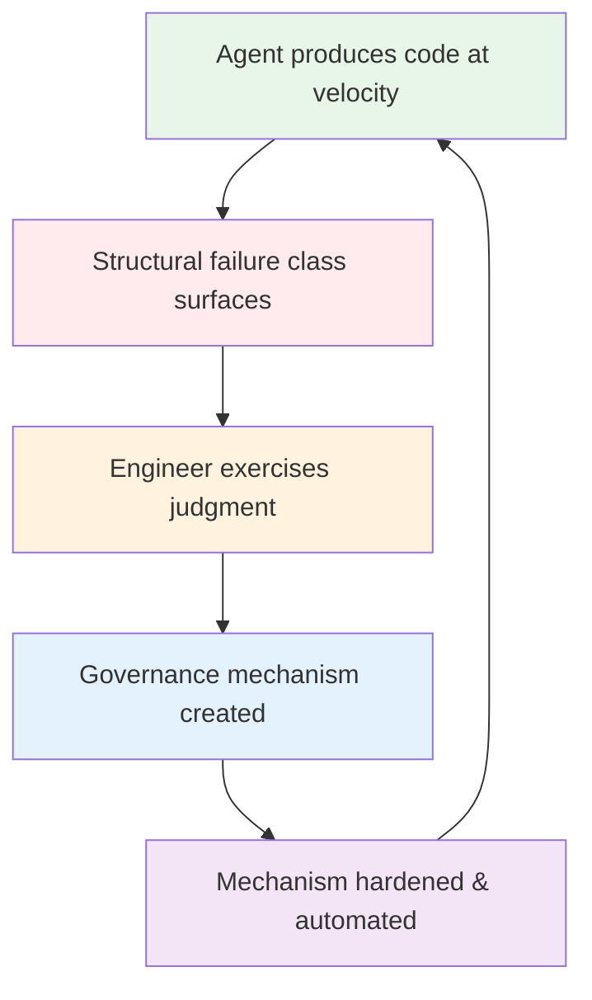
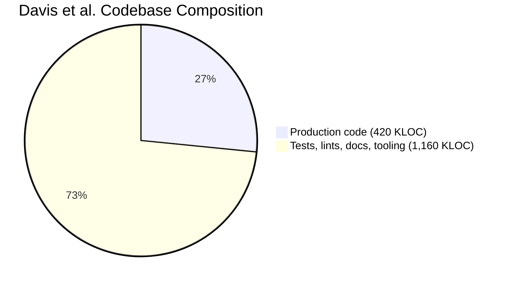

# Cheap Code, Costly Judgment: What Governance Conversion Means for Your Codex CLI Configuration


---

Writing code has never been cheaper. A single developer armed with a frontier coding agent can produce 420,000 lines of production code in twelve weeks [^1]. The question that ought to keep senior engineers awake is not *how fast can my agent write?* but *how do I govern what it writes?*

That question sits at the heart of a case study published this month by James C. Davis and colleagues at Purdue University. Their paper, "Cheap Code, Costly Judgment," tracks a twelve-week development effort in which one expert engineer used frontier AI coding agents to build a document-accessibility remediation system [^1]. The empirical record is unusually rich: 88 contemporaneous field notes, 420 KLOC of production code, and 1.16 million lines of tests, lints, documentation, and agent tooling. From that record the authors extract a candidate middle-range theory they call **governance conversion** — a process model explaining how high-velocity agentic implementation becomes governable.

This article unpacks that theory and maps it directly onto the governance primitives available in Codex CLI v0.146.

## The Scarcity Inversion

Traditional software engineering is organised around scarce implementation effort. Estimation, sprint planning, code review — all assume that writing code is expensive and therefore worth rationing [^2]. Agentic coding inverts that assumption. When marginal production cost approaches zero, the binding constraint shifts from *can we build it?* to *should we ship it?*

Davis et al. frame this as a move from **code-production scarcity** to **judgment scarcity** [^1]. The engineer in their study did not spend twelve weeks typing. They spent twelve weeks deciding what to ask the agent to build, verifying it built the right thing, and — critically — converting recurring failures into durable governance mechanisms.



## Governance Conversion: The Core Loop

The paper's central contribution is the **governance conversion** process model. Unlike compliance frameworks that derive controls from known obligations (ISO 27001, SOC 2), governance conversion discovers controls empirically: agentic velocity surfaces structural failure classes that are invisible at human coding speeds, and the engineer converts each failure class into a reusable governance mechanism [^1].

The loop operates continuously:

1. **High-velocity implementation** — the agent produces code far faster than the engineer can review line-by-line.
2. **Structural failure surfaces** — recurring classes of defect, drift, or quality regression become visible precisely *because* of the volume.
3. **Engineering judgment intervenes** — the engineer diagnoses the failure class and designs a governance mechanism (a lint rule, a test harness, a configuration constraint, a hook).
4. **Mechanism hardens** — the control becomes durable, automated, and agent-visible, preventing the failure class from recurring.
5. **Velocity resumes** — with the new guard rail in place, the agent can operate at speed without repeating the failure.



The key insight is that these controls are **discovered from failures that become visible only during agentic work** [^1]. You cannot design them upfront because you do not know which failure classes your agent will exhibit at scale until it is operating at scale.

## What the Numbers Tell Us

The study's quantitative profile is striking. The 1.16 MLOC of supporting material — tests, lints, documentation, and agent tooling — is 2.76× the production codebase [^1]. That ratio quantifies the governance overhead: for every line of agent-produced code that ships, nearly three lines exist solely to ensure it should have shipped.

This aligns with the broader observation that cheap code accelerates technical debt, security vulnerabilities, and system complexity faster than organisations can manage them [^3]. Simon Willison captures the practical corollary: delivering *good* code — functional, validated, secure, maintainable — remains significantly more expensive than delivering code [^4].

## Mapping Governance Conversion to Codex CLI

Codex CLI's configuration stack was not designed with governance conversion in mind, but it maps remarkably well onto the theory's mechanisms. Each layer addresses a different failure class.

### Failure Class: Unconstrained Agent Autonomy

When the agent operates in `full-auto` mode without constraints, it can make destructive changes before the engineer has time to exercise judgment. The governance mechanism is **approval policy escalation**.

```toml
# .codex/config.toml — project-level governance
[model]
name = "o4-mini"

[policy]
approval_policy = "on-request"   # require approval for file writes
sandbox_mode = "workspace-write" # contain blast radius
```

For fleet-wide enforcement, `requirements.toml` ensures individual developers cannot weaken the policy [^5]:

```toml
# requirements.toml — admin-enforced constraints
[policy]
approval_policy = ["suggest", "auto-edit"]  # prohibit full-auto
sandbox_mode = ["read-only", "workspace-write"]  # no network access
```

### Failure Class: Quality Regression at Volume

When the agent produces thousands of lines per session, subtle quality issues compound. The governance mechanism is **automated verification via hooks**.

```toml
# .codex/config.toml — PostToolUse hook for lint gating
[[hooks]]
event = "PostToolUse"
command = "npm run lint -- --quiet"
timeout_ms = 30000
on_failure = "block"  # prevent agent from continuing on lint failure
```

This is governance conversion in action: the engineer observed recurring lint failures in agent output, diagnosed the structural failure class, and hardened the response into an automated hook that fires after every tool use.

### Failure Class: Context Drift During Long Sessions

As sessions extend, the agent's context window fills and compaction discards earlier instructions. AGENTS.md survives compaction because Codex CLI re-injects it as a system-level instruction [^6]:

```markdown
<!-- AGENTS.md — compaction-surviving governance -->
## Coding Standards
- All public functions require JSDoc with @param and @returns
- No default exports; use named exports exclusively
- Error handling: wrap all async operations in try/catch
- Test coverage: every new function needs a corresponding test

## Architecture Constraints
- Data access only through the repository layer
- No direct database queries in route handlers
- All API responses conform to the ResponseEnvelope type
```

### Failure Class: Uncontrolled Scope Expansion

The agent may wander beyond its brief, modifying files outside its remit. The governance mechanism combines **sandbox mode** and **AGENTS.md scope constraints**:

```toml
# Contain agent to workspace only
[policy]
sandbox_mode = "workspace-write"
```

```markdown
<!-- AGENTS.md -->
## Scope
- Only modify files under src/services/ and src/tests/
- Never modify configuration files without explicit approval
- Database migrations require human review before execution
```

### Failure Class: Credential Leakage

Agents operating at speed may inadvertently include secrets in generated code or pass them to tools. The governance mechanism is **shell environment policy**:

```toml
# requirements.toml — exclude credentials from agent environment
[policy]
shell_environment_policy = "exclude"
shell_environment_keys = ["AWS_SECRET_ACCESS_KEY", "DATABASE_URL", "API_KEY"]
```

## The Governance-to-Code Ratio



The 2.76:1 ratio of governance material to production code is not waste — it is the cost of making agentic velocity safe. In Codex CLI terms, this translates to the configuration stack that wraps every agent session:

| Layer | Codex CLI Primitive | Governance Function |
|-------|-------------------|-------------------|
| Fleet policy | `requirements.toml` | Prevents policy weakening |
| Project config | `.codex/config.toml` | Sets per-project defaults |
| Agent instructions | `AGENTS.md` | Survives compaction, encodes standards |
| Runtime hooks | `PreToolUse` / `PostToolUse` | Automated quality gates |
| Containment | `sandbox_mode` | Blast-radius control |
| Approval | `approval_policy` | Human-in-the-loop checkpoint |

## Practical Recommendations

**Start in suggest mode.** New projects should begin with `approval_policy = "suggest"` until the team has identified and hardened controls for the first wave of structural failures. Premature escalation to `full-auto` skips the governance conversion loop entirely.

**Treat AGENTS.md as a living governance document.** Every structural failure the team identifies should be encoded in AGENTS.md as a constraint the agent can read. This is not documentation for humans — it is runtime policy for the agent.

**Measure your governance ratio.** If your test-and-tooling LOC is significantly below the production LOC your agent is generating, you are likely accumulating undetected structural failures. The Davis study suggests a healthy ratio sits above 2:1 [^1].

**Use hooks, not hope.** PostToolUse hooks that run linters, type-checkers, and security scanners after every tool invocation are the mechanical equivalent of governance conversion. They transform a manual judgment call into a durable, automated mechanism.

**Enforce fleet policy via requirements.toml.** Individual developers operating under time pressure will weaken their own governance constraints. Requirements files, delivered through MDM or cloud policy, prevent this [^5].

## The Judgment Tax

Davis et al. have given us a useful frame: when code becomes cheap, engineering becomes governance [^3]. The engineer's role shifts from builder to supervisor — defining constraints, managing dependencies, and containing failures rather than crafting individual lines [^3].

Codex CLI's layered configuration stack provides the mechanical substrate for this shift. But the substrate alone is insufficient. Governance conversion requires engineers who recognise structural failures when they surface, who have the judgment to design appropriate mechanisms, and who resist the temptation to let the agent run unmonitored because the code *looks* right.

The code is cheap. The judgment is not. Configure accordingly.

---

## Citations

[^1]: Davis, J.C., Amusuo, P.C., Singla, T., Çakar, B. & Davis, K.A. (2026). "Cheap Code, Costly Judgment: A Case Study on Governable Agentic Software Engineering." arXiv:2607.01087. [https://arxiv.org/abs/2607.01087](https://arxiv.org/abs/2607.01087)

[^2]: "When Code Becomes Cheap, Engineering Becomes Governance." DevOps.com, July 2026. [https://devops.com/when-code-becomes-cheap-engineering-becomes-governance/](https://devops.com/when-code-becomes-cheap-engineering-becomes-governance/)

[^3]: "Cheap Code means more Governance." Jeff's Substack (JoT), July 2026. [https://fffej.substack.com/p/cheap-code-means-more-governance](https://fffej.substack.com/p/cheap-code-means-more-governance)

[^4]: Willison, S. "Code is Cheap." Agentic Engineering Patterns, Simon Willison's Weblog, 2026. [https://simonwillison.net/guides/agentic-engineering-patterns/code-is-cheap/](https://simonwillison.net/guides/agentic-engineering-patterns/code-is-cheap/)

[^5]: "Codex CLI Enterprise Managed Configuration: requirements.toml, managed_config.toml, and Admin-Enforced Policies." Codex Knowledge Base, April 2026. [https://codex.danielvaughan.com/2026/04/27/codex-cli-enterprise-managed-configuration-requirements-toml-admin-policies/](https://codex.danielvaughan.com/2026/04/27/codex-cli-enterprise-managed-configuration-requirements-toml-admin-policies/)

[^6]: OpenAI. "Codex CLI AGENTS.md Documentation." GitHub, 2026. [https://github.com/openai/codex](https://github.com/openai/codex)
