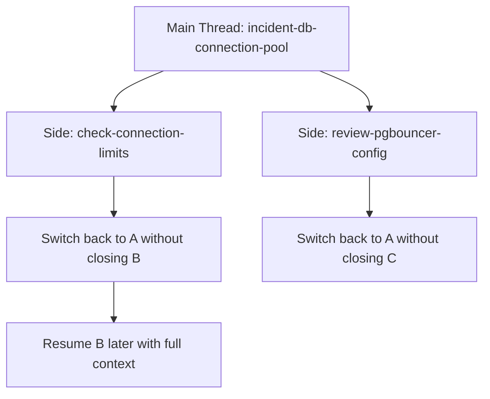
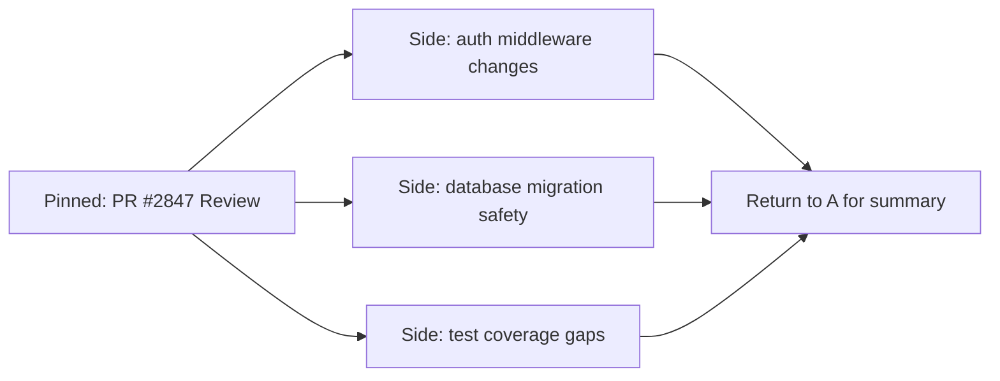

# Session Management in Codex CLI v0.146: Named Sessions, Thread Pinning, and the End of Context Amnesia


---

Codex CLI v0.146.0, released on 29 July 2026, delivers the most significant session management overhaul since the paginated thread history landed in v0.145.0 [^1]. The headline features — named sessions, thread pinning, and non-destructive side conversation switching — address a friction point that every heavy Codex CLI user has hit: you cannot juggle multiple concurrent concerns in a terminal agent without losing track of what matters.

This article breaks down what changed, how to configure it, and why these seemingly minor UX additions reshape how senior developers structure their agentic workflows.

## The Problem: Unnamed Threads and Context Amnesia

Before v0.146.0, Codex CLI sessions were identified by opaque thread IDs. The `/new` command started a fresh session; `/clear` wiped the current one. In both cases, you lost the name and had to rely on memory or scroll-back to find a previous conversation [^2]. For developers running multi-project workflows — reviewing a pull request whilst debugging a production incident whilst prototyping a new feature — this created a cognitive tax that scaled linearly with concurrent tasks.

The paginated thread history in v0.145.0 [^3] partially solved the retrieval problem by adding search and efficient resume, but it did nothing for the organisational problem: threads remained unnamed, unprioritised, and indistinguishable at a glance.

## What v0.146.0 Changes

### Named Sessions

The `/new` and `/clear` commands now accept an optional name argument:

```bash
# Start a named session
/new "incident-db-connection-pool"

# Clear current session and start a named one
/clear "feature/auth-refactor"
```

Named sessions appear in the thread history with their human-readable label, making it trivial to locate and resume them later. Names are persisted across CLI restarts and sync to the paginated history store introduced in v0.145.0 [^1].

### Thread Pinning

Important threads can be pinned, which promotes them to the top of the thread listing regardless of recency:

```bash
# Pin the current thread
/pin

# Unpin
/unpin
```

Pinned threads survive compaction cycles and are preserved across `/new` transitions [^1]. This is particularly useful for long-running architectural discussions or reference threads that contain project decisions you need to consult repeatedly.

### Side Conversation Switching

Prior to v0.146.0, the `/side` command opened a lightweight ephemeral conversation that inherited the parent thread's project context [^4]. The limitation was that switching back to the parent closed the side conversation permanently.

v0.146.0 changes this: side conversations now persist, and you can switch between them without closing either thread [^1]. The mental model is closer to browser tabs than to a stack:



### Thread Forking with Paginated History

Thread forking, first introduced as ephemeral forks [^4], now integrates with paginated history. Forked threads carry their parent's conversation history but diverge from the fork point. Temporary forks — useful for quick exploratory tangents — can be excluded from thread listings entirely [^1]:

```bash
# Fork current thread (appears in listings)
/fork "explore-alternative-schema"

# Temporary fork (hidden from listings)
/fork --temporary "quick-test"
```

## Configuration

Session management settings live in the standard `config.toml`:

```toml
[session]
# Auto-name sessions based on first prompt (default: false)
auto_name = true

# Maximum number of pinned threads (default: 10)
max_pinned = 10

# Persist side conversations across restarts (default: true)
persist_sides = true
```

These settings can also be scoped per-project in `.codex/config.toml`, which is useful for teams that want consistent session hygiene across a shared codebase [^5].

## Why This Matters for Agentic Workflows

### Multi-Project Context Switching

The typical senior developer context-switches between three to five active concerns during a working day. Named sessions and pinning create an explicit working set — the developer equivalent of having labelled terminal tabs, but with full conversational context preserved behind each label.

### Incident Response

During incidents, the ability to maintain a primary investigation thread, spin off side conversations to check specific hypotheses, and pin the main thread for quick return is operationally significant. Before v0.146.0, this workflow required either multiple terminal windows (losing cross-thread awareness) or disciplined use of `/fork` with manual bookkeeping.

### Code Review Workflows

A common pattern is to use a pinned thread for the overall review, with side conversations for deep-dives into specific files or architectural concerns:



Each side conversation inherits the parent's model selection and project context, so there is no setup overhead when switching [^4].

### Integration with Multi-Agent V2

Named sessions interact naturally with the Multi-Agent V2 architecture stabilised in v0.145.0 [^3]. Sub-agents can be assigned to named sessions, making it straightforward to track which agent is handling which concern:

```toml
[agents.reviewer]
model = "gpt-5.6-luna"
session_name = "review-agent"

[agents.implementer]
model = "gpt-5.6-terra"
session_name = "implementation-agent"
```

This complements the path-based addressing (`/root/reviewer`, `/root/implementer`) with human-readable session labels in the thread history [^6].

## Additional v0.146.0 Changes

Beyond session management, the release includes several notable improvements:

- **Agent Plugins manifests** — workspace plugin publishing and additional marketplace support for Amazon Bedrock and Claude Code [^1]
- **Remote Code Mode** — WebSocket connections to remote Code Mode hosts, extending the `codex remote-control` infrastructure [^1]
- **Proxy hardening** — configured proxies are now honoured across authentication, plugin downloads, MCP authorisation, remote execution, WebSockets, redirects, and LM Studio connections [^1]
- **Skill budget warnings** — the runtime warns when skill catalogues must be truncated under tight context budgets, rather than silently dropping skills [^1]
- **Enterprise controls** — enterprise-plan recognition and administrator controls for update management [^1]

## Practical Recommendations

1. **Enable `auto_name`** in your global `config.toml`. Manually naming every session adds friction; auto-naming based on the first prompt gives you searchable labels with zero effort.

2. **Pin sparingly.** The default limit of ten pinned threads is generous. If you find yourself pinning more than three or four, you likely have threads that should be archived instead.

3. **Use temporary forks for hypothesis testing.** When debugging, fork with `--temporary` to explore a theory without cluttering your thread history. If the fork yields useful results, you can promote it to a permanent thread.

4. **Combine with `/compact`.** Long side conversations accumulate context. Run `/compact` on side threads before switching back to the parent to keep token budgets manageable [^5].

5. **Name sessions in AGENTS.md conventions.** If your team uses AGENTS.md to document project conventions, consider adding a session naming convention (e.g., `incident/<id>`, `feature/<branch>`, `review/pr-<number>`) to keep thread histories consistent across team members.

## What Is Still Missing

Thread pinning does not yet support priority ordering — all pinned threads are equal. The feature request for weighted pins or thread categories (Issue #26233) [^7] remains open. Additionally, cross-surface session sync — resuming a CLI session in the Codex Desktop app — still requires the `/app` handoff command rather than automatic synchronisation.

## Citations

[^1]: OpenAI, "Release 0.146.0," GitHub, 29 July 2026. [https://github.com/openai/codex/releases/tag/rust-v0.146.0](https://github.com/openai/codex/releases/tag/rust-v0.146.0)

[^2]: GitHub, "Feature: Multi-Session Management for Codex CLI," openai/codex Discussion #341, 2026. [https://github.com/openai/codex/discussions/341](https://github.com/openai/codex/discussions/341)

[^3]: OpenAI, "Release 0.145.0," GitHub, 21 July 2026. [https://github.com/openai/codex/releases/tag/rust-v0.145.0](https://github.com/openai/codex/releases/tag/rust-v0.145.0)

[^4]: D. Vaughan, "Codex CLI Side Conversations: Ephemeral Forks, Session Branching, and the /side vs /fork Decision Tree," Codex Knowledge Base, 4 June 2026. [https://codex.danielvaughan.com/2026/06/04/codex-cli-side-conversations-ephemeral-forks-session-branching-patterns/](https://codex.danielvaughan.com/2026/06/04/codex-cli-side-conversations-ephemeral-forks-session-branching-patterns/)

[^5]: D. Vaughan, "Codex CLI Session Lifecycle: Archive, Resume, Fork, and Compact," Codex Knowledge Base, 5 June 2026. [https://codex.danielvaughan.com/2026/06/05/codex-cli-session-lifecycle-archive-resume-fork-compact-management/](https://codex.danielvaughan.com/2026/06/05/codex-cli-session-lifecycle-archive-resume-fork-compact-management/)

[^6]: D. Vaughan, "Codex CLI Multi-Agent Orchestration v2: Complete Guide," Codex Knowledge Base, 11 April 2026. [https://codex.danielvaughan.com/2026/04/11/codex-cli-multi-agent-orchestration-v2-complete-guide/](https://codex.danielvaughan.com/2026/04/11/codex-cli-multi-agent-orchestration-v2-complete-guide/)

[^7]: GitHub, "Codex Desktop/App no longer exposes a thread pinning tool to assistants," openai/codex Issue #26233, 3 June 2026. [https://github.com/openai/codex/issues/26233](https://github.com/openai/codex/issues/26233)
